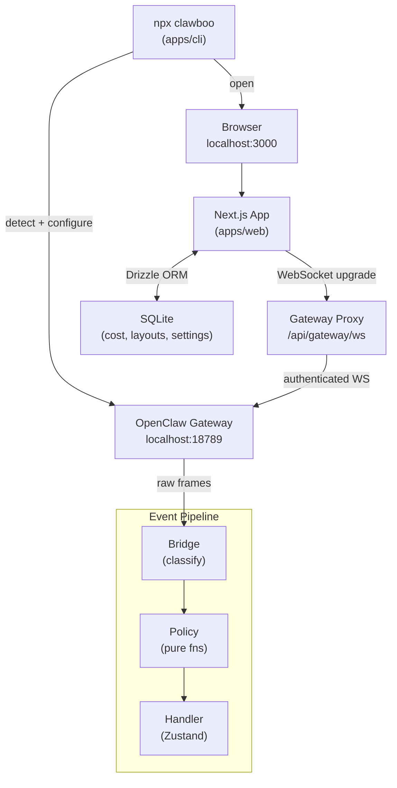

<div align="center">
  <h1>Clawboo</h1>

  <p><strong>Your AI agents, visible.</strong></p>

[](https://www.npmjs.com/package/clawboo)
[](https://github.com/clawboo/clawboo/stargazers)
[](./LICENSE)
[](https://www.typescriptlang.org/)

  <p>Open-source multi-agent mission control dashboard for <a href="https://github.com/openclaw/openclaw">OpenClaw</a> — see every agent, every action, every dollar.</p>
</div>

---

## Quickstart

```bash
npx clawboo
# That's it. Your Ghost Graph opens in 90 seconds.
```

---

## Screenshot

> **[Ghost Graph screenshot here]**

---

## Features

- **👻 Ghost Graph** — visual canvas of your entire agent fleet; nodes, edges, and live status at a glance
- **🦞 Boo Characters** — every agent has a unique ghost-lobster identity, deterministically generated from their ID
- **🚀 Pre-built Teams** — Marketing Squad, Dev Team, Research Lab, YouTube Crew, Student Pack — deploy in one click
- **💰 Cost Dashboard** — track every token and every dollar across all agents with per-model pricing
- **🌿 Frugal Toggle** — switch your entire fleet to local LLMs with one click
- **🔐 Exec Approvals** — review and approve agent shell commands directly from the graph
- **⏰ Built-in Scheduler** — cron jobs with human-readable schedule descriptions and a visual timeline

---

## Clawboo vs the alternatives

| Feature             | **Clawboo** | Antfarm |
| ------------------- | :---------: | :-----: |
| Boo Avatars         |     ✅      |   ❌    |
| Team Profiles       |     ✅      |   ❌    |
| Cost Tracking       |     ✅      |   ✅    |
| Skill Marketplace   |     ✅      |   ❌    |
| One-command install |     ✅      |   ❌    |

---

## Architecture



**Key invariants:**

- The browser never talks to the Gateway directly — all traffic goes through the same-origin proxy
- Every Gateway event flows through `Bridge → Policy → Handler` — no shortcuts
- SQLite stores only UI state (cost records, graph layouts, settings) — agent state lives in the Gateway

---

## Contributing

Contributions are welcome. Please read the guidelines below before opening a PR.

### Prerequisites

- Node.js 22+
- pnpm 9+
- A running [OpenClaw Gateway](https://github.com/openclaw/openclaw) instance for end-to-end testing

### Setup

```bash
git clone https://github.com/clawboo/clawboo.git
cd clawboo
pnpm install
pnpm dev          # starts apps/web on :3000
```

### Commands

```bash
pnpm build        # build all packages and apps
pnpm typecheck    # tsc --noEmit across the monorepo
pnpm lint         # ESLint flat config across all packages
pnpm test         # Vitest unit tests
pnpm e2e          # Playwright end-to-end tests
```

### Project structure

```
clawboo/
├── apps/
│   ├── web/          # Next.js 16 dashboard (port 3000)
│   ├── cli/          # npx clawboo installer
│   └── docs/         # Docusaurus site
└── packages/
    ├── gateway-client/   # WebSocket client for OpenClaw Gateway
    ├── gateway-proxy/    # Same-origin WS proxy
    ├── protocol/         # Message parser and transcript types
    ├── events/           # Bridge → Policy → Handler pipeline
    ├── config/           # Settings with XDG fallback chain
    ├── db/               # SQLite schema via Drizzle ORM
    ├── boo-avatar/       # Procedural ghost-lobster SVG generator
    ├── ui/               # Shared React components and design tokens
    └── logger/           # pino wrapper
```

### Guidelines

- **TypeScript strict** — no `any`, no `@ts-ignore`
- **No breaking changes to migrations** — `drizzle/` files are append-only
- **Pure policy functions** — `packages/events/src/policy/` must remain side-effect free and fully unit-testable
- **One PR, one concern** — keep PRs focused; split unrelated changes

---

## License

MIT © Clawboo Contributors — see [LICENSE](./LICENSE) for details.
