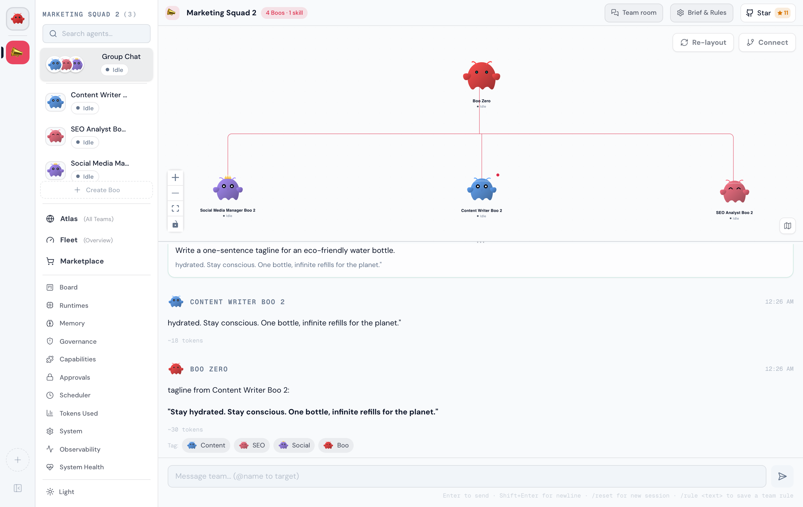
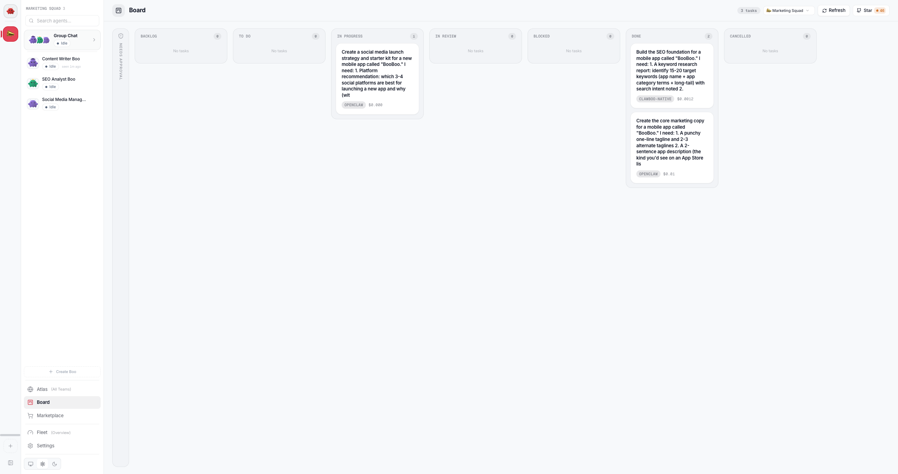
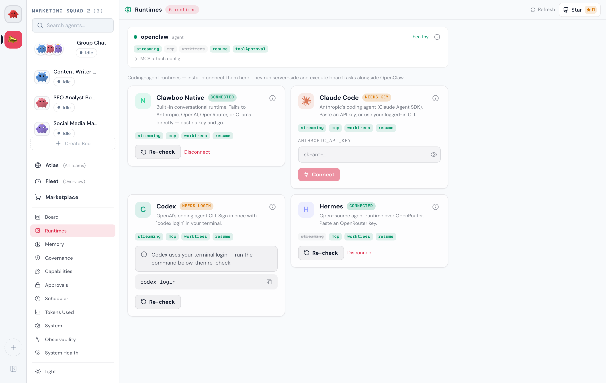
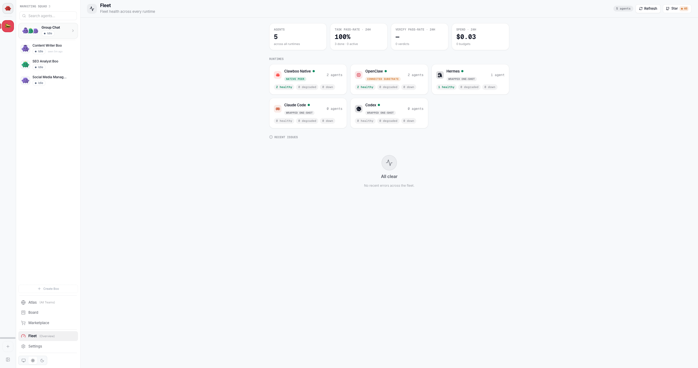
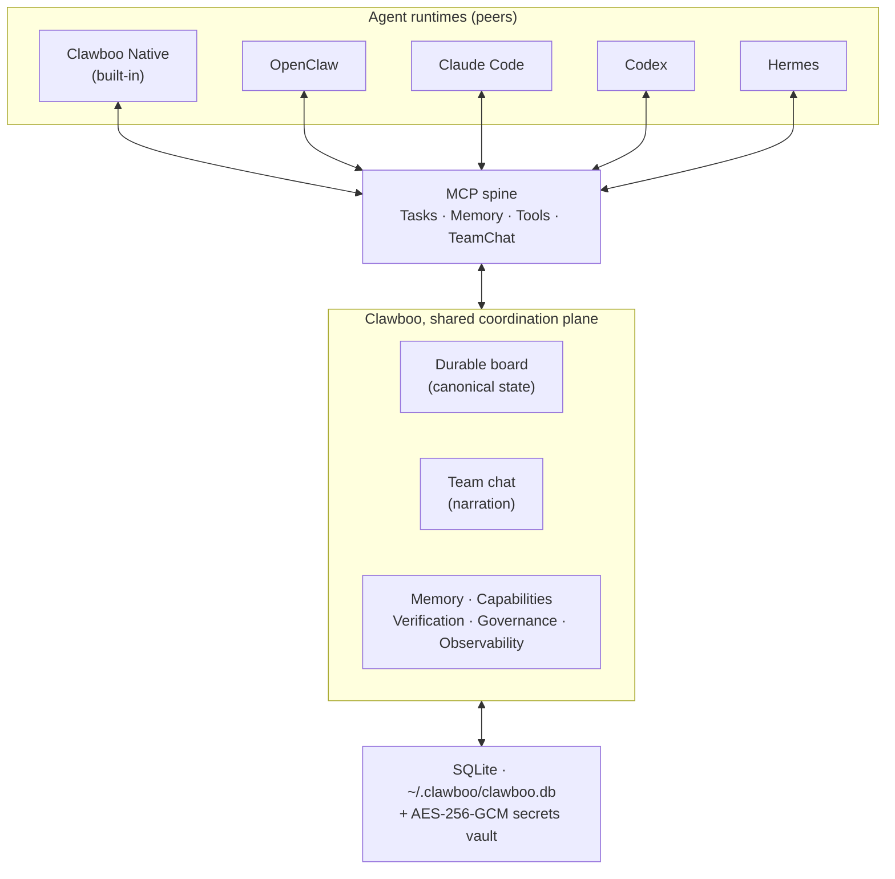

<p align="center">
  
</p>

<p align="center">
  A <strong>TypeScript orchestrator for heterogeneous AI agent runtimes</strong>. Native agents are built in: paste a key and go.
  <br/>
  Claude Code, Codex, Hermes, and OpenClaw join as <strong>peer teammates in one chat</strong>, sharing one board, one memory, and one capability dashboard, all governed, with autonomous work independently verified.
</p>

<p align="center">
  <a href="https://www.npmjs.com/package/clawboo"></a>
  <a href="https://www.npmjs.com/package/clawboo"></a>
  <a href="https://github.com/clawboo/clawboo/actions/workflows/ci.yml"></a>
  <a href="https://github.com/clawboo/clawboo/stargazers"></a>
  <a href="./LICENSE"></a>
  <a href="https://www.typescriptlang.org/"></a>
</p>

<p align="center">
  <a href="#quickstart">Quickstart</a>
  &nbsp;·&nbsp;
  <a href="#what-it-is">What it is</a>
  &nbsp;·&nbsp;
  <a href="#how-it-works">How it works</a>
  &nbsp;·&nbsp;
  <a href="#runtimes">Runtimes</a>
  &nbsp;·&nbsp;
  <a href="#configuration">Configuration</a>
  &nbsp;·&nbsp;
  <a href="https://docs.claw.boo">Docs</a>
  &nbsp;·&nbsp;
  <a href="https://github.com/clawboo/clawboo/discussions">Discussions</a>
</p>

<br/>

<p align="center">
  
</p>

<p align="center">
  <sub>One prompt, fanned out to specialists, tracked on the board, narrated in chat.</sub>
</p>

---

## Quickstart

```bash
npx clawboo
```

Node.js 22+ is the only prerequisite. The first run opens an onboarding wizard:

1. Pick a runtime. **Clawboo Native** is the default: it runs agents in-process and talks to your provider directly.
2. Paste one provider API key (Anthropic, OpenAI, OpenRouter, or a local Ollama, no key needed).
3. Clawboo seeds a starter team and drops you into the dashboard. Your team is ready in about a minute.

The dashboard opens at the port written to `~/.clawboo/api-port.txt` (default `http://localhost:18790`, auto-fallback through `18809` if busy). No flags, no external CLI, no cloud account.

> Prefer a different runtime? Connect Claude Code, Codex, Hermes, or a local OpenClaw Gateway from the **Runtimes** panel at any time.

---

## What it is

- **A durable kanban fused with a live group chat.** The board is the canonical source of truth for task state; chat is the narration. Tasks survive restarts, claims are race-free, and every delegation is a real board mutation.
- **Mixed-runtime peer chat.** Native, Claude Code, Codex, Hermes, and OpenClaw agents are all named peers in one room, and any runtime can lead. Coordination flows over structured lifecycle events and MCP calls, never terminal-output scraping.
- **Native agents built in, external runtimes one click away.** Paste a provider key and Clawboo runs agents itself, or install and connect a coding-agent CLI from the Runtimes panel. Each runtime keeps its own native powers (OpenClaw keeps its channels and always-on heartbeat; Hermes keeps its self-improvement and skills).
- **One shared memory, one capability dashboard.** Every runtime reads and writes the same tiered memory store and shows up in one unified skills and connectors inventory, while its private self-model stays its own.
- **Verified, governed, observable.** Built-in verification for autonomous completions (builder is not the judge), spend tracking and warnings, depth and fan-out caps, and approvals, plus OpenTelemetry traces, structured logs, and an error taxonomy, all on by default. Hard spend caps that auto-pause a run are opt-in.

---

## See it in action

<table>
  <tr>
    <td width="50%">
      
      <p align="center"><sub><strong>Atlas</strong>: every team, one live org graph.</sub></p>
    </td>
    <td width="50%">
      
      <p align="center"><sub><strong>Board</strong>: durable kanban, every delegation is a real task.</sub></p>
    </td>
  </tr>
  <tr>
    <td width="50%">
      
      <p align="center"><sub><strong>Runtimes</strong>: connect Native, OpenClaw, Claude Code, Codex, Hermes.</sub></p>
    </td>
    <td width="50%">
      
      <p align="center"><sub><strong>Fleet</strong>: health, pass rates, and spend across every runtime.</sub></p>
    </td>
  </tr>
</table>

---

## How it works


```mermaid
graph TD
    subgraph RT["Agent runtimes (peers)"]
      direction LR
      Native["Clawboo Native<br/>(built-in)"]
      OC["OpenClaw"]
      CC["Claude Code"]
      CX["Codex"]
      HM["Hermes"]
    end

    MCP["MCP spine<br/>Tasks · Memory · Tools · TeamChat"]

    subgraph CB["Clawboo, shared coordination plane"]
      direction LR
      Board["Durable board<br/>(canonical state)"]
      Chat["Team chat<br/>(narration)"]
      Plane["Memory · Capabilities<br/>Verification · Governance · Observability"]
    end

    Store["SQLite · ~/.clawboo/clawboo.db<br/>+ AES-256-GCM secrets vault"]

    Native <--> MCP
    OC <--> MCP
    CC <--> MCP
    CX <--> MCP
    HM <--> MCP
    MCP <--> CB
    CB <--> Store
```

Clawboo runs as a TypeScript control plane and integrates each runtime as a black box, so adding a runtime is configuration, not a rewrite. There is one architectural principle:

- **Clawboo owns the shared / coordination plane.** The registry, the durable board, team chat, the team-task scheduler, the shared memory, the managed tools and capability broker, verification, governance, the normalized event log, the per-task worktree system-of-record, and cross-runtime handoff and resume.
- **Each runtime keeps its private / cognitive plane.** Its own messaging channels, its own heartbeat, its private memory and self-improvement, its built-in tools, its connectors and auth, and its native session resume. Clawboo observes these but does not take them over.
- **MCP is the one common spine.** Every runtime consumes Clawboo's Tasks, Memory, Tools, and TeamChat servers over MCP, the single channel for both injection and observation.

Everything is local-first: the board persists in SQLite at `~/.clawboo/clawboo.db`, and runtime API keys live in an AES-256-GCM encrypted vault at `~/.clawboo/secrets/`. No SaaS, no cloud, nothing uploaded.

---

## Runtimes

| Runtime            | What it is                                                                                  | How to connect                                                           |
| ------------------ | ------------------------------------------------------------------------------------------- | ------------------------------------------------------------------------ |
| **Clawboo Native** | Built-in conversational runtime, talks to Anthropic / OpenAI / OpenRouter / Ollama directly | Paste a key in onboarding, no install                                    |
| **OpenClaw**       | A local OpenClaw Gateway, keeps its own channels and always-on                              | Start a Gateway and connect                                              |
| **Claude Code**    | Anthropic's coding agent (Claude Agent SDK)                                                 | Install and connect from Runtimes; paste a key or use your logged-in CLI |
| **Codex**          | OpenAI's coding agent CLI                                                                   | Install and connect; `codex login` once                                  |
| **Hermes**         | Open-source agent runtime over OpenRouter, keeps its self-improvement and skills            | Install and connect; paste an OpenRouter key                             |

Every runtime executes board tasks behind one interface, isolated in its own git worktree, with a structured handoff artifact so work can move between runtimes.

---

## Configuration

Clawboo stores everything under `~/.clawboo/` (auto-created). Nothing here is required for the happy path; these are the knobs.

| Variable                      | Purpose                                                                                                |
| ----------------------------- | ------------------------------------------------------------------------------------------------------ |
| `CLAWBOO_HOME`                | Clawboo's state directory (default `~/.clawboo`): SQLite DB, settings, secrets vault, worktrees        |
| `CLAWBOO_API_PORT`            | Pin the dashboard API port (default `18790`, auto-fallback through `18809`)                            |
| `CLAWBOO_DB_PATH`             | SQLite path for the out-of-process MCP stdio bins only (the server follows `CLAWBOO_HOME`)             |
| `CLAWBOO_SECRETS_MASTER_KEY`  | Override the credential-vault master key (auto-generated at `~/.clawboo/secrets/master.key` otherwise) |
| `OTEL_EXPORTER_OTLP_ENDPOINT` | Export traces to Jaeger / Zipkin (otherwise the local event log is the trace store)                    |
| `LOG_LEVEL`                   | pino log level (default `info`)                                                                        |

When you use the OpenClaw runtime, Clawboo reads OpenClaw's own `OPENCLAW_STATE_DIR` and `GATEWAY_URL` for interop. There are no feature flags: every subsystem ships on.

---

## Development

```bash
git clone https://github.com/clawboo/clawboo.git
cd clawboo
pnpm install
pnpm dev          # Express API on :18790 (auto-fallback) + Vite SPA on :5173
```

| Command                                    | What it does                                  |
| ------------------------------------------ | --------------------------------------------- |
| `pnpm build`                               | Build all packages + apps (Turbo)             |
| `pnpm typecheck`                           | `tsc --noEmit` across the workspace           |
| `pnpm lint`                                | ESLint flat config across all packages        |
| `pnpm test`                                | Vitest unit tests (node + jsdom projects)     |
| `pnpm e2e`                                 | Playwright end-to-end tests                   |
| `pnpm assemble && pnpm test:clean-install` | Bundle the CLI and smoke-test a clean install |

Tech stack: Node.js 22+ and TypeScript 5 strict, TurboRepo + pnpm, Vite SPA + React 19 + Express, Tailwind CSS 4, Zustand + TanStack Query, React Flow + ELK.js for the graph, CodeMirror 6, SQLite via better-sqlite3 + Drizzle ORM, the Model Context Protocol SDK, and Vitest + Playwright + MSW for tests. macOS, Linux, and Windows are all first-class.

See [CONTRIBUTING.md](./CONTRIBUTING.md) for branching, the PR checklist, and code guidelines.

---

## Roadmap

Clawboo ships [Changesets](https://github.com/changesets/changesets)-based releases as features land. On the horizon, not yet shipped:

- **Humans in the graph.** Humans as first-class participants on the board and in the room, picking up tasks behind the same interface as a runtime.
- **Multi-tenant.** Hosted and organization deployments with per-tenant scoping.

See the [CHANGELOG](./apps/cli/CHANGELOG.md) for the full release history.

---

## Community

Clawboo is brand new. The single best thing you can do:

**Star this repo.** It's the strongest signal for new visitors deciding whether to give it a try.

After that:

- Ask questions or share team templates in [Discussions](https://github.com/clawboo/clawboo/discussions).
- File [issues](https://github.com/clawboo/clawboo/issues) for bugs, repros, and regressions. macOS, Linux, and Windows are all first-class.
- Send a PR. Small fixes very welcome, see [CONTRIBUTING.md](./CONTRIBUTING.md).

<br/>

<p align="center">
  <a href="https://star-history.com/#clawboo/clawboo&Date">
    
  </a>
</p>

---

## License

MIT, see [LICENSE](./LICENSE). Third-party attributions in [THIRD_PARTY_NOTICES.md](./THIRD_PARTY_NOTICES.md). Contributing guide in [CONTRIBUTING.md](./CONTRIBUTING.md).

<p align="center">
  MIT © Sanreds
</p>
