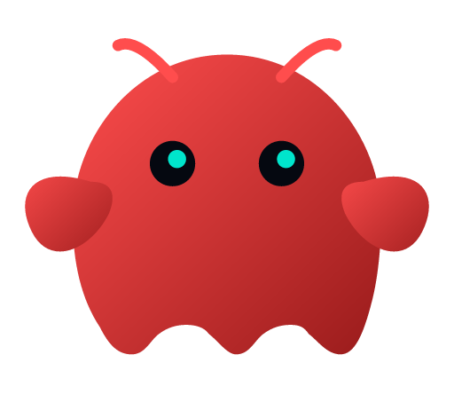
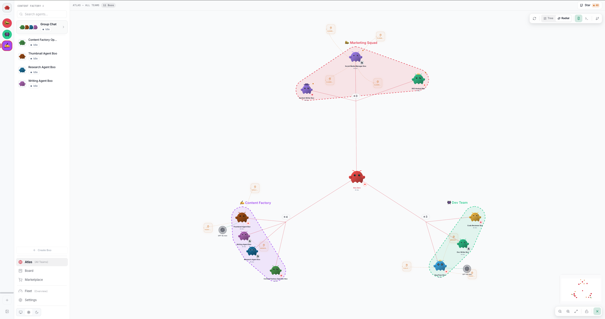
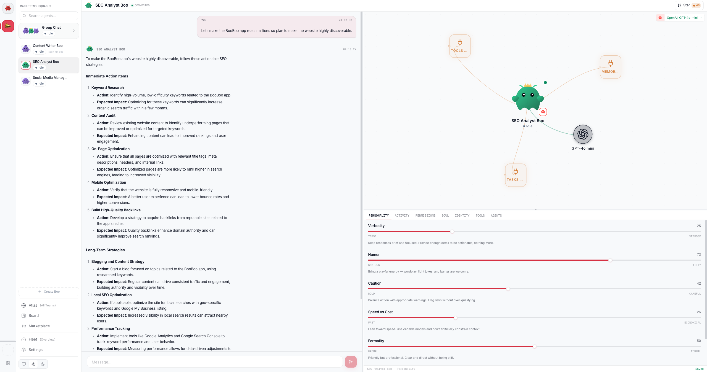
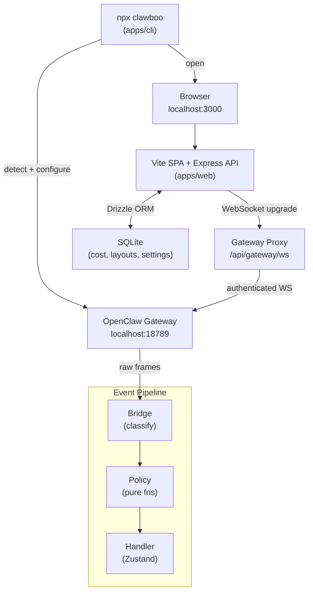

<p align="center">
  
</p>

<h1 align="center">Clawboo</h1>

<p align="center">
  <strong>Your AI agents, visible.</strong>
</p>

<p align="center">
  The open-source platform for deploying and orchestrating <a href="https://github.com/openclaw/openclaw">OpenClaw</a> agent teams.
  <br/>
  Deploy pre-configured teams, visualize your fleet topology, track costs, and manage approvals — all from one place.
</p>

<p align="center">
  <a href="https://www.npmjs.com/package/clawboo"></a>
  <a href="https://github.com/clawboo/clawboo/actions/workflows/ci.yml"></a>
  <a href="https://github.com/clawboo/clawboo/stargazers"></a>
  <a href="./LICENSE"></a>
  <a href="https://www.typescriptlang.org/"></a>
</p>

<p align="center">
  <a href="#quickstart">Quickstart</a>&nbsp;&nbsp;&middot;&nbsp;&nbsp;<a href="#features">Features</a>&nbsp;&nbsp;&middot;&nbsp;&nbsp;<a href="#how-it-works">How It Works</a>&nbsp;&nbsp;&middot;&nbsp;&nbsp;<a href="#development">Development</a>&nbsp;&nbsp;&middot;&nbsp;&nbsp;<a href="#roadmap">Roadmap</a>
</p>

<br/>

<p align="center">
  
</p>

<p align="center">
  <sub>Ghost Graph — a YouTube Crew with three Boo agents and their orbiting skills. Every edge maps to real OpenClaw config.</sub>
</p>

---

## Quickstart

**Prerequisites:** Node.js 22+ &middot; OpenClaw is auto-installed if not present

```bash
npx clawboo
```

That's it. Clawboo detects your system, installs OpenClaw if needed, configures your LLM provider, starts the Gateway, and opens in your browser. Your first agent team can be running in under 90 seconds.

---

## Features

**Ghost Graph** &mdash;
See your entire agent fleet as a living topology. Nodes represent agents, skills, and resources. Edges map to real OpenClaw config. Drag skills onto agents to install, draw routing connections, and watch status updates flow in real-time.

**Team Templates** &mdash;
Deploy pre-configured agent teams in one click. Marketing Squad, Dev Team, Research Lab, YouTube Crew, Student Pack — or build your own. The Marketplace is a growing distribution channel for community-created teams.

**Cost Intelligence** &mdash;
Track every token across every agent with per-model pricing. Daily trends, per-agent breakdown, and summary cards at a glance. Frugal Toggle switches your entire fleet to local LLMs via Ollama with one click.

**Skill Marketplace** &mdash;
Browse, install, and manage agent capabilities from a curated catalog. Trust scores, verified sources, and drag-to-install on the Ghost Graph.

**Exec Approvals** &mdash;
Review and approve agent shell commands before they run. Pending approvals surface as amber rings on Ghost Graph nodes. Allow once, always allow, or deny — every decision is logged.

**Built-in Scheduler** &mdash;
Visual cron management with a 48-hour timeline. Presets, custom intervals, per-agent grouping, and one-click "Run Now".

**Auto-Install Onboarding** &mdash;
`npx clawboo` detects your system, installs OpenClaw if needed, configures your LLM provider (Anthropic, OpenAI, Google, Ollama, and 11 more), starts the Gateway, and deploys your first team. Zero manual setup.

<br/>

<details>
<summary><strong>Agent Detail View</strong> — chat, mini-graph, and inline editor in one panel</summary>
<br/>
<p align="center">
  
</p>
<p align="center">
  <sub>Chat with an agent, see its skill topology, and tune personality sliders — all without leaving the view.</sub>
</p>
</details>

---

## How It Works


```mermaid
graph TD
    CLI["npx clawboo<br/>(apps/cli)"]
    Browser["Browser<br/>localhost:3000"]
    Web["Vite SPA + Express API<br/>(apps/web)"]
    Proxy["Gateway Proxy<br/>/api/gateway/ws"]
    Gateway["OpenClaw Gateway<br/>localhost:18789"]
    SQLite["SQLite<br/>(cost, layouts, settings)"]

    CLI -->|"detect + configure"| Gateway
    CLI -->|"open"| Browser
    Browser --> Web
    Web -->|"WebSocket upgrade"| Proxy
    Proxy -->|"authenticated WS"| Gateway
    Web <-->|"Drizzle ORM"| SQLite

    subgraph "Event Pipeline"
        direction LR
        Bridge["Bridge<br/>(classify)"] --> Policy["Policy<br/>(pure fns)"] --> Handler["Handler<br/>(Zustand)"]
    end

    Gateway -->|"raw frames"| Bridge
```

- **Same-origin proxy** — the browser never talks to the Gateway directly. The proxy injects auth tokens and handles Ed25519 device signing server-side.
- **Event pipeline** — every Gateway event flows through Bridge → Policy → Handler. Policy functions are pure and fully unit-testable.
- **Gateway is source of truth** — agent state lives in OpenClaw. SQLite stores only UI concerns: cost records, graph layouts, preferences, and chat history.

---

## Tech Stack

| Concern    | Choice                                    |
| ---------- | ----------------------------------------- |
| Runtime    | Node.js 22+, TypeScript 5 strict          |
| Monorepo   | TurboRepo + pnpm workspaces               |
| Frontend   | Vite SPA + React 19                       |
| API Server | Express                                   |
| CSS        | Tailwind CSS 4                            |
| Components | shadcn/ui (Radix)                         |
| Animations | Framer Motion                             |
| State      | Zustand (client), TanStack Query (server) |
| Graph      | React Flow + ELK.js                       |
| Editor     | CodeMirror 6                              |
| Database   | SQLite (better-sqlite3) + Drizzle ORM     |
| Testing    | Vitest (312 tests) + Playwright (8 e2e)   |
| Releases   | Changesets                                |

---

## Development

### Setup

```bash
git clone https://github.com/clawboo/clawboo.git
cd clawboo
pnpm install
pnpm dev          # Express API on :3000 + Vite SPA on :5173
```

### Commands

```bash
pnpm build        # Build all packages and apps (Turbo)
pnpm dev          # Start Express API (:3000) + Vite SPA (:5173) concurrently
pnpm typecheck    # tsc --noEmit across all packages
pnpm lint         # ESLint flat config across all packages
pnpm test         # Vitest unit tests (312 tests)
pnpm e2e          # Playwright end-to-end tests (8 tests)
pnpm assemble     # Build all + copy into CLI dist for npm publish
```

### Project Structure

```
clawboo/
├── apps/
│   ├── web/          # Vite SPA + Express API (port 3000)
│   ├── cli/          # npx clawboo launcher
│   └── docs/         # Docusaurus site
└── packages/
    ├── gateway-client/   # WebSocket client for OpenClaw Gateway
    ├── gateway-proxy/    # Same-origin WS proxy with auth injection
    ├── protocol/         # Message parser and transcript types
    ├── events/           # Bridge → Policy → Handler pipeline
    ├── config/           # Settings with XDG + OpenClaw fallback chain
    ├── db/               # SQLite schema via Drizzle ORM (9 tables)
    ├── boo-avatar/       # Procedural ghost-lobster SVG generator
    ├── ui/               # Shared React components and design tokens
    ├── logger/           # pino wrapper
    └── tsconfig/         # Shared TS configs (base, react, node)
```

---

## Contributing

Contributions are welcome. Please read these guidelines before opening a PR.

- **TypeScript strict** — no `any`, no `@ts-ignore`
- **Migrations are append-only** — never edit committed files in `drizzle/`
- **Policy functions are pure** — `packages/events/src/policy/` must remain side-effect free
- **One PR, one concern** — keep PRs focused

For detailed architecture documentation, see [CLAUDE.md](./CLAUDE.md).

### Prerequisites

- Node.js 22+
- pnpm 9+
- A running [OpenClaw Gateway](https://github.com/openclaw/openclaw) for end-to-end testing

---

## Roadmap

| Version    | Status  | Highlights                                                                                                                          |
| ---------- | ------- | ----------------------------------------------------------------------------------------------------------------------------------- |
| **v0.1.0** | Stable  | Ghost Graph, Team Templates, Cost Intelligence, Skill Marketplace, Approvals, Scheduler, Auto-Install Onboarding, CLI launcher      |
| **v0.2.0** | Planned | ClawHub integration (community team templates), Trust Vault (skill provenance + blast radius), Boo Zero conversational configurator |
| **v1.0.0** | Planned | Public launch, Docusaurus docs site, CI/CD pipeline, npm publish via Changesets                                                     |

---

<p align="center">
  MIT &copy; Clawboo Contributors — see <a href="./LICENSE">LICENSE</a> for details.
</p>
