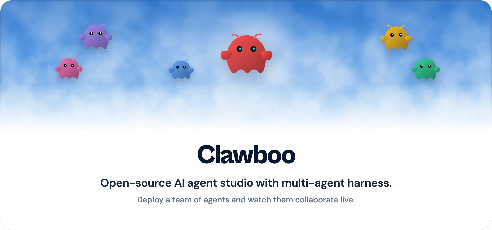
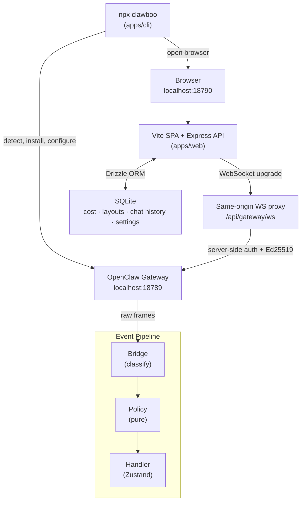

<p align="center">
  
</p>

<p align="center">
  A purpose-built multi-agent harness for self-hosted teams of <strong>AI agents</strong>, plus a <strong>300+ agent catalog</strong> and live group chat with structured delegation.
  <br/>
  Powered today by <a href="https://github.com/openclaw/openclaw">OpenClaw</a>; more agent runtimes coming.
</p>

<p align="center">
  <a href="https://www.npmjs.com/package/clawboo"></a>
  <a href="https://www.npmjs.com/package/clawboo"></a>
  <a href="https://github.com/clawboo/clawboo/actions/workflows/ci.yml"></a>
  <a href="https://github.com/clawboo/clawboo/stargazers"></a>
  <a href="./LICENSE"></a>
  <a href="https://www.typescriptlang.org/"></a>
</p>

<p align="center">
  <a href="#quickstart">Quickstart</a>
  &nbsp;·&nbsp;
  <a href="#what-you-can-do">Features</a>
  &nbsp;·&nbsp;
  <a href="#how-it-works">How it works</a>
  &nbsp;·&nbsp;
  <a href="#development">Development</a>
  &nbsp;·&nbsp;
  <a href="https://github.com/clawboo/clawboo/discussions">Discussions</a>
</p>

<br/>

<p align="center">
  
</p>

<p align="center">
  <sub>One prompt → the team leader delegates → three specialists respond live inside DelegationCards.</sub>
</p>

---

## Quickstart

```bash
npx clawboo
```

Node.js 22+ is the only prerequisite. The first run detects whether OpenClaw and the Gateway are installed, walks you through a single API key (Anthropic / OpenAI / Google / Ollama and 11 more), starts the Gateway, and opens the dashboard at `http://localhost:18790` (auto-fallback through `18809` if busy).

Your first agent team can be running and chatting in under 90 seconds.

> Already have OpenClaw running? The CLI auto-detects, auto-connects, and skips straight to the dashboard.

---

## Why Clawboo

Running a single AI agent is solved. Making a **team** of agents collaborate — parsing routing intent, scheduling parallel work, relaying context between teammates, synthesizing the result — is still a code project most teams reinvent every time.

Clawboo is the studio that ships it:

- **A real multi-agent harness, not a chat wrapper.** Clawboo's orchestration layer parses structured `<delegate>` / `<plan>` directives emitted by your agents, tracks parallel workstreams and multi-step plans as live state machines, batches relay updates between teammates, and injects identity + behavioral rules into every leader turn. Every routing decision renders as a structured card — fifteen rounds of production hardening, not a "wrap an LLM and pray" prototype.
- **A 300+ agent catalog, not boilerplate.** Browse 304 specialists across 82 workflow teams (engineering, marketing, research, content, game dev, paid media, support, …). One click to deploy — each agent gets its own `SOUL.md`, `IDENTITY.md`, `TOOLS.md`, and `AGENTS.md` provisioned automatically.
- **Local-first by design.** Your agents, your data, your machine. No SaaS, no cloud, no vendor lock-in. The npm package ships templates only; everything that's yours lives in `~/.openclaw/`.

---

## What you can do

### A purpose-built multi-agent harness

Most agent frameworks make you write the orchestration. Clawboo ships it. The harness parses structured `<delegate to="@Agent">…</delegate>` and `<plan>` directives emitted by your agents, runs parallel workstreams and sequential plans as live state machines, batches relay updates between teammates over a 3-second window, and even detects implicit fan-out from prose when agents skip the syntax. Identity + behavioral rules inject on every leader turn. Cascade vectors (intro storms, ack loops, stale entries from older sessions) all closed across fifteen rounds of production hardening.

### Deploy a team in 60 seconds

304 first-class agents across 82 prebuilt workflows. Pick a template — Marketing Squad, Engineering Sprint, Research Lab, YouTube Crew, Awesome Self-Healing Home Server — customize the name, icon, color, and provision the full agent files directly into your local OpenClaw Gateway.

### Group chat with structured delegation

Ask one question; the leader fans work out to the right specialists via `<delegate to="@Designer Boo">…</delegate>` tags, runs parallel workstreams, and synthesizes a unified answer back to you. Every routing decision renders inline as a `DelegationCard` / `PlanCard` / `WorkstreamCard` — no raw XML, no guessing what's running.

### Atlas — your whole org at a glance

A global org-graph showing every team and every Boo, connected from **Boo Zero** at the top down to each team's members. Convex-hull team halos, peacock-fan skill orbits, and degree-aware sizing make a 30-Boo fleet readable in one screen.

### Boo Zero — the universal team leader

A single primary agent that presides over every team. Boo Zero gets the user's message first, decides who handles what, routes via structured delegation, and brings the results back. Teamless in the database; ever-present in the chat.

### Live Ghost Graph per team

Force-directed visualization of each team's agents, skills, resources, and routing. Drag a skill onto a Boo to install it. Drag a handle between Boos to add a routing edge. Hover any node to see its dependency cluster light up.

### Marketplace

Three tabs — Skills, Agents, Teams — with category filters, source pills, search, and one-click deploy. The full original agent spec is preserved verbatim from upstream MIT-licensed sources, so what you read before deploying is exactly what your agent gets.

### Cost intelligence

Every token, every agent, every team. Per-agent breakdown, 30-day daily trend, and summary cards at a glance — token usage grouped by team and agent so you can see exactly where your spend goes.

### Approvals & Scheduler

Exec approvals surface as amber rings on Ghost Graph Boos with allow-once / always-allow / deny — every decision logged. The built-in cron scheduler has a 48-hour visual timeline, 8 presets, and per-agent grouping.

### Personality, persistence, privacy

Per-agent personality sliders (verbosity, humor, caution, speed-vs-cost, formality) merged into `SOUL.md` with marker comments so your edits survive Gateway restarts. All preferences, cost records, graph layouts, chat history, and team rules persist locally in SQLite — never uploaded.

---

## See it in action

<details>
<summary><strong>Ghost Graph — live agent topology with team halos</strong></summary>
<br/>
<p align="center">
  
</p>
<p align="center">
  <sub>Every Boo, every skill, every team. Every edge maps to real OpenClaw config — no decorative wires.</sub>
</p>
</details>

<details>
<summary><strong>Agent detail — chat, mini-graph, and inline editor in one panel</strong></summary>
<br/>
<p align="center">
  
</p>
<p align="center">
  <sub>Chat with an agent, see its skill topology, edit its <code>SOUL.md</code>/<code>IDENTITY.md</code>/<code>TOOLS.md</code>/<code>AGENTS.md</code>, and tune personality sliders — all without leaving the view.</sub>
</p>
</details>

<!--
  TODO (alongside the hero GIF): record short clips / take screenshots of:
    • Group Chat with DelegationCards + PlanCard mid-flight
    • Atlas (global all-teams view)
    • Marketplace 3-tab (Skills / Agents / Teams)
    • Cost Dashboard with daily trend
    • Onboarding wizard auto-install step
  Drop them into docs/screenshots/ and embed below this comment.
-->

---

## How it works


```mermaid
graph TD
    CLI["npx clawboo<br/>(apps/cli)"]
    Browser["Browser<br/>localhost:18790"]
    Web["Vite SPA + Express API<br/>(apps/web)"]
    Proxy["Same-origin WS proxy<br/>/api/gateway/ws"]
    Gateway["OpenClaw Gateway<br/>localhost:18789"]
    SQLite["SQLite<br/>cost · layouts · chat history · settings"]

    CLI -->|"detect, install, configure"| Gateway
    CLI -->|"open browser"| Browser
    Browser --> Web
    Web -->|"WebSocket upgrade"| Proxy
    Proxy -->|"server-side auth + Ed25519"| Gateway
    Web <-->|"Drizzle ORM"| SQLite

    subgraph "Event Pipeline"
        direction LR
        Bridge["Bridge<br/>(classify)"] --> Policy["Policy<br/>(pure)"] --> Handler["Handler<br/>(Zustand)"]
    end

    Gateway -->|"raw frames"| Bridge
```

Three invariants the codebase will never break:

- **Gateway is the source of truth.** Agent state lives in OpenClaw, never duplicated locally. SQLite stores only UI concerns: cost records, graph layouts, preferences, chat history, team rules.
- **Same-origin proxy always.** The browser never talks to the Gateway directly. The proxy injects auth tokens and handles Ed25519 device signing server-side.
- **Pure event pipeline.** Every Gateway frame flows Bridge → Policy → Handler. Policy functions are pure (no side effects) and fully unit-testable — 857 unit tests + 12 Playwright e2e tests run on every PR.

---

## Tech stack

| Concern    | Choice                                    |
| ---------- | ----------------------------------------- |
| Runtime    | Node.js 22+, TypeScript 5 strict          |
| Monorepo   | TurboRepo + pnpm workspaces               |
| Frontend   | Vite SPA + React 19                       |
| API server | Express                                   |
| Styling    | Tailwind CSS 4                            |
| Components | shadcn/ui (Radix)                         |
| Animations | Framer Motion                             |
| State      | Zustand (client), TanStack Query (server) |
| Graph      | React Flow (`@xyflow/react`) + ELK.js     |
| Editor     | CodeMirror 6                              |
| Database   | SQLite (better-sqlite3) + Drizzle ORM     |
| Testing    | Vitest (857 unit) + Playwright (12 e2e)   |
| Releases   | Changesets                                |
| Platforms  | macOS, Linux, Windows (all first-class)   |

---

## Development

### Setup

```bash
git clone https://github.com/clawboo/clawboo.git
cd clawboo
pnpm install
pnpm dev          # Express API on :18790 (auto-fallback) + Vite SPA on :5173
```

### Project structure

```
clawboo/
├── apps/
│   ├── web/          # Vite SPA + Express API
│   ├── cli/          # npx clawboo launcher
│   └── docs/         # Docusaurus site (placeholder)
└── packages/
    ├── gateway-client/   # WebSocket client for OpenClaw Gateway
    ├── gateway-proxy/    # Same-origin WS proxy with server-side auth
    ├── protocol/         # Message parser + transcript types + agent file defs
    ├── events/           # Bridge → Policy → Handler pipeline
    ├── config/           # Settings with XDG + OpenClaw fallback chain
    ├── db/               # SQLite schema via Drizzle ORM
    ├── boo-avatar/       # Procedural ghost-lobster SVG generator
    ├── ui/               # Shared React components + design tokens
    └── logger/           # pino wrapper
```

### Common commands

```bash
pnpm build               # Build all packages + apps (Turbo)
pnpm typecheck           # tsc --noEmit across workspace (21/21)
pnpm lint                # ESLint flat config (21/21)
pnpm test                # Vitest unit tests (857/857)
pnpm e2e                 # Playwright end-to-end tests (12/12)
pnpm assemble            # Build all + copy server.js + ui/ into CLI dist
pnpm verify:ingest       # Verify codegen'd marketplace catalog hasn't drifted
pnpm test:clean-install  # Smoke-test the bundled CLI end-to-end
```

### Contributing guidelines

- **TypeScript strict** — no `any`, no `@ts-ignore`.
- **Pure policy functions** — `packages/events/src/policy/` stays side-effect-free.
- **Forward-only migrations** — never edit committed files in `drizzle/`.
- **Every graph edge maps to real OpenClaw config** — no decorative edges.
- **One PR, one concern** — small, focused PRs merge faster.

Detailed contributing notes live in [CONTRIBUTING.md](./CONTRIBUTING.md).

---

## What's next

Clawboo ships [Changesets](https://github.com/changesets/changesets)-based patch releases as features land. Recent themes and what's coming:

| Theme                           | Direction                                                                                                                                                                       |
| ------------------------------- | ------------------------------------------------------------------------------------------------------------------------------------------------------------------------------- |
| **More agent runtimes**         | OpenClaw is the first runtime Clawboo drives. Adapters for additional agent runtimes are next — same studio, same harness, same team templates, any execution layer underneath. |
| **Tool connectors**             | First-class MCP support and a curated connector library — bring any tool, API, or data source into your agent fleet.                                                            |
| **Memory graphs**               | Per-agent and per-team long-term memory backed by vector + graph stores. Auto-built knowledge graphs of past work, decisions, and outputs.                                      |
| **Clawboo Marketplace**         | Hosted registry for community-published team templates, agent definitions, and skills. The pinned-SHA local catalog stays default; the hosted marketplace is opt-in.            |
| **Trust Vault**                 | Skill provenance and blast-radius signing — know what a skill can touch before you install it.                                                                                  |
| **Conversational team builder** | Tell Boo Zero "I need a team for X" and have it propose, customize, and deploy.                                                                                                 |

See [CHANGELOG](./apps/cli/CHANGELOG.md) for the full release history.

---

## Community

Clawboo is brand new. The single best thing you can do:

**Star this repo.** It's the strongest signal for new visitors deciding whether to give it a try.

After that:

- Ask questions or share team templates in [Discussions](https://github.com/clawboo/clawboo/discussions).
- File [issues](https://github.com/clawboo/clawboo/issues) for bugs, repros, regressions. macOS, Linux, and Windows are all first-class.
- Send a PR — see [Development](#development). Small fixes very welcome.

<br/>

<p align="center">
  <a href="https://star-history.com/#clawboo/clawboo&Date">
    
  </a>
</p>

---

<p align="center">
  Built on top of <a href="https://github.com/openclaw/openclaw">OpenClaw</a>. Catalog content from <a href="https://github.com/msitarzewski/agency-agents">agency-agents</a> and <a href="https://github.com/hesamsheikh/awesome-openclaw-usecases">awesome-openclaw-usecases</a> — both MIT.
</p>

<p align="center">
  MIT © Sanreds — see <a href="./LICENSE">LICENSE</a>.
</p>
