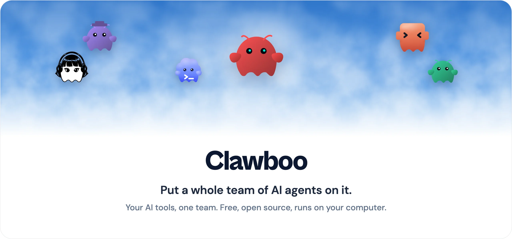
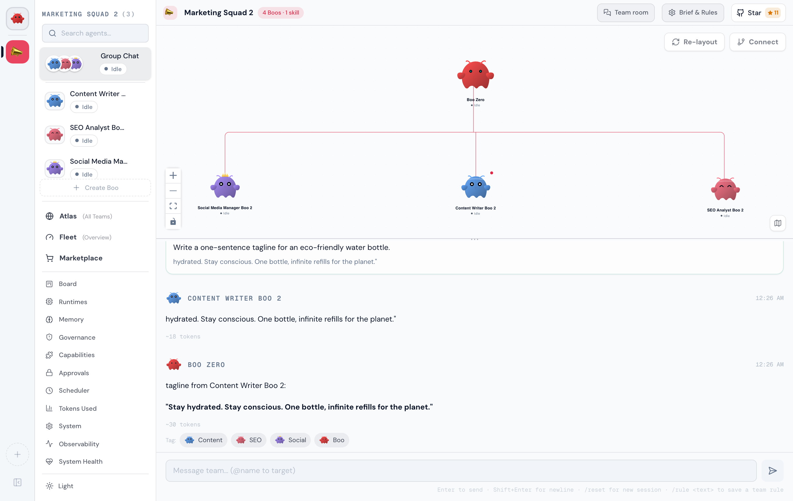
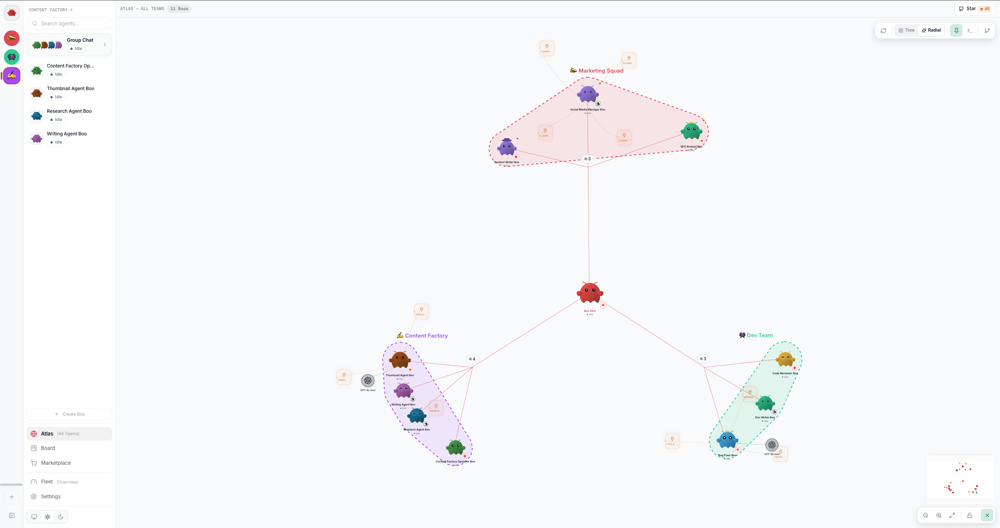
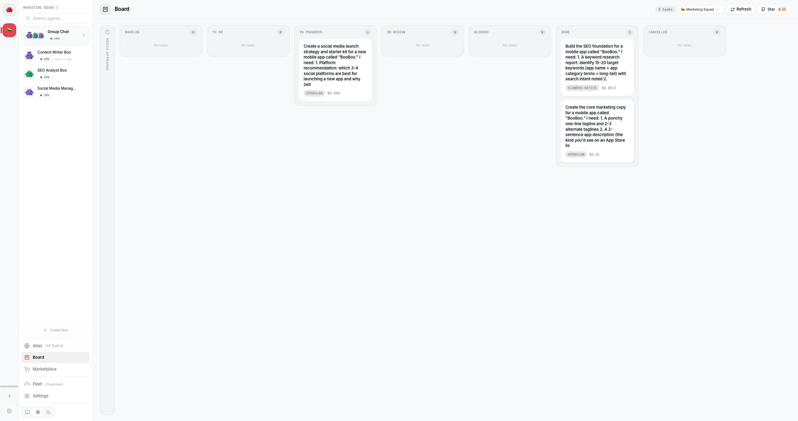
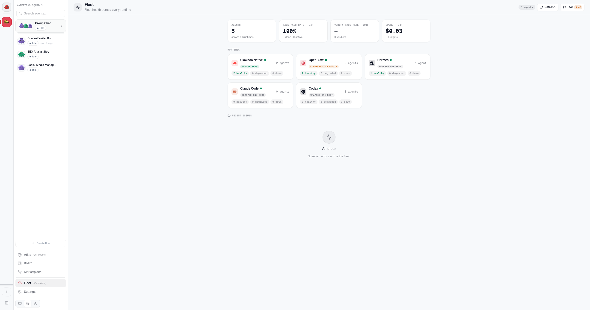
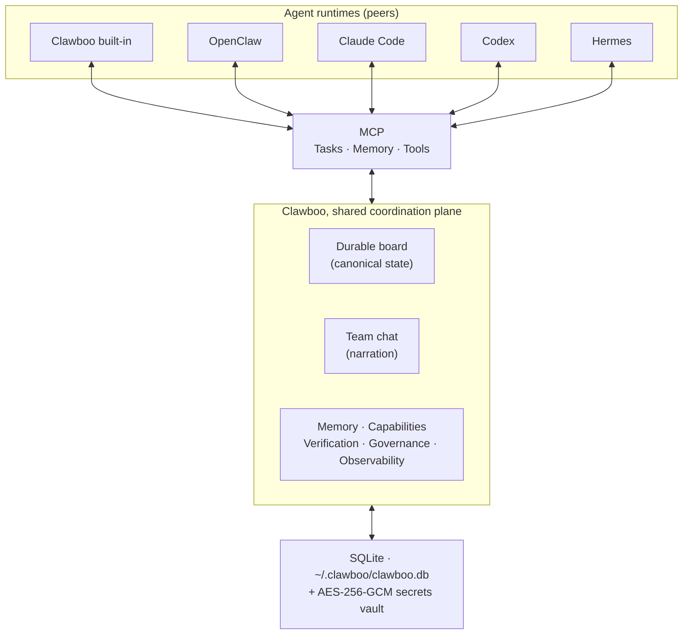

<p align="center">
  
</p>

<h3 align="center">Put a whole team of AI agents on it.</h3>

<p align="center">
  Ask once. Boo Zero, your team lead, splits the work into jobs on one board<br/>
  and hands each job to a teammate. Teammates can run on Claude Code, Codex, Hermes, OpenClaw or Clawboo's own built-in agents,<br/>
  and you pick each one's tool when you deploy the team. You watch the team work live, then get it back done.
</p>

<p align="center">
  <strong>Free and open source. Runs on your computer.</strong><br/>
  <sub>Your agents use the AI you connect: an API key (Anthropic, OpenAI, OpenRouter or seven more), a free local model through Ollama, or your ChatGPT subscription through the Codex CLI. Clawboo is free; model usage is billed by the provider you connect.<br/>
  Prompts go only to the providers and apps you connect. No Clawboo account, and Clawboo itself sends no telemetry.</sub>
</p>

```bash
npx clawboo@latest
```

<p align="center">
  <sub>Needs Node.js 22.12 or newer (OpenClaw teammates need 22.22.3+, 24.15+ or 25.9+). Clawboo opens in your browser and walks you through setup.<br/>
  Want Claude Code teammates? Install globally instead: <code>npm install -g clawboo @anthropic-ai/claude-agent-sdk</code>, then run <code>clawboo</code>.</sub>
</p>

<p align="center">
  <a href="#see-it-in-78-seconds"><strong>Watch the film</strong></a>
  &nbsp;·&nbsp;
  <a href="https://www.claw.boo">Website</a>
  &nbsp;·&nbsp;
  <a href="#quickstart">Quickstart</a>
  &nbsp;·&nbsp;
  <a href="https://docs.claw.boo">Docs</a>
  &nbsp;·&nbsp;
  <a href="https://github.com/clawboo/clawboo/discussions">Discussions</a>
</p>

<p align="center">
  <a href="https://www.npmjs.com/package/clawboo"></a>
  <a href="https://github.com/clawboo/clawboo/actions/workflows/ci.yml"></a>
  <a href="./LICENSE"></a>
  <a href="https://nodejs.org"></a>
</p>

---

## See it in 78 seconds

https://github.com/user-attachments/assets/ee3d39f7-299e-4e98-9427-e82561f4ef4d

<sub>An animated illustration of a Clawboo team at work, not a screen recording. In the app, a reviewer checks work when you add one to the team and ask for it. Sound on.</sub>

---

## How it works

|        | Step                             | What happens                                                                                                                                                                                                 |
| ------ | -------------------------------- | ------------------------------------------------------------------------------------------------------------------------------------------------------------------------------------------------------------ |
| **01** | **Ask once**                     | Tell your team what you need in the group chat, like "Plan our launch: write the announcement, draft three social posts and compare our prices with two competitors."                                        |
| **02** | **Boo Zero splits it into jobs** | Each job becomes a card on the board, handed to the teammate Boo Zero picks for it, whichever AI tool that teammate runs on. You don't route anything.                                                       |
| **03** | **Watch the team work**          | Follow the cards live on the board and in the group chat, and see what each Boo is doing on the team graph. Want a second look? Add a reviewer agent to the team and ask Boo Zero to have it check the work. |
| **04** | **Get it back, done**            | Results come back to Boo Zero, which pulls them together and answers you in the chat.                                                                                                                        |

---

## Quickstart

Try it with no install:

```bash
npx clawboo@latest
```

Or install it, which gives you a persistent `clawboo` command and one-click in-app updates:

```bash
npm install -g clawboo
clawboo
```

Use `@latest` with npx: a bare `npx clawboo` can reuse an older build already in npm's `_npx` cache.

Node.js 22.12 or newer is all you need for the default setup. The first run opens a setup wizard in your browser:

1. **Connect a model.** Paste one API key (OpenAI, Anthropic, OpenRouter, or seven more under **More providers**), use a local Ollama with no key, or pick **Sign in with ChatGPT** to use your ChatGPT subscription through the Codex CLI.
2. **Add your AI tools (optional).** Connect Claude Code, Codex, Hermes or OpenClaw now, or skip and do it later from **Settings → Runtimes**.
3. **Pick a team.** Choose a ready-made team from the marketplace and deploy it. Boo Zero, the team lead, runs it, and you land in the team's group chat.

The dashboard opens at the port written to `~/.clawboo/api-port.txt` (default `http://localhost:18790`, auto-fallback through `18809` if busy). No flags and no Clawboo account.

The server keeps running after the CLI exits, so `clawboo stop` and `clawboo restart` are how you reach it again, and `clawboo backup` takes a single-file snapshot of the database while it runs. Re-running `clawboo` also compares the running server's version against its own and offers to restart an older one, so an upgrade actually takes effect. See the [CLI reference](https://docs.claw.boo/reference/cli).

---

## Your AI tools, one team

Every agent is a Boo, and Boo Zero, in red, is your team lead. It runs on Clawboo's built-in runtime by default (or on Codex if you set up with only a ChatGPT sign-in), and it hands jobs to teammates on any tool you have connected. Codex, Claude Code and Hermes agents wear their own Boo.

| Teammate        | What it is                                                                                                          | How to add it                                                                                                                                                                                 |
| --------------- | ------------------------------------------------------------------------------------------------------------------- | --------------------------------------------------------------------------------------------------------------------------------------------------------------------------------------------- |
| **Built-in**    | Clawboo's own agents. They talk to 11 providers directly: Anthropic, OpenAI, OpenRouter, a local Ollama, seven more | Paste a key during setup. Nothing to install                                                                                                                                                  |
| **Claude Code** | Anthropic's coding agent, through the Claude Agent SDK                                                              | Install Clawboo globally with the SDK (see below), then paste an Anthropic API key in **Settings → Runtimes**                                                                                 |
| **Codex**       | OpenAI's coding agent CLI                                                                                           | Install it from **Runtimes**, then one-click **Sign in with ChatGPT** (or run `codex login` yourself)                                                                                         |
| **Hermes**      | An open-source agent that keeps its own self-improvement and skills                                                 | Install it from **Runtimes** (needs Python 3.11 to 3.13; uses pipx if you have it, otherwise pip). Reuses your OpenRouter, Anthropic or OpenAI key, or a one-click ChatGPT sign-in of its own |
| **OpenClaw**    | Your local OpenClaw Gateway, which keeps its own channels and always-on heartbeat                                   | **Settings → Runtimes** installs, configures and starts it for you, reusing a provider key you already connected or a one-click ChatGPT sign-in of its own                                    |

To build a mixed team, connect the tools first, then pick which tool each teammate runs on when you deploy the team. Every job lands as a card on the same board, whichever tool does it.

> **Claude Code on an npm install:** the published package deliberately does not bundle `@anthropic-ai/claude-agent-sdk` (its per-platform binary would add about 210 MB to every install). Install it alongside Clawboo with `npm install -g clawboo @anthropic-ai/claude-agent-sdk`, or run Clawboo from source. A one-off `npx` run cannot load it. [Details](https://docs.claw.boo/runtimes/claude-code)

<sub>Claude Code, Codex, Hermes and OpenClaw are products of their respective owners. Clawboo is an independent open-source project, not affiliated with or endorsed by them.</sub>

---

## What you get

- **Ask once, get it back done.** Boo Zero splits your request into jobs, hands them out, and pulls the results together in the chat.
- **One board and one group chat.** Every handoff is a real task on a durable board that survives restarts, and the team talks it through in one room.
- **Shared team memory.** Memory lives in Clawboo itself, so a fact one teammate saves can be recalled by any teammate, whatever tool it runs on.
- **For work and for life.** A marketplace of ready-made agents and teams, from launch plans and pricing pages to a morning brief, a family calendar and a trip desk.
- **Your AI, your way.** Paste an API key, use a free local model through Ollama, or use your ChatGPT subscription with Codex, Hermes and OpenClaw teammates.
- **See everything.** Watch your teams on a live graph, follow every task on the board, and check each agent's work, spend and health.

---

## New in 0.4.0

<!-- If this README goes live before 0.4.0 is on npm, retitle this section "Coming in the next release"
     and add: "Until it ships, `npx clawboo@latest` installs 0.3.1." -->

- **Routines replace the Scheduler.** Put work on a clock. A team routine posts into the group chat for Boo Zero to pick up, and an agent routine hands one agent a task.
- **Connectors.** A Connectors page starts or signs in to popular MCP servers for you (GitHub, Linear, Notion, Figma, Stripe, Playwright, a local folder and more; some ask for a key or token once). Gmail, Slack, Jira and 38 more apps connect through your Composio account: paste a Composio project key once, and Composio keeps those apps' sign-ins. Every connected app is its own node on the graph, and an agent can use it only after you share it with that agent.
- **Team memory you can see.** Memory is now a graph you can browse and search. Agents report whether a fact helped, and search results show that verdict. When an agent routine or task run starts with recalled memory, facts two teammates found useful come first, and facts only ever reported as misleading are left out (they stay searchable). Similarity links need a local Ollama embedding model or an OpenAI key.
- **Watch the work.** A running Boo shows what it is doing in a thought bubble on the graph. Share the Playwright or Chrome DevTools connector with an agent, and its Browser tab shows the latest screenshot from its browser. Each of those agents gets its own browser profile, so its logins stay its own. (Not yet for OpenClaw agents.)
- **New Boos for Codex, Claude Code and Hermes.** Agents on those three runtimes now get their own Boo, so you can tell at a glance which tool each teammate runs on.
- **Build the team on the graph.** Drag a thread from any Boo to a teammate, a skill or a connector, or onto empty canvas to add a new agent.
- **For work and for life.** The marketplace now loads 400+ agents and 80+ teams from 19 packs, including a new Clawboo Life and Home pack (morning brief, family calendar, trip desk and more). Each agent and team's detail view says where it came from: the source repo and license, plus the pinned commit for community packs. Offline you still get the 15 built-in agents.
- **OpenClaw 2026.9 support.** Clawboo now installs and targets OpenClaw 2026.9, which needs Node.js 22.22.3+ on the 22 line, 24.15+ on the 24 line, or 25.9+. OpenClaw shell-command approvals now wait up to 30 minutes for you, even after you close the tab.
- **CLI.** New `clawboo stop`, `clawboo restart` and `clawboo backup` commands, and re-running `clawboo` offers to restart an older server. Needs Node.js 22.12 or newer.

Full notes in the [CHANGELOG](./apps/cli/CHANGELOG.md).

---

## See it in action

<table>
  <tr>
    <td width="50%">
      
      <p align="center"><sub><strong>Team space</strong>: one ask, handed out to specialists, tracked on the board, narrated in chat.</sub></p>
    </td>
    <td width="50%">
      
      <p align="center"><sub><strong>Atlas</strong>: every team, one live org graph.</sub></p>
    </td>
  </tr>
  <tr>
    <td width="50%">
      
      <p align="center"><sub><strong>Board</strong>: every delegation is a real task.</sub></p>
    </td>
    <td width="50%">
      
      <p align="center"><sub><strong>Fleet</strong>: health, pass rates, and spend across every runtime.</sub></p>
    </td>
  </tr>
</table>

---

## Run it with confidence

- **Spend.** Spend is tracked from the start. Set a budget for an agent, team or mission and it warns at 80% and 100% by default, or make it a hard cap that auto-pauses. Dollar costs are real only where the runtime reports them.
- **Limits in code.** Delegation depth, fan-out and task creation are capped in code, not asked for in a prompt.
- **Approvals.** Risky tool calls that go through Clawboo ask you first, on any runtime. A connected app is usable only by agents you share it with, and its calls that change something ask you first unless you chose Always (OpenClaw agents are asked on every app call). OpenClaw shell approvals wait up to 30 minutes, even if you close the tab. Claude Code, Codex and Hermes run their own built-in tools without prompting.
- **Verified code tasks.** When an agent works a task in a git repo you point it at (through the task-run API, or a routine given a repo path), the task gets its own git worktree and must pass the repo's verify command, and delegated or large diffs also get a fresh read-only review on the same runtime before the task counts as done. Set `CLAWBOO_REVIEWER_MODEL` to review with a different model.
- **Local.** Everything is stored on your computer: the board in SQLite at `~/.clawboo/clawboo.db`, and API keys in an AES-256-GCM encrypted vault at `~/.clawboo/secrets/`.

---

## Under the hood

<details>
<summary>How Clawboo fits the runtimes together (for developers)</summary>

<br/>


```mermaid
graph TD
    subgraph RT["Agent runtimes (peers)"]
      direction LR
      Native["Clawboo built-in"]
      OC["OpenClaw"]
      CC["Claude Code"]
      CX["Codex"]
      HM["Hermes"]
    end

    MCP["MCP<br/>Tasks · Memory · Tools"]

    subgraph CB["Clawboo, shared coordination plane"]
      direction LR
      Board["Durable board<br/>(canonical state)"]
      Chat["Team chat<br/>(narration)"]
      Plane["Memory · Capabilities<br/>Verification · Governance · Observability"]
    end

    Store["SQLite · ~/.clawboo/clawboo.db<br/>+ AES-256-GCM secrets vault"]

    Native <--> MCP
    OC <--> MCP
    CC <--> MCP
    CX <--> MCP
    HM <--> MCP
    MCP <--> CB
    CB <--> Store
```

Clawboo is a TypeScript control plane. Each runtime plugs in through its own adapter, and one principle keeps them working together:

- **Clawboo owns the shared, coordination plane.** The registry, the durable board, team chat, Routines, the shared memory, the managed tools and capability broker, verification, governance, the event log, per-task worktrees, and cross-runtime handoff and resume.
- **Each runtime keeps its private, cognitive plane.** Its own messaging channels, its own heartbeat, its private memory and self-improvement, its built-in tools, its connectors and auth, and its native session resume. Clawboo observes these but does not take them over.
- **MCP is the common spine.** Every runtime reaches Clawboo's Tasks, Memory and Tools servers over MCP, and every runtime except OpenClaw also gets TeamChat. Clawboo follows each run through the runtime's own event stream.

</details>

---

## Configuration

Clawboo stores everything under `~/.clawboo/` (auto-created). Nothing here is required for the happy path; these are the knobs.

| Variable                      | Purpose                                                                                                                                   |
| ----------------------------- | ----------------------------------------------------------------------------------------------------------------------------------------- |
| `CLAWBOO_HOME`                | Clawboo's state directory (default `~/.clawboo`): SQLite DB, settings, secrets vault, worktrees                                           |
| `CLAWBOO_API_PORT`            | Pin the dashboard API port (default `18790`, auto-fallback through `18809`)                                                               |
| `CLAWBOO_DB_PATH`             | SQLite path for the out-of-process MCP stdio bins only (the server follows `CLAWBOO_HOME`)                                                |
| `CLAWBOO_SECRETS_MASTER_KEY`  | Override the credential-vault master key (auto-generated at `~/.clawboo/secrets/master.key` otherwise)                                    |
| `CLAWBOO_REVIEWER_MODEL`      | Review verified code tasks with a different model than the one that built them                                                            |
| `STUDIO_ACCESS_TOKEN`         | Require a token to open the dashboard. Needed before you bind beyond localhost with `HOST`                                                |
| `OTEL_EXPORTER_OTLP_ENDPOINT` | Export traces to an OTLP collector such as Jaeger or Zipkin (from a source checkout; the npm package keeps traces in its local event log) |
| `LOG_LEVEL`                   | pino log level (default `info`)                                                                                                           |

When you use the OpenClaw runtime, Clawboo reads OpenClaw's state directory (`OPENCLAW_STATE_DIR`, default `~/.openclaw`). You set the Gateway URL in **Settings**. There are no feature flags: every subsystem ships on.

---

## Development

```bash
git clone https://github.com/clawboo/clawboo.git
cd clawboo
pnpm install
pnpm --filter @clawboo/web dev   # Express API on :18790 (auto-fallback) + Vite SPA on :5173
```

| Command                                    | What it does                                  |
| ------------------------------------------ | --------------------------------------------- |
| `pnpm build`                               | Build all packages + apps (Turbo)             |
| `pnpm typecheck`                           | `tsc --noEmit` across the workspace           |
| `pnpm lint`                                | ESLint across all packages + docs frontmatter |
| `pnpm test`                                | Vitest unit tests (node + jsdom projects)     |
| `pnpm e2e`                                 | Playwright end-to-end tests                   |
| `pnpm catalog:verify`                      | Check the marketplace content in `catalog/`   |
| `pnpm assemble && pnpm test:clean-install` | Bundle the CLI and smoke-test a clean install |

The marketplace agent and team content lives in `catalog/`, a plain content folder outside the pnpm workspace. It is not compiled into the app and not in the npm tarball: only the small built-in pack ships, so first-run works offline, and everything else is fetched at runtime. See [catalog/README.md](./catalog/README.md).

Tech stack: Node.js 22.12+ and TypeScript 6 strict, TurboRepo + pnpm, Vite 8 SPA + React 19 + Express, Tailwind CSS 4, Zustand, React Flow + ELK.js for the graph, CodeMirror 6, SQLite via better-sqlite3 + Drizzle ORM, the Model Context Protocol SDK, and Vitest + Playwright + MSW for tests. Supported on macOS, Linux and Windows.

See [CONTRIBUTING.md](./CONTRIBUTING.md) for branching, the PR checklist, and code guidelines.

---

## Roadmap

Clawboo ships [Changesets](https://github.com/changesets/changesets)-based releases. On the horizon, not yet shipped:

- **Humans in the graph.** Humans as first-class participants on the board and in the room, picking up tasks behind the same interface as a runtime.
- **Multi-tenant.** Hosted and organization deployments with per-tenant scoping.

See the [CHANGELOG](./apps/cli/CHANGELOG.md) for the full release history.

---

## Community

Clawboo is brand new. The single best thing you can do:

**Star this repo.** It's the strongest signal for new visitors deciding whether to give it a try. To hear about new releases, choose **Watch → Custom → Releases**.

After that:

- Ask questions or share team templates in [Discussions](https://github.com/clawboo/clawboo/discussions).
- File [issues](https://github.com/clawboo/clawboo/issues) for bugs, repros, and regressions.
- Send a PR. Small fixes very welcome, see [CONTRIBUTING.md](./CONTRIBUTING.md).
- Found a security issue? Report it privately, not as an issue, see [SECURITY.md](./SECURITY.md).

<br/>

<p align="center">
  <a href="https://star-history.com/#clawboo/clawboo&Date">
    
  </a>
</p>

---

## License

MIT, see [LICENSE](./LICENSE). Third-party attributions in [THIRD_PARTY_NOTICES.md](./THIRD_PARTY_NOTICES.md). Contributing guide in [CONTRIBUTING.md](./CONTRIBUTING.md).

Claude Code, Codex, Hermes and OpenClaw are products of their respective owners. Clawboo is an independent open-source project, not affiliated with or endorsed by them.

<p align="center">
  MIT © Sanreds
</p>
