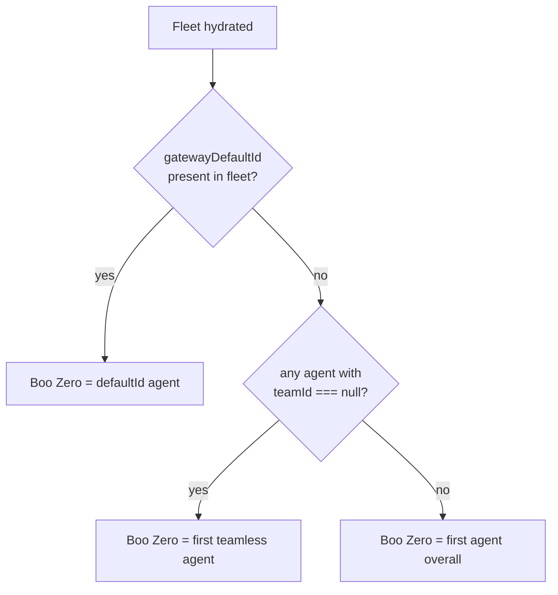
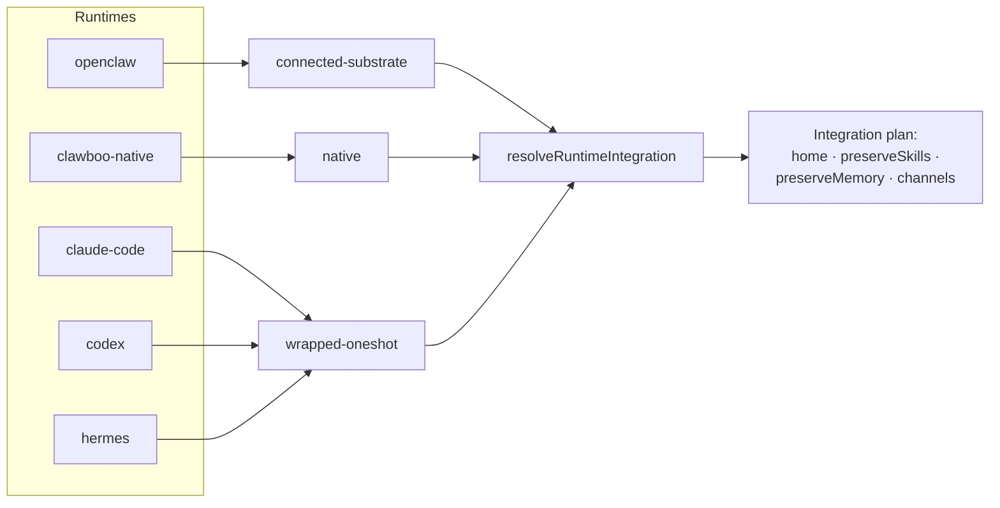

A **Boo** is a single agent in Clawboo. Concretely it is an `AgentRecord`, a runtime-agnostic row in the agent [registry of record](/appendices/glossary). The record says *who exists*: a stable id, a display name, a status, an optional team, and, critically, a `runtime` field and a `participantKind`. The record does **not** contain the agent's execution loop. That belongs to a [runtime](/appendices/glossary), reached through the uniform `RuntimeAdapter` trait. The same Boo can be backed by any of Clawboo's five runtimes, and the team layer never branches on which one.

This page explains what a Boo is and isn't, the `AgentRecord` shape and its source-of-truth discipline, **Boo Zero** (the universal team leader), the open-set `participantKind` seam, and how the five runtimes collapse onto just three *runtime classes* that decide how the host composes with each runtime.

## What a Boo is, and what it isn't

A Boo is the answer to *who exists*. It is **not** the answer to *how it runs* (that's the runtime) or *what work it's doing* (that's [the board](/concepts/the-board)). Those three concerns are deliberately separate:

- **Registry of record**: the `AgentRecord`. Owns identity, display, team membership, personality config, and the runtime tag. Reads of the fleet go through this (the `/api/agents` REST surface), which is why the dashboard renders even when a backing runtime is offline.
- **Runtime**: the `RuntimeAdapter` that actually executes a turn. Owns the execution loop, the session, and the runtime's own private state.
- **Board**: references agents and runtimes by id and owns only task state.

This separation is what makes "runtime-agnostic" real. A Boo is not "an OpenClaw agent" or "a Claude Code agent"; it is a record whose `runtime` field happens to name one of five runtimes today, and whose execution is delegated to that runtime behind a trait the rest of the codebase treats as a black box.

<Note>
Every Boo is a real `AgentRecord`. There are no synthetic or decorative agents; even Boo Zero, the universal leader, is a real record (the runtime's default agent). The Ghost Graph and the sidebar render records, not fictions.
</Note>

## The AgentRecord

`AgentRecord` is the neutral, Clawboo-native shape the rest of the codebase reads, not an OpenClaw protocol shape. An `OpenClawAgentSource` adapts the upstream Gateway into this shape in both directions; future sources (the native runtime) populate it directly. Each field is annotated with its source of truth: **Gateway-synced** fields are overwritten on every sync; **SQLite-native** fields are Clawboo-owned and preserved across re-sync.

| Field | Type | Source of truth | Meaning |
|---|---|---|---|
| `id` | `string` | SQLite-native | Clawboo's stable primary key. |
| `sourceId` | `RuntimeId` | SQLite-native | Which `AgentSource` owns the upstream record. |
| `sourceAgentId` | `string` | Gateway-synced | The upstream id within that source. |
| `displayName` | `string` | merged | Boo-Zero override ▸ Gateway identity name ▸ id. |
| `emoji` / `avatarUrl` | `string \| null` | Gateway-synced | Runtime identity visuals. |
| `avatarSeed` | `string \| null` | SQLite-native | Seed for the procedural Boo avatar. |
| `status` | `AgentRecordStatus` | Gateway-synced | `idle` · `running` · `error` · `sleeping` · `archived`. |
| `sessionKey` | `string \| null` | Gateway-synced | The agent's main session key. |
| `isDefault` | `boolean` | Gateway-synced | True when this is the source's default agent (Boo Zero). |
| `teamId` | `string \| null` | SQLite-native | Team membership; `null` = unassigned. |
| `personalityConfig` / `execConfig` | `unknown \| null` | SQLite-native | Clawboo-native config preserved across re-sync. |
| `participantKind` | `'agent' \| 'human'` | seam | Who executes: `agent` today (see below). |
| `runtime` | `RuntimeId` | seam | Which runtime backs this agent. |
| `tenantId` | `string \| null` | seam | Dormant multi-tenant scope (`null` = single implicit tenant). |
| `archivedAt` | `number \| null` | SQLite-native | Soft-delete tombstone (epoch ms); `null` = live. |
| `createdAt` / `updatedAt` | `number` | SQLite-native | Lifecycle timestamps. |

`RuntimeId` is an **open set**: `'openclaw' | 'claude-code' | 'codex' | 'hermes' | (string & {})`. The string-union escape hatch means the type is a list of autocomplete hints, not a closed enum; a sixth runtime is a new value, not a type change. `AgentRecordStatus` is a *superset* of the runtime's own status, adding the `archived` tombstone that Clawboo owns.

The sync that keeps a record fresh is idempotency-disciplined: a re-sync from the upstream overwrites only the Gateway-synced columns and never clobbers the SQLite-native ones. So a Boo's team, personality, and avatar seed survive a runtime reconnect untouched. The internals of that sync live in [AgentSource](/internals/agent-source).

## Boo Zero, the universal team leader

Exactly one Boo in the fleet is **Boo Zero**: the universal team leader. It is the runtime's *default agent*, and it is *teamless* in the database, `teamId === null`, yet it participates in **every** team. It does so through a team-scoped session key of the form `agent:<booZeroId>:team:<teamId>`, so its conversation in each team is isolated even though the underlying record is shared.

Boo Zero is identified on connect, not stored as a flag. The identification function walks a three-step priority:

1. The runtime's reported default agent (`defaultId`), if it exists in the fleet.
2. Otherwise, the first agent with `teamId === null` (the first unassigned agent).
3. Otherwise, the first agent overall.

Because Boo Zero is teamless but leads every team, the leader-resolution rule is layered. When resolving a team's effective leader, Boo Zero wins **regardless** of any team-internal lead. The team-internal lead (a CTO / Team Lead role, when one is detected) is a secondary concept that sits *between* Boo Zero and the rest of the team, and it becomes the routing fallback only when Boo Zero is absent. The full precedence is:

1. Boo Zero (when it exists in the fleet).
2. The team-internal lead (when set and a member of the team).
3. The first member of the team.
4. `null`: an empty team with no Boo Zero.

<Note>
Boo Zero's identity is determined at hydration from live fleet data, so it can change if the default agent changes. It is not a persisted boolean on the record; `isDefault` reflects the upstream default, and the identification function turns that (plus the teamless fallbacks) into the single Boo Zero id the UI uses.
</Note>

## participantKind, the human seam

Every `AgentRecord` and every `RuntimeAdapter` carries a `participantKind` of `'agent' | 'human'`. Today every participant is an `agent`; nothing in the shipped code branches on this field. It is a deliberate, reserved seam so that a person can later become a first-class task assignee, delegation target, or approver behind the **same** interface, without baking "executor == automated agent" into the trait, the board's assignee model, or the lifecycle event stream.

<Info>
`participantKind: 'human'` is a **future seam, not a shipped feature** in v0.2.0. There is no human-participant path yet. The field exists so the surrounding machinery (registry, board, events) doesn't have to be rewritten when one is added.
</Info>

## How a Boo relates to a runtime

A Boo's `runtime` field names one of five runtimes: `openclaw`, `clawboo-native`, `claude-code`, `codex`, or `hermes`. Each is wrapped by a `RuntimeAdapter`, one interface over every runtime, that normalizes the runtime's native signals into Clawboo's `RuntimeEvent` lifecycle stream. The hot path is supervision, relay, and UI, so Clawboo *wraps* runtimes rather than reimplementing their loops.

Each adapter declares a `Capabilities` block. The capability the host actually routes on is `runtimeClass`, which describes **how a runtime composes with the host**:

| `runtimeClass` | Meaning | Runtimes |
|---|---|---|
| `connected-substrate` | A long-lived runtime the host drives over its live connection; it owns its own home, skills, memory, channels, and scheduler entirely. | `openclaw` |
| `native` | A host-native participant whose private state (persisted conversation transcripts) lives in a stable per-identity home the host materializes. | `clawboo-native` |
| `wrapped-oneshot` | A per-run spawned one-shot worker (a CLI/SDK process the host launches, drives, and exits). | `claude-code`, `codex`, `hermes` |

The five runtimes therefore collapse onto **three classes**. This matters because the executor branches **only** on the runtime class, never on a runtime id. A pure function, `resolveRuntimeIntegration(capabilities)`, turns the declared `runtimeClass` (plus the `nativeHome` / `nativeSkills` / `nativeMemory` / `nativeChannels` seam) into a normalized integration plan: where the run's home lives (`connected`, `persistent` per-identity, or `ephemeral`), whether native skills and memory are preserved across runs, and whether deliveries ride the runtime's own channels.

The class also gates dispatch. The one-shot executor runner spawns a fresh process per run; so a `connected-substrate` runtime like OpenClaw must **never** be routed to it (it executes over its live Gateway connection instead). The runner refuses a connected-substrate adapter *before* the atomic claim, so a misrouted call never mutates the board. Because the refusal keys on the resolved integration home being `connected`, not on a runtime-id check, adding a sixth runtime is handled by construction.

A subtlety worth noting: `runtimeClass` lives on the adapter's `Capabilities`, not on the runtime *descriptor*. The descriptor (`RUNTIME_DESCRIPTORS`) covers install and auth: package name, health binary, auth kind, the env var written to the encrypted vault, for the four non-OpenClaw runtimes. The runtime class is an execution property the adapter declares. They answer different questions: the descriptor is "how do I bring this runtime online?", the class is "how does the host drive it once it's online?". For the install/connect side, see [Connecting runtimes](/runtimes/connecting-runtimes).

## Design rationale and trade-offs

The agent model is built around one decision: **the registry is the source of truth for who exists; the runtime is the source of truth for how an agent runs.** Splitting identity from execution buys three things. Reads serve from SQLite, so the fleet renders even when a runtime is down. A Boo can move between runtimes (or be backed by a new one) without rewriting any consumer, because consumers see `AgentRecord`, not a runtime-specific shape. And the open-set `runtime` / `participantKind` / `tenantId` fields let future capabilities (a sixth runtime, human teammates, multi-tenancy) land as data changes rather than type rewrites.

The cost is indirection: a Boo and its runtime are two layers, and a change to a runtime's behavior often touches its adapter rather than the record. The `runtimeClass → resolveRuntimeIntegration` routing is the same trade-off applied to execution; the host pays a small abstraction tax (a plan computed from capabilities) to never hardcode a runtime id in the hot path.

## Boundaries and non-goals

- **A Boo is not its runtime.** The record carries a `runtime` tag and execution config, but the execution loop, the live session, and the runtime's private on-disk state belong to the runtime. The board references the agent by id; it does not own agent identity or session state.
- **`participantKind: 'human'` is dormant.** No human-participant path exists in v0.2.0. The field is a seam.
- **`tenantId` is dormant.** Every record carries a `tenantId`, but there is no active per-tenant scoping, a single implicit tenant today.
- **Boo Zero is identified, not declared.** It is whatever the three-step priority resolves to at hydration, not a persisted leader flag. Change the runtime's default agent and Boo Zero can change.

<Note>
This documents the **v0.2.0 working tree** (commit `03b206a`). The current npm `latest` is **`clawboo@0.1.9`**, so `npx clawboo` installs 0.1.9 until the v0.2.0 tag is published. Differences are noted in [Known Issues](/appendices/known-issues).
</Note>

## See also

- [Teams and planes](/concepts/teams-and-planes), how Boos group into teams and the shared-plane / private-plane split
- [Runtimes overview](/runtimes/index), the five runtimes and the capability matrix
- [Connecting runtimes](/runtimes/connecting-runtimes), install/connect/disconnect a runtime
- [The board](/concepts/the-board), where a Boo's work lives once it's dispatched
- [AgentSource (internals)](/internals/agent-source), the registry-of-record sync discipline
- [RuntimeAdapter (internals)](/internals/runtime-adapter), the trait and the `RuntimeEvent` union
- [Glossary](/appendices/glossary), canonical term definitions
