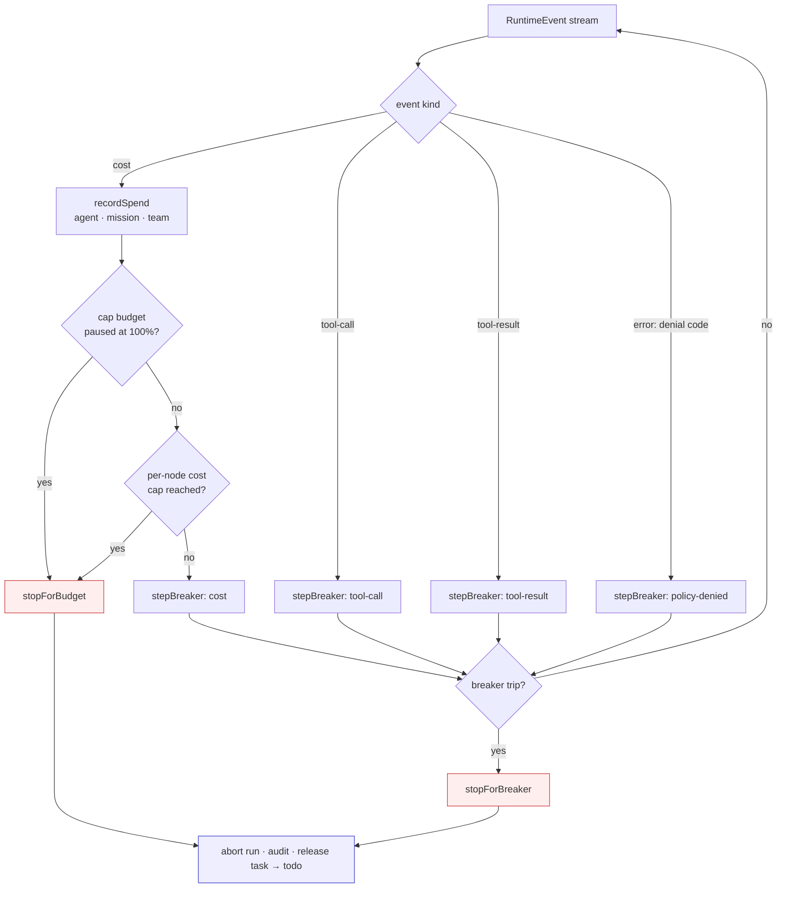

Governance is the set of guardrails that make a runaway agent *impossible*, not merely visible. Where [observability](/concepts/observability) tells you what a run did, governance stops a run that has gone wrong: a [budget](/appendices/glossary) that has run out of dollars, a tool loop that thrashes without progress, a delegation tree that tries to grow too deep, or a destructive delegation that a human should sign off on first.

Every governance signal is keyed on a typed [`RuntimeEvent`](/appendices/glossary): a `cost` event's dollar delta, a `tool-call` / `tool-result` pair, a typed error `code`, and never on rendered model prose. That is the same no-prose-as-control-signal discipline the whole [delegation and orchestration](/concepts/delegation-and-orchestration) layer follows: a control decision must come from a machine-readable field, because an LLM's free text is unparseable and adversarially manipulable.

This page explains the four mechanisms: the budget **kill-switch** (cap vs warn mode, per agent / mission / team, auto-pause at 100%); the five **circuit breakers** (a cross-runtime backstop for stuck loops); the orchestrator-boundary **caps** (depth / fan-out / cost); and the **approval handshake** for risky delegations.

## What it is, and what it isn't

Governance is **enforcement in code, below the model**. The budget kill-switch aborts a live run; the breakers halt a thrashing loop; the caps refuse a delegation before it spawns; the approval gate blocks a risky delegation until a human resolves it. None of these ask the model to behave; they make misbehavior structurally impossible regardless of what the model decides.

Governance is **on by default and uncapped by default**. The breakers and caps always run with conservative defaults that a healthy run never trips. Budgets enforce *nothing* until a user sets a limit, and the shipped posture is **track-and-warn**: a budget records spend and emits a warning at 80% and 100%, but a user must explicitly choose `cap` mode to get the auto-pause. There is no global feature flag; these are always-on parts of the [executor runner](/internals/executor-runner).

Governance is **not** a substitute for the sandbox. A worktree gives a file-mutating run an isolated checkout (a *concurrency* boundary), and a container is the documented escalation for a *privilege* boundary; budgets and breakers bound *spend and effort*, not *blast radius*. The two are complementary; see [Worktrees and handoff](/concepts/worktrees-and-handoff).

## The model

The governance signals all feed the same place: the cost / tool-call / tool-result loop inside the executor runner that drains a runtime's `RuntimeEvent` stream. Budget and breaker state are run-local accumulators; on the first trip, the loop breaks and a single teardown path runs.



The breaker feed is gated on `!stopForBudget`, so **the budget check wins ties** and at most one teardown, one `adapter.abort`, runs per run. Both teardowns end the same way: the run aborts, a forensic event lands in the [governance audit log](/appendices/glossary), and the task is released back to `todo` (retryable). The caps and the approval gate sit one layer up, in the orchestrator, refusing a delegation *before* it ever becomes a run.

## The budget kill-switch

A budget is a USD cap on a scope. There are four scopes:

| Scope | What it bounds |
|---|---|
| `agent` | One agent's lifetime spend. |
| `mission` | One delegation tree's spend, the *root* task of the tree (a top-level task is its own mission). Spend rolls up here so one tree can't drain the org budget. |
| `team` | A whole team's spend. |
| `tenant` | Dormant per-org seam (see [Boundaries](#boundaries-and-non-goals)). |

Each budget has a `limitUsdCents`, a `spentUsdCents`, a `status` (`active` → `soft_capped` → `paused`), and a `mode` (`cap` or `warn`). All money is integer cents, so the atomic SQL increment and the pure tier math agree byte-for-byte.

### Cap vs warn mode

Mode is the difference between *enforcing* a budget and *watching* one:

- **`warn` (the shipped default).** The budget records spend and emits a governance warning at the 80% and 100% crossings, but its persisted status is clamped so it never reads `paused`. The kill-switch, which triggers on `status === 'paused'`, leaves a warn budget's run alone. A new budget created via the REST surface defaults to `warn`; a hard cap is opt-in.
- **`cap`.** Identical tracking, but the 100% crossing persists `status = 'paused'` and the kill-switch aborts the run. Once `paused`, the scope stays paused on further spend until a human resumes it or raises the cap.

The clamp lives in the DB layer (`recordSpend`), and the kill-switch additionally checks `mode === 'cap'` explicitly, belt-and-suspenders, so a warn budget can never auto-pause even if the DB clamp regressed.

### How spend is recorded

On every `cost` event, the runner records the dollar delta against all three concrete scopes (agent, mission, team) atomically:

```ts
const a = recordSpend(db, 'agent', assigneeAgentId, ledgerCents)
const m = missionId ? recordSpend(db, 'mission', missionId, ledgerCents) : null
const t = task.teamId ? recordSpend(db, 'team', task.teamId, ledgerCents) : null
```

`recordSpend` is an atomic read-modify-write under `BEGIN IMMEDIATE` (the board's [contention recipe](/concepts/the-board#the-contention-recipe)): it reads the current spend, applies the delta, recomputes the status via the shared tier math, and persists, all while holding the write lock, so two concurrent cost events can never lose an update. It returns the resulting status plus which threshold this delta `crossed`: `'soft'`, `'hard'`, or `'none'`, so the caller can act exactly once per crossing. A scope with no budget row returns `null` (uncapped, the common case).

Two precision details make the ledger honest:

- **Sub-cent carry.** A cost event can be a fraction of a cent (`$0.004` ⇒ `0.4¢`). The ledger accumulates spend in *micro-cents* (ten-thousandths of a cent) so repeated tiny amounts are not floored to zero; the displayed `spentUsdCents` is `floor(microCents / 10000)`.
- **Estimated cost for runtimes without USD.** A runtime that reports token usage but no dollar figure (Codex, Hermes, an unpinned native model) emits `costUsd: null`. The runner estimates spend from the exact token usage × the model rate so the cap still engages; a real `costUsd` (Claude Code, a pinned native model) is used as-is.

### Auto-pause and the kill-switch teardown

When a `cap`-mode scope crosses 100%, or the optional per-run `maxNodeCents` ceiling is reached: the runner sets `stopForBudget`, aborts the live run, and runs one teardown:

1. **Audit**, an `auto_pause` entry in the governance audit log (`eventType: 'budget'`) recording the scope, cost, and per-node spend.
2. **System comment** on the board task: *"Auto-paused: `<scope>` budget reached. Raise the cap (or resume) to continue."*
3. **Complete the execution** as `cancelled` with error `budget_paused:<scope>`, and emit an `execution_completed` observability event.
4. **Release the task** to `todo`; retryable once a human raises the cap or resumes the budget.

There is also a **pre-flight gate**: before a run even claims its task, the runner checks whether any relevant `cap`-paused budget already exists (most-specific first: agent → mission → team). If one does, the dispatch is refused with `budget_paused` *before* the claim, so an over-budget run never mutates the board or spawns a process. This is the only enforceable cap for a [connected-substrate](/appendices/glossary) runtime like OpenClaw that reports cost only on the terminal event; the mid-run kill-switch can't fire if there are no mid-run cost events, so the pre-flight gate stops the *next* run instead.

Resuming a paused budget is a human override. A bare resume of a scope whose spend already meets its limit re-pauses on the very next cost event, so the resume route accepts a grace amount that raises the cap above current spend to make real forward progress.

<Tip>
Because budgets are `null` (uncapped) by default and the default posture is warn-mode, a fresh install enforces *no dollars at all*. You get the always-on tracking, audit log, and circuit breakers for free; you opt into hard enforcement per scope when you want it. See [Cost and budgets](/using/cost-and-budgets).
</Tip>

## The circuit breakers

The breakers are a deterministic, cross-runtime **backstop** for a run that is going nowhere. They are distinct from the budget kill-switch (which stops on *dollars*) and from a runtime's own max-turns limit (which stops on *iteration count*, per runtime): the breakers halt a run that burns turns or tokens making no progress or repeating a failing call, *before* the dollar ceiling is reached.

The breaker is a pure stateful reducer (`stepBreaker`) over run-local state. It does no I/O, never reads the wall clock (every timestamp arrives on the signal), and uses no randomness. The runner derives a typed `BreakerSignal` from each `RuntimeEvent` and steps the reducer, which returns the first trip it sees, or `null`.

There are five trip reasons:

| Reason | Fires when | Default |
|---|---|---|
| `iteration-cap` | Settled tool-calls in one run exceed the ceiling. | `> 30` |
| `repeat-failure` | The *same failing* tool signature (name + hash of typed input) N times in a row. | `≥ 3` |
| `no-progress` | N tool-results that add no *new* successful output. | `≥ 6` |
| `token-velocity` | Tokens-per-minute exceeds the ceiling, over a window of at least the minimum span. | `> 200,000` / min, `≥ 15s` window |
| `repeat-policy-denied` | The *same* typed policy-denial code N consecutive times. | `≥ 2` |

A few of these have deliberate nuance worth understanding:

- **`no-progress` only counts failures.** A successful tool call with a *new* signature is progress (it resets the stall counter). A successful *repeat* of an already-seen tool is treated as neutral; a healthy run legitimately re-reads the same file or config while reasoning, so counting that as no-progress would false-abort it. A genuinely stuck loop (repeated failures, or alternating failures that never produce new successful output) still trips.
- **`token-velocity` needs two cost events.** The first cost event sets the window start. This is reachable on runtimes that emit cost *per turn* (the native harness) and across [session rotations](/internals/executor-runner), but a wrapped-oneshot adapter (Claude Code, Codex, Hermes) emits exactly one cost event per run, so for those, velocity is a multi-rotation backstop, never an in-run trip. It is a coarse runaway net, not a fight with a runtime's own max-turns.
- **`repeat-policy-denied` keys on the typed error `code`, never the message prose.** A small allowlist of codes (`policy_denied`, `permission_denied`, `eacces`, `eperm`, and similar) marks a `RuntimeEvent` error as a denial. A run rapidly fighting the [tool broker](/appendices/glossary)'s guardrails is a "fighting the rails" signal worth a fast backstop; the specific reason still surfaces in the audit comment.

The breaker teardown mirrors the budget teardown exactly: a forensic `circuit_break` audit entry (with the trip reason, detail, and a counter snapshot), a typed `[stopped: <reason>] … Released to todo for re-planning.` board comment so the leader can re-plan, a `cancelled` execution with error `circuit_broken:<reason>`, and a release to `todo`. The worktree is left intact, so the [handoff](/concepts/worktrees-and-handoff) stays writable and a retry resumes from clean state.

Per-run overrides flow through the run input (`breakerConfig`), validated by a zod schema; each field is optional and falls back to the conservative default. A per-team or per-agent override table is a noted future seam.

## The caps

The caps are stateless predicates enforced at the orchestrator boundary, independent of what the model asks for. They refuse a delegation *before* it becomes a board task and a run.

| Cap | Bounds | Default | Where it lives |
|---|---|---|---|
| **depth** | How deep a delegation tree may grow (would-create-depth+1 is refused once the existing ancestor depth reaches the max). | `2` | Both the client orchestrator and the runner, via the board ancestor chain. |
| **fan-out** | How many parallel delegations *one turn* may spawn. | `8` | The client orchestrator, per turn. |
| **cost** | A single run's accrued cent ceiling, independent of any budget row. | opt-in (`maxNodeCents`) | The runner's cost loop. |

The **depth cap** is the single-reduce-point rule: a delegation tree may go at most two levels deep, so a leader delegates to a specialist who can delegate once more, and no further. The orchestrator computes depth from the board's `parent_task_id` ancestor chain, not from a prompt, and refuses a delegation that would exceed it, leaving a system comment on the source task and a reflection telling the delegator to handle the work directly.

The **fan-out cap** counts the delegations spawned in a single turn. When the count reaches the max, the overflow delegations are dropped (with a comment naming how many were not started), and an `onCapHit` callback fires. The default is eight parallel children per turn.

The **cost cap** (`maxNodeCents`) is a per-run cent ceiling passed inline at dispatch time. It accumulates the same estimated/real cents the budget ledger sees, and crossing it sets `stopForBudget = 'node'`, the same teardown as a budget auto-pause. It uses `>=` (at the cap is enforced), matching the budget hard cap's exact-boundary semantics.

## The approval handshake

Some delegations should not run until a human approves them, a destructive or external action a leader is about to hand to a specialist. The orchestrator gates these on the leader's approval queue.

A client-side heuristic decides which delegations are risky (matching obviously destructive or external verbs like `delete`, `deploy`, `publish`, `rm -rf`, `prod`, `secret`, `force-push`). A risky delegation calls the delegation-approval endpoint, which reuses the existing DB-mediated `tool_call_approvals` handshake:

1. **Sticky scope.** If the leader has previously resolved an `allow_always` for this scope key (`delegate:<kind>`), the prompt is skipped and the approval returns immediately.
2. **Otherwise, a pending approval is created** and the handler *blocks* on a poll loop until the leader resolves it via the existing Approvals UI, or until the TTL or the waiter deadline expires.
3. **The resolution decides.** `allow_once` or `allow_always` lets the delegation proceed; anything else (`deny`, `expired`, `timeout`) skips the delegation, leaving a system comment and a reflection so the leader can revise or reassign.

The poll loop is what makes a forgotten approval **time out rather than deadlock**: each approval carries an `expiresAt`, the waiter has its own deadline, and a durable TTL reaper atomically expires abandoned pending approvals on an interval (and unblocks the linked board task). Until a leader is identified, no approval is requested.

<Info>
The client REST call **fails closed**. If the approval endpoint is unreachable, the request maps to `timeout` (a non-approving resolution), never `allow_once`. The whole point of the gate is human sign-off for a destructive action, so an unreachable endpoint must not auto-approve. Only *risky* delegations reach this path, so the strictness can never deadlock ordinary team work.
</Info>

## Design rationale and trade-offs

The shape of this subsystem comes from a single conviction stated in the project's design intent: governance should make a runaway agent *impossible*, not just visible, and validated against research exemplars (cent-budget auto-pause, an independent reviewer, approval plumbing that times out rather than deadlocks).

Several deliberate choices follow from that:

- **Typed events, never prose.** Every signal keys on a structured `RuntimeEvent` field. The breaker's tool signatures hash *typed* input; the policy-denial breaker keys on the typed error `code`; the budget reads the `cost` event's dollar delta. This is non-negotiable because the alternative, scraping the model's free text for "I'm stuck" or "permission denied"; is both unparseable and trivially manipulable.
- **Budget wins ties; one teardown per run.** The breaker feed is gated on `!stopForBudget` so exactly one abort fires. A double-abort would race the runtime's cleanup.
- **Track-and-warn by default.** Auto-pausing dollars on a fresh install with no configured limit would be a hostile first impression. The default posture *measures*; you get audit, tracking, and breakers for free, and you opt into dollar enforcement per scope. (The DB column defaults to `warn`; the [production defaults](/operating/production-defaults) document the posture.)
- **Release to `todo`, not `failed`.** A stopped run leaves a retryable task and an intact worktree, so a human can raise a cap, resume a budget, or let the leader re-plan, recovery, not a dead end.
- **Reuse over new tables.** Approvals reuse the `tool_call_approvals` handshake; cost caps reuse the budget teardown; the audit log carries every governance event type. Fewer moving parts to keep consistent.

The trade-off is that the defaults are *coarse*. A breaker tuned conservatively (30 tool calls, 200k tokens/min) will let a genuinely-expensive-but-healthy run proceed; the per-run cost cap and the budgets are the precise instruments, and they are opt-in. Governance bounds the obvious runaway cheaply and leaves the fine-grained controls to a user who wants them.

## Boundaries and non-goals

- **Not a privilege boundary.** Budgets and breakers bound spend and effort, not blast radius. A run that stays under budget can still do anything its tools permit inside its worktree; the privilege boundary is the (documented, opt-in) container escalation, not governance.
- **The chat-path cost loop can ledger but not auto-abort.** The in-browser OpenClaw orchestration path records spend but has no live run handle to abort mid-stream, so its budgets are enforced by the pre-flight gate on the *next* dispatch, not a mid-run kill; a documented asymmetry with the server-side runner.
- **Single implicit tenant today.** Budgets and the audit log carry a dormant `tenant_id` column and a reserved `tenant` budget scope, but no per-tenant filtering is active in v0.2.0. Multi-tenant scoping is a future seam, not a shipped feature.
- **Caps are coarse-grained, not per-tool quotas.** Depth, fan-out, and a per-run cost ceiling are the orchestrator-boundary caps; there is no per-tool call quota or per-skill budget, that granularity, if needed, would be a new seam.

<Note>
This documents the **v0.2.0 working tree** (commit `03b206a`). The current npm `latest` is **`clawboo@0.1.9`**, so `npx clawboo` installs 0.1.9 until the v0.2.0 tag is published. Differences are noted in [Known Issues](/appendices/known-issues).
</Note>

## See also

- [Verification](/concepts/verification), the builder-≠-judge gate that makes "done" mean *verified*
- [Observability](/concepts/observability), the event log and audit trail governance writes into
- [The board](/concepts/the-board), the durable task store governance releases tasks back to
- [Worktrees and handoff](/concepts/worktrees-and-handoff), the isolation boundary governance complements
- [Governance dashboard](/using/governance-dashboard), the human-facing surface for budgets, caps, and approvals
- [Cost and budgets](/using/cost-and-budgets), setting USD budgets and the cost view
- [Governance API](/reference/rest-api/governance), the REST surface for budgets and delegation approval
- [Glossary](/appendices/glossary), canonical term definitions
