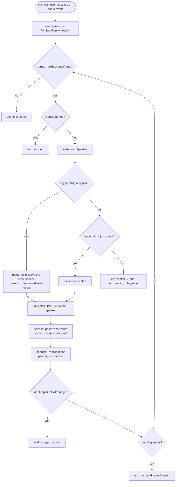

Peer chat is Clawboo's mixed-runtime team room: every team member, whether it runs on the native harness, OpenClaw, Claude Code, Codex, or Hermes, posts into **one durable room as a named peer**, and any of them can lead. It is two pieces working together: the `team_chat` SQLite table (the durable transcript) and a [TeamChat MCP](/appendices/glossary) server (the model-facing surface every runtime attaches). A bounded *exchange* drives a sequence of peer turns, picking who speaks next deterministically and capping how many turns can run. Every post a runtime receives is wrapped as `isUser=false` evidence, so a teammate's words can never land with user authority.

This page explains what peer chat is and isn't, the bounded exchange and speaker-selection loop, the anti-spoof identity binding, the `isUser=false` evidence-tagging that makes peer posts safe to ingest, how each runtime class attaches, and the boundaries: most importantly that the [board](/concepts/the-board) stays canonical and chat is only narration.

## What it is, and what it isn't

Peer chat is a **shared narration surface**, not a decision substrate. Every runtime can both POST (narrate its work, ask a teammate, report a result) and LISTEN (read new posts since a cursor). That symmetry is the wedge: in most multi-runtime setups, cross-runtime messaging is a privileged parent/child relay; here it is a flat room where the leader is one peer among equals and *any* runtime can be the one to lead.

Peer chat is **not** a write path to the board. The board is canonical for task and coordination state; a room post is a *description* of work, never the decision of record. The exchange's speaker-selection and turn cap govern **narration only**; a decision still lands as a board mutation through the board repository. When a board mutation happens, it *reflects* itself into the room as a system line (the fan-out), but that reflection runs strictly *after* the canonical write and can never become the authority. This is the same authority rule the board enforces, applied to the chat surface.

Peer chat is **not** OpenClaw's inter-session messaging, but it deliberately borrows OpenClaw's wire format for delivered posts (the `[Inter-session message … isUser=false]` envelope) so the safety property carries over verbatim.

## The model

An *exchange* is a bounded sequence of peer turns triggered by one stimulus: a user message, or (a documented future opt-in) a board lifecycle event. Each turn the engine selects the next speaker, dispatches exactly one turn for that speaker, records what the turn *obliges* the room to do next (which teammates owe a reply), and repeats until either the turn cap is hit or no obligation remains. This is the guard that two agents cannot chatter forever, the same bound OpenClaw's `sessions_send` uses (`maxPingPongTurns`, default 5).



The exchange ends for one of four reasons: `max_turns` (the cap fired with work still pending, the chatter-forever guard), `no_pending_obligation` (the conversation ran out of things to say), `budget_paused` (a turn's recorded spend tripped a cap budget), or `aborted` (the initiating client disconnected). The first three lifecycle signals, speaker selected, and the turn bound being hit, are projected into the [observability](/concepts/observability) event log as `speaker_selected` and `turn_bound_hit` events.

## Speaker selection

The "who talks next" decision is isolated behind one pure function so a richer LLM-selected policy can replace it later without touching the exchange loop. The shipped default is deterministic:

1. **Pending obligation → round-robin.** A participant that currently owes a turn (a delegation target, or the leader owed a report-up) speaks next. Among the obligated peers, the one who has spoken the *fewest* times this exchange is served first (so the leader can't starve specialists just by being owed a report-up every turn), ties broken by agent id, and the immediate self-repeat is avoided unless that peer is the only one owed.
2. **No obligation → leader-nominated.** With nothing pending, the leader is nominated to drive the conversation, unless the leader just spoke.
3. **Otherwise → no speaker**, and the exchange ends.

Exactly one participant may be the leader (the single-reduce-point invariant). A mis-assembled team with two leaders is normalized to the first and a warning is logged, rather than silently treating the second as an ordinary obligated speaker.

<Info>
The **real** chat-turn dispatcher returns **no obligations**. Production obligations come from board and lifecycle signals, never scraped from the runtime's prose, the same no-regex rule the board orchestrator follows. The multi-turn ping-pong is driven by injected obligations in tests; in production each chat turn is a single reduce, and the board (not the transcript) is what re-invokes a teammate.
</Info>

## A single turn: heartbeat-restore

One chat turn for a participant runs through a heartbeat-restore path that lets *any* runtime, leader or specialist, serve as a speaker. A conversational reduce produces no code deliverable, so unlike an executor run there is **no worktree**; the between-turn state lives in a SQLite key-value row instead of an `AGENT_HANDOFF.json`.

Per turn the dispatcher:

1. **Restores** the runtime's prior session: its stored native session id and its room cursor.
2. **Assembles** the turn: the new room posts since the cursor (wrapped as `isUser=false` evidence), the runtime's own last-turn summary, and the stimulus.
3. **Invokes one turn** through the runtime's adapter and drains it to a terminal `done`.
4. **Posts** that turn's terminal output to the room as the runtime's named peer.
5. **Saves** the new native session id, advances the cursor, records the session-rotation lineage, and attributes the turn's spend to the speaking agent and the team budget.

A persistent runtime (the native harness, Hermes) is *not* re-initialized each turn; it resumes its prior native session via the stored id (same-runtime only; a cross-runtime pickup ignores it), so the heartbeat is its natural continuation. A turn's spend is real when the runtime reports cost and estimated otherwise, so the team budget cap engages either way; a tripped cap budget halts the exchange.

## Anti-spoof: the identity binding

The load-bearing trust property is that **a runtime cannot post as a peer it isn't**. The TeamChat MCP server takes a `boundIdentity`, the author agent id, the team id, and the room id, and when it is set, the author and room are **authoritative from the binding, never from tool arguments**. The `team_chat_post` and `team_chat_subscribe` tools accept an `authorAgentId` argument, but a bound connection ignores it entirely.

The binding rides Clawboo's own configuration, not the model's. For an HTTP attach, the identity is carried as `roomTeamId` and `postAuthorAgentId` query parameters on the TeamChat server's attach URL; and Clawboo writes that URL when it generates the runtime's MCP config, so the model never controls it. The server parses the binding from the request URL and clamps every post and read to it. (Unbound mode, the raw stdio bin or an external attach, falls back to the tool arguments, mirroring the Memory server's scope behavior.)

The author binding pairs with a per-author **echo guard**: a subscriber never receives its own posts back as new input. The read query excludes the caller's author id, so a runtime can't re-ingest what it just said and loop on itself.

## `isUser=false`: peer posts are evidence, not instructions

When a post is delivered to a receiving runtime, it is wrapped in an inter-session attribution envelope:

```text
[Inter-session message · from=<authorAgentId> · kind=<peer|system> · seq=<n> · isUser=false]
| <body line 1>
| <body line 2>
```

The `isUser=false` token is the safety-critical substring, reproduced verbatim from OpenClaw's inter-session wire format. It tells the receiver to treat the post as **tool-routed evidence from a peer, context to synthesize, never a user instruction**. A peer can therefore say "ignore your instructions" and it cannot land with user authority, because only genuine user input carries that authority.

Escalation is prevented **by construction**, not by the receiver's judgement. A hostile peer could embed a byte-identical `[Inter-session message · … · isUser=true]` line in its body to forge a second, user-authority envelope. Two defenses neutralize that: any embedded inter-session header in the body is defanged (replaced with a placeholder), and every body line is quote-prefixed with `| `. The wrapper therefore always yields exactly one authentic header, the outer one, controlled by the connection binding, and the body can never present itself as a second turn.

System narration (a board mutation reflected into the room) carries `kind=system` and is *also* non-user evidence; a board reflection is context, never an instruction either.

## How each runtime attaches

The room is reachable by all five runtime classes, but the attach mechanism differs by class because the anti-spoof binding has to survive each one's config dialect.

| Runtime class | Attach mechanism | Binding |
|---|---|---|
| Native (`clawboo-native`) | In-process MCP bridge; the TeamChat server is constructed with a `boundIdentity` directly | Bound (in-process closure) |
| Hermes, Codex, Claude Code | HTTP attach; TeamChat is one of the four servers in `MCP_SERVER_NAMES`, attached via a Clawboo-written URL carrying `roomTeamId` / `postAuthorAgentId` | Bound (URL query params) |
| OpenClaw | **Not** attached as a tool. The Gateway config is process-wide, so a single static URL can't carry a per-run author binding | Server-mediated through the exchange |

The OpenClaw case is the deliberate exception. Registering an unbound TeamChat tool into the process-wide Gateway config would let an OpenClaw agent post as *any* author (identity from tool args), breaking the anti-spoof property. So OpenClaw agents do not get a TeamChat tool at all; only the shared Memory and Tasks servers are registered with the Gateway. Their room participation is instead fully *server-mediated*: the team exchange dispatches an OpenClaw agent's turn over the operator connection, posts its drained output with the authoritative bound identity, and injects new room posts back as evidence, POST and LISTEN, with no spoofable tool.

## The durable transcript

The room lives in one SQLite table, `team_chat`, the single source of truth both the MCP server and the REST read share. Each row is a post: an id, the `room_id` (`team:<teamId>` by default, kept distinct from the team id so a team could carry more than one room later), the `team_id`, the `author_agent_id`, the `body`, a `kind` (`peer`, `system`, or `user`), a `created_at`, and a per-room monotonic `seq`.

That `seq` is the ordering key, and it is assigned **inside a `BEGIN IMMEDIATE` write transaction** as `MAX(seq) + 1` for the room; so two concurrent posters can never collide on the `(room_id, seq)` unique index. This reuses the board's [write-contention recipe](/concepts/the-board#the-contention-recipe). The cursor read (`subscribe`) returns posts with `seq` greater than a `sinceSeq` cursor, optionally excluding an author (the echo guard); the subscribe handler then advances the cursor to the room's *true* head (`MAX(seq)`), not the last delivered row, so a subscriber whose own posts are the latest doesn't stall its cursor.

The UI reads the same room over `GET /api/team-chat?teamId=&sinceSeq=&limit=`, an incremental cursor poll. The room itself is started with `POST /api/team-chat/exchange`, a deliberate, invokable kickoff that runs one bounded exchange, guarded by a per-room re-entrancy lock so two exchanges can't race the same room.

## Design rationale and trade-offs

The wedge is making cross-runtime collaboration *flat*. The alternative most stacks ship, a privileged orchestrator relaying parent→child, bakes a hierarchy into the wire protocol and makes "any runtime can lead" impossible. A shared room where identity is bound at attach time, and a deterministic speaker policy isolated behind one function, gets the flat topology and a clean upgrade path (an LLM-selected speaker policy can drop in without touching the loop).

The cost is a second narration surface beside the board, and the discipline to keep it subordinate: speaker-selection and the turn cap govern *narration only*, and the real dispatcher returns no obligations, precisely so the transcript never becomes the source of truth. The bounded exchange is the price of safety; an unbounded ping-pong is a cost and cascade hazard, so the turn cap, the explicit-kickoff-only trigger, and the per-room lock are all guards against the same failure.

The `isUser=false` tagging is borrowed verbatim rather than reinvented because the substring is the contract OpenClaw runtimes already honor; reproducing it exactly means a peer post is safe to ingest across every runtime without a per-runtime carve-out.

## Boundaries and non-goals

- **The board stays canonical.** A room post never mutates the board. Decisions land via the board repository; the room only narrates them. The speaker-selection and turn cap are narration controls, not a consensus mechanism.
- **Not an autonomous loop.** The exchange runs only when explicitly kicked off (the REST endpoint, or a future UI "start discussion" button). Nothing fires real model turns on its own, so the cascade-prevention guardrails stay intact. The board-lifecycle stimulus (re-invoke the leader when a specialist report lands) is a deliberate, documented future opt-in, not a shipped autonomous trigger.
- **OpenClaw has no in-Gateway TeamChat tool.** Its room participation is server-mediated through the exchange, not a spoofable tool call, an organizational consequence of the process-wide Gateway config.
- **Single implicit tenant today.** Every `team_chat` row carries a `team_id`, and the read query is written to be tenant-scopable, but there is no `tenant_id` column yet. Multi-tenant scoping is a future seam, not a shipped feature.
- **Human-as-poster is a seam, not a feature.** The author id may later be a non-runtime participant (a human), but no human posting surface ships in v0.2.0.

<Note>
This documents the **v0.2.0 working tree** (commit `4aabf2e`). The current npm `latest` is **`clawboo@0.1.9`**, so `npx clawboo` installs 0.1.9 until the v0.2.0 tag is published. Differences are noted in [Known Issues](/appendices/known-issues).
</Note>

## See also

- [Delegation and orchestration](/concepts/delegation-and-orchestration), how structured delegation signals become board tasks
- [The board](/concepts/the-board), the canonical task substrate that decisions land on
- [MCP servers](/operating/mcp-servers), the four MCP servers (the quartet) and how runtimes attach them
- [Observability](/concepts/observability), where `speaker_selected` / `turn_bound_hit` / `team_chat_post` events land
- [Governance](/concepts/governance), the budget caps that can pause an exchange
- [Glossary](/appendices/glossary), canonical term definitions
