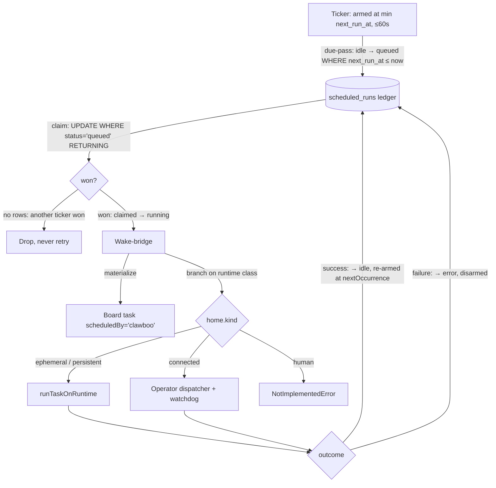

A **Routine** is a scheduled team task: a cron-shaped trigger that, on each fire, materializes a [board](/concepts/the-board) task and dispatches it through the same executor pipeline a delegated task would use. Routines are how a team gets recurring or future-dated work — a morning briefing, a nightly report, a one-shot reminder — without anyone sitting at the dashboard to kick it off.

Scheduling in Clawboo holds two things apart that other systems tend to blur: *team-task cron* (the Routines this page is about) and *runtime-own-life cron* (a runtime's own standalone scheduler, which Clawboo observes but does not own). It does so on top of a durable ledger that is the source of truth, fronted by an in-process ticker that holds no durable state of its own — kill the process, restart it, and every active Routine reconstructs from SQLite alone.

This page explains the two cron domains, the durable `scheduled_runs` ledger and the rebuildable ticker that drives it, the lifecycle of a single fire, the one-firing-owner invariant that keeps a task from having two schedulers, the error-halts policy that parks a failed recurring Routine instead of retry-burning it, and the unified Scheduler surface that merges Routines and the OpenClaw Gateway's own cron into one read.

## What it is, and what it isn't

A Routine is **Clawboo's cron for team work**. It owns *when* a team task runs. It is the single external wake for every [runtime](/appendices/glossary) class — native, the wrapped one-shot runtimes (Claude Code, Codex, Hermes), and OpenClaw — so a team built from mixed runtimes has one scheduling surface regardless of what each runtime can do on its own.

A Routine is **not** a runtime's own scheduler. Most runtimes carry some notion of standalone cron or heartbeat — the OpenClaw Gateway, for example, schedules an agent's own life via its built-in cron. Clawboo treats that as a *different domain*: it can read and operate those entries as an operator surface, but it never fires a team task into a runtime's own cron, and it never reaches into them to dispatch coordinated team work. The two are surfaced side by side and labeled, never merged.

A Routine is **not** a side channel. A fire is just another task dispatch: it lands on the board, gets atomically claimed, runs through the executor with budgets, approvals, verification, observability, and (for file-mutating work) a worktree all applying exactly as they would for a hand-created or delegated task. There is no privileged "scheduled" execution path.

## The two cron domains

The normalized schedule row every source projects carries a `domain` field that keeps the merged view honest. There are exactly two values:

| `domain` | Who fires it | Owned by | Example |
|---|---|---|---|
| `team-task` | Clawboo's Routines engine | the `scheduled_runs` ledger (`managed`) | "Every weekday at 9am, run the standup-summary team task." |
| `runtime-own-life` | the runtime's own scheduler | the runtime's own system (`external-write`) | An OpenClaw agent's Gateway cron that wakes *itself* to check email. |

The separation is enforced structurally, not by convention. Registering a `team-task` schedule through a `runtime-own-life` source is refused with a typed `TeamTaskDomainViolationError` — both at the multiplexer's gate and again inside the source itself, so the refusal is defense-in-depth. The reasoning: a runtime's own-life cron is the agent's private business, and team-task cadence belongs to the Routines ledger where the board, budgets, and verification can see it.

## The model

A Routine's durable state lives in the `scheduled_runs` ledger. The ticker reads it, decides what is due *in SQL*, atomically claims each due row, dispatches the fire through the executor, and writes the outcome back — re-arming the row for its next occurrence, or disarming it.



## The durable ledger

The `scheduled_runs` table is the source of truth. Each row is one Routine: the target `agent_id` and `team_id`, the `cron_spec` string, a `task_template` JSON blob describing the board task to materialize on each fire, a `status`, the `last_run_at` / `next_run_at` timestamps, a `scheduled_by` firing-owner label, a `last_error`, and the dormant `tenant_id` multi-tenant seam.

The ledger is deliberately **cron-math-free**. It stores `next_run_at` as a precomputed epoch-millisecond timestamp and never parses a cron expression itself — callers compute the next occurrence and hand it in. This keeps the database package free of any scheduling-library dependency; the single point that imports the cron library lives in the scheduler package's `occurrence.ts`, and everyone else deals in precomputed timestamps.

A `cron_spec` is one of two shapes: a croner-parseable cron expression (5- or 6-field, optionally with seconds), or a one-shot `once@<ISO-8601>`. A spent one-shot is self-disabling — after it fires, its `next_run_at` becomes null, and the due-pass only ever queues rows with a non-null `next_run_at`, so the row simply goes quiet.

The `task_template` is a validated JSON object: a board task `title`, an optional `description`, a worktree isolation `kind` (defaulting to `code`, which provisions a worktree), a `priority`, an optional `repoPath` / `model`, an optional `maxNodeCents` cost cap threaded into the run, and an optional `teamTaskId` that binds the Routine to an *existing* board task instead of minting a fresh one per fire.

### The ledger state machine

A row moves through six statuses, enforced inside the write transaction against the freshly read row (the same discipline the [board](/concepts/the-board) uses):

```
idle ──(next_run_at ≤ now)──► queued ──(atomic claim)──► claimed ──► running
                                                                       ├──► idle  (success, re-armed)
                                                                       └──► error (disarmed)
idle | queued | error ──(user pause)──► paused   (never auto-fires)
paused | error ──(user resume)──► idle           (re-armed by the caller)
```

`paused` is the one status that **never auto-fires**: the due-pass guards on `status = 'idle'`, so a paused row is invisible to it. A spent one-shot re-enters `idle` with a null `next_run_at` and is equally invisible. An errored recurring Routine sits in `error`, disarmed, until a human resumes it — which is the heart of the error-halts policy below.

## The rebuildable ticker

The ticker is the actuator. It holds *zero* durable state. Its topology is a single timer, armed at `min(max(minNextRunAt − now, 0), 60s)` and `.unref()`'d so it never keeps the process alive. The 60-second clamp does double duty: it is a periodic rescan that picks up rows written by another process and recovers from laptop sleep, and it makes spurious wakes harmless because dueness is always re-decided in SQL.

Each tick runs three phases:

1. **Due-pass.** A single `UPDATE … SET status='queued' WHERE status='idle' AND next_run_at ≤ now RETURNING` flips every due row to `queued`. Paused, errored, and disarmed rows are excluded by the `status='idle'` guard.
2. **Claim phase (sequential).** For each queued row, an atomic `UPDATE … SET status='claimed' WHERE id=? AND status='queued' RETURNING`. A zero-row result means another ticker (or another process) already claimed it — that is **data, not an error**, so the ticker drops the row and never retries. This is the same "never retry a 409" rule the board's claim follows. A won claim emits a `routine_fired` observability event and transitions the row to `running`.
3. **Dispatch phase (concurrent).** The claimed fires are dispatched in parallel under `Promise.allSettled`, so a slow OpenClaw fire (bounded only by its watchdog) never head-of-line-blocks the others, and one failing fire never aborts the rest. Each dispatch records its outcome and re-arms (or disarms) the ledger row.

After every tick the timer re-arms against the freshest `min(next_run_at)`. Any REST write to a Routine pokes the ticker to re-arm immediately rather than waiting for the next 60-second rescan.

### Boot-resume: the ledger reconstructs the actuator

Because the ticker holds no durable state, restarting the process loses nothing — but it can leave rows mid-transition (a `claimed` or `running` row from a fire that the previous process started). Boot-resume heals them in one transaction before arming:

- A `claimed` orphan (the fire never started) resets to `queued` — it was due; fire it now. The atomic claim and the board task's own claim deduplicate any double-fire.
- A **recurring** `running` orphan re-arms to `idle` at its next occurrence. The board side of a half-done dispatch is healed separately by the board's own orphan reconciliation.
- A **one-shot** `running` orphan goes to `error`, never re-armed. Its outcome is unknown, and re-firing risks materializing the one-shot twice — so a human inspects it instead.
- `idle` rows are untouched; a past-due `next_run_at` fires on the next due-pass.

## The fire path

When a claimed fire is dispatched, the wake-bridge does two things. First it **materializes the board task**: either the existing task the Routine was bound to (which must still be claimable), or a fresh per-fire task stamped `scheduled_by: 'clawboo'` — the firing owner of record. Then it **branches on the runtime's integration class**, read from the adapter's capability seam, never from a hardcoded runtime-id switch:

| Runtime class (`home.kind`) | Runtimes | Dispatch path |
|---|---|---|
| `ephemeral` / `persistent` | native, Claude Code, Codex, Hermes | the standard one-shot executor (`runTaskOnRuntime`) |
| `connected` | OpenClaw | a thin operator dispatcher over the live Gateway connection |
| *(human participant)* | a `participantKind: 'human'` agent | a typed `NotImplementedError` — a future "scheduled board ping," not a spawned run |

The **one-shot path** is the ordinary executor pipeline: claim the board task, provision a worktree if the kind requires it, run the adapter, verify, and complete. A lost claim is treated as success — someone else already owns the task, so the work is happening.

The **connected path** exists because an OpenClaw agent runs over its *live* Gateway connection; the one-shot runner refuses such a runtime by design. So a separate operator dispatcher claims the board task, opens a stable per-Routine session over the server-held operator client, and drains the adapter's event stream to a terminal `done` — bounded by a watchdog (10 minutes by default, overridable with `CLAWBOO_ROUTINE_OPENCLAW_TIMEOUT_MS`). The watchdog is the documented degradation: a pure dispatch-and-record with no closer would leak `in_progress` board tasks, so on timeout the dispatcher aborts the run and releases the task. Clawboo does **not** create a Gateway cron entry here — that would be the runtime's own-life domain.

Each fire emits a sequence of observability events under the run's trace: `routine_fired` at claim, `routine_dispatched` when the bridge picks a path, then `routine_completed` or `routine_error` once the outcome is recorded.

## The one-firing-owner invariant

A board task must have exactly one scheduler. Two schedulers firing the same task is the recipe for double-dispatch, stale claims, and drift. The `tasks.scheduled_by` column carries the firing owner of record — `manual` for a hand-created task, `clawboo` for one the Routines engine fires, `openclaw` (or a future runtime) for a runtime-fired one.

The invariant is enforced at three walls:

1. **Registration-time de-dup (the primary guard).** Binding a Routine to an existing team task inspects that task's `scheduled_by`. If it is already owned by a *different* non-`manual` owner, registration is refused with an `ownership_conflict`, surfaced as a typed `DuplicateFiringOwnerError` (HTTP `409`, never retried). A `manual` task is stamped with the new owner in the same `BEGIN IMMEDIATE` transaction, so two concurrent registrations against one task serialize. Crucially, the guard is **domain-scoped**: it only reads `tasks.scheduled_by` (the team-task domain), so a runtime's own-life cron never trips it.
2. **The atomic claim** is the backstop — even if two firings somehow targeted one task, only one can claim it.
3. **The Gateway source's refusal** is the third wall — a `team-task` create aimed at the runtime-own-life source is refused outright.

One more registration rule guards a subtle footgun: a Routine bound to an *existing* team task may only be a one-shot. A bound task is claimable exactly once (`todo → done`), so a recurring schedule against it would fire once and then park in `error` forever. Binding a recurring spec is refused at registration with a `BoundRecurringScheduleError` (HTTP `400`).

## The error-halts policy

When a *recurring* fire fails, the ledger row moves to `error` with the failure recorded in `last_error`, and `next_run_at` is set to null — **disarmed**. It will not fire again until a human resumes it.

This is deliberate. Autonomous scheduled work must never silently retry-burn: a Routine that fails every fire and keeps retrying would spend a budget, churn the board, and bury the real problem. Parking the Routine surfaces the failure (the Scheduler tab shows the error and a Resume affordance) and stops the bleeding. A successful fire, by contrast, re-arms cleanly at its next occurrence; a one-shot self-disables.

A failed dispatch that is *really* a lost claim is not an error at all — it means another worker already owns the task, the work is happening, and the fire is recorded as satisfied.

## The unified Scheduler surface

The Scheduler tab reads *both* domains through one merged view. A `ScheduleMultiplexer` fans exactly two `ScheduleSource` adapters:

- **`ClawbooRoutineScheduleSource`** — `domain: 'team-task'`, `manageability: 'managed'`. A thin projection over the `scheduled_runs` ledger; Clawboo fully owns these rows.
- **`OpenClawGatewayCronScheduleSource`** — `domain: 'runtime-own-life'`, `manageability: 'external-write'`. A read+write adapter over the operator's cron RPC on the live Gateway connection; Clawboo operates these but does not own them.

There is deliberately no third source. Claude Code, Codex, Hermes, and native have no live native scheduler that Clawboo drives — scheduling any of them *is* a Clawboo Routine. The Gateway is the only runtime with an own-life cron Clawboo surfaces.

The trait's contract has a load-bearing property: **`read()` never rejects**. A source whose backend is down (a disconnected Gateway) returns a degraded status with whatever records it can — a stale cache, or none — so one dead source can never take the merged view down. The REST `GET /api/schedules` therefore always returns `200`, with per-source degradation reported as data. Writes route by owner: an `observe-only` source refuses with `403`, a `team-task` create into a runtime-own-life source returns `422`, an unknown id returns `404`, an illegal transition or ownership conflict returns `409`, and a write against a disconnected Gateway returns `503`. The `manageability` tier is a structural gate — the UI is a pure function of it and can never offer an action the owning system forbids.

<Note>
The legacy in-app Scheduler panel still talks to the OpenClaw Gateway's `cron.*` methods over the browser proxy connection directly. The unified `/api/schedules` surface is the durable, multi-domain backend; the panel converges onto it in a later session.
</Note>

## Design rationale and trade-offs

The ledger-plus-rebuildable-ticker split is the whole design. Putting durable state in SQLite and keeping the actuator stateless means a crash or restart is a non-event — `bootResume()` reconstructs every active Routine from the rows alone, and deciding dueness in SQL makes the timer's exact wake time irrelevant. The alternative (a stateful in-memory scheduler) would lose its schedule on every restart and need a separate persistence layer anyway.

Keeping the database package free of the cron library — precomputing `next_run_at` at the caller and storing epoch milliseconds — means swapping the tick library touches exactly one file, and the ledger never grows a scheduling dependency. The cost is that the caller, not the row, owns the cron math; the ticker re-derives the next occurrence after each fire.

The error-halts policy trades autonomy for safety: a recurring Routine that fails stops itself rather than retrying, which means a transient failure needs a human to un-park it. For autonomous scheduled work spending real budget, that is the correct default — silent retry-burn is the worse failure mode.

## Boundaries and non-goals

- **Not a runtime's own scheduler.** Clawboo never fires a team task into a runtime's own-life cron, and never auto-creates own-life crons. The Gateway-cron source is an operator surface over schedules the Gateway owns, not their owner.
- **No native scheduler for the one-shot runtimes.** Claude Code, Codex, Hermes, and native have no live scheduler Clawboo drives — scheduling them is a Clawboo Routine. `hermes gateway` is deliberately never launched.
- **Human participants are a seam, not a feature.** A Routine targeting a `participantKind: 'human'` agent reaches a typed `NotImplementedError` — the intended future shape is a scheduled board ping, not a spawned process. It is reachable and typed, but not built in v0.2.0.
- **Single implicit tenant today.** Every ledger row carries a `tenant_id` column, but it is a dormant seam — no per-tenant filtering is active. Multi-tenant scoping is a future seam, not a shipped feature.

<Note>
This documents the **v0.2.0 working tree** (commit `03b206a`). The current npm `latest` is **`clawboo@0.1.9`**, so `npx clawboo` installs 0.1.9 until the v0.2.0 tag is published. Differences are noted in [Known Issues](/appendices/known-issues).
</Note>

## See also

- [The board](/concepts/the-board) — the durable task substrate a fire materializes into
- [Delegation and orchestration](/concepts/delegation-and-orchestration) — the other path that turns intent into board tasks
- [Governance](/concepts/governance) — the budgets and caps a scheduled fire runs under
- [Observability](/concepts/observability) — the `routine_*` events a fire emits
- [Gateway and events](/concepts/gateway-and-events) — the OpenClaw operator connection the connected dispatch rides
- [Recurring team work guide](/guides/recurring-team-work) — a how-to for scheduling recurring team tasks
- [Schedules API](/reference/rest-api/schedules) — the REST surface over the unified scheduler
- [Glossary](/appendices/glossary) — canonical term definitions
