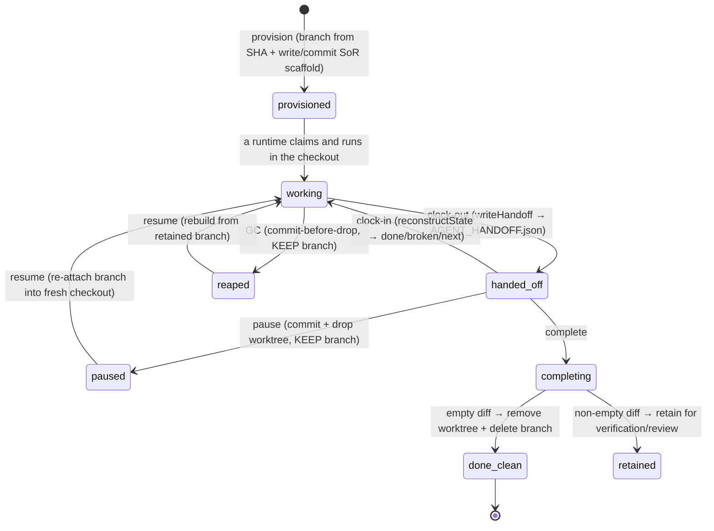

A file-mutating [task](/concepts/the-board) gets its own isolated git worktree — a separate checkout on its own branch, branched from a specific commit — so concurrent runs never collide. Into that worktree, Clawboo writes and commits a **system-of-record** (SoR): a fixed set of files (`TASK.md`, `task-progress.md`, `DECISIONS.json`, `init.sh`, `VERIFICATION.md`) that make the checkout self-describing. When a [runtime](/appendices/glossary) finishes a turn it writes `AGENT_HANDOFF.json` — structured data, not prose — and a *different* runtime, or a human, can reconstruct what's done, what's broken, and what's next from the worktree alone, with no chat history and no board access.

This is the seam that makes cross-runtime work possible. The board is the dispatcher; the worktree is the durable world the dispatched work happens in.

## What it is, and what it isn't

The worktree is **concurrency isolation, not a privilege boundary.** Two teammates working two file-mutating tasks at once each get their own checkout on their own branch, so they cannot trample each other's edits — collisions are impossible, not merely discouraged. That is the guarantee the worktree provides, and it is the *only* one. A worktree does not sandbox what code can do: it does not stop a process from reading outside the checkout, calling the network, or running arbitrary commands. Untrusted code, Docker-in-Docker, or cross-tenant work needs a real privilege boundary — a container or microVM. That tier (`container`) is a documented escalation point, keyed off a repo `devcontainer.json`; the worktrees package never provisions it and never runs Docker.

The worktree is also the **system-of-record**, which is a precise claim: the checkout — not chat, not the board UI — is the agent's knowable universe. If a fact isn't in the worktree's files, it does not exist for the next runtime. This is what lets a cold runtime resume work it never saw being done.

The board owns a *pointer* to the worktree (`tasks.worktree_ref`, `tasks.branch_ref`) and a `workspaces` row tracking its lifecycle; the worktree subsystem owns the actual checkout and the SoR files inside it. The two are separate on purpose — see [The board](/concepts/the-board#worktree-linkage).

## The model

The lifecycle has five operations — `provision`, `pause`, `resume`, `complete`, and `gc` — plus a sixth, detached read-only path used by [verification](/concepts/verification). Every mutating operation on a given checkout is serialized through a per-path async mutex, so a provision, a pause, and a GC sweep can never interleave on the same worktree.

## How it works

### Provisioning: branch from a SHA, not the dirty tree

When a file-mutating task starts, `provisionWorktree` creates a fresh checkout on the branch `clawboo/task-<id>`, branched from a **commit SHA** — never the dirty working tree. Branching from a SHA gives a stable diff baseline and avoids inheriting whatever uncommitted state happened to be in the repo. By default the branch point is `HEAD` resolved to a full SHA; a caller can pass an explicit `baseSha` or `baseRef`.

Provisioning is hardened against the failure modes a long-running worktree harness hits in practice:

- **Orphan-resilient** — any stale registration and leftover directory is force-removed before `git worktree add`.
- **Branch-collision recovery** — if the branch already exists and already points at the branch point, the existing branch is reused; otherwise the branch is reset (`-B`) to the branch point. Only a fresh provision ever uses `-b`/`-B`; re-attach (resume) never does, so resume can never discard committed work.
- **Verify both** — provisioning confirms both filesystem existence and git-metadata registration before declaring success.
- **Comprehensive cleanup, then one retry** — on failure it prunes everything and tries once more.

After the checkout exists, Clawboo writes the SoR scaffold into the worktree root and commits it with a recognizable message (`clawboo: scaffold task <id>`). That scaffold commit is the worktree's `baseCommit` — the baseline an agent's *work* is measured against. The scaffold is initialization, not work, so it does not count toward "did the agent do anything?"

<Info>
Worktrees live **outside** the user's repo, under the Clawboo state directory, namespaced by a hash of the repo path (`<clawboo-dir>/worktrees/<repo-hash>/<task-id>`). They never pollute the repo's own `git status`, and multiple repos never collide.
</Info>

### The system-of-record scaffold

`writeScaffold` lays down five files at the worktree root. Each answers one question a cold runtime must be able to answer from the checkout alone:

| File | Answers | Contents |
|---|---|---|
| `TASK.md` | *What is this and why?* | Title, task id, team, description, acceptance criteria, known gotchas, and a step-by-step "how to work this task" ritual. |
| `task-progress.md` | *Where are we?* | Current verified state, done / in-progress / blocked sections, and the clock-in / clock-out ritual. |
| `DECISIONS.json` | *Why was it built this way?* | A structured append-only log of non-obvious decisions — what was chosen, why, the rejected alternative, the constraint. The rationale that summaries drop. |
| `init.sh` | *How do I run and verify it?* | A runtime-agnostic startup script (`set -euo pipefail`) with three project-specific command slots: `INSTALL_CMD`, `VERIFY_CMD`, `START_CMD`. Made executable on write. |
| `VERIFICATION.md` | *What proves it's done?* | The evidence slot the completion gate reads — real test/lint output, not "the code looks fine." |

`init.sh` is runtime-agnostic on purpose: shell plus git work for every runtime, so a Claude Code task and a Codex task boot the same way. It fails loud (`set -euo pipefail`) so a broken baseline surfaces immediately instead of leaking into later work.

`AGENT_HANDOFF.json` is deliberately *not* part of the initial scaffold — it is the clock-out artifact, written only when a runtime first hands off.

### The cross-runtime handoff

`AGENT_HANDOFF.json` is the bridge that turns "one runtime's checkout" into "any runtime's checkout." It is **structured data**, validated against a Zod schema, so the next runtime parses it rather than interpreting English. The schema is **role-neutral**: its `runtime` field is any executor id and may be `'human'`, so a human teammate can pick up — or hand off — a task from the exact same artifact a Claude Code or Codex agent would.

The handoff records:

| Field | Meaning |
|---|---|
| `handoffFrom` | Display name or id of who is handing off (an agent, or a person). |
| `runtime` | The runtime that produced the handoff (may be `human`). |
| `timestamp` | ISO-8601 time of the handoff (defaulted to now when omitted). |
| `completedSubtasks` | What works now — completed, verified subtasks. |
| `brokenOrUnverified` | What is broken or unverified — the next runtime's risk list. |
| `nextBestStep` | The single next best step. |
| `whyBlocked` | Why the task is blocked, if it is. |
| `commands` | `init` / `verify` / `start` — how to re-enter the work. |
| `evidence` | Captured `testResults` / `lintResults` for the completion gate. |
| `warnings` | Free-form warnings for the next runtime. |
| `nativeSessionId` | The producing runtime's native session id — a same-runtime resume handle, *consumed only when the next dispatch's runtime matches.* A cross-runtime pickup ignores it and resumes from the structured handoff alone. |
| `roomCursor` | An optional team-chat room cursor for a worktree-backed [peer-chat](/concepts/peer-chat) leader turn (additive; absent for ordinary code tasks). |

### Cold resume: reconstruct state from the worktree alone

`reconstructState` is the clock-in read, and it is the proof that the system-of-record is runtime-agnostic. It reads **only** the worktree — `AGENT_HANDOFF.json`, falling back to `task-progress.md`, plus `init.sh` for commands — and returns a `ResumeState`: `{ done, broken, next, whyBlocked, commands, warnings, lastRuntime, nativeSessionId }`. No chat history. No board UI. Shell, git, and JSON, nothing else.

When a handoff is present, `done`/`broken`/`next` come straight from its structured fields. When there is no handoff yet (a first pickup), it falls back to parsing the `## Done` and `## Blocked` bullet sections of `task-progress.md` — so resume still works from the repo alone even before any handoff has been written. A malformed handoff is treated as no handoff, falling through to the progress log rather than crashing.

This is what lets a task pass cleanly from one runtime to a different one (Claude Code → Codex), or to a human: the receiving party reads the checkout, runs `./init.sh` to confirm the baseline verifies, and picks up from `done`/`broken`/`next`.

### Pause and resume

`pauseWorktree` frees disk and process slots without losing anything: it commits any uncommitted work to the branch (so nothing is lost), drops the worktree directory, and **keeps the branch.** `resumeWorktree` re-creates the worktree from the preserved branch by attaching it at its current tip — and never uses `-b`/`-B`, so prior commits are always preserved. The baseline commit is recovered by searching the branch for the SoR-scaffold commit, so a later `complete` still diffs against the right baseline.

In the [executor runner](/internals/executor-runner), pause-for-resume is the cross-runtime continuation path: a run dispatched with `keepForResume` writes its handoff, releases the task back to `todo`, and keeps the worktree — so the next dispatch (a different runtime) resumes from the handoff and the retained checkout.

### Completion: empty diff cleans up, non-empty retains

`completeWorktree` decides clean-vs-retain by diffing the worktree against its baseline commit — **excluding the SoR bookkeeping files.** That exclusion is load-bearing: a session that only wrote its own handoff and progress log produced no deliverable, so it counts as an *empty* diff even though the checkout technically changed. The diff counts the committed delta, uncommitted edits, *and* untracked files, so "did real work happen?" is answered precisely.

- **Empty diff → auto-cleanup.** No integration work to do, so the worktree is removed, the branch deleted, and the task lands `done` (an empty diff has no deliverable to verify, so this intentionally bypasses the verification gate).
- **Non-empty diff → retain.** The worktree and branch are kept, the diff-stat is returned, and the task moves to `in_review`, where the [verification](/concepts/verification) gate runs (a deterministic build/test/lint gate plus an optional read-only critic) and only a promotable verdict promotes `in_review → done`.

### The detached read-only reviewer

Verification's critic needs to read a teammate's work without being able to change it. `provisionReviewWorktree` makes a **detached** checkout at a specific commit — detached HEAD means there is no branch, so a reviewer has literally nothing to push. This is the structural half of *builder ≠ judge*: review can never mutate a teammate's branch. (Tool-level write denial is the runtime's job; the detached checkout is the guarantee that holds regardless.) Because a runtime leaves its work uncommitted, `commitWorktreeWork` first checkpoints the worktree to a real, reviewable commit, then the reviewer detaches at it.

### Garbage collection

`gcWorktrees` reaps stale worktrees by **age** (older than 72 hours by default) and **count** (keep at most 25, reap the oldest beyond that). Reaping is **commit-before-drop**: any uncommitted work is auto-saved to the branch first, then only the worktree directory is removed — the branch is kept, so nothing is lost and a re-dispatched task can rebuild its checkout from the retained branch. Active tasks (`in_progress` / `in_review`) are skipped, and that liveness is re-checked *inside* the per-path mutex immediately before the destructive step, so a task that became active mid-sweep is skipped rather than reaped. Failures are collected and never abort the sweep; only directories under the Clawboo worktree root are ever touched.

GC runs once at server startup (best-effort, never blocking boot). The server-side orchestrator marks each reaped worktree's `workspaces` row `stale`; when a stale task is later re-dispatched, the executor detects the reaped checkout (stale row, missing directory, or no git registration) and rebuilds it from the retained branch via `resumeTaskWorkspace` before running, so a re-dispatched task never runs in a missing working directory.

## Design rationale and trade-offs

**Why git worktrees and the git CLI.** Worktrees give parallel teammates real concurrency isolation with no merge dance during the work — each has its own checkout on its own branch off a shared baseline. The package shells out to the `git` CLI rather than a libgit2 binding because the CLI is the most robust path for mutable worktree operations and matches what every shipping worktree harness does. Every git invocation is bounded by a timeout and `windowsHide`, so a hung `git` can't wedge the single-threaded server event loop.

**Why the worktree is the system-of-record.** Chat is lossy and ephemeral; a board cell is structured but thin. The hard problem in cross-runtime work is that a runtime that *didn't* do the work has to continue it. Making the checkout self-describing — task, progress, decisions, startup script, evidence, handoff — means resume needs nothing but the filesystem and git. The cost is that runtimes must follow the clock-in/clock-out ritual (read the handoff, do the work, write the handoff); the payoff is that a Claude Code agent, a Codex agent, and a human can each pick up the same task cold.

**Why structured handoff, not prose.** A prose "here's where I left off" is exactly the kind of thing the next runtime would have to *interpret*, and interpretation drifts. `AGENT_HANDOFF.json` is parsed, not read, so done/broken/next are unambiguous. The `nativeSessionId` field is the one place where same-runtime continuity is preserved (resume the exact native session) while cross-runtime continuity falls back to the structured fields — the right asymmetry, since a session id is meaningless to a different runtime.

**Why branch from a SHA.** Branching from the dirty tree would make the diff baseline unstable and import whatever uncommitted noise was in the repo. A SHA is a fixed point; the SoR-scaffold commit on top of it is the precise baseline that "did the agent do work?" measures against.

## Boundaries and non-goals

- **Not a privilege boundary.** A worktree isolates *writes* between concurrent teammates. It does not sandbox what code can do — no network, filesystem, or syscall confinement. Untrusted or Docker-running work needs `container`-tier isolation (a container or microVM), which this subsystem documents as an escalation point but never provisions.
- **Only file-mutating tasks get one.** Read-only and research tasks run in place with no worktree — provisioning a worktree for a non-file-mutating task is refused (`422`). Review runs in a *detached* worktree (no branch to push), so it isn't a writable worktree either.
- **OpenClaw agents do not get a worktree.** The OpenClaw runtime declares `worktrees: false` because its agents run in Gateway-owned per-agent workspace directories inside OpenClaw's own sandbox; Clawboo never retargets a live OpenClaw agent's working directory. The clawboo-native, Claude Code, Codex, and Hermes runtimes declare `worktrees: true`. See [Runtimes](/runtimes/index).
- **GC heuristics, not a scheduler.** Reaping is age-and-count based, not a precise reference-counted lifecycle. The 72-hour age and 25-count defaults are field norms; active tasks are always skipped and commit-before-drop guarantees no data loss, so the heuristic can be conservative without being unsafe.

<Note>
This documents the **v0.2.0 working tree** (commit `03b206a`). The current npm `latest` is **`clawboo@0.1.9`**, so `npx clawboo` installs 0.1.9 until the v0.2.0 tag is published. Differences are noted in [Known Issues](/appendices/known-issues).
</Note>

## See also

- [The board](/concepts/the-board) — the dispatcher that owns the worktree pointer
- [Verification](/concepts/verification) — the builder-≠-judge gate that uses the detached reviewer
- [Cross-runtime handoff guide](/guides/cross-runtime-handoff) — pause on one runtime, resume on another
- [Executor runner](/internals/executor-runner) — claim → worktree → run → verify → handoff
- [@clawboo/worktrees](/reference/packages/worktrees) — the package's public API
- [Board API](/reference/rest-api/board) — the `/api/board/:taskId/workspace*` REST surface
- [Glossary](/appendices/glossary) — canonical term definitions
