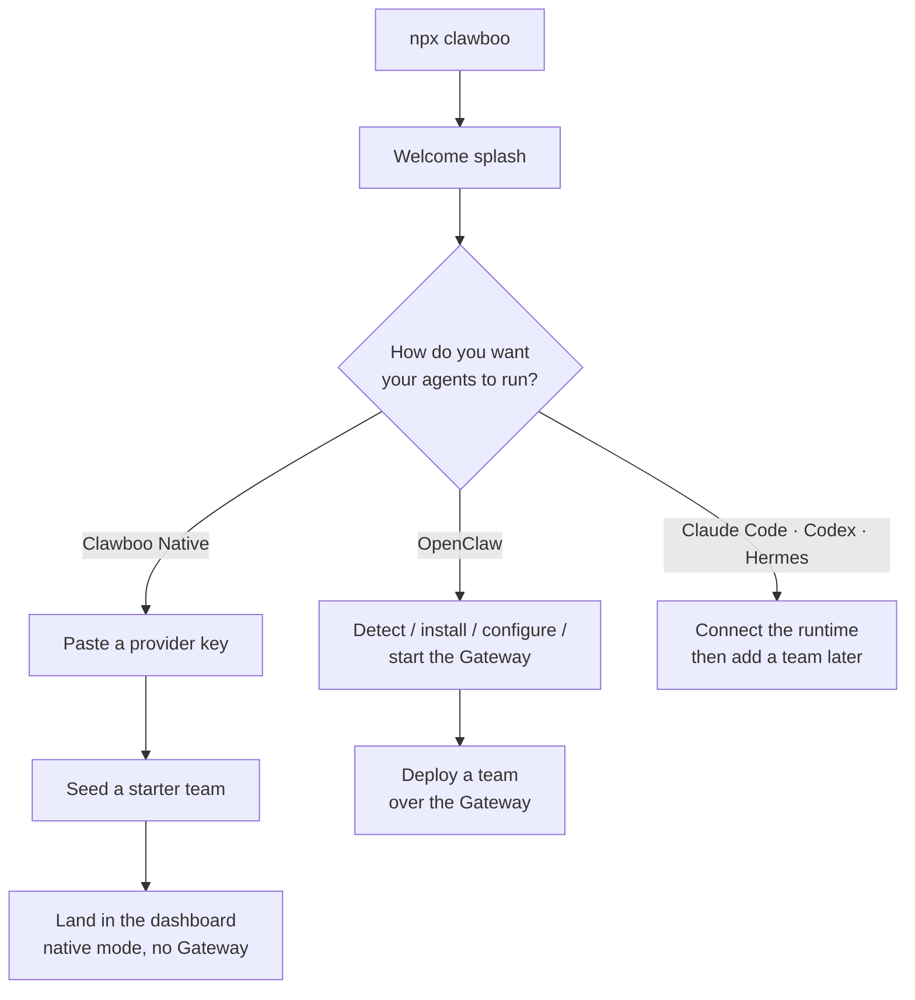

Clawboo runs the same way for everyone: one command, `npx clawboo`, which launches a local dashboard and walks you through a first-run wizard. The only real choice the wizard asks is **how you want your agents to run**. This page explains the two paths so you can pick before you start.

<Note>
This documents the **v0.2.0 working tree** (commit `03b206a`). The current npm `latest` is **`clawboo@0.1.9`**, so `npx clawboo` installs 0.1.9 until the v0.2.0 tag is published. The native-first onboarding described here is part of v0.2.0; differences are noted in [Known Issues](/appendices/known-issues).
</Note>

## Prerequisites

<Note>
- **Node.js 22 or newer**: Clawboo's `engines` field requires `node >=22.0.0`. The OpenClaw path also enforces this: the wizard's detection step flags Node older than 22.
- **A provider API key** if you choose the native path: Anthropic (`sk-ant-…`), OpenAI (`sk-…`), or OpenRouter (`sk-or-…`). A running local Ollama works with no key. The OpenClaw path needs a provider key too, entered during Gateway configuration.
- Nothing is installed globally to *run* Clawboo; `npx clawboo` downloads and launches the bundled dashboard server. (The OpenClaw path can install the `openclaw` CLI for you from inside the wizard.)
</Note>

That is the full list. You do not need OpenClaw, a Gateway, Docker, or any database; Clawboo bundles its own SQLite store and dashboard server.

## What `npx clawboo` does

```bash
npx clawboo
```

The launcher prints the Clawboo logo, does a quick **informational** probe of the OpenClaw Gateway port (`localhost:18789`) so it can tell you whether a Gateway is already up, starts the bundled dashboard server, then opens your browser at the discovered URL. The dashboard binds to loopback `127.0.0.1` on port `18790` (auto-falling back through `18790–18809` if that port is busy). On a fresh machine the first-run wizard appears.

The Gateway probe is purely informational; a "No Gateway detected" result does not block anything; the dashboard simply guides you through setup either way. See [Installation](/getting-started/installation) for the full launch sequence (port discovery, bundled vs dev server, the browser-open step).

## The first choice: how your agents run

After the welcome splash, the wizard asks **"How do you want your agents to run?"** and offers a recommended native card first, then a divider reading "Or bring your own runtime", then secondary cards for OpenClaw, Claude Code, Hermes, and Codex. Your pick decides the rest of onboarding:



| | Native-first (recommended) | OpenClaw Gateway |
|---|---|---|
| **Best for** | Getting a team running in ~60 seconds | Running OpenClaw agents on a local Gateway |
| **What you provide** | One provider API key (or a local Ollama) | A provider key, entered during Gateway config |
| **Extra software** | None: the native runtime ships inside Clawboo | The `openclaw` CLI + a running local Gateway (the wizard can install/start it for you) |
| **Wizard branch** | `chooseRuntime → configureNative → nativeReady` | `chooseRuntime → detect → install → configure → startGateway → team → deploy` |
| **End state** | A seeded two-agent team in native mode, no GatewayClient | A team deployed over the live Gateway |
| **Walkthrough** | [Quickstart: the native runtime](/getting-started/quickstart-native) | [Quickstart: OpenClaw](/getting-started/quickstart-openclaw) |

<Tip>
The choice is not permanent. Every runtime is a peer; you can add OpenClaw, Claude Code, Codex, or Hermes later from the **Runtimes** panel, and mix runtimes within a team. The wizard prompt even says so: "You can add or switch runtimes anytime from the Runtimes panel." See [Connecting runtimes](/runtimes/connecting-runtimes).
</Tip>

### Path 1: Native-first (recommended)

Pick the **Clawboo Native** card. Clawboo's [native runtime](/appendices/glossary) (`clawboo-native`) is an in-process harness that talks to provider SDKs directly (Anthropic, OpenAI, OpenRouter, or a local Ollama), so there is nothing extra to install and no Gateway. You paste a provider key, optionally test it, then click **Create my team**; Clawboo stores the key in its encrypted vault and seeds a starter team (a leader plus a specialist, both native, sharing one memory). You land directly in that team's group chat.

This is the fastest route to a running team. Follow it step by step in the [native quickstart](/getting-started/quickstart-native).

### Path 2: With the OpenClaw Gateway

Pick the **OpenClaw** card if you want to run OpenClaw agents on a local Gateway. The wizard enters its detection step, which checks Node.js, whether the `openclaw` CLI is installed, and whether a Gateway is running. From there it can install OpenClaw, write its config and provider key, start the Gateway, and then deploy a team over it.

This path involves more moving parts (a separate CLI and a long-lived Gateway process) but unlocks OpenClaw's own agents and channels. Follow it step by step in the [OpenClaw quickstart](/getting-started/quickstart-openclaw).

## Next steps

- [Installation](/getting-started/installation): what `npx clawboo` downloads and launches, ports, and the bundled server
- [Quickstart: the native runtime (no Gateway)](/getting-started/quickstart-native): the recommended ~60-second path
- [Quickstart: OpenClaw](/getting-started/quickstart-openclaw): the Gateway path
- [Deploy your first team and watch it collaborate](/getting-started/first-team)
- [Dashboard tour](/getting-started/dashboard-tour): Atlas, the Ghost Graph, the sidebar, and the view modes

## See also

- [Concept: the agent model and the five runtime classes](/concepts/agent-model)
- [Connecting runtimes](/runtimes/connecting-runtimes): add and switch runtimes after onboarding
- [Runtimes overview](/runtimes/index): the capability matrix
- [Glossary](/appendices/glossary): Boo, runtime, the board, registry of record
