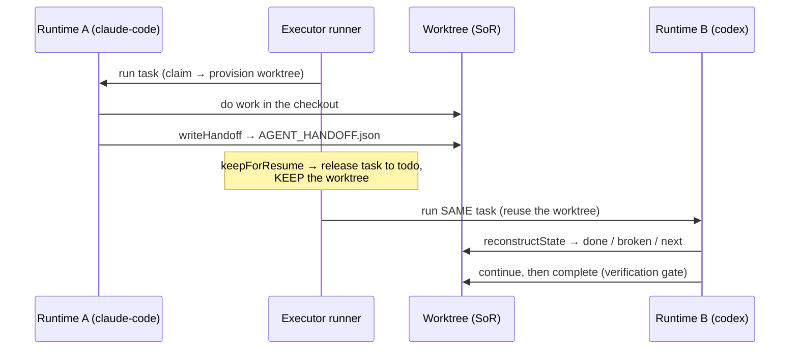

Use this guide when you want one [runtime](/appendices/glossary) to start a file-mutating board task, pause without losing work, and have a *different* runtime (or a human) pick it up cold — with no chat history and no shared model session. A Claude Code agent can do the first pass and a Codex agent the second; the receiving runtime reconstructs what's done, what's broken, and what's next from the task's git worktree alone.

This works because a file-mutating task carries its own isolated world: a per-task [worktree](/concepts/worktrees-and-handoff) (its **system-of-record**) plus a structured `AGENT_HANDOFF.json` clock-out artifact. The board is the dispatcher; the worktree is the durable world the dispatched work happens in. This guide composes [Worktrees and handoff](/concepts/worktrees-and-handoff), [the executor runner](/internals/executor-runner), and the [Board API](/reference/rest-api/board) workspace routes into one workflow.

<Note>
This guide drives the dispatch over REST (`POST /api/runtimes/:id/run`) so the mechanics are explicit. In normal use the team orchestrator dispatches and resumes tasks for you; you don't call these routes by hand. The point here is to see exactly how the pause/resume seam works.
</Note>

## Prerequisites

- Two connected, **worktree-capable** runtimes. Of the five runtimes, `clawboo-native`, `claude-code`, `codex`, and `hermes` declare `worktrees: true`; OpenClaw declares `worktrees: false` (its agents run in Gateway-owned workspace dirs, so the runner never retargets them — and the executor runner refuses a connected substrate before it claims anything). See [Connecting runtimes](/runtimes/connecting-runtimes) and the [capability matrix](/runtimes/index).
- A git repository on disk to branch from — its absolute `repoPath`.
- An existing board task in `todo` for a **file-mutating** kind (`code`, the default). Read-only / research tasks (`research`, `review`) get no worktree, so there is nothing to hand off — provisioning one for them is refused with **422**. See [the board](/concepts/the-board) and [Board API](/reference/rest-api/board).

The examples assume the API at the default loopback port `18790`; substitute your resolved port (see [Deployment](/operating/deployment)).

## The flow



## Steps

### 1. Start the task on the first runtime

Dispatch the task on runtime A with `repoPath` set and `keepForResume: true`. `keepForResume` is the load-bearing flag: it tells the runner to **pause** at the end of a successful run instead of completing. The `kind` defaults to `code`, which isolates to a worktree.

```bash
curl -X POST http://localhost:18790/api/runtimes/claude-code/run \
  -H 'Content-Type: application/json' \
  -d '{
    "taskId": "<task-id>",
    "assigneeAgentId": "claude-worker-1",
    "repoPath": "/abs/path/to/repo",
    "kind": "code",
    "keepForResume": true
  }'
```

What the [executor runner](/internals/executor-runner) does, in order:

1. **Atomic claim.** A single guarded UPDATE flips the task `todo → in_progress`. A lost claim is a **409** and is never retried — it means another worker legitimately owns the task.
2. **Worktree acquisition.** Because `claude-code` declares `capabilities().worktrees`, the runner provisions a fresh isolated checkout on the branch `clawboo/task-<id>`, branched from a commit SHA (not the dirty tree), and writes + commits the system-of-record scaffold (`TASK.md`, `task-progress.md`, `DECISIONS.json`, `init.sh`, `VERIFICATION.md`). The worktree lives **outside** your repo, under the Clawboo state dir, namespaced by a hash of the repo path — so it never touches your repo's own `git status`.
3. **Run.** The runtime works in the checkout, mutating real files.
4. **Pause (because `keepForResume`).** On a successful terminal the runner writes `AGENT_HANDOFF.json` into the worktree (with `nextBestStep` carrying the run's reported summary), then calls `releaseTask` — the task drops back to `todo` and the **worktree is kept**. The verification gate does **not** run on a pause; it runs only on a `complete` (step 4 below).

### 2. Inspect the handoff (optional)

The pause leaves a fully cold-resumable task. Confirm it with the [cold-resume read](/reference/rest-api/board#get-apiboardtaskidworkspace):

```bash
curl http://localhost:18790/api/board/<task-id>/workspace
```

The `resume` block is `reconstructState`'s output, computed purely from the worktree — `AGENT_HANDOFF.json`, falling back to `task-progress.md` + `init.sh`. No chat history, no board UI:

```json
{
  "ok": true,
  "workspace": { "status": "active", "branch": "clawboo/task-<id>", "...": "..." },
  "resume": {
    "hasHandoff": true,
    "done": [],
    "broken": [],
    "next": "<runtime A's reported summary>",
    "commands": { "init": "./init.sh", "verify": "", "start": "" },
    "warnings": [],
    "lastRuntime": "claude-code",
    "nativeSessionId": "<id or null>"
  },
  "handoff": { "...": "the parsed AGENT_HANDOFF.json" }
}
```

<Note>
`AGENT_HANDOFF.json` is **structured data, not prose** — the next runtime parses it rather than interpreting English. Its `runtime` field is role-neutral and may be `'human'`, so a person can pick up (or hand off) the task from the exact same artifact. See [Worktrees and handoff](/concepts/worktrees-and-handoff#the-cross-runtime-handoff).
</Note>

### 3. Resume on a different runtime

Dispatch the **same `taskId`** on runtime B. The task is back in `todo`, so runtime B claims it cleanly and reuses the kept worktree — this is the cross-runtime continuation path. Drop `keepForResume` to let runtime B finish for real.

```bash
curl -X POST http://localhost:18790/api/runtimes/codex/run \
  -H 'Content-Type: application/json' \
  -d '{
    "taskId": "<task-id>",
    "assigneeAgentId": "codex-worker-1",
    "repoPath": "/abs/path/to/repo",
    "kind": "code"
  }'
```

The runner's `acquireWorkspace` finds the existing active worktree for the task and reuses it as-is rather than provisioning a new one. (If a garbage-collection sweep had reaped the directory — keeping the branch — the runner rebuilds the checkout from the retained branch before running, so a reused worktree is never a missing directory.) Either way it reconstructs the `ResumeState` from the worktree's system-of-record and seeds the prompt's context tier with the prior handoff, so runtime B starts from runtime A's `done` / `broken` / `next` — not from scratch.

### 4. Let the resuming runtime complete

Because step 3 dropped `keepForResume`, runtime B finishes the run through the normal completion path: the runner runs the worktree `complete` action, which decides clean-vs-retain by diffing the checkout against its baseline (the system-of-record bookkeeping files are excluded from that diff):

| Diff vs baseline | What happens | Terminal status |
|---|---|---|
| Empty | No deliverable — worktree + branch removed | `done` (verification gate intentionally bypassed) |
| Non-empty | Worktree retained, the [verification](/concepts/verification) gate runs (deterministic build/test/lint, plus an optional read-only critic) | `pass` → `done` · `completed_with_debt` over a green gate → `done` · debt over a red gate → `blocked` · `fail` → `in_progress` |

Only a promotable verdict moves `in_review → done`. See [Verification](/concepts/verification) and the [`PATCH .../workspace` complete action](/reference/rest-api/board#patch-apiboardtaskidworkspace).

## Variations

| You want… | Do this |
|---|---|
| Hand off to a **human** | Write `AGENT_HANDOFF.json` directly via [`POST /api/board/:taskId/workspace/handoff`](/reference/rest-api/board#post-apiboardtaskidworkspacehandoff) with `runtime: "human"`. The person reads the worktree, runs `./init.sh` to confirm the baseline, and works from `done`/`broken`/`next`. |
| Pause manually (no run) | [`PATCH /api/board/:taskId/workspace`](/reference/rest-api/board#patch-apiboardtaskidworkspace) with `{"action":"pause"}` commits uncommitted work, drops the worktree directory, and keeps the branch — resumable. |
| Continue on the **same** runtime | If runtime B equals runtime A and the runtime supports native resume, the runner threads the persisted `nativeSessionId` into `ctx.resume` and resumes the exact native session. A **cross**-runtime pickup ignores `nativeSessionId` and resumes from the structured handoff alone — a session id is meaningless to a different runtime. |
| Pin the branch point | Pass `baseSha` (or `baseRef`) when provisioning via [`POST /api/board/:taskId/workspace`](/reference/rest-api/board#post-apiboardtaskidworkspace); the default branch point is `HEAD` resolved to a full SHA. |
| Inspect the worktree's files + diff | [`GET /api/board/:taskId/workspace/detail`](/reference/rest-api/board#get-apiboardtaskidworkspacedetail) returns the system-of-record file contents and the unified diff against the baseline. |

## Verify it worked

- After step 1, `GET /api/board/<task-id>` shows the task back in `todo` (the pause released it) and `GET /api/board/<task-id>/workspace` returns `resume.hasHandoff: true` with `lastRuntime` set to runtime A.
- After step 3, the task's `assigneeRuntime` reflects runtime B, and the run's execution row (the cross-runtime ledger) records a second entry via [`GET /api/board/:taskId/executions`](/reference/rest-api/board#get-apiboardtaskidexecutions).
- After step 4, the task lands in a terminal status (`done`, `in_review`/`blocked` if a non-empty diff went through the verification gate, or back to `in_progress` on a `fail` verdict).

## Troubleshooting

<Warning>
**The resume run provisioned a new worktree instead of reusing.** `acquireWorkspace` reuses an existing **active** workspace row whose `worktreePath` still exists and is git-registered. Pass the same `repoPath` on the resume dispatch so the runner can rebuild a reaped checkout from the retained branch; without `repoPath` it can only fall through to a fresh provision.
</Warning>

<Warning>
**The first runtime completed instead of pausing.** `keepForResume` must be `true` (boolean) in the run body. Without it, a successful run with a non-empty diff routes straight into the verification gate and a clean verdict promotes the task to `done` — there is nothing left to hand off.
</Warning>

<Danger>
**A worktree is concurrency isolation, not a sandbox.** It guarantees two parallel teammates can't trample each other's edits; it does **not** confine what code can do (network, filesystem, syscalls). Untrusted or Docker-running work needs `container`-tier isolation (a container or microVM), which the worktrees subsystem documents as an escalation point but never provisions. See [Worktrees and handoff](/concepts/worktrees-and-handoff#what-it-is-and-what-it-isnt).
</Danger>

<Danger>
**Don't retry a 409 on claim or status change.** A 409 from the claim (or an `illegal_transition` on a status PATCH) is data, not a transient error — the task is simply taken or the transition is illegal. A dead `in_progress` task is recovered by the board's orphan reconciliation, which releases it to `todo` for a normal re-claim. See [the board](/concepts/the-board#the-atomic-claim).
</Danger>

## Related

- [Worktrees and handoff](/concepts/worktrees-and-handoff) — the system-of-record + `AGENT_HANDOFF.json` model
- [The executor runner](/internals/executor-runner) — claim → worktree → run → verify → handoff, and the `keepForResume` pause
- [Board API](/reference/rest-api/board) — the `/api/board/:taskId/workspace*` routes
- [Runtimes API](/reference/rest-api/runtimes) — `POST /api/runtimes/:id/run`, the dispatch entry point
- [Verification](/concepts/verification) — the builder≠judge gate the resuming runtime triggers on completion
- [Connecting runtimes](/runtimes/connecting-runtimes) — bring `claude-code` / `codex` / `hermes` / `clawboo-native` online
- [Multi-runtime team guide](/guides/multi-runtime-team) — build a team mixing runtimes
- [Glossary](/appendices/glossary) — canonical term definitions
