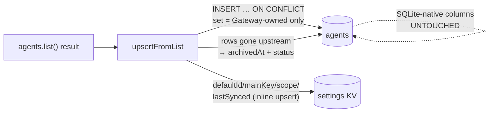

`AgentSource` is the seam that answers one question: *where does the agent list come from?* The answer Clawboo settled on is "**SQLite is the registry of record, and every upstream is one `AgentSource` that syncs INTO it.**" Reads serve from SQLite, so the fleet renders even when a backing runtime is offline, while writes, agent-file I/O, and live session lists delegate to the source that owns the agent and mirror back. The OpenClaw Gateway, which used to *be* the source of truth for who exists, is now one source among others behind this trait.

This page is for people working on the registry layer. It covers the `AgentSource` trait and its read/write split, the neutral `AgentRecord` / `TeamRecord` / `SessionRecord` shapes the rest of the codebase reads, the `AgentRegistry` multiplexer, and the two concrete sources: `OpenClawAgentSource` (a server-side Gateway connection with an idempotency-disciplined sync) and `ClawbooNativeAgentSource` (SQLite as its own upstream). The server connect-auth landmines that make the headless Gateway connection work are documented at the end, because they are easy to re-break.

For the concept-level view of what a Boo *is*, start with [the agent model](/concepts/agent-model). For the REST surface over this layer, see the [Agents API](/reference/rest-api/agents).

## What it is, and what it isn't

`AgentSource` is about **who exists**, the registry. It is deliberately *not* about **how an agent runs**, which is the `RuntimeAdapter` trait in `@clawboo/executor`. The package comment is blunt about it: "the two must not entangle." A source produces and persists `AgentRecord`s; an adapter executes a turn. The same Boo has both: a record in some source and an execution loop in some runtime, but the two layers never reach into each other.

It is also not the board. The board references agents by id and owns task state; it does not own agent identity, agent files, or session state. Those belong to the registry of record and the runtime respectively. The three-way split, registry / runtime / [board](/concepts/the-board), is the load-bearing structure of the whole system.

The trait and the record types live in `@clawboo/agent-registry`: a pure, browser-safe, **zero runtime-dependency** package (its `package.json` has no `dependencies` key at all). It holds only the neutral shapes plus the multiplexer, mirroring how `@clawboo/executor` holds `RuntimeAdapter`. The concrete sources, which talk to a Gateway or to SQLite, live server-side under `apps/web/server/lib/agentSource/`.

<Note>
"Phase A" appears throughout the source comments. It refers to the era when OpenClaw was the only source. The native source landed later as a peer, so the registry now holds two; the trait was designed for many from the start.
</Note>

## The model

```mermaid
flowchart TD
    subgraph SPA[Browser / SPA]
      REST[/api/agents REST]
    end
    subgraph Server[Express server]
      REG[AgentRegistry<br/>multiplexer]
      OCS[OpenClawAgentSource]
      NAT[ClawbooNativeAgentSource]
    end
    GW[(OpenClaw Gateway<br/>upstream)]
    DB[(SQLite<br/>registry of record)]

    REST -->|"reads (always work)"| REG
    REST -->|"writes / files / sessions"| REG
    REG --> OCS
    REG --> NAT
    OCS -->|"sync: agents.list() IN"| DB
    OCS -->|"writes / files OUT + mirror"| GW
    GW -.->|"presence/heartbeat/agent → resync"| OCS
    NAT <-->|"SQLite IS the upstream"| DB
    OCS -->|"reads"| DB
```

The shape of every operation falls out of one rule: **reads come from SQLite; writes go to the owning upstream and mirror back.** That is what makes the dashboard resilient, a disconnected Gateway degrades a *write* (you get a `503`), never a *read* (the list still answers, flagged `stale`).

## The AgentSource trait

The trait splits into four concern groups. Reads are SQLite-backed and never fail on a disconnect; writes require a live upstream and throw when it is down; files route through the owning source; and a lifecycle/observability group wraps it all.

```ts
export interface AgentSource {
  readonly id: RuntimeId

  // Reads — SQLite-backed, work even when the upstream is down
  listAgents(opts?: { includeArchived?: boolean; teamId?: string }): Promise<AgentRecord[]>
  getAgent(id: string): Promise<AgentRecord | null>
  listTeams(opts?: { includeArchived?: boolean }): Promise<TeamRecord[]>
  listSessions(agentId: string): Promise<SessionRecord[]>

  // Writes — require a live upstream, throw when disconnected
  createAgent(input: CreateAgentInput): Promise<AgentRecord>
  updateAgent(id: string, patch: UpdateAgentInput): Promise<AgentRecord>
  archiveAgent(id: string): Promise<void>

  // Agent files — route through the source
  readFile(agentId: string, name: AgentFileName): Promise<string>
  writeFile(agentId: string, name: AgentFileName, content: string): Promise<void>

  // Lifecycle / observability
  start(): Promise<void>
  stop(): Promise<void>
  health(): Promise<HealthResult>
  sync(): Promise<SyncResult>   // idempotent upstream→SQLite reconcile
  events(): AsyncIterable<AgentEvent>
}
```

A few contracts are worth pinning down:

- **`listSessions` is the deliberate exception to "reads serve SQLite."** Sessions are runtime-volatile, so the OpenClaw source delegates this one *live* to the Gateway (the native source reads its own `sessions` table). It is the only read that can fail on a disconnect.
- **`AgentFileName` is a local literal**, not an import. The package keeps a hand-copy of `@clawboo/protocol`'s `AGENT_FILE_NAMES` (`AGENTS.md`, `SOUL.md`, `IDENTITY.md`, `USER.md`, `TOOLS.md`, `HEARTBEAT.md`, `MEMORY.md`) precisely so the package stays dependency-free.
- **`events()` is a consumer-terminated async iterable.** It mirrors `RuntimeAdapter.events()`: a consumer `for await`s the `AgentEvent` stream and ends observation by breaking or calling the iterator's `return()`. The `AgentEvent` union covers `agent-upserted`, `agent-status`, `agent-archived`, `sync-complete`, and `connection`.
- **`health()` reports a connection state**, not just a boolean: `connected` · `connecting` · `reconnecting` · `disconnected`, plus the last sync timestamp.
- **`sync()` is the idempotency-disciplined reconcile**; its invariant is "preserves every SQLite-native column." That discipline is the heart of the OpenClaw source (below).

## The record types

`AgentRecord` is the neutral, Clawboo-native shape, *not* an OpenClaw protocol shape. A source adapts its upstream into this shape in both directions. Every field is annotated with its source of truth, and that annotation is the whole game: **Gateway-synced** fields are overwritten on every sync; **SQLite-native** fields are Clawboo-owned and survive a re-sync untouched.

The `concepts/agent-model.md` page tabulates every field; the discipline that matters here is the boundary. `displayName`, `emoji`, `avatarUrl`, `status`, `sessionKey`, `isDefault`, and `sourceAgentId` come *from* the upstream. `teamId`, `personalityConfig`, `execConfig`, `avatarSeed`, `participantKind`, `runtime`, `capabilities`, `tenantId`, and the soft-delete `archivedAt` are Clawboo's, set once and preserved.

`RuntimeId` is an **open set**: `'openclaw' | 'claude-code' | 'codex' | 'hermes' | (string & {})`. The `(string & {})` escape hatch makes the named values autocomplete hints rather than a closed enum, so a sixth runtime is a new value, not a type change. `AgentRecordStatus` (`idle | running | error | sleeping | archived`) is a *superset* of the upstream's own status; it adds the `archived` tombstone that Clawboo owns.

`TeamRecord` carries a computed `agentCount` (the live member-count subquery) and the same dormant `tenantId` seam. `SessionRecord` carries the upstream session key as `sourceSessionId` and a normalized `'active' | 'idle' | 'closed'` status.

The input shapes for writes are intentionally thin. `CreateAgentInput` is `{ name, teamId?, personalityConfig?, execConfig?, avatarSeed?, files? }`; `files` is a partial map of agent-file name to content, written at create time. `UpdateAgentInput` is the subset a caller is allowed to patch.

<Info>
`participantKind` (`'agent' | 'human'`) and `tenantId` are **dormant seams, not shipped features**. Nothing branches on `participantKind` today, and there is no active per-tenant filtering. They exist so the surrounding machinery doesn't need a rewrite when a human teammate or a second tenant lands.
</Info>

## The registry multiplexer

`AgentRegistry` is a thin catalog keyed by `RuntimeId`:

```ts
export class AgentRegistry {
  register(source: AgentSource): void
  unregister(id: RuntimeId): void
  get(id: RuntimeId): AgentSource | undefined
  default(): AgentSource     // first registered; throws if none
  has(id: RuntimeId): boolean
  list(): AgentSource[]
}
```

It does no work beyond holding sources and resolving one by id. `default()` returns the first registered source (OpenClaw, in practice) and throws if the registry is empty. This deliberately mirrors `RuntimeRegistry` in `@clawboo/executor`: the two parallel catalogs, one of sources, one of adapters, keep the "who exists" and "how they run" layers structurally separate.

On the server, a `ServerAgentRegistry` wrapper constructs both concrete sources, registers them, and owns the boot/reconnect/shutdown lifecycle. REST handlers reach the OpenClaw source via `getRegistry().source`, the native source via `getRegistry().nativeSource`, and route a per-agent operation by the row's `sourceId` through `getRegistry().registry.get(...)`. `getRegistry()` is a process-wide singleton, and a `SIGTERM` / `SIGINT` handler stops the OpenClaw source's connection on shutdown.

The per-agent REST routing is worth seeing, because it is where multi-source actually shows up:

```ts
function sourceForAgent(agentId: string): AgentSource {
  const reg = getRegistry()
  const row = /* SELECT sourceId FROM agents WHERE id = agentId */
  return (row && reg.registry.get(row.sourceId)) || reg.source
}
```

A read or write for a specific agent resolves to whichever source owns that row. An unknown id falls back to the default (OpenClaw) source so its `404` semantics still hold. The `GET /api/agents` aggregate read calls `listAgents()` on **every** registered source and flattens the lists, but keeps `defaultId` / `mainKey` / `stale` OpenClaw-derived, because Boo Zero and the Gateway session keys are OpenClaw concepts a native record doesn't have.

## OpenClawAgentSource, the Gateway source

This is the keystone source. It holds a server-side `GatewayClient`, opens its *own* upstream connection (separate from any browser tab), and reconciles the Gateway's agent list into SQLite. The Gateway client is injected via a `makeClient` dependency, the registry wires the real client; tests pass a fake, and the source only ever touches the narrow `OpenClawClientLike` slice it needs.

### The read/write split in practice

Reads (`listAgents`, `getAgent`, `listTeams`) select straight from SQLite, scoped to `sourceId = 'openclaw'`, and map each row through `mapRow` into an `AgentRecord` (parsing the stored `identityJson` for the display name, emoji, and avatar; synthesizing the `sessionKey` as `agent:<sourceAgentId>:<mainKey>`). They work whether or not the Gateway is up.

Writes go the other way. `createAgent` asks the Gateway for its config path, derives a per-agent workspace dir, calls `agents.create`, writes the supplied agent files via `agents.files.set`, and *then* mirrors a row into SQLite. `updateAgent` patches the SQLite-native columns. `archiveAgent` is a **hard delete**: it deletes the agent upstream (requiring a live Gateway), then removes the SQLite row and its FK children (cost records, approval history, and the per-agent `boo-zero:display-name:` setting). `readFile` / `writeFile` delegate to `agents.files.read` / `agents.files.set`. Every one of these guards on a live connection through `requireClient()`, which throws `Error('gateway_disconnected')` when down; the REST layer maps that message to a `503`.

<Note>
The reversible `archivedAt` tombstone and the hard `archiveAgent` delete are *different paths*. The tombstone is set by `sync` when an agent disappears upstream (reversible; it's revived if the agent reappears). `archiveAgent` is the explicit user-initiated delete.
</Note>

### The idempotent sync

`sync()` calls `agents.list()` and hands the result to `upsertFromList`, which runs the whole reconcile in **one transaction**. The discipline is in the `onConflictDoUpdate` `set` clause: it touches **only Gateway-owned columns**: `name`, `gatewayId`, `sourceAgentId`, `identityJson`, a `archivedAt: null` revival, and `updatedAt`. It never writes `teamId`, `personalityConfig`, `execConfig`, `avatarSeed`, `participantKind`, `runtime`, `capabilities`, or `tenantId`. That is the invariant the whole design rests on: **a re-sync from the Gateway can never clobber a Boo's team, personality, or avatar seed.** Re-running the sync against an unchanged upstream leaves every SQLite-native column exactly as it was.

The same pass also handles disappearance and revival. Any row present in SQLite but absent from the live list is archived (`archivedAt` set, `status = 'archived'`) and an `agent-archived` event fires; the next sync that sees it again sets `archivedAt` back to `null`. List-level metadata, `defaultId`, `mainKey`, `scope`, and the last-synced timestamp, is upserted into the `settings` KV table inline (the transaction handle isn't typed as a `ClawbooDb`, so `setSetting` can't be reused there).



### Connection lifecycle and resync triggers

`start()` opens the connection; if no `gatewayUrl` is configured it just sits `disconnected` (reads still serve SQLite). On a successful connect it runs an initial `sync()`, best-effort registers Clawboo's shared MCP servers in the Gateway config, then subscribes to two streams. The `onStatus` callback flips the `connection` state and triggers a debounced resync on reconnect. The `onGatewayEvent` callback re-fires the (750 ms-debounced) sync on `presence`, `heartbeat`, or `agent` broadcast frames, so the registry tracks live fleet changes without polling.

There is a careful division of reconnect ownership: `OpenClawAgentSource` owns *only* the initial-connect-failure retry (2 s → 60 s capped backoff, `.unref()`'d so it never holds the process open). Once a connection has opened, the `GatewayClient`'s own reconnect loop owns post-open drops. The two are gated on disjoint conditions so they never race.

The source also exposes an **operator surface** beyond the `AgentSource` trait, `operatorCall`, `onGatewayBroadcast`, and `operatorClient`, used by the scheduler (cron) and the connected-substrate dispatch path. These ride the same single paired connection; they are why OpenClaw is the one runtime the host drives over a live connection rather than a spawned process.

## ClawbooNativeAgentSource, SQLite as upstream

The native source is a *peer* of the OpenClaw source in the same registry, but it has no remote substrate: **SQLite IS its upstream.** That single fact collapses most of the trait. Reads and writes are direct SQLite, `start()` and `stop()` and `sync()` are no-ops, `health()` always reports `connected`, and writes never throw `gateway_disconnected`; a native agent can be created, edited, and deleted with no Gateway at all.

Where the OpenClaw source mirrors files to the Gateway, the native source keeps everything in the database: agent files and the per-agent `AgentConfig` live in `settings`-KV rows under a per-agent prefix (the same namespace the agents REST sweep knows), and sessions come from the `sessions` table the native harness populates. `createAgent` mints a `native-<slug>-<6 hex>` id, validates the config through `agentConfigSchema`, inserts the row, persists the config and any files, and, if the config sets a `budgetUsd`, mints an agent-scope `cap`-mode budget. `archiveAgent` is a hard delete of the row, its FK children, its sessions, and its per-agent KV rows; the `archivedAt` tombstone is unused here, because a substrate-less source can never have a "gone upstream" condition.

`getAgent` is **scoped**: it returns `null` for a row owned by a foreign source, so the native source never accidentally serves an OpenClaw agent and vice versa. This scoping is what lets the multiplexer aggregate both sources' lists without overlap.

<Danger>
The `cleanup-ghosts` sweep is scoped to `sourceId = 'openclaw'` for exactly this reason. The live-id list it reconciles against comes from the *Gateway*, so only Gateway-owned rows may be compared against it; a native agent is never a "ghost" of the Gateway. An unscoped sweep would delete every native agent the moment a browser hydrated the fleet.
</Danger>

## The server connect-auth landmines

A headless Node connection to the Gateway is not the same as a browser one, and the differences are easy to re-break. Three details in the registry's `connectOptions()` are load-bearing, all forced by OpenClaw 2026.5.x's tightened connect handshake.

| Landmine | The trap | The fix |
|---|---|---|
| **`client.id` allowlist** | A custom id like `'clawboo-server'` is rejected (`invalid connect params: at /client/id`, WS closes `1008`), leaving the sync source permanently disconnected; every agent-file read/write then `503`s. | Use an **allowed, non-browser** id: `clientName: 'cli'` (the first-class programmatic client type). |
| **Origin requirement** | The control-ui ids (`openclaw-control-ui`, `webchat-ui`) additionally require a browser `Origin` header. A headless Node connect via the global undici WebSocket sends none → `CONTROL_UI_ORIGIN_NOT_ALLOWED`. | `cli` has no origin requirement; the source *also* injects the `ws` package's `WebSocket` (which honours `{ origin }`) plus the gateway-host origin (`resolveServerOrigin`), mirroring the proxy's upstream recipe. |
| **Device auth** | The browser device path needs `crypto.subtle` + `localStorage`, absent in Node. | Set `disableDeviceAuth: true` (skip the browser path) and pass a `signConnect` hook that signs with the already-paired **proxy device identity**. |

The `signConnect` hook is the additive mechanism that makes the headless connection possible. In `GatewayClient.sendConnect`, after the params are assembled, an injected `signConnect(params, nonce)` populates `params.device` from the proxy identity's signature, and if it throws, the connect proceeds without device fields rather than failing. The browser device path is explicitly guarded `!opts.signConnect && !opts.disableDeviceAuth`, so a Node signer never double-signs. Every browser caller passes neither flag and gets identical behavior; only the server source signs this way.

<Warning>
These three options travel together in `connectOptions()`. Changing `clientName` away from an allowlisted programmatic id, or dropping the injected `WebSocket` / `origin`, silently re-introduces a permanently-disconnected sync source, which surfaces not as a connection error but as `503`s on every agent write and a fleet that renders from stale SQLite. Verify against a running Gateway, not just a typecheck.
</Warning>

## Design rationale and trade-offs

The central decision is the same one stated in the [agent model](/concepts/agent-model): **the registry is the source of truth for who exists; the upstream is the source of truth for how an agent's runtime runs.** Inverting the old "the Gateway is the source of truth" rule buys three things. Reads serve from SQLite, so the dashboard works offline. A second runtime plugs in as a second source with the *same* interface, no consumer rewrite, because everyone reads `AgentRecord`. And the open-set `runtime` / `participantKind` / `tenantId` fields turn future capabilities into data changes rather than type rewrites.

The cost is a second persistence layer and a sync discipline that has to be exactly right. The idempotent upsert, Gateway-owned columns only, is the price of letting SQLite hold Clawboo-native config (team, personality, avatar) that the Gateway knows nothing about. Get the `set` clause wrong and a routine resync silently wipes user data.

The native source pays a different price for the same benefit: by being its own upstream it gets offline writes for free, but it inherits the *house semantics* (hard delete, no tombstone) rather than the Gateway's reversible archive, a deliberate asymmetry, because there's nothing remote to go "missing."

## Boundaries and non-goals

- **Not the runtime.** A source owns *who exists*; it never executes a turn. Execution is `RuntimeAdapter` in `@clawboo/executor`. The two layers stay separate by design.
- **Not the board.** The board references agents by id and owns only task state. No agent identity, files, or session state live there.
- **One-to-one team membership.** An agent row has a single `teamId`. A many-to-many membership model is a documented deferred seam, not a shipped feature.
- **`participantKind` and `tenantId` are dormant.** No human-participant path and no active per-tenant scoping exist in v0.2.0. Both are reserved fields.

<Note>
This documents the **v0.2.0 working tree** (commit `4aabf2e`). The current npm `latest` is **`clawboo@0.1.9`**, so `npx clawboo` installs 0.1.9 until the v0.2.0 tag is published. Differences are noted in [Known Issues](/appendices/known-issues).
</Note>

## See also

- [The agent model](/concepts/agent-model), what a Boo is, Boo Zero, the runtime classes
- [RuntimeAdapter (internals)](/internals/runtime-adapter), the parallel "how they run" trait
- [Source seams](/internals/seams), the `CapabilitySource` / `ScheduleSource` multiplexers that mirror this pattern
- [The board](/concepts/the-board), where a dispatched agent's work lives
- [Agents API](/reference/rest-api/agents), the REST surface over the registry
- [Database schema](/reference/database-schema), the `agents`, `teams`, and `sessions` tables
- [Glossary](/appendices/glossary), canonical term definitions
