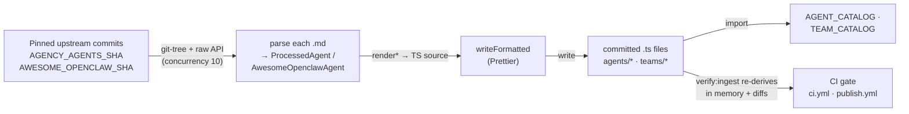

The marketplace catalog, 304 deployable agents and 82 teams, is **committed codegen**. None of it is fetched at runtime, and none of it is hand-maintained entry by entry. Instead, `scripts/ingest-marketplace-content.ts` reads two upstream GitHub repos at pinned commits, parses each `.md` file into a typed catalog entry, renders the entries as TypeScript source, runs that source through Prettier, and writes it to disk. The generated files (~20 of them under `apps/web/src/features/marketplace/`) are committed to git and imported directly by the app. A second script, `scripts/verify-ingest.ts`, re-runs the same render pipeline in memory and diffs the result against the committed files; that diff is a CI gate on every PR and every release.

This page explains *why* the catalog is built this way, how the ingest pipeline is structured as a deterministic function of a pinned input, the zero-loss `identityTemplate` invariant that the whole design hangs on, and how `verify:ingest` makes a two-script generator/verifier pair safe to ship. For the *shapes* this pipeline produces, the `AgentCatalogEntry` / `TeamTemplate` schemas, the ID conventions, the per-source counts, see the [marketplace catalog reference](/reference/marketplace-catalog). This page is about the machinery, not the output.

## What it is, and what it isn't

The ingestion pipeline is a **build-time content generator**, not a runtime feature. It runs only when a maintainer invokes `pnpm ingest:marketplace`; the app never calls it. The product of that run is plain committed TypeScript, so the marketplace browses and deploys entirely client-side with no network dependency on the upstream repos; a fresh `npx clawboo` install carries the full catalog inside its bundle.

It is also **not** the source of truth for the catalog. The committed `.ts` files are. The pinned upstream commits are an *input* to a transform that produced those files; once generated, the files stand on their own. The ingest script exists to regenerate them deterministically (when an upstream pin is bumped), and the verify script exists to prove they were generated and not hand-edited. The upstream repos could vanish and the catalog would be unaffected.

This is the deliberate middle path between two alternatives the project rejected:

- **Runtime fetch** would break offline-first installs and make the catalog non-reproducible; a deploy would depend on a live GitHub and on whatever the upstream `HEAD` happened to be.
- **Hand-writing** ~300-line entries across hundreds of agents is error-prone, unreviewable at scale, and would drift the moment an upstream source changed.

Committed codegen keeps the offline-first guarantee *and* reproducibility, while making every change auditable as a normal PR diff.

<Note>
A small, hand-written slice sits beside the generated content and is deliberately *not* part of the pipeline: the 15 clawboo built-in agents (`agents/clawboo/*`), the 5 built-in teams (`teams/clawboo-builtin.ts`), and the catalog barrel (`teams/index.ts`). Their source is local TypeScript with path-alias imports the ingest script can't resolve at script runtime, so they're authored by hand and skipped by the verifier. The generated arrays they import *are* verified.
</Note>

## The model

The pipeline is one deterministic function: **pinned commits → parse → render → Prettier → committed `.ts`**, with the verifier re-running the middle three steps and diffing.



Two properties make this a *function* rather than a script with side effects, and both are load-bearing for the verify gate:

1. **The input is pinned.** The two upstream commit SHAs are constants in `scripts/lib/ingest-helpers.ts` (`AGENCY_AGENTS_SHA = '64eee9f8…'`, `AWESOME_OPENCLAW_SHA = '659895e5…'`). Both the ingest and verify scripts import the *same* constants, and every GitHub call, the recursive git-tree fetch and each raw-file fetch, embeds the SHA in its URL. Nothing reads a branch `HEAD`. Re-running today and re-running in a year against the same pins produce byte-identical output.
2. **The transform is order-stable.** Every domain's agents are sorted by `id` before rendering, the awesome-openclaw entries are sorted by `id`, and the per-usecase named-agent extraction de-dupes deterministically. There is no `Date.now()`, no `Math.random()`, no filesystem-order dependence in the rendered content.

Because the function is deterministic, the verifier can re-evaluate it and assert the committed files equal the result, which is the entire trust model (see [the verify gate](#the-verify-gate)).

## How the ingest pipeline works

`scripts/ingest-marketplace-content.ts` orchestrates two source pipelines plus a team-generation phase. The reusable logic, every fetch, parse, and render helper, lives in `scripts/lib/ingest-helpers.ts`, which the verify script imports as well. Keeping the helpers in one module is what guarantees the generator and verifier can't diverge.

### Fetch (pinned, concurrency-limited)

For each source, the script fetches the repo's recursive git tree at the pinned SHA via the GitHub API, filters the tree to the relevant `.md` blobs (the 13 agency domain folders; everything under `usecases/` for awesome-openclaw), then downloads each file's raw content. Downloads run through a hand-rolled `pLimit(tasks, concurrency)` worker pool at concurrency 10, enough to be fast, bounded enough to stay under GitHub's unauthenticated rate ceiling. The raw-content URLs hit `raw.githubusercontent.com/<repo>/<SHA>/<path>`, again pinned.

### Parse (markdown → typed entry)

Each agency `.md` file becomes a `ProcessedAgent` via `processAgentFile`. The parser:

- derives a stable `id` (`agency-<slug(filename)>`, with the sub-folder prepended for game-development files to avoid collisions),
- pulls a 1–2 sentence `description` from the YAML frontmatter (with a body-line fallback),
- distills a `soulTemplate` by collecting up to three sections whose headings match a small `SOUL_KEYWORDS` list (tolerant of leading emoji and possessive prefixes), falling back to the first 400 characters,
- matches `skillIds` against an inline `SKILL_MATCH_CATALOG` by word-boundary tag matching, and
- sets `identityTemplate` to the file's content **verbatim** (see [the zero-loss invariant](#the-zero-loss-identitytemplate-invariant)).

The awesome-openclaw pipeline is different in kind: those files are prose usecase write-ups, not agent manifests. `processUsecaseFile` always emits one guaranteed `*-operator` entry per usecase, then runs five regex passes over the body to extract named role/phase agents (`### Agent N: Name (Role)`, `### Name Agent`, `**Name Agent**` bold, and two passes scoped to the `## What It Does` section), de-duped per file by role slug. Even a usecase page with zero detectable headings yields its operator, the floor that keeps the count stable. The whole usecase body still becomes each entry's verbatim `identityTemplate`.

### Render and format (the Prettier step)

The render helpers (`renderDomainFile`, `renderAwesomeOpenclawFile`, the team renderers) emit TypeScript source by `JSON.stringify`-ing each field into an object literal. That raw output is *unformatted*, double-quoted, single-line strings, and would never byte-match the committed files, which carry the repo's Prettier style (single quotes, wrapped lines). So every write goes through a `writeFormatted(outPath, content)` helper that runs `prettier.format(content, { parser: 'typescript', filepath: outPath })` before flushing to disk.

<Info>
The Prettier normalization isn't cosmetic polish: it's what makes the generator's output comparable to a committed file at all. The verifier re-formats *both sides* with the exact same config (`scripts/verify-ingest.ts`'s `format()`), so a difference in formatting can never be mistaken for a difference in content. Without `writeFormatted`, a freshly generated file would drift against its committed twin on whitespace alone and the gate would fire on every run.
</Info>

### Team generation

After the agent files are written, the script builds the three generated team files from the same in-memory agent data:

- `teams/agency-workflows.ts`: five hand-curated workflows (`WORKFLOW_TEAM_CONFIGS` maps each example filename to a list of catalog agent IDs), with hub-and-spoke routing generated by `buildHubSpokeRouting` (first agent is the leader; everyone else routes to `@<Leader>`) and the full example `.md` body stored as `workflowNarrative`.
- `teams/awesome-openclaw.ts`: one team per usecase, members grouped by usecase slug.
- `teams/synthetic.ts`, the 30 "Excellence Teams" that partition every agency agent *not* already covered by a workflow team into per-domain clusters, so every agent appears in at least one team. The exclusion set comes from `workflowAgentIds()`.

These three are generated; `teams/clawboo-builtin.ts` and `teams/index.ts` are hand-written.

## The zero-loss `identityTemplate` invariant

The single most important property of the catalog, the one the deploy story depends on and a unit test enforces, is **zero-loss**: every entry's `identityTemplate` is the full, verbatim source content, never a condensed summary.

For the two upstream sources this is trivial by construction: `processAgentFile` and `processUsecaseFile` both assign `identityTemplate: content`, the exact `.md` body fetched at the pinned commit. For clawboo built-ins (which have no upstream `.md`) `fromInlineAgent` synthesizes the `identityTemplate` from the full set of inline fields under headings, structured around the original data, never lossy of it.

The shorter, distilled `soulTemplate` is a separate field. The two map onto two different deploy artifacts:

| Field | Deploy artifact | Content |
|---|---|---|
| `soulTemplate` | `SOUL.md` | Distilled mission statement |
| `identityTemplate` | `IDENTITY.md` | The full, verbatim source body, zero-loss |

So a deploy is lossless: `createAgent` writes `identityTemplate` straight into the agent's `IDENTITY.md`, byte-for-byte for upstream entries. The same property is what lets the agent-detail modal render an agent's *entire* original spec before you commit to deploying it.

The guarantee is mechanical, asserted for every catalog entry by `agentCatalog.test.ts`:

```ts
it('identityTemplate.length > 500 (zero-loss — full content preserved)', () => {
  for (const e of AGENT_CATALOG) {
    expect(e.identityTemplate.length).toBeGreaterThan(500)
  }
})
```

A length floor is a blunt instrument, but a deliberate one: any future change that accidentally swapped in a summary, a slug, or a truncated excerpt would drop dozens of entries under 500 characters and fail loudly. The invariant isn't documentation; it's a tripwire.

## Design rationale and trade-offs

**Why a separate verify script instead of one idempotent generator?** Because a generator that "fixes" drift in place would mask the drift. The two-script split makes the property explicit and externally checkable: `ingest` *writes*, `verify` *asserts*, and CI runs only `verify`. A reviewer can trust a green check without re-running the network-bound generator. The cost is keeping one renderer (`renderAgentsIndex`) duplicated across both scripts, a small, intentional copy that a comment flags, paid to keep the verifier self-contained.

**Why pin SHAs rather than track a branch?** Determinism. A pinned commit makes the transform a pure function of a fixed input, which is the precondition for the verifier to be meaningful at all. Bumping the catalog is a conscious act: change a SHA constant in `ingest-helpers.ts`, re-run `pnpm ingest:marketplace`, commit the regenerated files. The verify gate then proves the new files match the new pin.

**Why commit the output at all?** So the catalog ships in the bundle and the install is offline-first, and so catalog changes show up as reviewable diffs. The alternative, generating at build time, would make the build depend on a live GitHub and would hide the catalog from review.

## The verify gate

`scripts/verify-ingest.ts` is the enforcement arm. It re-runs the agency and awesome-openclaw pipelines and the three team renderers entirely in memory, fetching the same pinned trees, parsing the same files, rendering the same source; then, for each file it owns, reads the committed file from disk, runs *both* the freshly generated content and the committed content through Prettier with identical config, and string-compares. On any mismatch it prints a short line diff and exits `1`; when every generated file is current it exits `0`. Hand-written files (the clawboo built-ins, `teams/clawboo-builtin.ts`, `teams/index.ts`) are not in its check set.

The gate runs in two places, wired to the `verify:ingest` npm script (`tsx scripts/verify-ingest.ts`):

| Workflow | Where | What drift blocks |
|---|---|---|
| `.github/workflows/ci.yml` | A dedicated `verify-ingest` job, parallel to `lint` / `typecheck` / `test` / `build` | PR merge |
| `.github/workflows/publish.yml` | A `pnpm verify:ingest` step before `pnpm build` | Releases |

So a hand-edit to a generated file, or a forgotten regeneration after a SHA bump, fails the same way in both a PR and a release. Because the verifier imports its render logic from `scripts/lib/ingest-helpers.ts`, the *same* module the generator uses, the two can never disagree about what "correct" output is.

<Warning>
Every generated file opens with an `// AUTO-GENERATED — do not edit manually` header. Editing one by hand passes locally but fails `verify:ingest` in CI. To change catalog content, bump the pinned SHA in `scripts/lib/ingest-helpers.ts` and re-run `pnpm ingest:marketplace`, never patch the generated `.ts` directly.
</Warning>

## Boundaries and non-goals

- **Not a live marketplace.** There is no runtime fetch, no remote catalog API, no per-install update channel. The catalog is whatever was committed at build time. A "fetch from ClawHub" model is a hypothetical future, not a shipped feature.
- **Not the source of truth for the hand-written slice.** The 15 clawboo built-in agents and 5 built-in teams are authored by hand and live outside the pipeline. `verify:ingest` neither generates nor checks them; their correctness rests on ordinary unit tests, not on the drift gate.
- **Counts are doc-time figures, not test assertions.** The 304 / 82 totals are derived from the committed files at a fixed commit. The catalog's own tests assert *lower bounds* (≥ 270 agents, ≥ 160 agency, ≥ 40 awesome, ≥ 15 clawboo) so a future re-ingest at a newer SHA can grow the catalog without breaking tests. Don't treat the exact counts as invariants, treat the zero-loss `identityTemplate` floor and the verify gate as the invariants.

<Note>
This documents the **v0.2.0 working tree** (commit `03b206a`). The current npm `latest` is **`clawboo@0.1.9`**, so `npx clawboo` installs 0.1.9 until the v0.2.0 tag is published. Differences are noted in [Known Issues](/appendices/known-issues).
</Note>

## See also

- [Marketplace catalog reference](/reference/marketplace-catalog), the `AgentCatalogEntry` / `TeamTemplate` schemas, ID conventions, and per-source counts this pipeline produces
- [The agent model](/concepts/agent-model), what a deployed catalog agent becomes
- [Release process](/internals/release-process), Changesets, `publish.yml`, and the clean-install gate this sits alongside
- [Monorepo and build](/internals/monorepo-and-build), the Turbo / pnpm build the catalog compiles into
- [Testing](/internals/testing); the unit / e2e / clean-install strategy that backs the catalog's invariants
- [Glossary](/appendices/glossary), canonical term definitions
