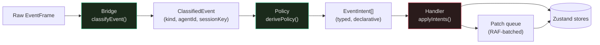

`@clawboo/events` is the package that turns the OpenClaw [Gateway](/appendices/glossary)'s raw WebSocket event stream into reactive UI state. It is a small, dependency-light library — its only runtime deps are `@clawboo/gateway-client`, `@clawboo/protocol`, and `@clawboo/logger`, and it imports nothing from `node:*`, so it ships in the browser bundle. Three stages do the work, and the design's whole point is *where the line between them falls*: the first two stages are **pure functions** you can unit-test without a Gateway, a browser, or a store; only the third touches state.

This page is the contributor-level walk through that package: the three layers, the typed seam that connects them (`EventIntent[]`), why purity is enforced at the package boundary, the RAF patch queue that smooths streaming, the guard state the Handler concentrates, and the invariant that every OpenClaw frame flows through this one pipeline. For the user-facing framing of the Gateway flow and device pairing, see [Gateway and events](/concepts/gateway-and-events); this page is the internals.

## The three layers

A raw frame becomes a store mutation in three named hops:

- **Bridge** (`bridge.ts`) — pure parsing. `classifyEvent(frame)` answers "what *is* this frame?" and returns a `ClassifiedEvent` (`kind`, extracted `agentId`/`sessionKey`, timestamp). It never decides what to do.
- **Policy** (`policy/*`) — pure decision-making. `derivePolicy(event)` answers "what *should happen*?" and returns an array of typed `EventIntent`s — a description, not a mutation. It reads only its inputs.
- **Handler** (`handler.ts`) — the one stateful stage. `createEventHandler(deps)` dispatches each intent to injected store-writers, applying cross-cutting guards (debounce, stale-run dropping) as it goes.

A single convenience runner threads a frame through all three: `processEvent(frame, handler)` calls `classifyEvent` → `derivePolicy` → `handler.applyIntents`. That function is the entire public entry point a caller needs.



## Stage 1 — Bridge: `classifyEvent` and the pure helpers

`classifyEvent(frame)` switches on the frame's `event` name and produces a `ClassifiedEvent`. The mapping is small and total — anything unrecognized falls through to `unknown` rather than throwing:

| Frame `event` | Classified `kind` |
|---|---|
| `presence`, `heartbeat` | `summary-refresh` |
| `chat` | `runtime-chat` |
| `agent` | `runtime-agent` |
| `exec.approval.pending` / `.requested` / `.resolved` | `approval` |
| anything else | `unknown` |

Agent identity is extracted defensively. For `chat` frames the `agentId` comes from the session-key shape `agent:<id>:<session>` (parsed by `SESSION_KEY_RE`). For `agent` frames a top-level `agentId` wins, else the session key is parsed. For approval frames `agentId` may be at the top level *or* nested inside `payload.request`, and `classifyEvent` checks both.

The Bridge also owns a set of small pure helpers the rest of the pipeline reuses:

- `parseChatPayload` / `parseAgentPayload` — shape-validate a raw payload and return `null` on anything malformed (missing `runId`/`sessionKey`, an out-of-range `state`). The Policy router relies on this `null` to turn a junk frame into an `ignore` intent instead of a crash.
- `isReasoningStream(stream)` — classifies a stream name as a thinking trace, with an explicit deny-list (`assistant`, `tool`, `lifecycle`) checked *before* the allow-list (`reason`, `think`, `analysis`, `trace`) so an `assistant` stream is never misread as reasoning.
- `resolveLifecyclePatch` — maps a `start`/`end`/`error` lifecycle phase to a status patch, ignoring a terminal phase whose `runId` doesn't match the currently-tracked run.
- `mergeRuntimeStream`, `dedupeRunLines` — stream concatenation and per-run line de-duplication.
- It re-exports `extractText` / `extractThinking` / `extractToolLines` from `@clawboo/protocol` so consumers have one import surface.

<Note>
The Bridge knows nothing about Zustand, `apps/web`, or even what a "store" is. It transforms `EventFrame → ClassifiedEvent` and validates payloads. That is the whole contract.
</Note>

## Stage 2 — Policy: `derivePolicy` and the four deciders

`derivePolicy(event)` is the router. It switches on the classified `kind` and delegates to one of four pure deciders, each in its own file, returning `EventIntent[]`:

```ts
// packages/events/src/policy/index.ts
export function derivePolicy(event: ClassifiedEvent): EventIntent[] {
  switch (event.kind) {
    case 'summary-refresh':
      return decideAgentEvent(event)
    case 'runtime-chat': {
      const payload = parseChatPayload(event.payload)
      if (!payload) return [{ kind: 'ignore', reason: 'malformed chat payload' }]
      return decideWorkChatEvent(event, payload)
    }
    case 'runtime-agent': {
      const payload = parseAgentPayload(event.payload)
      if (!payload) return [{ kind: 'ignore', reason: 'malformed agent payload' }]
      return decideWorkAgentEvent(event, payload)
    }
    case 'approval':
      return decideTrustEvent(event)
    case 'unknown':
    default:
      return [{ kind: 'ignore', reason: 'unknown event kind' }]
  }
}
```

The router re-validates each payload with the Bridge's parser before handing it to a decider, so a malformed payload always becomes a single `{ kind: 'ignore', reason }` intent. Nothing in this layer throws.

The four deciders map to three logical **planes** (`work`, `agent`, `trust`):

- **`decideAgentEvent`** (`agent.ts`) — for `summary-refresh`. It emits one `scheduleSummaryRefresh` intent with a fixed `delayMs: 750`, and sets `includeHeartbeatRefresh` only when the originating frame was a `heartbeat` (vs a `presence`). It does not mutate fleet state directly — it asks the Handler to debounce a reload.
- **`decideWorkChatEvent`** (`work.ts`) — for `runtime-chat`. A `delta` becomes a `queueLivePatch` carrying the extracted streaming text and thinking trace (RAF-batched downstream). A `final` becomes a `clearPendingLivePatch` + a `commitChat` that finalizes the turn with output lines and an `idle` patch — and, if the final message carried *no* thinking trace, an extra `requestHistoryRefresh` so the full transcript is re-fetched. `aborted` and `error` each become a `clearPendingLivePatch` + `commitChat` with the appropriate terminal status (`idle` / `error`).
- **`decideWorkAgentEvent`** (`work.ts`) — for `runtime-agent`. The `lifecycle` stream's `start`/`end`/`error` phase becomes an `updateAgentStatus` intent (`running` / `idle` / `error`); the `assistant` and reasoning streams become `queueLivePatch` intents. The `tool` stream is deliberately handed off to the Handler via `appendOutputLines` rather than carrying lines through an intent, so this decider returns an `ignore` for it.
- **`decideTrustEvent`** (`trust.ts`) — for `approval`. It emits `approvalPending` for `exec.approval.pending` / `.requested`, else `approvalResolved`. Missing an `agentId` is an `ignore`, not an error.

Because every decider reads only `(event, payload)` and returns an array, the **same input always derives the same intents**. That is what makes Policy unit-testable in isolation — and it is exactly what `policy-work.test.ts` and `policy-trust.test.ts` exercise: feed a `ClassifiedEvent`, assert the `EventIntent[]`, no Gateway and no store in sight.

## The seam: `EventIntent[]`

The boundary between pure and stateful is a typed discriminated union, `EventIntent`. Policy emits these; the Handler consumes them. The union is the contract:

```ts
// packages/events/src/types.ts (abridged)
export type EventIntent =
  | { kind: 'queueLivePatch'; plane: 'work'; agentId: string; sessionKey?: string; patch: AgentStatusPatch }
  | { kind: 'clearPendingLivePatch'; plane: 'work'; agentId: string }
  | { kind: 'commitChat'; plane: 'work'; agentId: string; sessionKey?: string; patch: AgentStatusPatch; outputLines: string[] }
  | { kind: 'updateAgentStatus'; plane: 'agent'; agentId: string; patch: AgentStatusPatch }
  | { kind: 'scheduleSummaryRefresh'; plane: 'agent'; delayMs: number; includeHeartbeatRefresh: boolean }
  | { kind: 'requestHistoryRefresh'; plane: 'agent'; agentId: string; reason: 'chat-final-no-trace' }
  | { kind: 'approvalPending'; plane: 'trust'; agentId: string; payload: unknown }
  | { kind: 'approvalResolved'; plane: 'trust'; agentId: string; payload: unknown }
  | { kind: 'ignore'; reason: string }
```

An intent is a *description of what should happen*, never a call into a store. That indirection is the load-bearing design move: it keeps Policy pure (you can't accidentally write to a store from a function that only constructs plain objects), and it lets the Handler apply cross-cutting concerns — RAF batching, stale-run dropping, the pending-approval guard — uniformly across every intent kind, regardless of which decider produced it.

## Stage 3 — Handler: `applyIntents` and its guard state

`createEventHandler(deps)` returns `{ applyIntents, dispose }`. The `deps` are the injected dispatchers and state queries that write to and read from the Zustand stores — `queueLivePatch`, `appendOutputLines`, `dispatchIntent`, `getAgentRunId`, `loadSummarySnapshot`, `refreshHeartbeatLatest`, `requestHistoryRefresh`, plus an injectable `setTimeout`/`clearTimeout` pair for testing. The pure package never imports `apps/web`; the wiring lives the other way around (see [the wiring](#wiring-in-the-web-app), below).

`applyIntents(intents, event)` is a `switch` over `intent.kind`. Most cases are a one-line delegate to a dep. Two of them carry the real intelligence, and they share a guard structure.

**The `closedRuns` stale-run guard.** The Handler keeps a `Map<runId, expiry>` with a 30-second TTL (`CLOSED_RUN_TTL_MS`), capped at 500 entries (`CLOSED_RUNS_MAX_SIZE`, oldest-evicted on overflow). `pruneClosedRuns()` runs at the top of every `applyIntents`. When a `commitChat` or terminal `updateAgentStatus` actually clears the agent's `runId`, that `runId` is added to `closedRuns`. A subsequent terminal `updateAgentStatus` whose run is already in `closedRuns` is dropped. This guards against a duplicate `final` or a late lifecycle `end` flipping a freshly-started run back to idle.

**The pending-approval subtlety.** The Handler captures the agent's `runId` *before* calling `dispatchIntent`, then re-reads it after. A run is only marked closed if the dispatch actually cleared the `runId`. This matters because when an exec approval is pending, the injected `dispatchIntent` deliberately *skips* the terminal status patch — the LLM stream ended but the run is still alive, blocked on the approval decision. If the Handler blindly marked the run closed on every `commitChat`, it would then drop the *real* final event that arrives after the approval resolves. The pre/post `runId` comparison is what threads that needle.

**The summary-refresh debounce.** `scheduleSummaryRefresh` cancels any pending `summaryRefreshTimer` and re-arms one, so a burst of `presence`/`heartbeat` frames collapses into a single fleet reload after `delayMs`. `dispose()` clears that timer and the `closedRuns` map — it is called when the Gateway disconnects so no timer leaks across a reconnect.

<Info>
The Handler is the *only* place in `@clawboo/events` that holds state. Every guard — the debounce timer, the stale-run map, the pre/post-`runId` capture — is concentrated here on purpose. The cost of keeping Bridge and Policy pure is paid by making the Handler the single home for all the messy temporal logic, which is a deliberate trade: one stateful unit is far easier to reason about than state smeared across three layers.
</Info>

## The RAF patch queue

Streaming deltas arrive faster than the screen refreshes — a single agent turn can fire dozens of `delta` frames a second. `createPatchQueue(onFlush)` (`patch-queue.ts`) coalesces them. It keeps a `Map<agentId, updates>` of pending patches; `enqueue` merges an incoming patch into the agent's pending entry and schedules a flush on the next `requestAnimationFrame`. `flush` drains the map and calls `onFlush(patches)` once with everything accumulated, so the store is written at most once per animation frame per agent.

The merge has one important rule: **a `runId` change discards the old streaming state**. If an incoming patch carries a different `runId` than the pending one, the queue *replaces* the pending entry rather than merging — so a stale partial stream from a finished run can never bleed into a fresh run's text.

```ts
// packages/events/src/patch-queue.ts (abridged)
const existingRunId = typeof existing['runId'] === 'string' ? existing['runId'] : ''
const incomingRunId = typeof patch.updates['runId'] === 'string' ? patch.updates['runId'] : ''
if (incomingRunId && existingRunId && incomingRunId !== existingRunId) {
  state.pending.set(patch.agentId, { ...patch.updates }) // replace — don't merge
} else {
  state.pending.set(patch.agentId, { ...existing, ...patch.updates }) // merge
}
```

The queue is browser-safe by guard: it only schedules via `requestAnimationFrame` when that global exists, and `cancelAnimationFrame` is guarded the same way — so the same code is a harmless no-op in SSR / Node test contexts. `dispose()` cancels any pending frame and clears the map.

## Wiring in the web app

`@clawboo/events` exports only pure functions and an intent-driven Handler; it knows nothing about which stores exist. The binding is done once, in the browser, by the `useGatewayEvents` hook. On mount it:

1. Creates a patch queue whose `onFlush` writes each batch into the fleet store (`useFleetStore.patchAgent`).
2. Constructs the Handler with `deps` backed by the real Zustand stores — `getAgentRunId` reads the fleet store; `dispatchIntent` writes `updateAgentStatus` / `commitChat` / approval intents, applying the pending-approval guard; `queueLivePatch` enqueues to the patch queue; `loadSummarySnapshot` / `refreshHeartbeatLatest` / `requestHistoryRefresh` reload from the server.
3. Subscribes to `client.onEvent` and runs `processEvent(frame, handler)` for every frame.

The cleanup return unsubscribes and calls `patchQueue.dispose()` + `handler.dispose()`, so both the RAF frame and the Handler's timers are torn down when the Gateway connection closes or the component unmounts.

This split — pure library, browser-only wiring — is what keeps the package's invariant true: the pure stages can be tested without a DOM, and the only file that imports a store is the hook, not the package.

## Design rationale and trade-offs

**Pure Bridge and Policy, stateful Handler.** Classification and decision-making are the parts that are hard to get right (what a frame *means*, which intents it produces, how a malformed payload is handled). Making them pure means they are testable in isolation, deterministic, and reusable — and it pushes every piece of temporal state into one auditable place. This is the same purity discipline the [board](/concepts/the-board) and governance layers follow: side effects live at the edges, decisions in the middle.

**Intents over direct store calls.** Policy could call stores directly and skip the union. It doesn't, because the indirection is what *enforces* purity (you cannot dispatch from a function that only returns objects) and what lets the Handler layer guards on uniformly. The `EventIntent` union is a small price for a clean seam.

**RAF batching over write-per-frame.** Writing the store on every streaming delta would thrash React's render path. Coalescing per agent per animation frame keeps the live fleet view smooth without dropping data, and the `runId`-change-discards-state rule keeps the coalescing correct across run boundaries.

**Dependency injection for the Handler's effects.** The Handler takes `setTimeout`/`clearTimeout` and every store-writer as `deps`. That is what lets the package stay browser-agnostic and lets tests drive the Handler with fake timers and spy dispatchers — no real Gateway, no real store, no real clock.

## Boundaries and non-goals

- **OpenClaw-specific.** This pipeline maps OpenClaw WebSocket frames to the live *fleet view*. The other four runtimes (clawboo-native, Claude Code, Codex, Hermes) emit a normalized `RuntimeEvent` union server-side and do **not** flow through `classifyEvent` / `derivePolicy`. See [the agent model](/concepts/agent-model) and [the RuntimeAdapter trait](/internals/runtime-adapter).
- **Not the team-orchestration engine.** Bridge→Policy→Handler keeps an agent's status, streaming text, and approvals in sync. Turning delegation signals into durable work is the board orchestrator's job, on a different code path. See [delegation and orchestration](/concepts/delegation-and-orchestration).
- **Not a transport.** The package never opens a socket. It transforms frames the `GatewayClient` already delivered; the socket, reconnect, and the same-origin proxy live in `@clawboo/gateway-client` and `@clawboo/gateway-proxy`. See [Gateway and events](/concepts/gateway-and-events).
- **Token-count gap is upstream.** Gateway `chat` payloads carry no usage data, so the cost path estimates tokens elsewhere; that is a Gateway limitation, not this pipeline's. See [Known issues](/appendices/known-issues).

<Note>
This documents the **v0.2.0 working tree** (commit `03b206a`). The current npm `latest` is **`clawboo@0.1.9`**, so `npx clawboo` installs 0.1.9 until the v0.2.0 tag is published. Differences are noted in [Known Issues](/appendices/known-issues).
</Note>

## See also

- [Gateway and events](/concepts/gateway-and-events) — the user-facing Gateway flow, the two connections, and device pairing
- [The RuntimeAdapter trait](/internals/runtime-adapter) — how the *other* four runtimes emit lifecycle events instead
- [The agent model](/concepts/agent-model) — where this OpenClaw pipeline fits among the five runtime classes
- [Architecture invariants](/concepts/architecture-invariants) — "all Gateway events go Bridge→Policy→Handler"
- [`@clawboo/events`](/reference/packages/events) — the package's public API surface
- [Glossary](/appendices/glossary) — canonical term definitions
