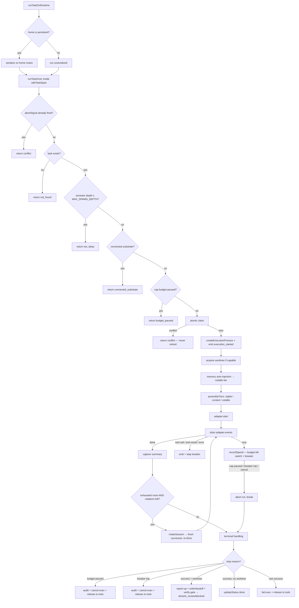

The executor runner is the server-side integration glue that drives a single board task through a runtime, from claim to terminal. It lives in `apps/web/server/lib/executorRunner.ts`, and it is the un-flagged graduation of the idea that **a teammate is a [`RuntimeAdapter`](/internals/runtime-adapter)**: given a task id, an assignee, and an adapter factory, it atomically claims the task, opens an execution row, acquires an isolated [worktree](/concepts/worktrees-and-handoff) when the runtime can use one, assembles a tiered prompt, drives the adapter's normalized event stream, enforces [governance](/concepts/governance) on every cost event, rotates the session when it runs out of room, runs the [verification](/concepts/verification) gate, and writes a cross-runtime handoff.

The whole thing talks **only** through the `RuntimeAdapter` trait and an injected adapter factory. It never assumes "a runtime is a spawned process," so a future non-subprocess participant — a human, UI-driven — slots in behind the same seam without touching the runner.

This page walks the lifecycle in order: the pre-claim refusals, the atomic claim, worktree acquisition, prompt assembly with memory auto-injection, the event-drain loop with its budget kill-switch and circuit breakers, session rotation, the terminal branches (report-up, verify gate routing, handoff), and capability-driven degradation.

## What it is, and what it isn't

The runner is the **dispatcher for one task on one non-OpenClaw runtime**. It is the consumer side of the executor seam: the trait knows nothing about the board, and the runner knows nothing about how any individual runtime maps its native frames — it sees only `RuntimeEvent`s.

What it is *not*:

- **Not the team orchestrator.** Deciding *which* tasks to spawn from a delegation lives in [delegation and orchestration](/concepts/delegation-and-orchestration). The runner runs *one* task that already exists on [the board](/concepts/the-board).
- **Not the OpenClaw path.** OpenClaw is a *connected substrate* — it executes over its live Gateway connection, not as a one-shot spawn. The runner refuses a connected-substrate runtime before it claims anything (see [pre-claim refusals](#pre-claim-refusals)). The four wrapped/native runtimes (`clawboo-native`, `claude-code`, `codex`, `hermes`) go through here.
- **Not the verification critic.** The runner *triggers* verification on completion, but the builder-≠-judge gate is its own subsystem; the runner reuses its own adapter factory to drive the independent reviewer.

The public entry point is `runTaskOnRuntime(input)`, which returns a structured `RunTaskResult` and never throws for the expected board outcomes — a `404`, `409`, too-deep, connected-substrate, or budget-paused result is data, not an exception. The REST surface over it is `POST /api/runtimes/:id/run` (`runtimesRunPOST`), which maps the structured reasons onto HTTP status codes.

## The lifecycle

## How it works

### Pre-claim refusals

Everything that can refuse the dispatch without mutating the board runs *before* the claim, so a misrouted or over-budget call never opens an execution row or spawns a process. In order:

1. **Aborted waiter.** A run can sit queued behind a same-identity dispatch in the home mutex for the whole duration of the prior run. If the caller disconnected meanwhile (its `AbortController` fired), the runner bails and returns `conflict` before the claim, so a dead waiter never mutates the board.
2. **Task existence** → `not_found`.
3. **Depth bound.** Recursion is bounded via the board's ancestor chain: a task whose ancestor count reaches `MAX_SPAWN_DEPTH` (2) is refused with `too_deep`. This is the single-reduce-point invariant — children never fan out past the depth ceiling.
4. **Connected-substrate refusal.** The integration class comes from `capabilities()`, never from a runtime-id switch. `resolveRuntimeIntegration(caps)` resolves a `connected-substrate` runtime (OpenClaw) to a `connected` home, and the runner refuses it with `connected_substrate` — this one-shot runner must never spawn it.
5. **Budget preflight.** A *cap-mode* paused budget on the agent, mission, or team scope blocks the dispatch with `budget_paused`. This is the only enforceable cap for a connected substrate that reports no incremental cost (its spend lands only on the terminal); a warn-mode budget is clamped to never read `paused`, so it never blocks here.

<Note>
The runtime class drives integration depth *by construction*. The runner branches only on `resolveRuntimeIntegration(caps).home.kind` — never on a runtime id. A persistent home (native, Hermes) serializes its dispatch on a per-identity home path so two concurrent runs of the same `(runtime, agent)` never spawn two writers against one `state.db`; an ephemeral or connected home is never keyed. See [the seams](/internals/seams) for the same construction applied to schedules and capabilities.
</Note>

### The atomic claim

The claim is a single conditional UPDATE through the board's `claimTask`. A lost claim returns `{ ok: false }` and the runner returns `conflict` — **never retried**. A conflict means another runtime legitimately owns the task; a retry would either no-op or fight for taken work. This is the same never-retry-a-409 rule the board itself enforces; see [the board](/concepts/the-board#the-atomic-claim).

Immediately after a successful claim the runner opens an `execution_processes` row (the per-run ledger crash recovery reads on restart) and emits an `execution_started` observability event. The run reason on the exec row is `resume-via-handoff` when the runtime can't resume natively, otherwise `run`.

### Worktree acquisition

A worktree is acquired only when the adapter declares `capabilities().worktrees`. `acquireWorkspace` has three paths:

- **Reuse.** An existing active worktree for the task is reused as-is — this is the cross-runtime continuation path. If a reuse target was reaped by a garbage-collection sweep (the row is `stale`, the directory is gone, or it's no longer git-registered), the runner rebuilds it from the retained branch via `resumeTaskWorkspace`.
- **Provision.** No existing worktree and the task's kind isolates to `worktree` → `provisionTaskWorkspace` branches a fresh isolated checkout with the system-of-record scaffold.
- **None.** A read-only / research task, or no `repoPath`, gets `cwd: null` — no worktree cost.

Either way, the runner reconstructs the cold-resume `ResumeState` from the worktree's [`AGENT_HANDOFF.json`](/concepts/worktrees-and-handoff) and the system-of-record files, so a fresh runtime picks the task up from where the last one left it.

### Prompt assembly

The prompt is assembled with `assembleTiers` from `@clawboo/executor/tiers` into three tiers, ordered so the frozen content forms the cacheable prefix and only the volatile tail changes per turn:

| Tier | Content | Why this tier |
|---|---|---|
| `stable` | The task title + description (`# Task: …`) | The cacheable head — identical across rotations. |
| `context` | The resume handoff + an MCP-availability note + memory guidance + degradation notes (+ a rotation handoff note on a successor) | Per-run but stable across turns. |
| `volatile` | The auto-injected memory block | The only tail that varies; never the cached prefix. |

**Memory auto-injection** (`buildMemoryInjection`) seeds the most-relevant team facts for the task into the volatile tier so a runtime begins with the team's accumulated knowledge without having to call the [Memory MCP](/concepts/memory) tool (it still can, for more). It reuses the exact `SqliteMemoryStore` + embedding-provider stack the `/api/memory` REST surface uses, is bounded by a character budget (so the seed never crowds out the real instruction), is recall-sanitized (a candidate fact that trips the injection scanner is dropped, so a poisoned "fact" can't smuggle instructions) and scrubbed of secrets, and is a no-op when memory is empty — a fresh install injects nothing. It's computed once and reused across rotations. A task can opt out via `disableMemoryAutoInject` (eval runs set this so seeded facts don't perturb deterministic baselines).

A persistent-home runtime also gets a stable per-identity `homeDir` under Clawboo's state dir, materialized owner-only (`0700`) before the driver touches it. The runner only *computes* the path — the driver provisions it. The run context (`RuntimeRunContext`) carries the `cwd`, model, the native resume id (only for a same-runtime continuation), the MCP base URL, the authoritative memory scope, the home dir, and any provider keys.

### The event-drain loop

`adapter.start` returns a `RunHandle`; the runner then drains `adapter.events(run)` to a terminal `done`. Each event variant drives a side effect:

- **`text-delta`** — accumulated into `lastText` (the reasoning channel is skipped — the feed shows what the agent is doing, not its private reasoning).
- **`cost`** — the governance hot path (below).
- **`tool-call`** (settled, not each streaming-input delta) / **`tool-result`** / **`error`** — emitted as observability events and fed to the circuit breaker. An `error` is run through the [error taxonomy](/concepts/observability): an unknown class is a *harness bug* and alerts; a recognized policy denial (a broker `Deny` surfaced by the runtime) is expected governance, not a bug.
- **`done`** — captures the reason and summary, then breaks the inner loop.

An injected `abortSignal` (the REST handler wires it to `res.on('close')`) aborts the live run if the dispatch client disconnects, so a hung CLI doesn't keep burning with no operator-facing kill. The handle is re-read each time the listener fires, so it aborts the *current* run even across a rotation.

#### The budget kill-switch

On **every** `cost` event, the runner records spend against the agent, mission (the root of the delegation tree), and team budgets atomically via `recordSpend`. A runtime that reports usage but no USD (Codex, Hermes, unpinned-native) has its spend estimated from the exact token usage × the model rate so the cap still engages; a real `costUsd` is used as-is. The per-node ceiling accumulates rounded integer cents while the budget ledger takes fractional cents so sub-cent events aren't lost.

The default posture is **track-and-warn**: budgets are null/uncapped until a user sets a limit, and a warn-mode budget records spend and emits a governance warning at its 80% / 100% crossings (fired once per crossing) but never auto-pauses. Only a *cap-mode* scope that crosses 100% — or the per-node `maxNodeCents` ceiling — aborts the live run; the explicit `mode === 'cap'` check is belt-and-suspenders so a warn budget can never pause even if the DB-layer clamp regressed.

#### Circuit breakers

The circuit breaker is a deterministic backstop that halts a run making no progress, repeating a failing tool, or burning tokens — *before* the dollar ceiling, and on a cross-runtime basis the runtime's own `max_turns` doesn't cover. It's fed typed `RuntimeEvent` signals, never rendered prose: token counts on `cost`, a tool signature on `tool-call`/`tool-result` (correlated by `toolCallId`), and the typed error *code* on a policy-denied error. The five trip reasons and their conservative defaults (`BREAKER_DEFAULTS`):

| Reason | Default | Signal |
|---|---|---|
| `iteration-cap` | 30 tool iterations | settled tool calls per run |
| `repeat-failure` | 3 | consecutive identical-tool failures |
| `no-progress` | 6 | consecutive results with no new successful output |
| `token-velocity` | 200,000 tok/min (after a 15 s window) | tokens per minute |
| `repeat-policy-denied` | 2 | identical typed denial codes |

The breaker feed is gated on `!stopForBudget`, and its teardown sits *after* the budget teardown — so the budget wins ties and at most one `adapter.abort` runs per run. No double-abort.

### Session rotation

The runner's unit of context assembly is the **run boundary**: Clawboo doesn't own a per-model-turn loop — the runtime owns its inner loop, so the runner assembles context once, calls `adapter.start`, and drains to a terminal `done`. Rotation happens *between* runs, never mid-generation.

When a run exhausts its room — an explicit `done{reason: 'max_turns'}`, or a non-success done that crossed the context-window watermark (`shouldRotate`: `tokensUsed / contextWindow ≥ thresholdPct`, default 0.85) — and the chain cap isn't reached (`maxRotations`, default 3), the runner rotates: `rotateSession` serializes the predecessor (best-effort), synthesizes a short structured handoff note (decisions + last summary, never the raw transcript), starts a **fresh** successor session carrying that note, and re-drives the loop.

A runtime that reports no context window and never emits `max_turns` never rotates — byte-identical to pre-rotation behavior. Successors always start fresh (`ctx.resume = null`): resuming the exhausted session would re-exhaust it instantly, so continuity rides the handoff note. Budget and breaker state are **cumulative across rotations** (declared above the loop); only the per-run accumulators reset each pass. Each rotation records session lineage (`recordRotation`) and emits a `session_rotated` event.

<Info>
Rotation composes with — never fights — the budget kill-switch and the breaker. A budget / breaker / cancel trip breaks to the terminal handling and never rotates over a stop. The cumulative state above the loop is what makes "exactly one teardown per run" hold across a multi-rotation chain.
</Info>

### Terminal handling

After the loop, exactly one terminal branch runs.

**Budget pause** (`stopForBudget`): audit a `budget` event, drop a system comment, complete the execution as `cancelled` with `budget_paused:<scope>`, emit `execution_completed`, and `releaseTask` to `todo` (retryable once a human raises the cap).

**Breaker trip** (`stopForBreaker`, mutually exclusive with the budget pause): mirror the budget teardown exactly — audit a `circuit_break` event, drop a `[stopped: <reason>]` comment for the leader to re-plan, complete the execution as `cancelled` with `circuit_broken:<reason>`, and release to `todo`. The worktree is left intact so the handoff stays writable and a retry resumes from clean state.

**Success.** The model summary is scrubbed of secrets *before* it lands in a durable board comment, the execution row, the handoff, or the HTTP response (a failed CLI that dumps its env to stderr would otherwise persist a credential verbatim — `compact()` does not scrub). Then:

- The agent comment + `succeeded` execution row are written and `execution_completed` emitted.
- **With a worktree:** the native session id is persisted into `AGENT_HANDOFF.json` (best-effort, filtering the late-bind fallback so a `--resume` isn't poisoned). If `keepForResume`, the task is released to `todo` (a pause — another runtime resumes from the handoff). Otherwise `actOnTaskWorkspace(taskId, 'complete')` runs the **verification gate**, which routes the terminal status:

  | Verdict | Terminal status |
  |---|---|
  | empty diff | `done` (no deliverable to verify) |
  | `pass` | `done` |
  | `completed_with_debt` over a green deterministic gate | `done` |
  | `completed_with_debt` over a red deterministic gate | `blocked` (routed to a human — a failing build/test gate is not auto-promotable) |
  | `fail` | `in_progress` (reverted with a structured `{what, why, howToFix}` fix note) |

  The critic that produces the verdict reuses *this run's adapter factory* on a detached, push-less checkout with a fresh session and **no builder `homeDir`** — builder ≠ judge at the run level. An operator can also make the judge a different model via `CLAWBOO_REVIEWER_MODEL`. See [Verification](/concepts/verification).

- **Without a worktree** (a research/conversational success): `updateStatus(db, taskId, 'done')`.

**Non-success.** A system comment records the outcome; the execution is closed `cancelled` (aborted) or `failed` with the scrubbed summary. A terminal `done{reason: 'error'}` is classified through the taxonomy and alerts on an unknown (harness-bug) class. A run that *attempted* a native resume and failed clears the persisted session id (keyed structurally on the attempt, never on an error string), so the next dispatch falls back to the prose handoff instead of retrying into the same stale id forever. Finally `releaseTask` returns the task to `todo` — retryable.

### Degradation planning

A runtime advertises what it can do via `capabilities()`; the runner fills the gaps **in code**, never by assuming. `planDegradations(caps)` produces three flags consumed at run start:

| Flag | Triggered by | Effect |
|---|---|---|
| `resumeViaHandoff` | `!caps.resume` | Carry state across runs via the worktree handoff; the exec run reason becomes `resume-via-handoff`. |
| `routeApprovalsThroughClawboo` | `!caps.toolApproval` | Risky tools are gated through Clawboo's own approval queue. |
| `coarseStreaming` | `!caps.streaming` | Expect block-level, not token-level, progress. |

`describeDegradations` renders human-readable notes that go into the prompt's context tier and the structured result, so the gap-filling is visible rather than silent.

## Tracing and observability

Every dispatch runs inside `withTaskSpan`. The **trace id is the mission root** — the root of the delegation tree — so a multi-agent task renders as one trace. The run's `spanId` is derived deterministically from its task id, and its parent span is either an explicit cross-process `parentTraceparent` or the board parent task's span (the ancestor chain *is* the trace hierarchy). Every lifecycle event (`execution_started`, `cost`, `tool_call`, `tool_result`, `error`, `session_rotated`, `execution_completed`) is emitted under this span via `emitEvent`, which self-gates and is best-effort. The result is that the Ghost-Graph live overlay and the trace view are projections of this same event log; see [Observability](/concepts/observability).

## Design rationale and trade-offs

The runner exists so that "drive one runtime through one task" is a single, testable function with one set of invariants — instead of being scattered across the orchestrator, the worktree subsystem, and each adapter. Pushing claim/worktree/verify/handoff behind this seam buys three things:

- **Heterogeneity by construction.** The runner branches only on capabilities, so a new runtime is a new adapter + driver, never a change to the runner. The connected-substrate refusal, persistent-home serialization, degradation plan, and rotation watermark are all capability-driven.
- **A single teardown discipline.** Cumulative budget/breaker state above the rotation loop, the `!stopForBudget` gating, and the "break-never-rotate-over-a-stop" rule together guarantee exactly one `adapter.abort` and one terminal per run — even across a rotation chain.
- **Recoverability.** Every terminal closes the execution row and either drives a real status or releases the task; orphan and stale reconciliation on [the board](/concepts/the-board#orphan-and-stale-reconciliation) clean up anything a crash leaves behind.

The cost is a second concurrency boundary (the per-identity home mutex) layered on top of the board's atomic claim — necessary because the claim dedupes a *task*, not a per-home writer.

## Boundaries and non-goals

- **One task, one runtime.** The runner does not orchestrate a team or decide what to delegate. That's the team orchestrator's job.
- **Never the OpenClaw path.** A `connected-substrate` runtime is refused before the claim. OpenClaw runs over its live connection through a different dispatcher.
- **No mid-generation control.** The runtime owns its inner turn loop; the runner's unit of intervention is the run boundary. Rotation, budget aborts, and breaker trips all act at event granularity, but a fresh context is only assembled between runs.
- **Best-effort lineage and handoff.** Session-codec serialization, rotation lineage, and the native-session-id persistence never fail a completed run — losing native resume degrades gracefully to the prose handoff, which is the designed cross-runtime path anyway.

<Note>
This documents the **v0.2.0 working tree** (commit `03b206a`). The current npm `latest` is **`clawboo@0.1.9`**, so `npx clawboo` installs 0.1.9 until the v0.2.0 tag is published. Differences are noted in [Known Issues](/appendices/known-issues).
</Note>

## See also

- [The RuntimeAdapter trait](/internals/runtime-adapter) — the seam the runner consumes
- [The seams](/internals/seams) — the same capability-driven multiplexer pattern for schedules and capabilities
- [The board](/concepts/the-board) — atomic claim, status transitions, reconciliation
- [Verification](/concepts/verification) — the builder-≠-judge gate the runner triggers on completion
- [Governance](/concepts/governance) — budgets, the kill-switch, and circuit breakers
- [Worktrees and handoff](/concepts/worktrees-and-handoff) — the isolated world and the cross-runtime `AGENT_HANDOFF.json`
- [Observability](/concepts/observability) — the event log the runner emits into
- [Runtimes API](/reference/rest-api/runtimes) — `POST /api/runtimes/:id/run`, the REST entry point
- [Glossary](/appendices/glossary) — canonical term definitions
