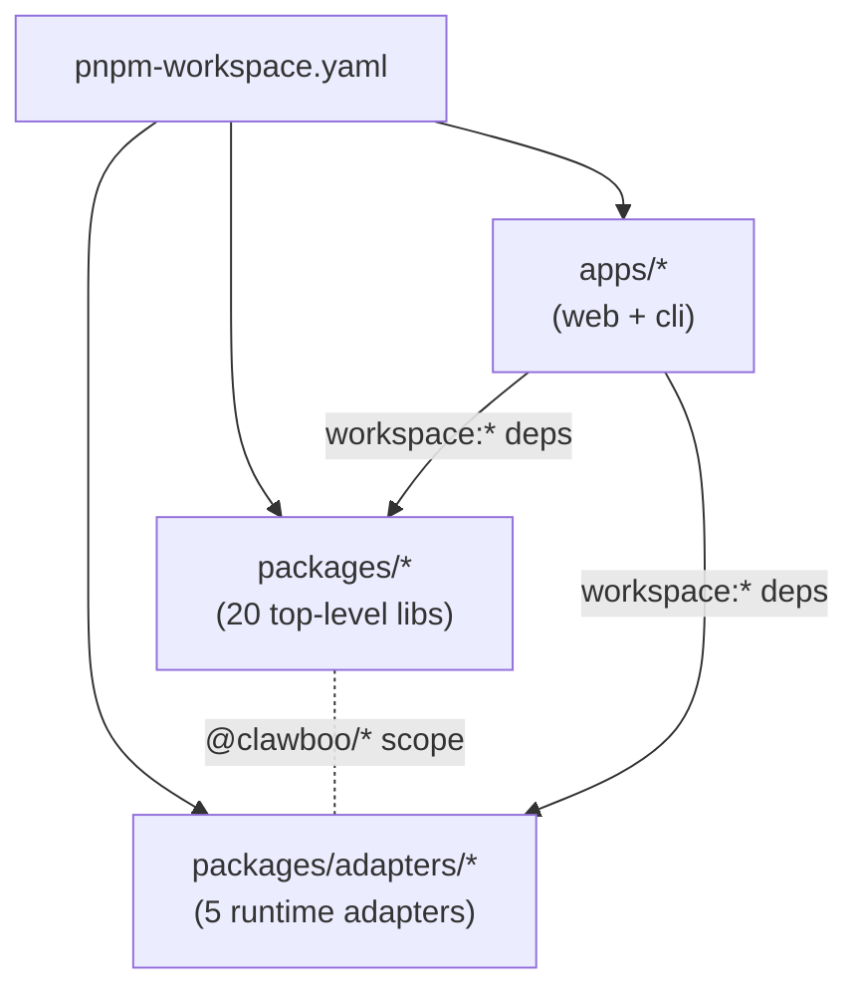
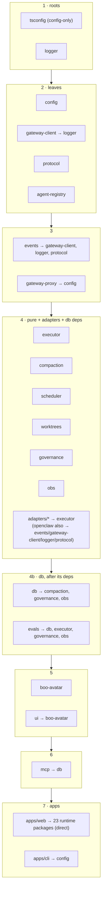

Clawboo is a TurboRepo + pnpm-workspaces monorepo. Shared libraries live under the `@clawboo/*` scope in `packages/`; the two consumers are `apps/web` (the dashboard SPA + Express API) and `apps/cli` (`npx clawboo`). This page is for people working *on* Clawboo: how the workspace is wired, why the build runs in the order it does, what actually ships to npm, and the root commands you run day to day.

If you want the per-package API surface and the dependency graph in detail, read [the package overview](/reference/packages/index); this page is the build mechanics, not the package catalog.

## What it is, and what it isn't

The repo is a **single workspace** of many small packages, not a polyrepo with version pins. Every `@clawboo/*` library is consumed via `workspace:*` (or `workspace:^`) protocol from the two apps, so there is no internal npm publish-then-install loop; Turbo builds a package's `dist/` and the app that depends on it picks it up directly.

It is **not** a "publish every package" monorepo. Despite 25 scoped packages, **all of them are `private: true`**; none publishes to npm. The **only** published artifact is the `clawboo` CLI in `apps/cli`, and it does not depend on its sibling packages at runtime the way the web app does. Instead, the build *inlines* the libraries it needs into the CLI's shipped bundle. See [What publishes](#what-publishes).

## The workspace layout

`pnpm-workspace.yaml` declares three globs:

```yaml
packages:
  - 'packages/*'
  - 'packages/adapters/*'
  - 'apps/*'
```

The second glob is load-bearing. The five runtime adapters live one level deeper, `packages/adapters/{native,openclaw,claude-code,codex,hermes}`, so without `packages/adapters/*` pnpm would not discover them and `workspace:*` resolution would fail. The result is **25 packages** (20 top-level under `packages/*` plus 5 nested adapters) and two apps.

`@clawboo/tsconfig` is the shared TypeScript-config root, `base.json`, `react.json`, `node.json`. It is a devDependency everywhere and has no runtime edge, so it doesn't appear in the dependency graph that drives the build order.



## The build pipeline (Turbo)

`turbo.json` defines five tasks, all of which `dependsOn` the upstream build:

```json
{
  "tasks": {
    "build": { "dependsOn": ["^build"], "outputs": ["dist/**"] },
    "dev":   { "cache": false, "persistent": true, "dependsOn": ["^build"] },
    "lint":      { "dependsOn": ["^build"] },
    "typecheck": { "dependsOn": ["^build"] },
    "test":      { "dependsOn": ["^build"] }
  }
}
```

The `^build` prefix means **"build all of this package's dependencies first."** That single line is what makes the build order correct without anyone hand-maintaining it: Turbo reads each `package.json`'s `@clawboo/*` dependency edges and topologically sorts them. A package's `dist/` is always present before any task that depends on it runs. `lint`, `typecheck`, and `test` each depend on `^build` too, so they run against compiled dependency output, not stale `dist/` (or a missing one on a clean checkout).

`build` declares `dist/**` as its cache output, so Turbo can skip rebuilding an unchanged package and restore its `dist/` from cache. `dev` is marked `cache: false` and `persistent: true` (it's a long-running watcher, never cached).

Each library builds with **tsup**; the standard config emits CJS + ESM + `.d.ts` into `dist/`. The web app's build is bespoke: a Vite build for the SPA plus two tsup runs (the server bundle and the MCP stdio bins); the CLI is a single tsup run.

<Note>
Turbo derives the *exact* topological order from the `package.json` graph. The tiers below are the human-readable grouping; they are not a strict serial sequence, because edges like `db → obs` and `evals → db` interleave what would otherwise be neat layers.
</Note>

## Build order

Packages build before the apps that depend on them. Within a tier, no package has a `@clawboo/*` edge on a sibling in the same tier.



1. **`tsconfig` + `logger`**: the shared TS-config root and the base logger. `logger` has no `@clawboo/*` runtime edge.
2. **`config` · `gateway-client` · `protocol` · `agent-registry`**: `gateway-client` depends on `logger`; the rest are pure/zero-dep.
3. **`events` · `gateway-proxy`**: `events` → `gateway-client`/`logger`/`protocol`; `gateway-proxy` → `config`.
4. **`executor` · `adapters/*` · `worktrees` · `compaction` · `scheduler` · `governance` · `obs`**: `executor` is pure (`.` + `./contract` + `./tiers` subpath exports); the five adapters depend only on `executor` (`adapter-openclaw` also on `events`/`gateway-client`/`logger`/`protocol`). `compaction`/`governance`/`obs` are the dependencies `db` pulls in, so `db` (and `evals`, which needs `db`/`executor`/`governance`/`obs`) sequence after this tier.
5. **`boo-avatar` + `ui`**: `ui` → `boo-avatar`.
6. **`mcp`**: depends on `db`; its build also produces the stdio bins.
7. **`apps/web` → `apps/cli`**: the web app directly depends on 23 of the `@clawboo/*` runtime packages (`boo-avatar` reaches it transitively via `ui`, so all 24 are consumed); the CLI's only `@clawboo/*` dependency is `config`.

## What publishes

Run `pnpm build` and you produce `dist/` for every package. But `npm publish` only ships **`clawboo`**, the CLI. Every `@clawboo/*` package carries `private: true`, so a `pnpm publish` (or Changesets publish) skips it.

The CLI ships as a self-contained bundle. The web server's tsup config (`tsup.server.config.ts`) marks the whole `@clawboo/*` scope `noExternal`, so `dist/server.js` **inlines** every workspace library it uses, `db`, `mcp`, `governance`, the adapters, and the rest, into one file. `assemble-cli.sh` then copies that `server.js`, the Vite `ui/`, and the four bundled MCP stdio bins into `apps/cli/dist/`. The published CLI tarball's `files` array is just `dist`, so the npm package is exactly: the CLI entrypoint, the inlined server bundle, the SPA assets, and the MCP bins.

This is why the CLI's `package.json` lists only `@clawboo/config` (and the `@clawboo/tsconfig` devDependency) as a workspace dependency. Everything else reaches the published package already bundled into `server.js`, not as a separate npm install.

<Info>
A few runtime deps stay **external** in the server bundle and must be present in the CLI's own `dependencies`: `better-sqlite3`, `ws`, `pino`, and `pino-pretty` (native or stream-y modules tsup shouldn't inline), plus the lazily-imported `@opentelemetry/*`. The provider SDKs `@anthropic-ai/sdk` + `openai` and the scheduler's `croner`, by contrast, **are** bundled (`noExternal`) so a clean `npx clawboo` install runs the native runtime and Routines with no extra `node_modules`.
</Info>

## Root commands

These run from the repo root. The Turbo-fronted ones fan out across the workspace honoring the build order.

| Command | What it does |
|---|---|
| `pnpm build` | `turbo build`, builds every package + app `dist/`, dependency-ordered, cached. |
| `pnpm dev` | `turbo dev --concurrency=20`, runs each package/app dev task. For `apps/web` this is the dev orchestrator (below). |
| `pnpm lint` | `turbo lint`, ESLint across the workspace. |
| `pnpm typecheck` | `turbo typecheck`, `tsc --noEmit` across the workspace. |
| `pnpm test` | `turbo test`, per-package Vitest (the real path; each package has its own config). |
| `pnpm e2e` | `playwright test`, the Playwright end-to-end suite (sandboxed; see [Testing](#testing-strategy-pointer)). |
| `pnpm assemble` | `pnpm build && bash scripts/assemble-cli.sh`, full build, then copy the server bundle + UI + MCP bins into `apps/cli/dist/`. |
| `pnpm verify:ingest` | `tsx scripts/verify-ingest.ts`, fails if the committed marketplace catalog drifts from a fresh codegen. |
| `pnpm ingest:marketplace` | `tsx scripts/ingest-marketplace-content.ts`, regenerates that catalog from the pinned upstream SHAs. |
| `pnpm test:clean-install` | `node scripts/test-clean-install.mjs`, boots the bundled CLI in an isolated `$HOME` and asserts the dashboard works (see below). |
| `pnpm prepublish:check` | `pnpm assemble && pnpm test:clean-install`, the local reproduction of the release gate. |

`pnpm dev` for the web app does **not** start Vite and Express directly. It runs `scripts/dev-orchestrator.cjs`, which picks a free API port first (honoring `CLAWBOO_API_PORT`, else scanning from `CLAWBOO_API_PORT_START`), exports it into the child env, then `concurrently` runs `pnpm dev:api` (`tsx watch server/index.ts`) and `pnpm dev:ui` (`vite`) so both inherit the same port, no race over who binds first.

<Note>
The repo requires Node `>=22` and pnpm `>=9` (`packageManager` pins `pnpm@9.15.0`). CI runs on Node 22 with `pnpm install --frozen-lockfile`, so the lockfile is authoritative.
</Note>

### `db:studio` is the only database script

`@clawboo/db` exposes exactly one script: `db:studio` (`drizzle-kit studio`, a read-only browser over the dev DB). There is **no `db:migrate` and no `db:generate`**; both were removed.

The reason is the schema model: Clawboo has **no migration ladder**. The schema is created by `createDb`'s inline `CREATE TABLE IF NOT EXISTS` DDL; that DDL is the *sole* schema-creation source for all 27 tables. `schema.ts` is the Drizzle **type** layer used for typed queries, never to apply migrations. A schema change is a hard reset of the local SQLite file (the database is per-user local state, not a shared server), so there is nothing to generate or migrate.

A unit test (`schemaSource.test.ts`) guards this posture two ways: it builds a real in-memory DB via `createDb()` and asserts every `schema.ts` table and its column set matches the live DDL (catching drift between the type layer and the bootstrap), and it asserts the package ships no `db:migrate`/`db:generate` scripts, no `drizzle` entry in `files`, and no migration-ladder directory on disk. `drizzle.config.ts` remains only so `drizzle-kit studio` can find the schema.

<Danger>
Do not reintroduce a migration ladder or a `db:migrate` script casually. The "DDL is the schema, schema change is a reset" decision is enforced by a test that will fail the build if you ship the footgun scripts. If a future change needs migrations, it's a deliberate architectural shift; start by reading `schemaSource.test.ts`.
</Danger>

## The release gate

The release path layers two gates on top of the normal build. `pnpm assemble` produces the CLI bundle; `pnpm test:clean-install` then simulates `npx clawboo` on a real machine. The clean-install smoke test binds a fake non-Clawboo listener on a nearby port, spawns the bundled CLI in an isolated `$HOME` with no env pins, and asserts: the CLI's HTTP-signature port probe skips the fake listener, the SPA renders at `/`, a deep route falls through to `index.html`, `/api/settings` returns Clawboo-shaped JSON, and a bundled MCP stdio bin completes a real JSON-RPC `tools/list` handshake. It exists because v0.1.1 (`Cannot GET /`) and v0.1.2 (port-collision `Unauthorized`) shipped broken; this catches that whole class.

CI mirrors the gate. The `ci.yml` workflow runs `lint`, `typecheck`, `test`, `build`, `verify-ingest`, and `smoke-test-bundle` as parallel jobs; the bundle smoke test runs on a `[ubuntu-latest, windows-latest]` matrix (the Windows leg guards spawn/path regressions). The `publish.yml` workflow re-runs `verify:ingest` → `build` → `assemble-cli.sh` → `test:clean-install` before the Changesets publish step, so a broken bundle can't reach npm even if a PR race let it through.

## Testing strategy pointer

The test layout follows the monorepo shape. Each library has its own `vitest.config.ts` and runs under `turbo test`; the root `vitest.config.ts` only globs `packages/*/src/**/*.test.ts` for ad-hoc package runs. `apps/web` uses a **two-project** Vitest config: a `node` project (the SPA logic in `src/` plus the Express-server integration tests in `server/`, all `.test.ts`, with widened timeouts for real-git/real-sqlite tests) and a `jsdom` project (React component tests, `.test.tsx`). On top of that sit the Playwright e2e suite (sandboxed into a throwaway `$HOME`), the clean-install bundle smoke test, and the `@clawboo/evals` orchestration harness. For the full picture see [Testing](/internals/testing).

## See also

- [Package overview](/reference/packages/index), per-package version, purity, deps, and the full dependency graph
- [Testing](/internals/testing), unit / component / e2e / clean-install / evals strategy
- [Release process](/internals/release-process), Changesets, `publish.yml`, and the clean-install gate
- [Codegen and ingestion](/internals/codegen-and-ingestion), the marketplace ingest + `verify:ingest` gate
- [Database schema](/reference/database-schema), the 27 tables created by `createDb`'s DDL
- [Internals overview](/internals/index), the contributor map
