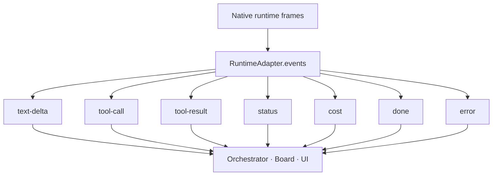

`@clawboo/executor` is the substrate that lets Clawboo drive five heterogeneous agent runtimes through one interface. It defines the `RuntimeAdapter` trait (the seam an adapter implements), the normalized `RuntimeEvent` union (the lifecycle stream every adapter emits), the `RuntimeRegistry` (the open set of available adapters), a single-consumer `AsyncQueue` primitive, the `runAdapterContract` test suite every adapter must pass, and the `./tiers` KV-cache prompt-assembly discipline. The package is pure — no workspace dependencies, no `node:*` imports — so it builds browser-safe and ships inlined into the CLI bundle.

This page explains the trait method by method, the seven-variant event union and the two runtime asymmetries it encodes in the types, the registry and queue primitives, the contract suite that keeps adapters honest, and the prompt-tier helpers. It is the executor's view of [the agent model](/concepts/agent-model): a Boo's `runtime` field names a runtime, and that runtime is reached through exactly this trait.

## What it is, and what it isn't

The trait answers one question: **how do you drive a black-box runtime through a uniform stream?** Clawboo's hot path is supervision, relay, and UI — it wraps runtimes, it does not reimplement their inner loops. An adapter is a thin wrapper that starts a run on its runtime and translates the runtime's native frames into `RuntimeEvent`s.

What the trait is *not*:

- **Not the dispatcher.** Claiming a task, provisioning a worktree, running verification, and recording the handoff belong to the [executor runner](/internals/executor-runner), which consumes adapters. The trait knows nothing about [the board](/concepts/the-board).
- **Not the registry of record.** The trait owns *how an agent runs*; *who exists* lives in [AgentSource](/internals/agent-source). An adapter never decides which Boos exist.
- **Not runtime-specific.** The five concrete runtimes (`openclaw`, `clawboo-native`, `claude-code`, `codex`, `hermes`) each ship their own `RuntimeAdapter`, but every consumer codes against the trait. Adding a sixth runtime is a new adapter, not a change to any consumer.

The package's barrel (`src/index.ts`) deliberately exports only the trait, the event union, the registry, the async queue, the integration plan, and the rotation helpers — never the contract suite, which imports a test runner. The contract suite lives under the `./contract` subpath so an app importing the main barrel never pulls vitest into its bundle.

## The trait

```ts
interface RuntimeAdapter {
  readonly id: RuntimeId
  readonly participantKind: ParticipantKind
  capabilities(): Capabilities
  health(): Promise<HealthResult>
  start(task: TaskHandle, opts: StartOpts): Promise<RunHandle>
  events(run: RunHandle): AsyncIterable<RuntimeEvent>
  abort(run: RunHandle): Promise<void>
  setModel(run: RunHandle, model: string): Promise<void>
  writeContext(run: RunHandle, key: string, value: string): Promise<void>
  readonly sessionCodec?: SessionCodec
  dispose?(): Promise<void>
}
```

### Identity: `id` and `participantKind`

`id` is a `RuntimeId` — an **open set**: `'openclaw' | 'claude-code' | 'codex' | 'hermes' | (string & {})`. The `(string & {})` escape hatch makes the union a list of autocomplete hints, not a closed enum, so a new runtime id is a value, not a type change.

`participantKind` is `'agent' | 'human'`. Today every adapter sets `'agent'`; nothing in the shipped code branches on this. It is a reserved seam so a person can later be a first-class task assignee, delegation target, or approver behind the *same* interface, without baking "executor == automated agent" into the trait.

<Info>
`participantKind: 'human'` is a future seam, not a shipped feature in v0.2.0. There is no human-participant adapter. The field exists so the trait, the board's assignee model, and the event stream don't have to be rewritten when one is added.
</Info>

### `capabilities()` — the declarative profile

`capabilities()` returns a `Capabilities` block describing what the runtime can do and how it composes with the host. The base flags are concrete runtime properties:

| Field | Type | Meaning |
|---|---|---|
| `streaming` | `boolean` | Emits incremental text deltas (vs. a whole message at turn end). |
| `mcp` | `boolean` | Can discover and call MCP tool servers. |
| `worktrees` | `boolean` | Runs work in isolated git worktrees. |
| `resume` | `boolean` | Can resume a prior session from a serialized handle. |
| `toolApproval` | `boolean` | Surfaces tool-approval gates the host must resolve. |
| `models` | `string[]` | Model ids the runtime can use (may be empty when unknown). |
| `contextWindowTokens?` | `number` | The context window, when known. Drives the proactive rotation watermark — omitted/0 leaves the watermark inert. |

On top of the base flags sits the **native-preservation seam** — a block of optional fields that let the host route a runtime to the right integration depth *by construction*, never by branching on a runtime id:

- `runtimeClass?: 'wrapped-oneshot' | 'connected-substrate' | 'native'` — how the runtime composes with the host. Omitted ⇒ `'wrapped-oneshot'` (the conservative spawn path).
- `nativeHome?: NativeHomeClaim` — a *claim* about the home dir the runtime accrues state in (`scope: 'per-identity' | 'per-run'`, `persist: boolean`). The adapter never computes a path — it states a claim and the host materializes the actual directory.
- `nativeSkills?` / `nativeMemory?: 'preserve' | 'none'` — whether the runtime's on-disk skills and memory survive across runs.
- `nativeChannels?: 'gateway' | 'none'` — whether the runtime owns its own delivery channels.
- `nativeScheduler?: boolean` — informational only; the host's scheduler always owns when-to-run for teammate dispatch.

Every native-preservation field is optional. A third-party adapter that omits the entire seam compiles unchanged and resolves to the conservative one-shot defaults — absence of a claim never preserves *and* never strips anything beyond what the plain one-shot path already does. The pure function that consumes this seam is `resolveRuntimeIntegration` (covered in [seams](/internals/seams) and used by [the runner](/internals/executor-runner)); the conceptual mapping of runtime → class lives in [the agent model](/concepts/agent-model#how-a-boo-relates-to-a-runtime).

<Note>
`runtimeClass` lives on the adapter's `Capabilities`, not on the runtime descriptor. The descriptor (`RUNTIME_DESCRIPTORS`) covers install and auth — package name, health binary, auth kind, the vault env var. The class is an *execution* property the adapter declares. They answer different questions: the descriptor is "how do I bring this runtime online?", the class is "how does the host drive it once it's online?".
</Note>

### `start()` and the late-bound `runId`

`start(task, opts)` delivers the run's opening message and returns a `RunHandle`:

```ts
interface RunHandle {
  readonly adapterId: string
  readonly sessionKey: string
  runId: string | null
}
```

`runId` is deliberately mutable and **late-bound**. A runtime usually does not return its run id synchronously from `start()` — it arrives on the first lifecycle frame — so callers begin with `runId: null` and read it once events flow. The `events()` implementation re-binds `run.runId` from the first frame of each run.

`TaskHandle` (`{ taskId?, teamId? }`) carries the optional board references, so an adapter can run board-backed *or* ad-hoc. `StartOpts` carries the runtime-side `agentId`, the `sessionKey`, the `message`, an optional `model` and `context` block, and a `childToolBlocklist` — tools a child run must not use (e.g. no recursive delegation). The blocklist is advisory for runtimes that can't restrict tools per-run; the host *also* enforces the real guarantee out-of-band, e.g. a board spawn-depth ceiling.

### `events()` — a continuous observer, not a one-shot generator

`events(run)` returns an `AsyncIterable<RuntimeEvent>` carrying the normalized lifecycle stream for `run.sessionKey`. The contract has one subtlety worth internalizing:

<Info>
`events()` is a **continuous observer** for long-lived sessions. A Gateway team session hosts many successive runs on one `sessionKey`; the stream keeps yielding across runs, and `done`/`error` are emitted as events but do **not** necessarily end the stream. The consumer terminates observation explicitly (`break` or `iterator.return()`), which releases the underlying subscription. For one-shot runtimes (a single CLI process) the stream naturally ends when the process exits. Either way, the *consumer* drives termination.
</Info>

This is why adapters subscribe eagerly — on the call to `events()`, not on the first `next()` — so frames emitted between subscription and the first pull are buffered rather than dropped. The OpenClaw adapter shows the canonical shape: it subscribes via `client.onEvent`, filters frames by `sessionKey`, re-binds `run.runId` from each frame, maps native frames to `RuntimeEvent`s, and only unsubscribes when the iterator's `return()` is called.

### Control: `abort()`, `setModel()`, `writeContext()`

The three side-effecting methods map onto the runtime's own controls:

- `abort(run)` cancels the live run. The OpenClaw adapter does a *two-tier teardown*: a surgical per-run `chat.abort` when a `runId` is bound, plus a heavier session-level `sessions.abort` backstop *always* — covering the runId-not-yet-bound race and any queued/pending work.
- `setModel(run, model)` switches the model mid-session.
- `writeContext(run, key, value)` writes a context file (e.g. updating an agent file).

### Optional members: `sessionCodec` and `dispose`

`sessionCodec` (optional) serializes a run's session to a blob and restores it — the resume primitive. `dispose` (optional) releases adapter-level resources. Both are absent on adapters that don't support them; the trait stays minimal and the host degrades gracefully.

## The RuntimeEvent union

Every adapter normalizes its runtime's native signals into one `RuntimeEvent` union, so the orchestrator, board, and UI consume a single stream and stay decoupled from per-runtime quirks. There are seven kinds:

```ts
type RuntimeEventKind =
  | 'text-delta'
  | 'tool-call'
  | 'tool-result'
  | 'status'
  | 'cost'
  | 'done'
  | 'error'
```

Each event carries a common envelope, `RuntimeEventBase`:

```ts
interface RuntimeEventBase {
  runId: string
  sessionId: string | null  // the runtime's session handle
  ts: number
  seq: number               // strictly increasing per-stream tiebreaker
}
```

`seq` matters: events that share a millisecond `ts` are ordered by this monotonic per-stream counter, so a consumer can always reconstruct causal order.



| Kind | Payload (beyond the base) | Notes |
|---|---|---|
| `text-delta` | `text`, `channel?: 'assistant' \| 'reasoning'` | Incremental assistant text; `channel` separates visible output from reasoning traces. |
| `tool-call` | `toolCallId`, `name`, `input`, `partial` | `partial: true` while the input JSON is still streaming. |
| `tool-result` | `toolCallId`, `name`, `output`, `isError` | The outcome of a tool call. |
| `status` | `phase: 'init' \| 'thinking' \| 'running' \| 'turn-complete'`, `model?`, `detail?` | A non-text lifecycle signal. |
| `cost` | `costUsd: number \| null`, `usage`, `model`, `estimated?` | Token usage plus USD when available. |
| `done` | `reason: 'success' \| 'max_turns' \| 'aborted' \| 'error'`, `summary`, `usage?`, `costUsd?` | Terminal summary for a single run/turn. |
| `error` | `code: string \| null`, `message`, `fatal` | A recoverable or fatal failure. |

### Two asymmetries encoded in the types

The union deliberately encodes two real runtime differences in the types rather than papering over them:

1. **Not every runtime reports USD cost.** `cost.costUsd` is `number | null`, and an `estimated?` flag marks a derived (non-authoritative) value. A runtime that can't supply USD emits `costUsd: null` rather than a fabricated number.
2. **Not every runtime emits incremental text.** A runtime without native deltas emits a single synthetic `text-delta` carrying the whole message, so streaming-unaware consumers still see one delta.

The package ships an exhaustiveness guard, `assertExhaustive(x: never): never`, for `switch` statements over the union — a new variant becomes a compile error at every switch that forgot to handle it.

## The registry

`RuntimeRegistry` is the open set of available adapters, keyed by id. It is a thin `Map` wrapper — `register`, `unregister`, `get`, `has`, `ids`, `list` — that mirrors the open-set philosophy: OpenClaw is the reference adapter today, and future adapters (or a human participant) register through the same interface. Like everything else here, the registry has no opinion about *which* adapters exist; the server wires concrete adapters in at boot.

## The async queue

Adapters bridge a callback event source (a WebSocket `onEvent`, a subprocess stdout reader) into an `AsyncIterable` by pushing into a `createAsyncQueue<RuntimeEvent>()` from the callback and letting the consumer pull via `for await`. The queue is single-consumer push/pull with one notable design choice:

<Note>
Backpressure is **drop-oldest** at a `max` (default 1000). Orchestration cares about tool-calls and `done`, not every text delta, so dropping the *stalest* buffered item if a consumer falls behind is safer than unbounded memory growth. A `close()` ends the stream; the iterator's `return()` closes the queue, which is what lets `events()` release its subscription on consumer termination.
</Note>

## The contract suite

Every `RuntimeAdapter` must pass one shared test suite: `runAdapterContract(harness)`. The adapter supplies a runtime-specific `AdapterTestHarness` — how to make the adapter, start a run, emit a native frame, and read recorded side-effects — and the generic suite drives a runtime-agnostic scenario through the adapter and asserts on the *normalized* output. The harness translates abstract `ContractFrames` (`delta`, `toolCall`, `final`, `aborted`, `error`) into the runtime's own transport frames.

The contract asserts the load-bearing properties of the trait:

- `id` is a non-empty string and `participantKind` is `'agent'` or `'human'`.
- `capabilities()` returns a well-formed shape (the base flags are the right types).
- `health()` resolves within two seconds.
- `start()` returns a handle with the adapter id and an **unbound `runId` (`null`)**.
- `events()` round-trips a normalized stream that ends in `done: success` with **monotonically increasing `seq`**.
- `runId` binds **late**, from the first lifecycle frame.
- `abort()` issues a cancel side-effect and the stream surfaces `done: aborted`.
- `setModel()` and `writeContext()` each issue the expected side-effect.

<Info>
The contract suite is exposed under the `@clawboo/executor/contract` subpath and `vitest` is kept **external** in the tsup config. If the runner were bundled, `@clawboo/executor/contract` would register its `describe`/`it` on a detached collector and the adapter's contract tests would silently never run. Keeping it external binds the suite to the *consumer's* vitest instance at runtime.
</Info>

The package itself ships a self-test: a minimal `InMemoryAdapter` that satisfies the *same* `runAdapterContract` suite the real adapters use. It proves the harness is sound independently of any runtime and doubles as the smallest reference implementation of the trait. All five real adapters import `runAdapterContract` from the contract subpath and run it against their own fake driver.

## The `./tiers` KV-cache primitives

The `./tiers` subpath is the prompt-assembly discipline — the rules every shipping harness converged on for keeping a provider's KV/prefix cache warm. It is generic, browser-safe (no `node:*`), and the seam each adapter assembles its prompt through.

A prompt has three tiers ordered by how often they change:

| Tier | Changes | Holds |
|---|---|---|
| `stable` | Frozen for the session | Identity, tool guidance, skills index — the cache anchor, rebuilt only on compaction. |
| `context` | Infrequently | Caller/system message, team manifest, project files. |
| `volatile` | Per turn | Memory snapshot, last handoff summary, a date-only timestamp. |

`assembleTiers(tiers)` joins them `stable → context → volatile` so the frozen content forms the cacheable head and only the volatile tail changes per turn — append, don't mutate the prefix. It returns the joined `prompt`, the `stablePrefix` (identical turn-over-turn), its byte length, and suggested `cacheBreakpoints` (byte offsets an Anthropic-style consumer maps to `cache_control` markers; OpenAI/OpenClaw ignore them).

Two helpers enforce the cache-stability rules:

- `sortToolDefs(defs)` sorts tool definitions by name, non-mutating. Tool-array order is a load-bearing cache key — an unsorted (or hash-map-ordered) list re-orders turn-to-turn and busts the cached tool-definitions prefix.
- `dateStamp(d)` returns a date-only `YYYY-MM-DD` (UTC) stamp. **Never** minute/second precision — a fine-grained timestamp in the prompt busts the KV prefix cache on every rebuild. If a runtime needs wall-clock time, expose it as a tool, never bake it into the cacheable prefix.

Byte length is measured with `TextEncoder` (the UTF-8 unit providers cache on), which is global in Node 22+ and every browser, keeping the module browser-safe.

The runner ([executor-runner](/internals/executor-runner)) assembles each run's prompt through `assembleTiers`, putting the worktree handoff into the volatile/context tier; the native runtime's conversation loop uses `dateStamp` for its date-only header.

## Session rotation

The package also ships the session-rotation helpers (`shouldRotate`, `buildRotationHandoffNote`, `rotateSession`, `DEFAULT_ROTATION`) — the model-agnostic answer to "the session ran out of room before the task finished." Rotation happens at the *run boundary*, not mid-generation, because the adapter owns the inner loop. The helper is pure and DB-free: it takes an adapter, a `restart` closure (the host re-assembles the prompt with a short structured handoff note and calls `adapter.start`), and an optional `recordRotation` callback for lineage/observability. `shouldRotate` fires on the context watermark (`tokensUsed / contextWindow >= thresholdPct`, default 0.85) — inert when the runtime reports no window, so a runtime without a context window stays byte-identical to pre-rotation behavior and only rotates on an explicit `max_turns`. `DEFAULT_ROTATION.maxRotations` (3) bounds the successor chain per task. The runner wires all of this into its drive loop; the mechanics live in [executor-runner](/internals/executor-runner).

## Design rationale and trade-offs

The trait exists to make "a teammate is a runtime" structurally true. By normalizing every runtime onto one event union and one control surface, the orchestrator, the supervisor, the UI, and the verification layer code against a single shape and never learn a runtime's quirks. The two type-level asymmetries (`costUsd: number | null`, synthetic `text-delta`) are the honest cost of heterogeneity — they push the difference into the types where a consumer must acknowledge it, rather than hiding it behind a lie.

The package is pure on purpose. With no workspace deps and no `node:*` imports, the trait and its primitives build browser-safe and inline cleanly into the CLI bundle; the *real* drivers (the WebSocket client, the subprocess spawner, the SDK) live in the adapter packages and the server, behind the seam. The contract suite is the enforcement mechanism: a new adapter is correct when it passes `runAdapterContract`, and the in-memory self-test proves the suite itself is sound.

The trade-off is indirection. Driving a runtime is two layers — the adapter and the runtime behind it — and a behavior change often touches an adapter's frame mapper rather than any consumer. The native-preservation seam adds another: capabilities are data the host turns into an integration plan, so getting a runtime's home/skills/memory right means getting its declared `Capabilities` right, not editing the runner.

## Boundaries and non-goals

- **The trait does not dispatch.** Claiming, worktrees, verification, budgets, and handoff are the runner's job. An adapter starts a run and yields events; it knows nothing about the board.
- **The trait does not decide who exists.** That is the registry of record (AgentSource). An adapter never creates or archives a Boo.
- **The contract suite is not in the app bundle.** It imports vitest and is reachable only through the `./contract` subpath, with vitest kept external.
- **`participantKind: 'human'` is a dormant seam.** No human-participant adapter exists in v0.2.0.
- **`./tiers` cache breakpoints are advisory.** They are suggestions for an Anthropic-style consumer; OpenAI auto-caches prefixes and the OpenClaw Gateway owns its own caching, so both ignore the breakpoints.

<Note>
This documents the **v0.2.0 working tree** (commit `03b206a`). The current npm `latest` is **`clawboo@0.1.9`**, so `npx clawboo` installs 0.1.9 until the v0.2.0 tag is published. Differences are noted in [Known Issues](/appendices/known-issues).
</Note>

## See also

- [The agent model](/concepts/agent-model) — what a Boo is and how it maps onto a runtime
- [The executor runner](/internals/executor-runner) — claim → worktree → run → verify → handoff, plus rotation and breakers
- [Seams](/internals/seams) — `resolveRuntimeIntegration` and the source multiplexers
- [AgentSource (internals)](/internals/agent-source) — the registry of record
- [Runtimes overview](/runtimes/index) — the five runtimes and the capability matrix
- [`@clawboo/executor` reference](/reference/packages/executor) — the full public API
- [Glossary](/appendices/glossary) — canonical term definitions
