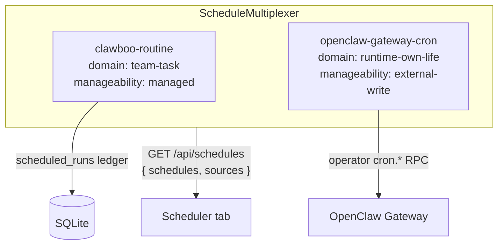

Clawboo has three "registry of record" seams that follow the same shape: a neutral record type, a per-source adapter trait, a multiplexer that fans the adapters into one stream, and a process-wide singleton that registers the concrete adapters. The first is [`AgentSource`](/internals/agent-source), *who exists*. This page covers the other two, which share `AgentSource`'s package shape but add a `read()` fan-in:

- **`CapabilitySource`**, what every runtime *can do*. Five per-runtime adapters project a `CapabilityRecord` stream; the [Ghost Graph](/using/ghost-graph) and the [Capabilities dashboard](/concepts/capabilities) both consume it.
- **`ScheduleSource`**, *when* work fires. Two adapters project a `ScheduleRecord` stream: Clawboo Routines (team-task cron) and the OpenClaw Gateway cron (a runtime's own-life cron).

Both seams encode the same discipline: `read()` never rejects (degradation is data), writes are owner-routed by an id prefix, and the UI plus the write path are a pure function of a per-record or per-source *manageability* tier; Clawboo may never offer an action the owning runtime forbids.

This page explains the seam shape, why a multiplexer over `AgentSource`'s `Map` registry, the manageability tiers, the two-domain split in the scheduler, and the invariants each seam is built to keep.

## What these seams are, and what they aren't

A seam is the line where Clawboo's neutral substrate meets a runtime's idiosyncratic reality. `CapabilitySource` and `ScheduleSource` are each a small, browser-safe, dependency-light package: the record types plus the trait plus the multiplexer, and a set of server-side concrete adapters that do the actual I/O. The packages know nothing about a Gateway, a Hermes home, or a SQLite path; the adapters know everything.

`@clawboo/capability-registry` is **browser-safe, zero runtime deps**; the SPA imports the record types to type the REST response, so the package mirrors `@clawboo/agent-registry`'s discipline of re-declaring small foreign types locally (`CapabilityAvailability` mirrors `@clawboo/db`'s `AvailabilityRequirement`) rather than taking a dependency. `@clawboo/scheduler` is the **only place in the monorepo that imports `croner`**; everything downstream deals in precomputed epoch-ms timestamps, so swapping the tick library changes exactly one file.

These seams are **read-and-route, not store**. They own no durable rows of their own. The capability projection is *persisted* by the server-side service into a `capabilities` table for disconnect tolerance, but that table is a cache of the merged read, not the source of truth; each adapter's backing store (the broker's `tool_registry`, a Hermes home's `SKILL.md` files, the Gateway config) remains canonical. The scheduler's Routines side projects over the `scheduled_runs` ledger; the Gateway-cron side projects over the live Gateway, owning nothing.

<Note>
All `@clawboo/*` packages are `private: true`. The seam packages ship to npm only by being inlined into the `clawboo` CLI bundle, never as standalone published artifacts.
</Note>

## The seam shape

All three seams instantiate the same five parts. `AgentSource`'s registry is a plain catalog, register one source, ask for it by id. The two seams here keep that catalog shape but make the registry a *multiplexer*: its job is the cross-source `read()` fan-in, not just a lookup.

| Part | `AgentSource` | `CapabilitySource` | `ScheduleSource` |
|---|---|---|---|
| Record type | `AgentRecord` | `CapabilityRecord` | `ScheduleRecord` |
| Trait | `AgentSource` | `CapabilitySource` | `ScheduleSource` |
| Registry / multiplexer | `AgentRegistry` (`Map` catalog) | `CapabilityMultiplexer` (`read()` fan-in) | `ScheduleMultiplexer` (`read()` fan-in) |
| Id composition | `source.id` | `${sourceId}:${rawKey}` | `${source}:${sourceScheduleId}` |
| Singleton | `getRegistry()` | `getCapabilityMultiplexer()` | `getScheduleMultiplexer()` |
| Concrete adapters | 2 (OpenClaw, native) | 5 (native, hermes, claude-code, codex, openclaw) | 2 (clawboo-routine, openclaw-gateway-cron) |

The trait is the same idea in both: a typed `id`, a `read()` that returns records plus a status, and a `write()` that throws a small set of typed errors. The composite id is the routing key; split it on the first `:` to recover the owning source, which is all a write needs.

```mermaid
flowchart TD
    subgraph cap["CapabilityMultiplexer.read()"]
        n[native source]
        h[hermes source]
        cc[claude-code source]
        cx[codex source]
        oc[openclaw source]
    end
    n & h & cc & cx & oc -->|"CapabilityReadResult\n{ records, status }"| merge[per-source try/catch fan-in]
    merge -->|"{ records[], sources[] }"| svc[loadCapabilities]
    svc -->|persist OK sources<br/>serve last-good for degraded| rest[GET /api/capabilities]
    rest --> graph[Ghost Graph]
    rest --> dash[Capabilities dashboard]
```

### read() never rejects; degradation is data

The load-bearing contract is that a source's `read()` returns degradation as a *value*, never as a thrown error. Each `read()` returns `{ records, status }`, where `status` is `{ sourceId, ok, degraded, reason?, at }`. A disconnected Gateway returns `[]` plus `{ ok: false, degraded: true, reason: 'gateway_disconnected' }`; the adapter does not throw. The multiplexer additionally wraps every `read()` in a per-source `try/catch`, so even a source that *violates* its own never-reject contract becomes a degraded status entry rather than taking the whole merge down. The result is that one dead source can never blank the inventory or the schedule list.

```ts
// CapabilityMultiplexer.read() — the fan-in is defensive on both ends.
for (const source of this.sources.values()) {
  try {
    const result = await source.read()
    records.push(...result.records)
    sources.push(result.status)
  } catch (err) {
    sources.push({ sourceId: source.id, ok: false, degraded: true, reason: String(err), at: Date.now() })
  }
}
return { records, sources }
```

The REST layer reads `{ records, sources }` and always returns `200`; the per-source degradation rides in the `sources` array. For capabilities, the server-side `loadCapabilities` goes one step further: it persists each *OK* source's records into the `capabilities` table (a source-scoped reconcile) and, for any *degraded* source, serves that source's last-good table rows. A Gateway that blips for one read still shows its tools, stale-but-present, instead of vanishing.

## Manageability: the write gate

The seam's purpose is to let Clawboo *observe* every runtime's capabilities and schedules while *managing* only what the owning runtime cedes. That line is drawn by a manageability tier, and the rule is strict: the UI and the write path are a pure function of the tier; neither may offer an action the owner forbids.

This is the one place the two seams diverge in shape, and the divergence is documented in the source itself.

**`ScheduleSource` carries manageability per source.** A source is uniformly `managed`, `external-write`, or `observe-only`, declared as a `readonly manageability` field on the trait. The multiplexer can therefore gate the write *before touching the source*: an `observe-only` source's write throws `UnsupportedScheduleWriteError` up front.

| Tier | Meaning | Schedule example |
|---|---|---|
| `managed` | Clawboo fully owns the rows | Clawboo Routines (the `scheduled_runs` ledger) |
| `external-write` | The runtime owns the store; Clawboo writes *through* its API | OpenClaw Gateway cron (via operator `cron.*` RPC) |
| `observe-only` | Clawboo can read but never write | *(no schedule source today)* |

**`CapabilitySource` carries manageability per record.** This is a deliberate deviation: a single adapter emits records of *mixed* manageability. The Hermes adapter, for instance, surfaces its `SKILL.md` skills *and* a rolled-up `observe-only` built-ins record from the same `read()`. So there is no `readonly manageability` on the capability trait; the gate is enforced upstream at the REST layer (resolve the target record → reject `observe-only` or non-`writable`) and defended again inside each `source.write()`.

| Tier | Meaning | Capability example |
|---|---|---|
| `managed` | Clawboo owns the durable row | brokered MCP tools, curated skills (native source) |
| `external-write` | The runtime owns the store; Clawboo writes through it | Codex's attached MCP servers |
| `runtime-of-record` | The runtime owns it; Clawboo drives changes through the runtime's API | OpenClaw `tools.allow`/`tools.deny` via `config.patch` |
| `observe-only` | Clawboo can read but never write | runtime built-ins, Hermes `SKILL.md`, attached MCP spine |

A record also carries a `writable` flag (default `true`). A source that emits a record it cannot *yet* write, an OpenClaw `runtime-of-record` MCP connector or plugin, whose `config.patch` toggle is a documented follow-up, sets `writable: false`. The dashboard then renders no dead Enable/Disable button. Because the `writable` column isn't persisted, the REST mapper *re-derives* it from the row's runtime characteristics when serving the degraded last-good path, so the gate stays a pure function of the record even when the live source is offline.

<Info>
The action set the UI shows and the write the REST layer allows are both derived from `manageability` (+ `writable`), never from a per-runtime literal in the panel. Add a runtime, declare its records' tiers, and the surface follows. This is why `observe-only` records always render "built-in, managed by &lt;runtime&gt;" with no action; the panel never special-cases a runtime name.
</Info>

## The five capability adapters

The capability seam is where the five-runtime asymmetry is most visible. Each adapter projects the same `CapabilityRecord` shape, but the *origin* and *manageability* of its records encode what Clawboo is actually allowed to do with that runtime.

| Source | What it reads | Manageability of its records | Can `write()`? |
|---|---|---|---|
| `native` | broker `tool_registry` (global tools), each native agent's MCP toggles, the per-agent `skills` table | `managed` (all three) | yes: install/enable/disable via the existing tool-broker pipeline |
| `openclaw` | Gateway `tools.allow`/`tools.deny`, `mcp.servers`, `plugins.entries` over the shared operator connection | `runtime-of-record` (tools/plugins/connectors); the clawboo MCP spine is `observe-only` | yes for `tools.*` via `config.patch`; MCP/plugin toggles are not writable yet |
| `hermes` | each per-identity home's `SKILL.md` files + `mcp.json` connectors | `observe-only` | no: Clawboo never writes a Hermes skills dir |
| `claude-code` | the clawboo MCP servers attached per run + Claude built-ins | `observe-only` | no: Claude runs against the user's real `~/.claude` |
| `codex` | the clawboo MCP servers (stdio attach) + Codex built-ins | `external-write`, status `manageable-but-pending-auth` | no: auth-blocked until `codex login`, home is ephemeral |

Two details are worth their own note because they capture invariants the rest of the system depends on:

- **The native source's curated-skill records carry the *agent's* runtime, not `clawboo-native`.** A curated catalog skill installed onto an OpenClaw agent is an honest Clawboo-managed annotation (it is exactly what the `TOOLS.md` bullet always was), so the record's `runtime` is the agent's while its `manageability` stays `managed`. The dashboard groups it under the agent's runtime; Clawboo still owns the write.
- **The OpenClaw source reuses the *shared* operator connection.** It is constructed with `getRegistry().source`, the same `OpenClawAgentSource` slice the agent registry holds, and never opens a second Gateway connection. Its `config.get`/`config.patch` calls ride that one connection; a `config.patch` carries the `{ raw, baseHash }` envelope OpenClaw 2026.5.x expects.

The native adapter's `write()` is the seam's only genuinely durable managed write, and it is deliberately *not forked* from the rest of the system: an install runs the existing supply-chain `scanForInjection` over the *whole* payload (name, skill content, and a connector's command/args/env) and writes the same `skills` table the `POST /api/skills` path writes, with the same `appendAudit` trail.

## The two schedule domains

The scheduler seam's invariant is captured by one field on `ScheduleRecord`: `domain`. There are exactly two cron *domains*, and conflating them is the mistake the seam exists to prevent.

- **`team-task`**, Clawboo's own scheduler for team work, the `clawboo-routine` source over the `scheduled_runs` ledger. It is the single external wake for *every* runtime class (native, the wrapped one-shots, and OpenClaw team tasks alike).
- **`runtime-own-life`**, a runtime's *own* standalone cron, the `openclaw-gateway-cron` source over the live Gateway. The Scheduler tab is an operator surface over these, not their owner.

There are deliberately only two sources. Claude Code, Codex, Hermes, and native have no live native scheduler of their own; scheduling them *is* a Clawboo Routine; and `hermes gateway` is never launched, so there is no third adapter to write.



The multiplexer's write gate enforces this domain split in order: unknown source → `UnknownScheduleError`; `observe-only` tier → `UnsupportedScheduleWriteError`; and a `team-task` *create* aimed at a `runtime-own-life` source → `TeamTaskDomainViolationError`. The Gateway-cron source *also* refuses a `team-task` create internally, so the domain rule is defended twice; Clawboo never registers a team task into a runtime's own scheduler.

### Refusals are data, surfaced as typed errors

The scheduler inherits the board's idiom that a refusal is *data, not an exception*; but the seam needs callers to branch structurally, so the data refusals are minted into typed errors carrying a `readonly code`. The REST layer maps each code to a precise status:

| Error (`code`) | REST status | Meaning |
|---|---|---|
| `InvalidCronSpecError` / `BoundRecurringScheduleError` / ZodError | `400` | malformed spec, or a recurring schedule bound to an already-claimable task |
| `UnknownScheduleError` | `404` | unknown composite id / unknown source |
| `DuplicateFiringOwnerError` / `IllegalScheduleTransitionError` | `409` | the one-firing-owner refusal, or an illegal routine-state transition, never retried |
| `TeamTaskDomainViolationError` | `422` | a team-task create aimed at a runtime-own-life source |
| `UnsupportedScheduleWriteError` | `403` | a write against an `observe-only` source |
| `ScheduleSourceUnavailableError` | `503` | the backing Gateway connection is down |

The **one-firing-owner** invariant is the scheduler's analog of the board's atomic claim. A board task carries a `scheduledBy` owner column; binding a Routine to a task whose `scheduledBy` is a *different* non-`'manual'` owner is refused at registration time with `DuplicateFiringOwnerError`. Like the board's 409 conflict, this refusal is never retried; it means another engine legitimately owns that task's cadence. A runtime's own-life cron is a different domain and never trips the guard.

The capability seam's error taxonomy is the smaller mirror: `UnknownCapabilityError` → `404` and `UnsupportedCapabilityWriteError` → `422`, with the canonical `unsupported()` helper that every `observe-only` source's `write()` raises.

## How a runtime dispatch chooses its path, without a switch

The scheduler seam's payoff shows up in the wake-bridge, the code that turns a Routine fire into a real dispatch. It must route a fire to the right execution path; but it does *not* switch on a runtime id. It reads the runtime's *integration plan* and branches on `resolveRuntimeIntegration(caps).home.kind`:

- a `persistent` or `ephemeral` home (native, the wrapped one-shots) → the standard executor runner, exactly as a manual `POST /api/runtimes/:id/run`;
- a `connected` home (OpenClaw) → a thin operator dispatcher over the shared Gateway connection.

A fire is *just another task dispatch* through the standard pipeline, so budgets, circuit breakers, verification, worktrees, and observability all apply. The capability seam and the runtime-integration seam compose here: the same capability declaration that tells the Capabilities dashboard "this runtime is `runtime-of-record` for its config" tells the wake-bridge "dispatch this fire over the connected path."

## Design rationale and trade-offs

**Why a multiplexer over `AgentSource`'s plain registry?** `AgentSource` answers "who exists" from a single source per phase; a `Map` catalog is enough. Capabilities and schedules are inherently *heterogeneous and partial*: five runtimes, two cron systems, any of which may be offline. The merged view is the product, so the registry's job becomes the fan-in: collect every source's `read()`, tolerate failures as status entries, and present one stream. Making this a multiplexer rather than a catalog is what lets the Ghost Graph and the dashboard both consume *one* query instead of five, and what makes a degraded source a visible-but-non-fatal condition.

**Why per-record manageability for capabilities but per-source for schedules?** The shape follows the data. A schedule source is uniform; every Routine is `managed`, every Gateway cron is `external-write`; so the cheaper per-source gate is honest. A capability adapter is not uniform: Hermes legitimately owns both an `observe-only` built-in and a `SKILL.md` it merely observes. Forcing a per-source tier there would either over-promise (offer to write a built-in) or under-promise (refuse to manage a managed skill). The per-record tier costs a `writable`-derivation in the REST mapper but keeps the gate truthful.

**Why dependency-light, browser-safe packages?** The record types cross the wire to the SPA, so the package that defines them cannot drag in a Gateway client, a SQLite driver, or `croner`. Re-declaring small foreign types locally (the `CapabilityAvailability` mirror, the local Gateway cron-shape codec) is the cost; the benefit is a type contract the browser can import directly and a `croner` blast radius of exactly one file.

## Boundaries and non-goals

- **Not stores.** The seams route and merge; they own no canonical rows. The capability `capabilities` table is a disconnect-tolerance cache of the merged read; the schedule sources project over the `scheduled_runs` ledger and the live Gateway.
- **Not a place to special-case a runtime.** The whole point is that the UI and write path are a pure function of `manageability` + `writable` (capabilities) or `manageability` + `domain` (schedules). A new runtime declares its records' or its source's tiers; nothing in the panel or the multiplexer learns its name.
- **Single implicit tenant today.** `CapabilityRecord.tenantId` and the schedule `tenantId` seam are dormant, always `null` in v0.2.0. The `'human'` `CapabilityRuntime` and the human-participant Routine (`NotImplementedError`) are reachable seams, not shipped features.
- **Some writes are follow-ups, not bugs.** OpenClaw MCP/plugin `config.patch` toggles and a durable Codex managed home are documented future work; those records are surfaced honestly as non-`writable` or `pending-auth` rather than offered with a dead button.

<Note>
This documents the **v0.2.0 working tree** (commit `03b206a`). The current npm `latest` is **`clawboo@0.1.9`**, so `npx clawboo` installs 0.1.9 until the v0.2.0 tag is published. Differences are noted in [Known Issues](/appendices/known-issues).
</Note>

## See also

- [AgentSource internals](/internals/agent-source): the first seam these two mirror
- [Capabilities](/concepts/capabilities): the concept-level view of the capability inventory
- [Scheduling](/concepts/scheduling): Routines, the ticker, and the error-halts policy
- [The board](/concepts/the-board): the atomic-claim idiom the one-firing-owner guard echoes
- [The executor runner](/internals/executor-runner): where a Routine fire becomes a real run
- [Schedules API](/reference/rest-api/schedules) · [Capabilities API](/reference/rest-api/capabilities): the REST surfaces over these seams
- [Glossary](/appendices/glossary): canonical term definitions
