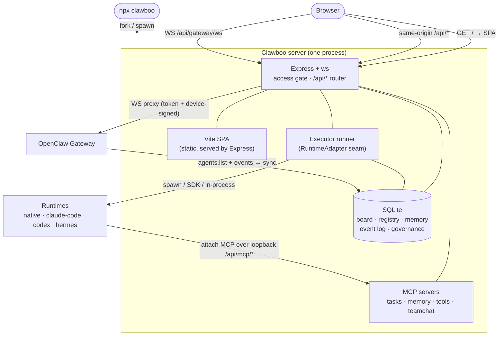

Clawboo is a single `npx clawboo` command that becomes a local mission-control dashboard for a fleet of AI agents. Under that one command sits a small, deliberate stack: a bundled Express server serving a Vite single-page app, a SQLite database that is the durable source of truth for task coordination, a uniform interface (`RuntimeAdapter`) that lets one orchestrator drive five different agent runtimes, four Model Context Protocol servers that those runtimes share, and an append-only event log that every visualization is a projection of.

This page is the 10,000-foot view. It walks each layer once: how a command launches a server, how the browser talks to it, where task state lives, how agents actually execute, and how the live graph is derived, and links into the concept deep-dives for each piece. If you want to understand *why* before *what*, start with [What is Clawboo](/intro/what-is-clawboo); if you want to run it, jump to [installation](/getting-started/installation).

## What it is, and what it isn't

Clawboo is a **local-first orchestrator**, not a hosted SaaS. The whole stack runs in one process on `127.0.0.1` by default: there is no cloud control plane, no account, no telemetry phoning home. The browser, the API, the database, and the agent-coordination spine all live on your machine.

It is an **orchestrator over runtimes**, not a runtime itself, except for one. Clawboo's job is to coordinate agents that run on engines like the OpenClaw Gateway, Claude Code, Codex, or Hermes, driving them all through a single interface. The one runtime it *owns* is `clawboo-native`, an in-process conversational harness that talks to provider SDKs directly so you can run a team with nothing but a pasted API key. See [the agent model](/concepts/agent-model).

It is **board-canonical**. The durable [board](/concepts/the-board) (SQLite) is the source of truth for task and coordination state. Chat is narration of that state; a runtime owns *how* an agent runs and *who exists* lives in the agent [registry of record](/appendices/glossary). No single subsystem owns everything; each layer below owns exactly one concern.

## The model

The whole system is one process; the CLI launcher hands off to a long-lived Express server that serves the SPA, fronts SQLite, and bridges to the runtimes.

Two execution paths reach the agents. OpenClaw runs ride the **live Gateway connection** the browser proxies through; the other four runtimes execute **server-side through the executor runner**. Both surface their outcomes onto the same board and the same event log.

## How it works

### 1. The CLI launches a server, then gets out of the way

`npx clawboo` is a thin launcher. It probes for an already-running dashboard (env var → a runtime port file at `~/.clawboo/api-port.txt` → a scan of `18790`–`18809`), and if it finds none it `fork`s the bundled server (`server.js`, sitting next to the CLI) in production mode, detached, and polls until the server writes its port. Then it opens your browser at the resolved URL and exits.

The port-discovery probe is signature-checked, not just a TCP test: the CLI does an HTTP `GET /api/settings` and confirms a Clawboo-shaped JSON response (`gatewayUrl` plus `hasToken`) before trusting a port, because the fallback range overlaps the OpenClaw Gateway's auxiliary ports and Chrome's remote-debugging port, which a naive TCP probe would mistake for the dashboard. The server resolves its own bind interface and port: it binds **loopback `127.0.0.1` by default** and picks the first free port from `18790` upward, so a fresh install is never network-exposed and never collides with whatever else you run on `:3000`. See [deployment](/operating/deployment).

### 2. The browser talks to the server, same-origin

The SPA is just static files Express serves; in production any unmatched `GET` falls through to `index.html` so client-side routing works. Every API call the SPA makes is a **same-origin relative path** (`fetch('/api/board')`, `fetch('/api/settings')`, …); there is no hardcoded backend host in the browser. That keeps the architecture portable: wherever the server is reachable, the SPA reaches it.

Sitting in front of every route is an optional **access gate**, active only when `STUDIO_ACCESS_TOKEN` is set. It folds the request path to lowercase before matching (so an uppercased `/API/settings` can't evade it), validates the token's character set, and, importantly, exempts a **loopback** `/api/mcp/*` request from the cookie requirement, because that path is the control plane a spawned runtime attaches to with its credentials scrubbed. A non-loopback bind with no token set triggers a loud security warning. See [security](/operating/security).

There is one non-HTTP path: the browser opens a WebSocket to the same-origin `/api/gateway/ws`, which the server proxies to the OpenClaw Gateway, injecting the upstream auth token and signing the device handshake server-side so the browser never holds a credential. That's the only way the browser reaches the Gateway. See [Gateway and events](/concepts/gateway-and-events).

### 3. The board is the durable source of truth

When a team delegates work, the work becomes a row in SQLite. The [board](/concepts/the-board), `tasks`, `task_deps`, `task_comments`, `workspaces`, `execution_processes`, is the transactional substrate for all coordination. An agent picks up work by **atomically claiming** a task (a single conditional `UPDATE` that exactly one concurrent caller can win; a lost claim is a `409` the caller never retries), a run is recorded as an `execution_processes` ledger row, and the outcome lands back on the board. Refresh the page, restart the server, or run a dozen agents against the one database file; the board survives all of it, with a WAL-based contention recipe and two startup/interval reconciliation passes that recover crashed and abandoned work.

SQLite is more than the board. The same database file is the agent [registry of record](/appendices/glossary) (synced from the Gateway), shared [memory](/concepts/memory), the [governance](/concepts/governance) ledger, and the observability [event log](/concepts/observability). There is **no migration ladder**; `createDb`'s inline `CREATE TABLE IF NOT EXISTS` DDL is the sole schema source, applied on every connection, so the file is immediately usable. A schema change is a hard reset, which is acceptable because all state is local and reproducible. See the [database schema](/reference/database-schema).

### 4. Runtimes execute through one seam, or over the live Gateway

A claimed task has to actually *run* somewhere. Clawboo drives every runtime through a single [RuntimeAdapter](/appendices/glossary) interface that emits a normalized [RuntimeEvent](/appendices/glossary) stream, so the orchestrator never branches on a runtime id. There are two execution paths:

- **The server-side executor runner** drives the four non-OpenClaw runtimes (`clawboo-native`, `claude-code`, `codex`, `hermes`). For each one it claims the task, opens an execution row, acquires an isolated git [worktree](/concepts/worktrees-and-handoff), assembles a cache-stable prompt, drains the adapter's event stream to a terminal `done`, then writes a report-up summary, drives the task status (through the builder-≠-judge [verification](/concepts/verification) gate), and clocks out an `AGENT_HANDOFF.json` so a different runtime can resume cold. The runner talks *only* through the adapter trait and an injected driver; it never assumes a runtime is a spawned process, so a future human-in-the-loop participant slots in behind the same seam. See the [executor runner internals](/internals/executor-runner).
- **The live OpenClaw Gateway connection** handles OpenClaw runs. OpenClaw is a *connected substrate*, not a CLI Clawboo spawns: its agents run in Gateway-owned workspaces, and runs ride the browser→proxy connection. The server-side executor runner explicitly refuses an OpenClaw task. Its event stream flows through the OpenClaw-specific **Bridge→Policy→Handler** pipeline that keeps the live fleet view in sync. See [Gateway and events](/concepts/gateway-and-events) and the [runtimes overview](/runtimes/index).

### 5. MCP servers are the shared spine

Different runtimes don't speak a common orchestration protocol, except through MCP. Clawboo hosts four [Model Context Protocol](/appendices/glossary) servers, **tasks, memory, tools, and teamchat**, over the same SQLite substrate, and every runtime attaches them. A `clawboo-native` agent connects in-process; a spawned CLI runtime attaches over the loopback `/api/mcp/*` control plane; OpenClaw attaches them through its Gateway config. This is how a Claude Code specialist reads the board, a Hermes agent saves a shared memory fact, and a Codex agent posts to the team room, all against the same data, regardless of where it runs. See [MCP servers](/operating/mcp-servers).

### 6. The event log projects the live graph

Every coordination action, a task created, a delegation routed, a run started, a cost recorded, is appended to one `orchestration_events` table. The server-side runner emits directly; the browser-observed OpenClaw stream is mirrored back via `POST /api/obs/ingest`. Every observability surface is then a **pure projection of that log**: the [Ghost Graph](/using/ghost-graph) you watch a team collaborate on is `projectGraph(events)` (served at `GET /api/obs/graph`); fleet-health triage, the per-mission trace view, and the cost overlay are other reducers over the same stream. Replaying the log reproduces the state; the graph is never hand-drawn, it is derived. See [observability](/concepts/observability).

## Design rationale and trade-offs

**One process, local-first.** Bundling the server, SPA, database, and MCP spine into a single `npx`-launched process is what makes "screenshot-shareable in five minutes" achievable: no infra to provision, no account to create. The cost is that scaling beyond one machine is not a turn of a config knob; the single SQLite data-access layer is the deliberate seam where a future SQLite→Postgres or multi-tenant move would land (the coordination, registry, and governance tables, 17 of the 27, already carry a dormant `tenant_id` column).

**Board-canonical over narration-only.** Making SQLite the source of truth for coordination buys durability (state survives a restart), race-freedom (the atomic claim), and recoverability (the reconciliation passes), at the cost of a second persistence layer beside each runtime's own session state. The alternative, treating a chat transcript as authority, can't be transactionally claimed, can't survive a refresh, and can't tell a crashed run from a slow one.

**One adapter seam over per-runtime code paths.** The `RuntimeAdapter` interface and the normalized event union mean the orchestrator, the board, and the observability log are written once and work for every runtime; a specialist on Claude Code and a leader on `clawboo-native` coordinate identically. The cost is that each new runtime must be wrapped to fit the seam, and permanent asymmetries (Hermes has no token stream; OpenClaw runs in its own sandbox) live in each adapter's declared capabilities rather than being papered over.

**MCP as the cross-runtime contract.** Rather than syncing a second board into each runtime's own coordination model (drift, double-dispatch, stale-claim races), Clawboo exposes its board/memory/tools/team-room as MCP servers and lets runtimes attach. The runtime stays a black box; the shared plane stays the single source of truth.

## Boundaries and non-goals

- **Not multi-machine in v0.2.0.** The stack is one local process. The `tenant_id` columns are a dormant seam, not active per-tenant scoping.
- **Not a hosted product.** There is no cloud control plane, no account system, and no remote management surface beyond binding to a non-loopback interface (which requires an access token and triggers a warning).
- **OpenClaw is special.** Four runtimes go through the uniform executor runner; OpenClaw is a connected substrate driven over a live WebSocket and refused by the runner, a deliberate asymmetry, not an inconsistency.
- **This is the overview, not the spec.** Each layer here has a concept page with the real mechanics, and a reference page with the exact routes, shapes, and defaults. Follow the links.

<Note>
This documents the **v0.2.0 working tree** (commit `4aabf2e`). The current npm `latest` is **`clawboo@0.1.9`**, so `npx clawboo` installs 0.1.9 until the v0.2.0 tag is published. Differences are noted in [Known Issues](/appendices/known-issues).
</Note>

## See also

- [What is Clawboo](/intro/what-is-clawboo): the positioning and the wedge
- [Why Clawboo](/intro/why-clawboo): differentiators vs running runtimes standalone
- [The agent model](/concepts/agent-model): Boo, Boo Zero, and the five runtime classes
- [The board](/concepts/the-board): the durable, transactional coordination substrate
- [Gateway and events](/concepts/gateway-and-events): the OpenClaw path and the Bridge→Policy→Handler pipeline
- [Observability](/concepts/observability): the event log and the Ghost Graph projection
- [Runtimes overview](/runtimes/index): the five runtimes and the capability matrix
- [MCP servers](/operating/mcp-servers): attaching the shared spine to a runtime
- [Installation](/getting-started/installation): `npx clawboo` and what it launches
- [Glossary](/appendices/glossary): canonical term definitions
