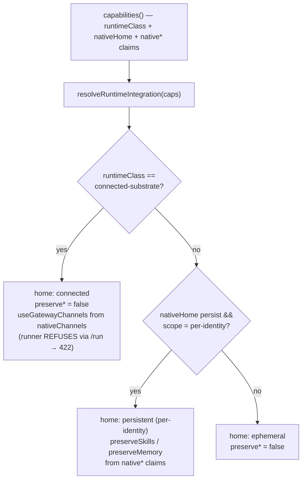

A [runtime](/appendices/glossary) is the engine that actually runs an agent. Clawboo supports five: `openclaw`, `clawboo-native`, `claude-code`, `codex`, and `hermes`, and drives each one through a single [RuntimeAdapter](/appendices/glossary) interface. That uniformity is the point: a [team](/appendices/glossary) can mix runtimes freely, and the orchestrator drives every one of them off the same normalized [RuntimeEvent](/appendices/glossary) stream. A specialist running on Claude Code, a leader running on `clawboo-native`, and an agent on the OpenClaw Gateway all coordinate through the same [board](/concepts/the-board), [memory](/concepts/memory), and [team chat](/concepts/peer-chat).

This page introduces the five runtimes, the three **runtime classes** that determine how the host integrates each one, and the full capability matrix, built directly from each adapter's `capabilities()` and the runtime descriptor.

## The five runtimes

| Runtime id | Name | What it is | Connection model |
|---|---|---|---|
| `clawboo-native` | Clawboo Native | An in-process conversational harness that talks to provider SDKs directly | Built in: paste a provider key, no Gateway, no install |
| `openclaw` | OpenClaw | An agent run by the external OpenClaw Gateway | A connected substrate driven over a live WebSocket connection |
| `claude-code` | Claude Code | The Claude Code agent SDK, spawned per run | External CLI Clawboo installs; head-less API key |
| `codex` | Codex | OpenAI's `codex exec` agent, spawned per run | External CLI Clawboo installs; interactive ChatGPT OAuth |
| `hermes` | Hermes | The Hermes agent CLI, spawned per run | External CLI Clawboo installs; head-less API key |

The four non-OpenClaw runtimes (`clawboo-native`, `claude-code`, `codex`, `hermes`) are declared in a single descriptor and reachable through `/api/runtimes`. OpenClaw is the fifth, handled separately because it is a connected substrate (see [runtime classes](#runtime-classes)), not a CLI/SDK Clawboo spawns and not a member of the `/api/runtimes` id set. Its lifecycle (Gateway install, device pairing, channels) lives on its own page.

<Note>
Each adapter declares `participantKind: 'agent'`. `'human'` is a reserved seam in the trait so a person could later be a first-class task assignee or delegation target behind the same interface; nothing branches on it in v0.2.0.
</Note>

## Runtime classes

Every runtime declares a `runtimeClass` that says how it composes with the host. The host routes a runtime to the right integration depth **by construction**: a pure function reads the runtime's declared capabilities and never branches on a runtime id. This is the [shared plane vs private plane](/concepts/teams-and-planes) boundary made mechanical.

- **`wrapped-oneshot`**: a per-run spawned worker. Clawboo installs the CLI (or, for `clawboo-native`, ships it inside the server), spawns it for one task, drains its events, and tears it down. `claude-code`, `codex`, and `hermes` are wrapped one-shots. A wrapped one-shot may still accrue durable state if it claims a persistent per-identity home (Hermes does).
- **`connected-substrate`**: a long-lived runtime the host drives over its existing live connection, rather than spawning. `openclaw` is the only connected substrate: runs ride the live Gateway session over the adapter's long-lived client. The server-side executor runner **refuses** a connected substrate before it claims a board task: `POST /api/runtimes/:id/run` would return `422` `connected_substrate`, because OpenClaw work is dispatched through the live Gateway path, not the one-shot runner. (And `openclaw` is not a `/api/runtimes` id, so that route 404s it first.)
- **`native`**: a host-native participant. `clawboo-native` is the only one: Clawboo *is* this runtime's substrate, so its private plane (persisted conversation transcripts) lives in a stable per-identity home the host materializes.

`resolveRuntimeIntegration` turns these claims into a plan with three home kinds: `persistent` (a per-identity dir that outlives the run), `ephemeral` (a throwaway per-run dir), or `connected` (no host-managed home; the substrate owns its own state entirely). The `preserveSkills` / `preserveMemory` flags are **clamped to a persistent home**; a runtime that claims `preserve` but only gets an ephemeral home degrades to the safe default rather than producing a contradictory plan. `coRunScheduler` is always `false`: the host's [scheduler](/concepts/scheduling) owns when-to-run, so a runtime's own cron (`nativeScheduler`) is informational and can never co-run for teammate dispatch.

## The capability matrix

Each adapter answers `capabilities()` with a fixed shape. The fields below come straight from each `capabilities()` body and the runtime descriptor.

### Execution capabilities

| Capability | `clawboo-native` | `openclaw` | `claude-code` | `codex` | `hermes` |
|---|---|---|---|---|---|
| `streaming` (incremental text deltas) | yes | yes | yes | yes | **no** |
| `mcp` (can call MCP tool servers) | yes | **no** | yes | yes | yes |
| `worktrees` (isolated git worktrees) | yes | **no** | yes | yes | yes |
| `resume` (resume a prior session) | yes | yes | yes | yes | yes |
| `toolApproval` (surfaces tool-approval gates) | yes | yes | yes | yes | yes |
| `contextWindowTokens` | 200000 |, | 200000 |, |, |
| `runtimeClass` | `native` | `connected-substrate` | `wrapped-oneshot` | `wrapped-oneshot` | `wrapped-oneshot` |

`streaming: false` on Hermes is a permanent asymmetry, not a missing feature: Hermes has no native token stream, so the host derives its lifecycle from the structured output instead. `mcp: false` and `worktrees: false` on OpenClaw reflect that OpenClaw agents run in Gateway-owned workspaces under OpenClaw's own sandbox; Clawboo never retargets a live OpenClaw agent's cwd, and OpenClaw attaches Clawboo's [MCP servers](/operating/mcp-servers) through the Gateway config rather than the adapter. `contextWindowTokens` drives the proactive session-rotation watermark; when it is omitted (or 0), rotation fires only on an explicit `max_turns` signal.

### Native-preservation seam

These claims tell the host which native powers each runtime carries, so it can decide what to materialize and what to preserve across runs.

| Claim | `clawboo-native` | `openclaw` | `claude-code` | `codex` | `hermes` |
|---|---|---|---|---|---|
| `nativeHome.scope` | `per-identity` | *(omitted)* | *(omitted)* | `per-run` | `per-identity` |
| `nativeHome.persist` | `true` |, |, | `false` | `true` |
| `nativeSkills` | `none` | `preserve` | `none` | `none` | `preserve` |
| `nativeMemory` | `preserve` | `preserve` | `none` | `none` | `preserve` |
| `nativeChannels` | `none` | `gateway` | `none` | `none` | `none` |
| `nativeScheduler` | no | yes | no | no | yes |

How those claims resolve through `resolveRuntimeIntegration`:

- **`clawboo-native`**: `home: persistent (per-identity)`, `preserveMemory: true`. Clawboo materializes a stable per-identity home and its persisted conversation transcripts survive and resume across dispatches. No native skills dir (capabilities ride the shared [tools broker](/concepts/capabilities)), no channels (the shared spine is its only voice).
- **`openclaw`**: `home: connected`. The Gateway owns its own state dir entirely, so the host provisions and preserves nothing; `preserveSkills`/`preserveMemory` resolve to `false` because there is nothing host-managed to keep. `useGatewayChannels` is `true` (`nativeChannels: 'gateway'`); OpenClaw's own channels and cron are runtime-native and the host never serves or co-runs them.
- **`claude-code`**: `home: ephemeral`. A stateless wrapped one-shot: the cognition is the model, no durable cross-run substrate exists to preserve. `nativeHome` is omitted, so the SDK runs against the user's real HOME / Keychain auth.
- **`codex`**: `home: ephemeral`. The driver mkdtemps a throwaway `CODEX_HOME` each run. Because `nativeHome` is `per-run` (not `per-identity`), the preserve flags clamp to `false`. (A known limitation: Codex keeps its ChatGPT OAuth in `$CODEX_HOME/auth.json`, so a user's `codex login` against `~/.codex` is invisible to spawned runs; see [Codex](/runtimes/native).)
- **`hermes`**: `home: persistent (per-identity)`, `preserveSkills: true`, `preserveMemory: true`. The Hermes self-improvement loop compounds in one stable home per identity: self-created skills, `MEMORY.md`, and `state.db` accrue across runs.

### Models

| Runtime | `models` declared by `capabilities()` |
|---|---|
| `clawboo-native` | `['claude-haiku-4-5', 'claude-sonnet-4-6', 'gpt-4o-mini', 'gpt-4o']` (routable surface, not exhaustive; `AgentConfig` picks the model; any provider-supported id works) |
| `openclaw` | `[]` (the Gateway resolves models from its own config) |
| `claude-code` | `['sonnet', 'opus', 'haiku']` |
| `codex` | `['gpt-5-codex', 'gpt-5', 'o4-mini']` |
| `hermes` | `[]` (provider-defined; Hermes resolves models via its own provider config) |

An empty `models` array does not mean "no models"; it means the list is owned elsewhere (the Gateway config for OpenClaw, Hermes's own provider config for Hermes).

## How a runtime is wired

Each non-OpenClaw runtime is a pure [RuntimeAdapter](/internals/runtime-adapter) constructed with a per-run driver factory: the adapter wraps a black-box runtime and the factory supplies the real driver (the Claude Agent SDK, `codex exec`, the `hermes` CLI, or the in-process native harness). The adapters live in dependency-light packages that import only `@clawboo/executor`; the real subprocess/SDK drivers live server-side so the browser bundle never sees them. All five adapters are always available; actual usability depends on install and credential state at run time, not on a flag.

Health for the CLI runtimes is "the binary resolves", checked via `resolveRuntimeBin`, which probes `PATH` **and** the well-known user-install dirs (so a Hermes binary in the Python user-site bin reads healthy even though that dir is usually off the server's PATH). Native health is "any routable provider key (or `OLLAMA_BASE_URL`) resolves", no binary, no network call.

## Boundaries and non-goals

- **OpenClaw is not a `/api/runtimes` runtime.** It is a connected substrate driven over the Gateway. Its routes 404 on the runtimes API and it is refused by the one-shot runner. Manage it through the [system API](/reference/rest-api/system), not the runtimes API.
- **Clawboo does not reimplement runtime loops.** Each adapter wraps the runtime as a black box and normalizes its native signals into `RuntimeEvent`s. Clawboo supervises, relays, and coordinates on the [shared plane](/concepts/teams-and-planes); it does not own the runtime's inner turn loop.
- **`nativeScheduler` never co-runs.** A runtime can ship its own cron, but the host's scheduler always owns when-to-run for teammate dispatch. The claim is informational only.
- **No conversion between runtimes.** A runtime's agents are not migrated, exported, or "collapsed into native." The runtimes are co-equal peers.

<Note>
This documents the **v0.2.0 working tree** (commit `4aabf2e`). The current npm `latest` is **`clawboo@0.1.9`**, so `npx clawboo` installs 0.1.9 until the v0.2.0 tag is published. Differences are noted in [Known Issues](/appendices/known-issues).
</Note>

## See also

- [Connecting runtimes](/runtimes/connecting-runtimes), install, connect, disconnect, the encrypted vault
- [Clawboo Native](/runtimes/native) · [OpenClaw](/runtimes/openclaw) · [Claude Code](/runtimes/claude-code) · [Codex](/runtimes/codex) · [Hermes](/runtimes/hermes)
- [The RuntimeAdapter trait](/internals/runtime-adapter), the interface every runtime implements
- [Teams and planes](/concepts/teams-and-planes), the shared-plane / private-plane boundary `runtimeClass` resolves
- [The executor runner](/internals/executor-runner), claim → worktree → run → verify → handoff, and the connected-substrate refusal
- [`/api/runtimes` reference](/reference/rest-api/runtimes), full request/response shapes
- [Glossary](/appendices/glossary), canonical term definitions
