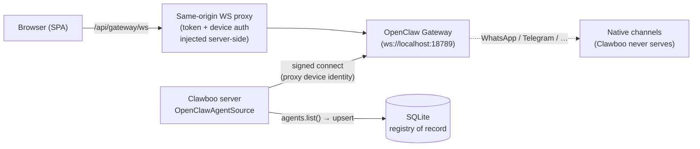

Use this page to bring the **OpenClaw** [runtime](/appendices/glossary) online. Unlike the other four runtimes, OpenClaw is **not a CLI you install**; it is a *connected substrate*. Clawboo connects to a running **OpenClaw Gateway** (a WebSocket server that hosts OpenClaw agents), syncs the Gateway's agent list into SQLite as the [registry of record](/appendices/glossary), and drives chat over that long-lived connection. There is no per-task subprocess to spawn.

This is why OpenClaw is connected and managed differently from `claude-code`, `codex`, `hermes`, and `clawboo-native`; those are CLIs Clawboo installs and runs per task (see [Connecting runtimes](/runtimes/connecting-runtimes)). OpenClaw has its own state directory, its own scheduler, and its own external messaging channels; Clawboo coordinates with it, it does not run it.



## Prerequisites

<Note>
OpenClaw is a separate project. Clawboo connects to an OpenClaw Gateway you run locally; it does not bundle OpenClaw. The onboarding wizard's OpenClaw path can install, configure, and start one for you, or you can point Clawboo at a Gateway you already run.
</Note>

- An OpenClaw Gateway, reachable over WebSocket (default `ws://localhost:18789`). The Clawboo server connects to the URL stored in [settings](/reference/configuration) (`gatewayUrl`).
- The Gateway's auth token. Clawboo's onboarding writes one into OpenClaw's `~/.openclaw/.env` as `GATEWAY_AUTH_TOKEN` and mirrors it into Clawboo's `settings.json` (`gatewayToken`).
- Node.js (Clawboo's prerequisite). The install step runs `npm install -g openclaw@^2026.5`, so `npm` must be on `PATH`.
- For OpenClaw **2026.5.x and later**: a one-time **device pairing approval**, see [Device pairing](#device-pairing-not_paired).

## How OpenClaw connects

There are **two** connections to the Gateway, and they exist for different reasons.

### The browser connection (same-origin proxy)

The browser never talks to the Gateway directly. The SPA opens a WebSocket to the Clawboo server's own `/api/gateway/ws` endpoint, and the server proxies it upstream to the Gateway. The proxy is what injects the auth token and signs the Ed25519 device-auth connect frame **server-side**, so the browser never sees the credential. WS upgrades to any path other than `/api/gateway/ws` are dropped (`socket.destroy()`).

This is the runtime/execution path: the chat stream (`chat.send`, `chat.abort`), session control (`sessions.abort`, `sessions.patch`), and live config patches ride this browser→proxy→Gateway connection.

### The server connection (OpenClawAgentSource)

The Clawboo server opens its **own** Gateway connection, the `OpenClawAgentSource`. This is the *registry of record* leg: it calls `agents.list()` and mirrors the result into SQLite so the fleet list, agent files, and team membership survive the Gateway being down. Reads (`listAgents`, `getAgent`, `listTeams`) come from SQLite and work offline; writes, file I/O, and live sessions delegate to the Gateway and require a live connection.

A headless Node connection can't use the browser's `crypto.subtle` device-auth path, so the server reuses the **already-paired proxy device identity** (`~/.clawboo/proxy-device-identity.json`) to sign its connect frame via the gateway-client `signConnect` hook. Two details are load-bearing here, both confirmed against OpenClaw 2026.5.x:

- The server connects with `client.id` = `cli` (the Gateway validates `client.id` against a fixed allowlist; a custom id like `clawboo-server` is rejected and the socket closes with code `1008`).
- The server presents an `Origin` of the gateway host (`http(s)://<gateway-host>`). A headless Node WebSocket sends no `Origin` by default, which the Gateway rejects with `CONTROL_UI_ORIGIN_NOT_ALLOWED`; Clawboo injects the `ws` package's WebSocket (which honours a custom `origin`) to satisfy the check.

<Info>
If the server connection is down, reads still serve SQLite (the agent list renders, flagged `stale: true`), but writes 503. `GET /api/agents` returns `{ defaultId, mainKey, agents, stale, lastSyncedAt }`; agent-file `GET`/`PUT` and session reads return `503 { "error": "gateway_disconnected" }`. See [Agents API](/reference/rest-api/agents).
</Info>

## Channels

OpenClaw can connect to external messaging channels (WhatsApp, Telegram, and the like) and runs its own cron/heartbeat scheduler. These are the runtime's *private plane*; Clawboo never serves a channel and never co-runs the Gateway's scheduler. The OpenClaw adapter declares this in its capabilities: `nativeChannels: 'gateway'`, `nativeScheduler: true`, `nativeSkills: 'preserve'`, `nativeMemory: 'preserve'`. Clawboo's [Routines](/concepts/scheduling) schedule *team-task* work, a different domain from OpenClaw's own-life cron, so the two never conflate.

## Steps

The OpenClaw onboarding path runs these from the wizard, but each maps to a `/api/system/*` route you can also drive directly. See the [System API](/reference/rest-api/system) for full shapes.

### 1. Detect

`GET /api/system/status` reports whether OpenClaw is installed, the Gateway is running, and Node is sufficient:

```json
{
  "node": { "version": "v22.x.x", "major": 22, "sufficient": true, "path": "…" },
  "openclaw": { "installed": true, "version": "2026.5.x", "path": "…", "stateDir": "~/.openclaw", "configExists": true, "envExists": true },
  "gateway": { "running": true, "port": 18789, "pid": 12345, "managedByClawboo": true, "uptimeMs": 9000 }
}
```

`gateway.running` is true when a managed PID is alive **or** the port probes reachable. When the Gateway is running and `~/.openclaw/.env` exists, the handler syncs the `.env` token into Clawboo's settings as a side effect.

### 2. Install (optional)

`POST /api/system/install-openclaw` is a Server-Sent Events stream that runs `npm install -g openclaw@^2026.5`. The version is pinned to the `^2026.5` range deliberately: the gateway-client advertises connect protocol `minProtocol: 3, maxProtocol: 4`, and pinning the install keeps a fresh user on a protocol-compatible OpenClaw until that range is widened.

| Event `type` | Payload | Meaning |
|---|---|---|
| `progress` | `{ step, message }` | Phase marker |
| `output` | `{ line }` | A line of npm output |
| `error` | `{ code, message }` | `EACCES`, `SPAWN_THROW`, or `EXIT_<code>` |
| `complete` | `{ success: true, version }` | Install finished |

<Warning>
A global npm install can hit `EACCES`. The stream emits an `error` event with code `EACCES` and a `sudo` hint. Prefer a Node version manager (nvm/fnm) or Homebrew over `sudo`.
</Warning>

### 3. Configure

`POST /api/system/configure-openclaw` with body `{ provider, apiKey?, model?, gatewayPort? }` writes OpenClaw's `openclaw.json` and `.env`, generates a Gateway token, and saves Clawboo's settings. `provider` is required; `apiKey` is required for every provider except `ollama`. The handler writes a local-mode Gateway config (`gateway.mode: 'local'`, token auth via `${GATEWAY_AUTH_TOKEN}`), enables agent-to-agent tooling (`tools.agentToAgent.enabled: true`, `tools.sessions.visibility: 'all'`), and resolves a default model from the provider.

```json
{ "ok": true, "gatewayUrl": "ws://localhost:18789" }
```

The raw token is never returned in the body; it is persisted server-side, and the same-origin proxy injects it on connect.

### 4. Start the Gateway

`POST /api/system/gateway` with body `{ action }` controls the Gateway process. `action: "status"` and `action: "stop"` return JSON; `action: "start"` and `action: "restart"` are SSE streams that spawn the Gateway detached, poll until the port is reachable (up to 60s), sync the token, and reconnect the server-side `OpenClawAgentSource`. An unknown `action` returns `400`.

| `action` | Response | Notes |
|---|---|---|
| `status` | JSON `{ running, pid, port, uptimeMs }` | Quick liveness check |
| `stop` | JSON `{ ok, stopped }` | Stops the managed process |
| `start` | SSE | Spawns + polls + reconnects the source |
| `restart` | SSE | Stops, waits, then starts |

### 5. Connect (and pair the device)

Once the Gateway is reachable, the SPA connects through `/api/gateway/ws`. On a fresh OpenClaw 2026.5.x install the first connect fails with `NOT_PAIRED`; proceed to the next section.

## Device pairing (NOT_PAIRED)

OpenClaw **2026.5.x and later** dropped auto-pair-on-first-connect. A new device lands in OpenClaw's pending list, and every connect attempt rejects with a structured error until a human approves it:

```
GatewayResponseError { code: 'NOT_PAIRED', message: 'pairing required: device is not approved yet' }
```

The SPA branches on `err.code === 'NOT_PAIRED'` in three places: the connect screen, the onboarding `StartGatewayStep`, and the bootstrap auto-reconnect, and swaps in a **DevicePairingApproval** card. The card's "Approve this device" button hits `POST /api/system/approve-device`, which performs a two-step shell-out against the OpenClaw CLI:

1. `openclaw devices approve --latest` runs in **preview** mode: it prints `Approve this exact request with: openclaw devices approve <UUID>` and exits non-zero. Clawboo regex-extracts the UUID from the captured stdout/stderr.
2. `openclaw devices approve <UUID>` performs the actual approval.

On success the SPA auto-retries the original connect with the same URL and token, and the connection completes.

| Status | When |
|---|---|
| `200 { ok: true, requestId, output }` | Device approved |
| `400 { error: "OpenClaw not installed" }` | No `openclaw` binary found |
| `404 { error: "No pending device pairing requests found", details }` | The preview emitted no requestId |
| `500 { error: "Failed to approve device: …" }` | The approval command failed |

<Tip>
Power users can pair from a terminal instead: `openclaw devices approve --latest` to see the requestId, then `openclaw devices approve <UUID>`. The DevicePairingApproval card surfaces this manual fallback too.
</Tip>

## Why OpenClaw can't be run by the per-task executor

The other four runtimes execute a board task by spawning a one-shot process: claim the task, provision a worktree, run the CLI/SDK, report up. OpenClaw is a **connected substrate**; its runs ride the live Gateway session over the server's long-lived connection, so the one-shot executor runner refuses it **by construction**, before any board mutation:

- The OpenClaw adapter's `capabilities()` declare `runtimeClass: 'connected-substrate'` (and `worktrees: false`).
- `resolveRuntimeIntegration(caps)` maps that class to `home.kind === 'connected'`.
- The executor runner checks this *before the atomic claim* and returns `{ ok: false, reason: 'connected_substrate' }`, which the REST layer maps to `422`. The refusal landing pre-claim is the point: a misrouted run never touches the board.

There is a second wall in front of it: `/api/runtimes/:id/run` only accepts the four non-OpenClaw runtime ids (`isRuntimeId` excludes `openclaw`), so calling it with `openclaw` returns `404 { "error": "unknown runtime 'openclaw'" }`. OpenClaw's team work flows through its live session and the board orchestration over the Gateway connection, not through the per-task runner.

## Global memory scope

When the server-side connection comes up, `OpenClawAgentSource` registers Clawboo's shared **Memory** and **Tasks** [MCP](/appendices/glossary) servers into the Gateway's top-level `mcp.servers` config (each as `{ url, transport: 'streamable-http' }`), so OpenClaw agents can read and write the one shared team memory. This is **idempotent**; it reads the current config, skips the patch when both servers are already registered with the right URLs (so the per-reconnect re-apply can't burn the Gateway's 3-writes-per-60s control-plane budget), and a stale config is re-merged on reconnect.

Two scoping facts follow from the Gateway config being process-wide:

- **Memory is registered at GLOBAL scope for OpenClaw.** The other four runtimes get a *per-run team scope* baked into their attach URL; a single static Gateway-config URL can't carry a per-run team binding, so an OpenClaw agent's memory facts are team-unscoped. This is an organizational boundary for the local-first single-user model, not a security one.
- **TeamChat is deliberately NOT registered for OpenClaw.** A process-wide static URL can't carry a per-run author binding, and registering the `team_chat` tool unbound would let an OpenClaw agent post as any author (identity from tool args), breaking the anti-spoof property that the [peer-chat](/concepts/peer-chat) room depends on. Instead, an OpenClaw agent's room participation is fully server-mediated through the team exchange, which posts the agent's drained turn under the authoritative bound identity.

## Verify it worked

- `GET /api/agents/registry/health` (always `200`) reports the source `connection`; it should read `connected` with a recent `lastSyncedAt`.
- `GET /api/agents` should return your OpenClaw agents with `stale: false`.
- `GET /api/system/status` should show `gateway.running: true`.
- Send a message in group chat; the run streams over the same-origin proxy connection.

## Troubleshooting

<Warning>
**Connect rejects with `NOT_PAIRED`.** Expected on OpenClaw 2026.5.x's first connect. Click "Approve this device" (or run `openclaw devices approve --latest` then `openclaw devices approve <UUID>` in a terminal), then retry. See [Device pairing](#device-pairing-not_paired).
</Warning>

<Warning>
**Agents render but writes 503.** The fleet list reads from SQLite, so it survives the Gateway being down; agent-file writes and live sessions need the connection. `GET /api/agents` will show `stale: true` and the registry health `connection` will be `disconnected` / `reconnecting`. Start the Gateway (`POST /api/system/gateway { "action": "start" }`) and the source reconnects.
</Warning>

<Danger>
**`POST /api/runtimes/openclaw/...` returns `404`.** OpenClaw is not a `/api/runtimes` runtime; only `claude-code`, `codex`, `hermes`, and `clawboo-native` are. Drive OpenClaw through `/api/system/*` and `/api/gateway/ws`, not the runtime install/connect/run routes.
</Danger>

## Related

- [Connecting runtimes](/runtimes/connecting-runtimes), the CLI runtimes (different connection model)
- [Runtimes overview](/runtimes/index), the capability matrix
- [Gateway and events](/concepts/gateway-and-events), the Gateway flow and the Bridge→Policy→Handler pipeline
- [AgentSource](/internals/agent-source), the registry-of-record sync internals
- [Memory](/concepts/memory), the shared Memory-MCP tier
- [Peer chat](/concepts/peer-chat), why TeamChat is server-mediated for OpenClaw
- [System API](/reference/rest-api/system) · [Agents API](/reference/rest-api/agents), full request/response shapes
- [Glossary](/appendices/glossary), canonical term definitions
