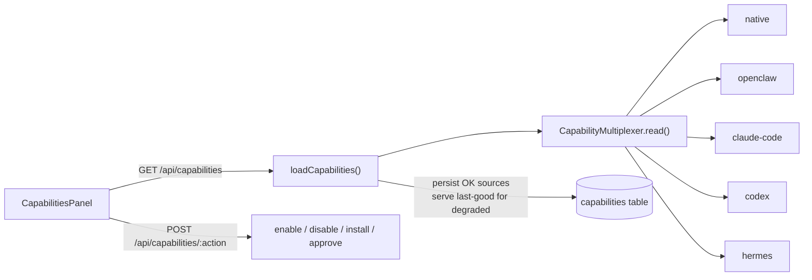

Use this page when you want to see every skill, tool, and connector across all your [runtimes](/appendices/glossary) in one place, understand why a tool is greyed out, and turn the manageable ones on or off.

The dashboard is the human-facing surface over the unified **capability inventory**, the same merged stream the Ghost Graph reads. It groups every runtime's capabilities by runtime, then by kind, and renders a per-row action set that is a pure function of the row's manageability tier: the UI can never offer an action the owning runtime forbids. The panel is `CapabilitiesPanel`, backed by `GET /api/capabilities` and `POST /api/capabilities/:action`.

## Prerequisites

<Note>
The Capabilities nav button is always visible; the inventory subsystem is always on. What it shows depends on which runtimes you have connected and what skills you have installed.
</Note>

- At least one runtime to read capabilities from. `clawboo-native` is built in and always contributes rows; connecting `openclaw`, `claude-code`, `codex`, or `hermes` adds their capabilities. See [Connecting runtimes](/runtimes/connecting-runtimes).
- Nothing else: reads are non-destructive, and a disconnected source degrades to its last-known rows rather than blanking the inventory.

## Where it lives

Open the **Capabilities** entry in the left sidebar's nav list (the puzzle-piece icon). It sits in the secondary nav alongside Board, Runtimes, Memory, and Governance. There is no Cmd/Ctrl number shortcut for this view.

The header shows a live count pill (`N capabilities · M runtimes`) and a **Refresh** button. The diagnostics drawer elsewhere in the app can also deep-link here with a runtime pre-selected.

## How to read the inventory

### Groups: runtime → kind

Rows are grouped by the runtime that **owns** the capability, in a fixed order (`clawboo-native`, then `openclaw`, `claude-code`, `codex`, `hermes`, `human`). Each group header shows the runtime label and a count. Within a group, rows sort by kind, then alphabetically by name.

There are three kinds, each with its own icon:

| Kind | What it is | Icon |
|---|---|---|
| `skill` | A curated skill annotated onto an agent | puzzle piece |
| `tool` | A brokered MCP tool or a runtime built-in | wrench |
| `connector` | An attached MCP server / external connector | plug |

When more than one runtime contributes capabilities, a row of filter pills appears above the groups: **All runtimes** plus one pill per runtime. Click a pill to narrow the view to a single runtime.

### Availability badges

Every row carries a `StatusPill` derived from the record's availability and status:

| Pill | Tone | Meaning |
|---|---|---|
| `Ready` | success | Available and on |
| `Disabled` | idle | Available but currently off |
| `Pending auth` | warning | Real and manageable, but blocked on auth (e.g. a Codex connector until `codex login`) |
| `Unavailable` | idle | Its availability requirement is unmet (greyed) |

An **unavailable** row is rendered greyed (reduced opacity plus a grayscale filter) because its declarative availability requirement, an auth credential, a config value, an env var, or a plugin, is not satisfied. The server evaluates availability into `available` plus a `diagnostics` list; an unavailable row never offers an Enable/Disable button, so the action set reads consistently with the greyed presentation.

### Manageability-derived actions

The action on the right of each row is a pure function of the row's **manageability tier**, never a per-runtime literal in the UI:

| Manageability | Who owns the store | Dashboard action |
|---|---|---|
| `managed` | Clawboo owns the durable row (brokered tools, curated skills) | **Enable** / **Disable** by current status |
| `external-write` | The runtime owns the store; Clawboo writes through it (e.g. Hermes `mcp.json` / `SKILL.md`) | **Enable** / **Disable** by current status |
| `runtime-of-record` | The runtime owns it; Clawboo drives changes through the runtime's API (e.g. OpenClaw config) | **Enable** / **Disable**, only if the source can actually write it |
| `observe-only` | Clawboo can read but never write (built-ins, external-vendor CLIs) | none: `built-in, managed by <runtime>` |

A few rows look manageable by tier but still render no button, by design:

- An **observe-only** row shows `built-in, managed by <runtime>` with a lock or eye-off icon and no action.
- An **unavailable** (greyed) row offers no action even if its tier is managed; its requirement is unmet.
- A `runtime-of-record` row whose owning source can't yet write it (the source sets `writable: false`, e.g. an OpenClaw connector or plugin whose `config.patch` write is a follow-up) renders no dead button.
- A `manageable-but-pending-auth` row renders a **disabled** Enable button carrying the source's hint; for a Codex connector the hint is `pending auth — run \`codex login\``.

<Note>
The dashboard's per-row action set is intentionally Enable/Disable only. Installing a skill lives in the [Marketplace](/using/marketplace), and approving a tool call flows through the tool-approval queue embedded at the top of this panel (see [Approvals](/using/approvals)). The full managed action set is satisfied across those surfaces, not duplicated here.
</Note>

## Steps

### Enable or disable a capability

1. Open **Capabilities** from the sidebar.
2. Find the row. Use a runtime filter pill or scroll to its group.
3. Confirm the action is offered: the row has an **Enable** (mint) or **Disable** (neutral) button. If it shows `built-in, managed by <runtime>`, it is observe-only and cannot be changed here.
4. Click the button. The row goes busy (a spinner replaces the action icon) while `POST /api/capabilities/enable` (or `/disable`) runs with `{ id }`.
5. On success the panel refreshes and re-reads the inventory, so the pill flips (`Disabled` ↔ `Ready`).

If the action is rejected, for example a `422` because the row is observe-only or not writable, a toast surfaces the typed error, and the inventory is **not** refreshed because nothing changed.

### Refresh / handle a degraded source

- Click **Refresh** in the header to re-read every source.
- If a source is degraded (a disconnected Gateway, a missing runtime home), a warning banner names the source and its reason, and the dashboard shows that source's **last-known** capabilities rather than dropping them. Reconnect the source, then Refresh.

## How it's wired

`GET /api/capabilities` accepts optional `runtime`, `kind`, `scope`, and `agentId` query filters and returns one merged view `{ records, sources }`. The service fans the source adapters, persists each healthy source's rows (source-scoped reconcile), serves last-good rows for any degraded source, and de-dupes fresh-wins by id. The browser client treats a failed fetch as `ok: false` so a total failure reads as an error with a Retry, not as an empty inventory.

`POST /api/capabilities/:action` handles `enable`, `disable`, `install`, and `approve`. The server re-resolves the target row and gates `enable`/`disable` the same way the UI does: an observe-only or non-writable row returns `422`; a missing row returns `404`. The `approve` action reuses the existing tool-approval handshake; there is no second approval path.

## Options / variations

| Variation | Effect |
|---|---|
| Runtime filter pill | Narrows the view to one runtime (or **All runtimes**) |
| `GET /api/capabilities?runtime=&kind=&scope=&agentId=` | Server-side filtering for programmatic reads |
| Refresh | Re-reads every source and re-evaluates availability |
| Degraded-source banner | Shows last-known rows for a source that failed to read |

## Verify it worked

- After an Enable/Disable, the row's pill flips between `Ready` and `Disabled` and the header count is unchanged.
- A direct `GET /api/capabilities` returns the row with the updated `status`.
- A rejected action raises a toast and leaves the inventory untouched; that is the expected response when you try to act on an observe-only or non-writable row.

## Troubleshooting

<Warning>
**A tool is greyed and `Unavailable`.** Its availability requirement is unmet. The greying reflects a missing auth credential, config value, env var, or plugin; connect the runtime or provide the credential, then **Refresh**. The row offers no action until it becomes available.
</Warning>

<Warning>
**A Codex connector shows `Pending auth` with a disabled Enable button.** Codex connectors are real and manageable but blocked until you run `codex login` locally. The button's hint carries the exact command. See [Connecting runtimes](/runtimes/connecting-runtimes).
</Warning>

<Danger>
**An OpenClaw connector or plugin has no Enable/Disable button.** Some OpenClaw `runtime-of-record` rows are read-only in the dashboard (their `config.patch` write is a follow-up); the source marks them non-writable so the UI never shows a dead button. The Gateway `tools.allow`/`deny` surface is the writable runtime-of-record one.
</Danger>

## Related

- [Capabilities (concept)](/concepts/capabilities), the inventory model and manageability tiers
- [`/api/capabilities` reference](/reference/rest-api/capabilities), full request/response shapes
- [Connecting runtimes](/runtimes/connecting-runtimes), bring runtimes online so they contribute capabilities
- [Marketplace](/using/marketplace), install curated skills
- [Approvals](/using/approvals), the tool-approval queue embedded in this panel

## See also

- [Ghost Graph](/using/ghost-graph), reads the same capability stream as per-agent skill nodes
- [Runtimes](/runtimes/connecting-runtimes)
- [Glossary](/appendices/glossary)
