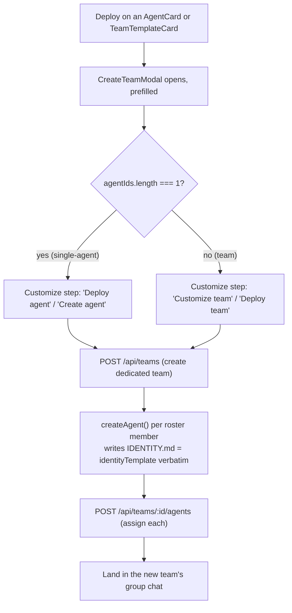

Use this page when you want to add agents to your fleet: either one specialist at a time or a pre-wired [team](/appendices/glossary). The **Marketplace** is a static, committed catalog of 304 agents, 82 teams, and 30 skills you can browse offline and deploy with two clicks.

The catalog itself never changes at runtime; it is codegen'd from upstream MIT-licensed repos at pinned commits (see [Marketplace catalog reference](/reference/marketplace-catalog)). What this page covers is the dashboard surface that browses it: the three tabs, the search and filter controls, the detail modals, and the two deploy paths. The UI is `MarketplacePanel`; deploying funnels into the same team-create + agent-create pipeline documented in [Teams](/using/teams).

## Prerequisites

<Note>
The Marketplace is browsable with no Gateway and no runtime connected; it is a static catalog rendered entirely client-side. **Deploying** an agent or team requires a connected runtime (Clawboo Native or OpenClaw) so the new [Boo](/appendices/glossary) records can actually be created.
</Note>

- A connected runtime to deploy into: see [Connecting runtimes](/runtimes/connecting-runtimes) or the [Native quickstart](/getting-started/quickstart-native).
- Nothing to install. The catalog ships inside the dashboard bundle.

## Where it lives

Open the Marketplace from the **Marketplace** nav button (shopping-cart icon) in the left sidebar, or press **Cmd/Ctrl + 2**. The panel fills the content area with a toolbar (the three tab toggles + sort), a filter bar, and a responsive card grid.

The panel opens on the **Agents** tab by default. The toolbar shows all three tab toggles with live counts: `Skills (30)`, `Agents (304)`, `Teams (82)`. Each tab keeps its own search query and filters, so switching tabs never loses your place.

## The three tabs

| Tab | Count | What it lists | Default? |
|---|---|---|---|
| **Agents** | 304 | Individual `AgentCatalogEntry` records, one specialist each | yes |
| **Teams** | 82 | Pre-wired `TeamTemplate`s (a roster of agents + routing) | no |
| **Skills** | 30 | `CatalogSkill` entries you can install onto an existing agent | no |

### Agents tab

The default view. Each agent renders as an `AgentCard` showing its mascot avatar, name, role, a source badge, a colored domain pill, a category label, a two-line description, and a stats line (`N skills • in N teams`). Two buttons: **Details** (opens the detail modal) and **Deploy** (creates the agent in a dedicated team).

### Teams tab

Each team renders as a `TeamTemplateCard` showing its emoji, name, agent count, a source badge, an optional amber **Synthetic** pill (for the 30 codegen'd "Excellence Team" partitions), a category label, the description, and the agent roles in the roster. Buttons: **Details** and **Deploy**.

### Skills tab

Each skill renders as a `SkillCard` with a category dot, a source badge (`Verified` / `Clawboo Marketplace` / `skill.sh` / `Local`), a trust-score bar (mint ≥ 80, amber ≥ 50, red below), the author and version, and an **Install** button. When a skill is used by catalog agents, a `Used by N agents` link appears that cross-jumps to the Agents tab pre-searched on that skill name.

<Note>
Installing a skill is different from deploying an agent. **Install** appends the skill to an *existing* agent in your fleet (you pick the target from a dropdown); it `POST`s to `/api/skills`, which injection-scans the entry before recording it. Deploying an agent or team *creates new Boos*.
</Note>

## Search and filters

Each tab has its own search box and filter pills. Search is a case-insensitive substring match; it never hits the network.

| Tab | Search matches | Filter pills |
|---|---|---|
| Agents | name · role · description · tags | **Domain** (one pill per agent domain present, e.g. Engineering, Marketing, Design) + **Source** |
| Teams | name · description · tags | **Category** (only categories with ≥ 1 team) + **Source** |
| Skills | name · description · tags | **Category** (Code / File / Web / Comm / Data / Other) + sort dropdown (Name A–Z · Trust Score · Category) |

The **Source** filter (shared by Agents and Teams) has four options:

| Source pill | Meaning |
|---|---|
| All | no source filter |
| Clawboo | hand-written first-party entries |
| Agency Agents | from the `agency-agents` upstream |
| Awesome OpenClaw | from the `awesome-openclaw` upstream |

Filters compose with search: the result set is `search(query)` then narrowed by the active domain/category pill and the active source pill. When nothing matches, the grid shows an empty state with a **Clear filters** button that resets that tab's search and pills.

## The detail modals

Both **Details** buttons open a modal you can dismiss with **Escape** or the close button.

### Agent detail (the zero-loss identity view)

`AgentTemplateDetail` shows the agent's avatar, name, role, source/domain/category badges, the full description, a source-attribution link, **clickable skill chips**, **"Appears in N teams" chips**, and, the payoff, the agent's **full `identityTemplate` rendered as Markdown**, labeled *"Full source from \<source\>, preserved verbatim."*

This is the zero-loss guarantee made visible: every catalog entry stores its complete original source spec (not a summary), and that exact text is what lands in the agent's `IDENTITY.md` when you deploy. You read the entire spec before committing.

The chips are cross-reference shortcuts:

- Clicking a **skill chip** jumps to the Skills tab, pre-searched on that skill.
- Clicking a **team chip** jumps to the Teams tab, pre-searched on that team.

A **Deploy** button at the bottom runs the same single-agent deploy as the card.

### Team detail

`TeamTemplateDetail` shows the team's emoji, name, source badge, category, description, source-attribution link, an optional expandable **Workflow** narrative, and the **full roster**: each agent with its avatar, role, parsed skills, and parsed `@`-mention routing (so you can see who delegates to whom before deploying). It also has a **Deploy** button.

## Deploy

Both deploy paths open the same `CreateTeamModal` and end at the same team-create + agent-create pipeline. The difference is how many agents land and how the modal is labeled.

### Deploy a single agent

Click **Deploy** on an `AgentCard` (or in the agent detail modal). Clawboo wraps that one agent into an adhoc one-agent `TeamTemplate` (id `adhoc-<agentId>`) and opens `CreateTeamModal`. The modal detects single-agent mode by shape (`agentIds.length === 1`) and relabels the Customize step; the title reads **"Deploy agent"** and the confirm button reads **"Create agent"**, and the pick step is skipped.

The deploy loop is otherwise identical to a team deploy: it always creates a dedicated team for that one agent, then creates the agent inside it. (A single-agent deploy is just a one-member team.)

### Deploy a team

Click **Deploy** on a `TeamTemplateCard` (or in the team detail modal). `CreateTeamModal` opens pre-filled with the template's name, emoji, and color, skipping the pick step. The Customize step lets you rename/recolor; the confirm button reads **"Deploy team"**. On confirm it:

1. `POST`s `/api/teams` to create the team (with a client-minted UUID so the preview palette matches the deployed team).
2. Calls `createAgent()` for each roster member, writing the verbatim `identityTemplate` to that Boo's `IDENTITY.md`.
3. `POST`s `/api/teams/:id/agents` to assign each new Boo to the team.

When the modal finishes, Clawboo selects the new team and opens its **group chat** so you can use it immediately. See [Teams](/using/teams) for managing the team afterward (leaders, rules, color collections).

## Verify it worked

- After a deploy, the dashboard switches you into the new team's group chat. The team appears in the team sidebar and the [Ghost Graph](/using/ghost-graph).
- Open the agent in the fleet; its **IDENTITY.md** should contain the same source text you saw in the agent detail modal.
- After a skill **Install**, a success toast confirms it, the skill appears on the agent in the [Capabilities dashboard](/using/capabilities-dashboard) and on the Ghost Graph, and the `Used by N agents` count on the skill card reflects it.

## Troubleshooting

<Warning>
**Deploy fails with a name collision.** Team deploy creates Boos by name; if your fleet already has an agent with that exact name, the runtime can reject the create. The deploy step surfaces the error with a "Continue anyway" escape. Rename the conflicting agent, or deploy into a fresh fleet.
</Warning>

<Warning>
**A skill install returns an error toast.** `POST /api/skills` injection-scans every entry first. A destructive / exfiltration / prompt-injection finding blocks the install with a `422` (the toast shows the finding), and the block is recorded in the governance audit log. This is the supply-chain guard; it is intentional, not a bug.
</Warning>

<Note>
**Counts won't change after deploy.** The `Skills (30)` / `Agents (304)` / `Teams (82)` toolbar counts are the *catalog* size, not your fleet. They are fixed; deploying does not grow them.
</Note>

## See also

- [Teams](/using/teams): manage a team after you deploy it (leaders, rules, color collections)
- [Ghost Graph](/using/ghost-graph): see the deployed agents and their routing
- [Capabilities dashboard](/using/capabilities-dashboard): where installed skills surface
- [Agents](/using/agents): edit a deployed agent's SOUL / IDENTITY / TOOLS / AGENTS files
- [Marketplace catalog reference](/reference/marketplace-catalog): agent/team schemas, sources, pinned SHAs, ingestion mechanism
