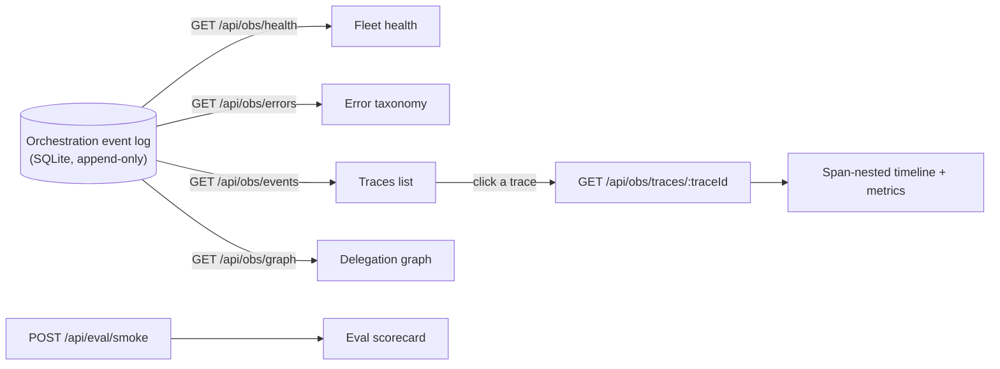

Use this page when you want to see what your agents actually did: the cost and token spend of a multi-agent task, why an agent stopped, which agents are stalled, and how the smoke evals score the harness. Everything here reads from the durable orchestration **event log** — an append-only stream that the panel folds into projections. Replaying the same log always reproduces the same view, so the dashboard cannot drift from reality.

The whole surface is the **Observability** panel (`ObsPanel`), backed by the `/api/obs/*` routes. Observability is always on — there is no feature gate to enable, and the handlers serve unconditionally.

## Prerequisites

<Note>
There is nothing to configure. The Observability nav view is always present. The data is empty until agents run board tasks — run a [team](/using/teams) or a [board](/using/board) task first, then come back.
</Note>

- A team that has executed at least one board task (delegation, tool calls, cost). A fresh install with no runs shows empty states everywhere.
- Nothing to install — the panel ships in the Clawboo server.

## Where it lives

Open the **Observability** view from the secondary nav in the left sidebar (the `Activity` icon). It is one of the dashboard nav views; unlike the `Cmd`/`Ctrl`+1–6 quick-nav slots (graph, marketplace, approvals, scheduler, cost, system), Observability has no keyboard shortcut — reach it via the nav button.

The panel is two columns:

- **Left column** (fixed width) — three stacked sections: **Fleet health**, **Error taxonomy**, and the **Traces** list.
- **Right column** — the **Eval scorecard** at the top, then the selected **Trace** with its metrics bar and span-nested timeline, then the **Delegation graph**.

A **Refresh** button in the header re-fetches everything; the panel also auto-refreshes every 5 seconds.

## Steps

### 1. Read the traces list and open one

A **trace** groups every event that shares a `traceId` — the full multi-agent task, from the leader through its specialists down to individual tool calls. The panel derives the **Traces** list from the recent event feed (`GET /api/obs/events?order=desc&limit=300`), showing the newest traces first with an event count and timestamp, capped at 40 entries.

Click a trace to open it. The panel fetches `GET /api/obs/traces/:traceId` (all events for that id, ordered causally by `seq`), and renders two things in the right column:

- **A metrics bar** computed from the trace's events:
  - **cost** — total USD for the run
  - **tokens** — input → output token counts
  - **tok/min** — output tokens per minute over the observed window
  - **tools** — total tool calls
  - **tool err** — failed tool results / total tool results, shown as a percentage (amber when above 0%)
- **A span-nested timeline** — each event indented by its span depth, following the `span_start` → `parentSpanId` chain. A child task's run nests visually under its parent's. Errors render in the accent color, span markers in mint, cost events in amber.

<Tip>
The metrics are reconciled per run: a runtime that reports cost only at completion (no mid-run `cost` event) still shows the real total, because the metrics take the larger of the summed `cost` events and the final `execution_completed` total. So OpenClaw runs (no incremental cost) and native runs (per-turn cost) both read correctly.
</Tip>

### 2. Triage the fleet

The **Fleet health** section (`GET /api/obs/health`) projects each agent into the Gastown triage taxonomy. An agent with an **open** execution (started but not completed) is:

| Status | Meaning | Pill tone |
|---|---|---|
| `working` | A recent event landed | working (mint) |
| `stalled` | No event for over 5 minutes while an execution is open | warning (amber) |
| `zombie` | No event for over 30 minutes while an execution is open — the process is almost certainly dead | error (red) |
| `idle` | No open execution | idle |

Each row shows the agent id, an open-run count, the status, and the agent's spend. A `zombie` is what orphan reconciliation will reap on the next server boot.

### 3. Scan the error taxonomy

The **Error taxonomy** section (`GET /api/obs/errors`) groups `error` events by their class and counts them, sorted by frequency. Clawboo classifies every runtime/tool failure into a fixed set of expected classes:

`InvalidArgs` · `Timeout` · `ProviderError` · `RateLimited` · `UserAborted` · `UnexpectedEnv` · `Unknown`

The classifier matches the error's code and message against ordered rules. Anything that matches none is `Unknown` — and `Unknown` is treated as a **harness bug**: it is flagged in the panel (an accent-colored badge plus a "harness bug" label) and counted in the section header (`N bugs`). The Cursor doctrine here is that an unrecognized failure is a defect in Clawboo's own error handling, not a normal runtime hiccup, so it should alert rather than be swallowed.

The error feed is also the agent-readable "what errored in the last window" query — pass `?since=<ms>` to scope it, or `?harnessBug=true` to return only the harness bugs.

### 4. Follow the delegation graph

The **Delegation graph** section (`GET /api/obs/graph`) is the event-sourced projection of the task graph: task nodes (with status and cost), `delegation` edges (a parent task spawned a child), and `dependency` edges (a task is blocked on another). The legend distinguishes the two edge kinds — a solid arrow for delegation, a dimmed arrow for dependency. Each row reads `source → target  kind`. This is the same projection that drives the live overlay on the [Ghost Graph](/using/ghost-graph).

### 5. Run the smoke evals

The **Eval scorecard** at the top of the right column has a **Run smoke evals** button. Clicking it sends `POST /api/eval/smoke` and renders the real `SuiteReport`.

This runs the deterministic `SMOKE_TASKS` suite — the exact subset CI runs — with **no live model, no API keys, no executor, and no network**. Each trial executes against an ephemeral temp-dir SQLite board, so your real `clawboo.db` is never touched and nothing pollutes the Board / Fleet / Observability views. The body accepts `{ trials?, k? }`, both clamped to `[1, 3]` so the route can never become a load generator; the scorecard calls it with `{ trials: 1 }`.

The report renders:

- **pass@1** — fraction of tasks where at least one trial succeeded
- **pass^k** — fraction where all `k` trials succeeded
- **k** and **tasks** counts
- A per-task table: task id, suite (`capability` / `regression`), kind (`coding` / `research` / `coordination`), per-task pass@1, and mean score.

Below the live report is the **Ablation** card. It renders the `±verifier × ±structured-state` marginal-contribution scorecard as a **shape, explained, not run** — a `CI only` pill marks it. The four variants (`full`, `−verifier`, `−structured`, `none`) and the two contribution rows (`verifier`, `structured-state`) are listed with em-dash placeholders. The full ablation (4 variants × N trials with a live-model judge) runs only in CI, never from this button.

### 6. Watch the live activity terminal

The same event log feeds a live **activity terminal** — `ActivityTerminal`, a console that backfills the recent window (`GET /api/obs/events`) then live-tails the SSE stream (`GET /api/obs/stream`). It renders tool calls, tool results, errors, cost, and lifecycle events for every runtime uniformly, with a `Live` / `Reconnecting` pulse, tabular timestamps, and expandable tool I/O. It is mounted at three scopes:

| Scope | Where | Filter |
|---|---|---|
| Per-task | The **Activity** section of the task drawer ([the board](/using/board)) | `taskId` |
| Per-agent | The **Activity** tab in [agent detail](/using/agents) | `agentId` |
| Global | The Atlas **Activity** dock — a right-edge slide-in toggled by the `Activity` button on the [Ghost Graph](/using/ghost-graph) toolbar (Atlas scope only) | none (all teams) |

<Note>
The OpenClaw runtime is observed in the browser, so its `tool_call` / `tool_result` / `error` events never reach the server's event log on their own. The browser mirrors them through `POST /api/obs/ingest`, which is restricted to exactly those three kinds — board lifecycle events are always emitted server-side and are never accepted from the browser. This is what makes the terminal uniform across runtimes.
</Note>

## Options and variations

The read endpoints share a query vocabulary:

| Query param | Routes | Effect |
|---|---|---|
| `teamId` | `events`, `health`, `graph`, `stream` | Scope to one team |
| `taskId` | `events`, `stream` | Scope to one task |
| `agentId` | `events`, `stream` | Scope to one agent |
| `traceId` | `events` | Scope to one trace |
| `kinds=a,b,c` | `events` | Comma-separated event kinds |
| `since=<ms>` | `events`, `errors`, `stream` | Wall-clock cutoff (ms epoch); on `stream`, a resume cursor |
| `afterSeq=<n>` | `events` | Cursor on the monotonic `seq` |
| `limit=<n>` | `events` | Row cap |
| `order=asc\|desc` | `events` | Causal (`asc`) or newest-first (`desc`) |
| `harnessBug=true` | `errors` | Only harness bugs (`Unknown` class) |

The SSE stream (`GET /api/obs/stream`) is a short-interval DB-tail on the `seq` cursor. `EventSource` reconnects automatically and resumes from the last `seq` via its `Last-Event-ID` header (or `?since=`). Each event's `data` is redacted before it reaches the browser — credential-shaped keys and values are masked, while numeric cost and token fields survive.

## Verify it worked

- Open Observability with at least one completed board task. The header badge reads `N tasks · M agents` instead of `event log`.
- Click a trace — the right column shows the metrics bar (non-zero cost/tokens for a real run) and the indented timeline.
- The Fleet health section lists your agents with a status pill. A finished run reads `idle`.
- Click **Run smoke evals** — the scorecard fills with `pass@1` / `pass^k` and the per-task table within a second or two. (If it fails, the panel shows "Smoke run failed — check the server log.")

## Troubleshooting

<Warning>
**Everything is empty.** The panel only shows what is in the event log. A fresh install, or a server that has never executed a board task, has nothing to project. Run a team task first.
</Warning>

<Warning>
**An agent reads `zombie` but I think it's fine.** `zombie` means no event landed for over 30 minutes while an execution was still open — the process is almost certainly dead. If the work genuinely finished, the missing `execution_completed` event is the real problem; the next server boot's orphan reconciliation will release the task.
</Warning>

<Tip>
**A harness-bug count above zero is a signal, not a crash.** An `Unknown` error class means Clawboo's taxonomy did not recognize a failure. Open the trace, read the error message, and report it — it is a gap in Clawboo's error handling, by design surfaced rather than hidden.
</Tip>

## See also

- [Observability](/concepts/observability) — the event log, projections, and builder≠judge model
- [`/api/obs` reference](/reference/rest-api/observability) — full request/response and SSE event shapes, plus `/api/eval/smoke`
- [Events and errors reference](/reference/events-and-errors) — every orchestration event kind and the error taxonomy
- [The board](/using/board) — per-task activity and execution ledger
- [Ghost Graph](/using/ghost-graph) — the live graph overlay sourced from the same projection
- [Agents](/using/agents) — the per-agent Activity tab
