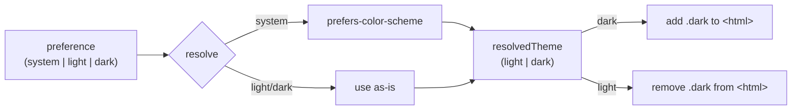

Use this page when you want to switch the dashboard between **light**, **dark**, and **system** (follow-the-OS) themes, or when you need to understand where the preference is stored and why fresh installs open in light mode.

The toggle lives in the bottom-left of the sidebar. There is no API behind it — theming is entirely client-side: a single class on the `<html>` element flips the CSS-variable palette, so switching is instant with no rebuild and no page reload.

## Prerequisites

<Note>
Theming needs nothing connected. The toggle works on the very first screen, before you connect a [runtime](/appendices/glossary) or deploy a team, because the preference lives in the browser, not on the server.
</Note>

- A browser with `localStorage` (every modern browser). The preference is stored per origin, so two ports — for example a dev server on `:5173` and the bundled server on its API port — keep independent theme settings.

## Steps

### 1. Find the theme toggle

Open the dashboard. The toggle (`ThemeToggle`) sits at the bottom of the left sidebar (`AgentListColumn`), below a divider, under the navigation buttons. It renders a Lucide icon, the current preference label, and — when you are on **System** — the resolved theme in small uppercase to its right.

| Current preference | Icon | Label | Right-side hint |
|---|---|---|---|
| Light | Sun | `Light` | — |
| Dark | Moon | `Dark` | — |
| System | Monitor | `System` | `light` or `dark` (whatever the OS resolves to) |

### 2. Click to cycle

The toggle is a single button that cycles through the three preferences in a fixed order on each click:

```
light → dark → system → light → …
```

The button's tooltip (and `aria-label`) always names what the next click will do — for example *"Theme: Light. Click for Dark."*, or on System *"Theme: System (dark). Click for Light."*. There is no separate menu; one button, one cycle.

### 3. (Optional) Let it follow your OS

Pick **System** to track your operating-system color scheme. While in system mode, Clawboo subscribes to the `prefers-color-scheme: dark` media query and flips the resolved theme live when you change your OS appearance — no click required. Picking **Light** or **Dark** explicitly unsubscribes from that media query and pins the theme.

## How it resolves and persists

Two concepts are kept distinct:

- **Preference** (`theme`) — the raw choice you made: `system`, `light`, or `dark`.
- **Resolved theme** (`resolvedTheme`) — the concrete palette currently rendered: `light` or `dark`, never `system`. In system mode it is derived from the OS media query; otherwise it equals the preference.



**Persistence.** When you change the preference, it is written to `localStorage` under the key `clawboo.theme`. On the next load, `ThemeProvider` reads that key:

- A stored value of `light`, `dark`, or `system` is honored.
- Any other state — including a fresh install with **no stored value** — defaults to **light**, so onboarding always happens in light mode.

**Applying the class.** The resolved theme maps to exactly one DOM change: `dark` adds the `.dark` class to `document.documentElement` (`<html>`); `light` removes it. Everything visual follows from that class.

## No flash on load (FOUC prevention)

If theming only ran inside React, a dark-mode user would briefly see the light default before the bundle mounted and applied the class. To prevent that flash, an **inline `<script>` in `index.html` runs synchronously before React mounts**. It reads the same `clawboo.theme` key, resolves the preference (consulting `prefers-color-scheme` only for `system`), and sets or removes the `.dark` class on `<html>` immediately. `ThemeProvider` then re-applies the identical result on mount.

<Info>
The inline init script in `index.html` is a hand-mirrored copy of the resolver in `ThemeProvider.tsx` — same key, same default-to-light fallback, same `prefers-color-scheme` check. They must stay in sync. If you change one resolver, change the other, or a hard refresh in dark mode will flash light.
</Info>

## How the palette switches

There are no two stylesheets and no JavaScript re-styling. `globals.css` declares one set of Tailwind tokens that resolve to CSS variables, then defines the variable values twice:

- **`:root`** holds the **light** values (`--background: #f8fafc`, `--foreground: #0f172a`, `--primary: #dc2a48`, …) plus `color-scheme: light`.
- **`.dark`** overrides the same variables with the **dark** production values (`--background: #0a0e1a`, `--foreground: #e8e8e8`, …) plus `color-scheme: dark`.

A Tailwind 4 `@theme inline` block maps semantic color tokens (`--color-background`, `--color-foreground`, `--color-primary`, and so on) onto those variables, and a `@custom-variant dark (&:where(.dark, .dark *))` makes the `.dark` class the dark-mode switch. So toggling the single `.dark` class on `<html>` re-resolves every token at once — instant, no rebuild. Light-mode brand colors are deepened one step (for example primary red `#dc2a48` vs. the dark `#e94560`) for AA contrast on white.

## Options / variations

| Preference | Behavior | OS-tracking |
|---|---|---|
| `light` | Always light palette | No |
| `dark` | Always dark palette | No |
| `system` | Follows the OS color scheme, live | Yes — re-resolves on OS change |

<Note>
The welcome / onboarding splash screen is intentionally **theme-independent** — it always renders a bright day-sky backdrop with dark-pinned text regardless of your theme choice. Your light/dark/system selection still applies everywhere else in the dashboard.
</Note>

## Verify it worked

- Click the toggle and watch the whole UI repaint in one frame — no reload, no flash mid-app.
- Inspect `<html>` in the browser devtools: the `dark` class is present in dark mode (and when System resolves to dark) and absent in light mode.
- Check `localStorage` for the `clawboo.theme` key — it should hold your last explicit choice (`light`, `dark`, or `system`).
- Hard-refresh while in dark mode: the page should load dark immediately, with no light flash, proving the inline init ran before React.

## Troubleshooting

<Warning>
**A hard refresh flashes the wrong theme.** This means the inline `index.html` script and the `ThemeProvider` resolver have drifted. They are deliberate copies of one another — re-align the stored-key read, the default-to-light fallback, and the `prefers-color-scheme` branch.
</Warning>

<Warning>
**System mode does not follow my OS change.** Live tracking is only active while the preference is `system`. If you previously picked Light or Dark, the media-query subscription is removed; switch back to **System** to re-enable it.
</Warning>

<Note>
**My theme reset to light.** The preference is stored per browser origin. Clearing site data, switching browsers, or opening the dashboard on a different port (for example dev `:5173` vs. the bundled server) starts from the light default until you choose again.
</Note>

## Related

- [Design system](/internals/design-system) — the token catalog, surface tiers, and motion behind the palette
- [Dashboard tour](/getting-started/dashboard-tour) — where the sidebar and views live
- [Using Clawboo](/using/index) — the full feature map
