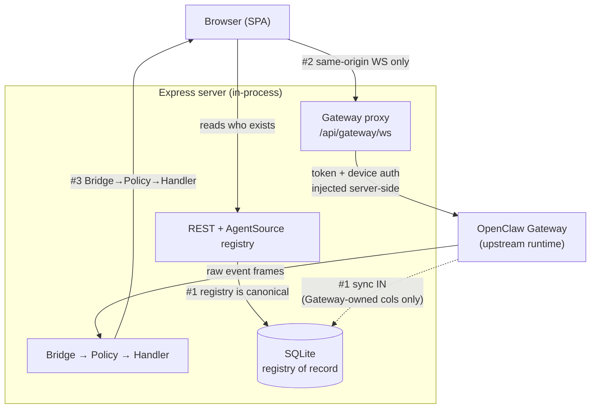

An invariant is a rule the codebase is built to hold no matter what changes around it. Clawboo has a small set of them. They are not style preferences; break one and a whole class of bug becomes possible: a stale agent list that survives a Gateway outage stops being stale; a graph edge stops mapping to anything real; the browser starts talking to credentials it should never see.

This page enumerates the seven invariants, cross-checks each against the code that enforces it, and is honest about the two that _generalized_ as Clawboo grew from a single-runtime, chat-narration tool into a multi-runtime, board-driven [orchestrator](/appendices/glossary). Where an invariant evolved, the page says so and shows the new shape rather than repeating the old framing.

## What invariants are, and what they aren't

These are **architecture invariants**: properties of the system's structure. They are distinct from:

- **Feature flags.** Clawboo used to gate subsystems (board, executors, MCP, governance) behind `CLAWBOO_*` flags; that flag layer has been removed and every subsystem is always-on. Invariants are not toggleable; flags were.
- **Style conventions.** Where files live, how a component is named; those are conventions, enforced by review, not by structure.
- **Behavioral guarantees.** "The team chat never floods with 40 responses" is a behavior the cascade-prevention machinery upholds; it is verifiable but it is implemented across many files, not a single structural rule.

An invariant is something you can point a grep or a single file at and say "this is true, and here is where it would break if it weren't."

## The model

The seven invariants partition cleanly into the planes they protect: _who exists_ and _how it runs_ (the registry/runtime split), _how the browser reaches a runtime_ (the proxy boundary), _how events flow_ (the pipeline), _how the dependency graph is shaped_ (packages never depend up), and _what the canvas and the database may contain_ (real records, idempotent schema).



Numbers in the diagram refer to the invariants below.

## The seven invariants

### 1. The registry is the source of truth for _who exists_; the Gateway for _how OpenClaw runs_

SQLite is the agent [registry of record](/appendices/glossary). The `agents` and `teams` rows are canonical for _who exists_. The OpenClaw [Gateway](/appendices/glossary) is one [`AgentSource`](/appendices/glossary) among several, synced _into_ SQLite by a server-side connection. The browser reads the fleet from `GET /api/agents` (SQLite, via the registry), never off `GatewayClient.agents.*` directly.

A server-side `ServerAgentRegistry` constructs an `OpenClawAgentSource` (wired to a real `GatewayClient`) and a peer `ClawbooNativeAgentSource` (SQLite-backed, no upstream), and registers both into one `AgentRegistry` multiplexer. `GET /api/agents` aggregates `registry.list()` and serves it from SQLite, flagging `stale: true` when the OpenClaw connection is down; so the fleet still renders with the Gateway offline.

```ts
// apps/web/server/lib/agentSource/registry.ts
this.registry.register(this.source) // OpenClawAgentSource
// ...
this.registry.register(this.nativeSource) // ClawbooNativeAgentSource
```

The discipline that makes this safe is **idempotent, column-scoped sync**. When the Gateway list is upserted into SQLite, the conflict-update clause touches _only_ Gateway-owned columns: `name`, `gatewayId`, `sourceAgentId`, `identityJson`, `archivedAt`, `updatedAt`, and never the SQLite-native columns (`teamId`, `personalityConfig`, `execConfig`, `avatarSeed`, `participantKind`, `runtime`, `capabilities`, `tenantId`). A re-sync therefore never clobbers a team assignment or a personality setting that Clawboo owns.

```ts
// apps/web/server/lib/agentSource/openClawAgentSource.ts (upsertFromList)
.onConflictDoUpdate({
  target: agents.id,
  // GATEWAY-OWNED columns ONLY — never teamId / personality / execConfig /
  // avatarSeed / participantKind / runtime / capabilities / tenantId.
  set: { name, gatewayId, sourceAgentId, identityJson, archivedAt: null, updatedAt: now },
})
```

The Gateway stays canonical for the _runtime_ concerns the registry doesn't own: live exec approvals, cron, runtime config, and the execution stream (`chat.*`, `sessions.abort/patch`, `config.patch`). Those ride the browser→proxy connection (the [RuntimeAdapter](/appendices/glossary) layer); for example, sending a message is still `client.call('chat.send', …)` from the browser, untouched by the registry.

<Note>
**How this generalized.** The original invariant was "the Gateway is the source of truth." When SQLite became the registry of record, it generalized to the split above: the registry owns *who exists*, the Gateway owns *how OpenClaw runs*. A second runtime (clawboo-native) plugs in as a peer `AgentSource`, and a future native record would arrive through that second source, never as a "fake" agent.
</Note>

### 2. Same-origin WebSocket for the browser

The browser never talks to the Gateway directly. Its only path to the upstream is the same-origin proxy at `/api/gateway/ws`. The browser resolves that URL from its own `window.location`; there is no place to point it at a remote host:

```ts
// packages/gateway-client/src/helpers.ts
export const resolveProxyGatewayUrl = (): string => {
  if (typeof window === 'undefined') return 'ws://localhost:18790/api/gateway/ws'
  const protocol = window.location.protocol === 'https:' ? 'wss' : 'ws'
  return `${protocol}://${window.location.host}/api/gateway/ws`
}
```

Every browser caller connects with `disableDeviceAuth: true`. The proxy injects the upstream auth token _server-side_; the browser never receives the credential, only a `hasToken` flag. The proxy also handles Ed25519 device signing server-side with a persistent keypair. The server's WS upgrade router accepts exactly one path and destroys every other upgrade socket:

```ts
// apps/web/server/index.ts
server.on('upgrade', (req, socket, head) => {
  if (resolvePathname(req.url) === '/api/gateway/ws') {
    proxy.handleUpgrade(req, socket, head)
    return
  }
  socket.destroy()
})
```

The proxy's own `handleUpgrade` re-checks the path and access gate before accepting, so a forged request that slips past the router is still rejected. The only non-browser Gateway connection is the server-side `OpenClawAgentSource`; and it authenticates with the shared proxy device identity, not a browser path.

### 3. All Gateway events go Bridge → Policy → Handler

Every raw Gateway event frame flows through a three-layer pipeline with no shortcuts. The convenience runner makes the contract explicit: classify, derive intents, apply:

```ts
// packages/events/src/index.ts
export function processEvent(frame: EventFrame, handler: EventHandlerHandle): void {
  const classified: ClassifiedEvent = classifyEvent(frame) // Bridge
  const intents = derivePolicy(classified) // Policy
  handler.applyIntents(intents, classified) // Handler
}
```

The middle layer is the load-bearing one: **Policy is pure**. `derivePolicy` is a side-effect-free switch from a `ClassifiedEvent` to an `EventIntent[]`; it reads the event, decides what should happen, and returns a description of it. It dispatches nothing, mutates no store:

```ts
// packages/events/src/policy/index.ts
export function derivePolicy(event: ClassifiedEvent): EventIntent[] {
  switch (event.kind) {
    case 'runtime-chat': {
      /* … */ return decideWorkChatEvent(event, payload)
    }
    case 'runtime-agent': {
      /* … */ return decideWorkAgentEvent(event, payload)
    }
    case 'approval':
      return decideTrustEvent(event)
    // …
  }
}
```

That purity is why the policy layer is exhaustively unit-tested: it has no Gateway, no Zustand, no clock to mock. Only the Handler is stateful; it takes the intents and dispatches them. Keeping classification, decision, and dispatch separate is what lets the decision logic be reasoned about and tested in isolation.

### 4. Packages never import apps

The dependency graph flows one way: `apps/` depends on `packages/`, never the reverse. A package may be imported by an app; an app is never imported by a package. This is what keeps the `@clawboo/*` packages independently buildable, browser-safe where they claim to be, and free of app-specific coupling.

A repo-wide grep for any package `src/` file importing from `apps/` (or `@clawboo/web`) returns **zero** import statements. The only matches are _comments_, a package's data-access layer noting that `apps/web` calls it, or a zod-schema file noting where its schemas are consumed. The arrows point the right way:

```
apps/web  ──imports──▶  @clawboo/db, @clawboo/events, @clawboo/executor, …
packages  ──never───▶  apps/
```

This is why, for example, the board's `repository.ts` and the events `policy/` directory carry no React, no Express, and no app config; they are pure modules an app wires up, and a future surface (a CLI, a different web app) could wire up the same way.

### 5. Every graph edge maps to real state, no decorative edges

The Ghost Graph and [Atlas](/appendices/glossary) render edges, and every edge corresponds to real configuration or board state. There are three edge kinds, each with a concrete source:

- **Dependency edges (Boo → Boo)** come from parsing each agent's `AGENTS.md` routing rules. `buildGraphElements` runs `parseAgentsMd(files.agentsMd, agentNames)` and emits one `dependency` edge per resolved `@mention` route, a real routing instruction the agent will act on.
- **Skill edges and resource edges (Boo → tool)** come from the unified capability inventory. They are built from `files.capabilities`, real `CapabilityRecord` entries from the [capability registry](/concepts/capabilities), and the server-evaluated `available` flag drives whether a node renders greyed.

```ts
// apps/web/src/features/graph/useGraphData.ts
if (files?.agentsMd) {
  const bindings = parseAgentsMd(files.agentsMd, agentNames) // real routing
  // → one 'dependency' edge per binding
}
const caps = files?.capabilities // real inventory
// → 'skill' / 'resource' nodes + edges per capability
```

There is one honest nuance. To make the spanning tree readable, the graph synthesizes a small set of **structural** edges: Boo Zero to each team (hub-spoke), and invisible `team-root` junctions in Atlas. These are not decorative; they encode the real team-membership hierarchy, and they are explicitly tagged `isSynthetic: true` so any consumer that scans for _AGENTS.md_ routing (such as "Refresh Protocol") skips them. The single exception that is purely a graph-layer attribute is Boo Zero's "Leadership" orbital, which the code documents as "NOT a capability record; it's a graph-layer attribute" with a reserved `clawboo-leadership-` id that can never collide with a real skill.

So the rule reads precisely: **no edge is decorative**; every edge maps to a routing rule, a capability, or a real team-membership relationship, and the one synthesized non-routing attribute is flagged and reserved.

### 6. Every Boo is a real agent record

A [Boo](/appendices/glossary) on the canvas is always backed by a real `AgentRecord`. The graph builds one `BooNode` per agent in the registry; there are no placeholder or mock agents:

```ts
// apps/web/src/features/graph/useGraphData.ts
const booNodes: GraphNode[] = agents.map((agent) => ({
  id: `boo-${agent.id}`,
  type: 'boo',
  data: { agentId: agent.id, name: agent.name, status: agent.status ?? 'idle' /* … */ },
  position: { x: 0, y: 0 },
}))
```

[Boo Zero](/appendices/glossary) is itself a real registry record (teamless in the DB) that the canvas synthesizes into the tree as the universal-leader root; it gets the crown badge and the Leadership orbital, but it is a genuine agent, not an invented node.

This invariant has a corollary in the server's ghost-row cleanup. When the browser sweeps stale local rows after a Gateway hydration, the cleanup is scoped to `eq(agents.sourceId, 'openclaw')`; because the live-id list it compares against came from the Gateway, only Gateway-owned rows are eligible to be deleted. Native (`clawboo-native`) agents are never ghosts of an OpenClaw list, so they are structurally excluded:

```ts
// apps/web/server/api/agents.ts (cleanup-ghosts)
.where(eq(agents.sourceId, 'openclaw'))
```

<Note>
**How this generalized.** The original framing was "every Boo is an OpenClaw agent." With the peer native source, the framing is "every Boo is a real agent *record*", backed by some `AgentSource`, OpenClaw or native. The cleanup scoping above is exactly the discipline that keeps a second source's records from being mistaken for ghosts of the first.
</Note>

### 7. The schema is idempotent and additive (the evolved "forward-only" rule)

This invariant is the one that changed shape the most, so read the current form rather than the legacy one.

The historical rule was "SQLite migrations are forward-only, never edit a committed migration file." There is **no migration ladder at all**. The schema is created by an inline, idempotent `CREATE TABLE IF NOT EXISTS` DDL block in `createDb()`, declared as the sole source of truth:

```ts
// packages/db/src/db.ts
// Bootstrap DDL — the SOLE schema source of truth. There is no migration
// ladder: a schema change is a hard reset of the local DB, so this
// block declares every table/column on a fresh DB outright. `schema.ts` is the
// Drizzle TYPE layer over the same tables (used for typed queries, never to
// apply migrations); schemaSource.test.ts guards the two against drift.
```

Two things keep this honest:

- **The unapplied drizzle ladder must not ship or run.** The `@clawboo/db` package's `files` array excludes `drizzle`, and there are no `db:migrate` / `db:generate` scripts (only a read-only `db:studio`). A test pins this posture so a stray migration runner can't be reintroduced.
- **The type layer and the runtime DDL must agree.** `schemaSource.test.ts` builds a real DB via `createDb(':memory:')` and asserts that every table and column in the Drizzle `schema.ts` type layer matches the live DDL, and vice versa.

So the _spirit_ of "forward-only" holds exactly: the committed schema is never destructively rewritten in place, the DDL is additive and idempotent, and the type layer stays in lockstep. The _mechanism_ changed: instead of a stack of `.sql` files applied in order, a single idempotent DDL block runs on every connection, and a schema change targets a fresh database rather than migrating in place.

<Danger>
Because there is no migration ladder, a schema change at this stage is a **hard reset** of the local DB, not an in-place upgrade. In v0.2.0 this is acceptable; it is the part of this invariant most likely to change when real data needs preserving across schema versions.
</Danger>

## Design rationale and trade-offs

The invariants exist to make whole categories of failure impossible rather than merely caught.

The registry/runtime split (1) buys offline tolerance: kill the Gateway and the fleet still renders, because _who exists_ lives in SQLite and only _how it runs_ needs the upstream. The cost is a second persistence layer and the idempotency discipline that keeps the two from fighting.

The same-origin proxy (2) buys credential safety: the browser is structurally incapable of seeing the Gateway token or signing device frames, because those happen server-side. The cost is an extra hop and a proxy that must correctly inject auth on every connect.

The pure Policy layer (3) buys testability: decision logic with no side effects can be exhaustively unit-tested without a Gateway, a store, or a clock. The cost is the ceremony of three layers where a naive implementation would dispatch inline.

The one-way dependency graph (4) buys independently-buildable, browser-safe packages, at the cost of pushing app-specific glue up into `apps/` rather than letting a package reach down for it.

Real-state-only edges (5) and real-record-only Boos (6) buy a canvas you can trust: what you see maps to what the system will do. The cost is the synthetic-edge tagging and the source-scoped cleanup that keep "real" honest in a multi-source world.

The idempotent schema (7) buys a zero-friction fresh install, `createDb` produces a usable database with no migration step, at the cost of no in-place upgrade path, a deliberate v0.2.0 trade-off.

## Boundaries and non-goals

- **Invariants are structural, not behavioral.** They guarantee the _shape_ of the system (who is canonical, who talks to whom, which way dependencies point). They do not, by themselves, guarantee that a feature behaves correctly; that is what tests and the cascade-prevention machinery are for.
- **Some invariants are OpenClaw-specific and have generalized.** Invariants 1, 2, 3, and 6 were originally phrased around the single OpenClaw runtime. As the multi-runtime board path became the default, they generalized: a teammate is now a `RuntimeAdapter` (not only an OpenClaw agent), and a future non-OpenClaw runtime emits a normalized lifecycle-event stream server-side rather than flowing through the Gateway WS bridge. The generalized forms above are the current ones.
- **The schema invariant will likely evolve again.** "No migration ladder, hard reset on change" is a v0.2.0 posture. Preserving real data across schema versions is a planned future requirement.

<Note>
These docs describe Clawboo **v0.2.0**, the current release.
</Note>

## See also

- [Gateway and events](/concepts/gateway-and-events), the Bridge → Policy → Handler pipeline in depth (invariant 3)
- [The agent model](/concepts/agent-model), Boo, Boo Zero, and the five runtime classes (invariants 1, 6)
- [The board](/concepts/the-board), the durable task substrate the multi-runtime direction is built on
- [Capabilities](/concepts/capabilities), the capability inventory behind the graph's skill/resource edges (invariant 5)
- [AgentSource, registry of record](/internals/agent-source), the sync discipline behind invariant 1
- [Database schema](/reference/database-schema), the tables the idempotent DDL declares (invariant 7)
- [Glossary](/appendices/glossary), canonical term definitions
