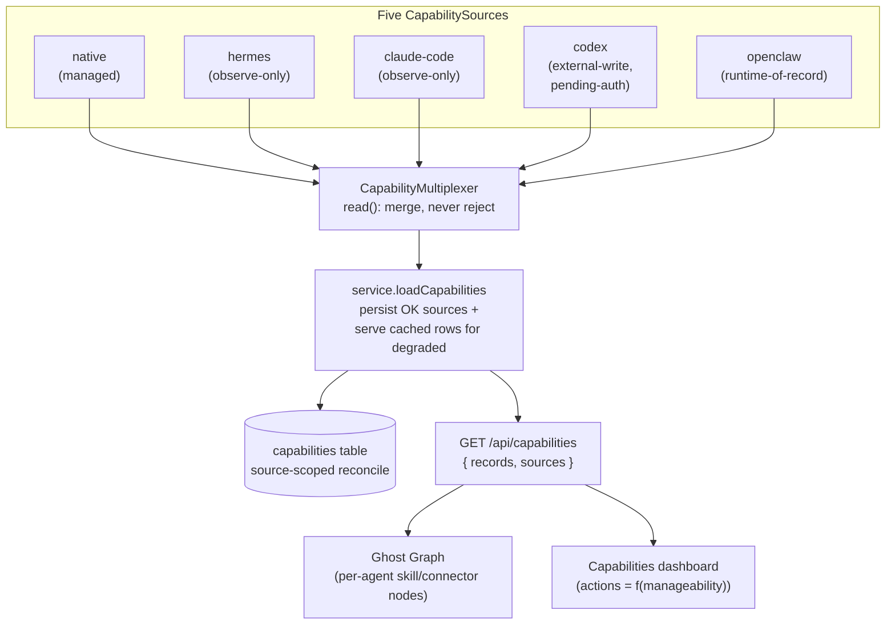

A [capability](/appendices/glossary) is any skill, tool, or connector an agent can use. Clawboo runs [five runtimes](/runtimes/index), and each one tracks its own capabilities differently: a brokered MCP tool in a clawboo-owned table, a Hermes `SKILL.md` on disk, an OpenClaw Gateway extension behind `config.patch`, a built-in nobody can touch. The **capability inventory** normalizes all of that into one shape, the `CapabilityRecord`, fanned in from per-runtime adapters, merged by a multiplexer, and persisted to a durable table.

One stream feeds two surfaces: the per-agent skill and connector nodes on the [Ghost Graph](/appendices/glossary), and the Capabilities dashboard. Every record carries a `manageability` tier, and that tier alone decides whether Clawboo can install, enable, or disable the capability, or merely observe it. The UI affordances and the write path are a pure function of the tier.

This page explains the record shape, the five sources, the manageability tiers and how they route writes, the multiplexer's never-fail fan-in, the durable projection that survives a disconnected source, and the boundaries Clawboo deliberately does not cross.

## What it is, and what it isn't

The inventory is a **read-mostly observation layer with a tier-gated write path**. Clawboo's stance is: _observe every capability across all runtimes; manage only what the owning runtime cedes._ That stance is encoded in the data, not in branching logic. A record that says `observe-only` is a record Clawboo will never write; the panel renders no Enable/Disable button for it, and the REST layer refuses any write against it.

It is **not** a marketplace and **not** a skill installer in itself. The [marketplace](/using/marketplace) is where you browse the 304 agents and 82 teams; installing a curated skill is one specific write the inventory routes (to the native source), but the inventory's primary job is to _surface what exists_ across heterogeneous runtimes in one consistent shape.

It is also **not** a second copy of any runtime's own state. A capability source `read()` reflects the runtime's authoritative store: the Gateway config, the Hermes home on disk, the `tool_registry` table, into records each time. The persisted `capabilities` table is a cache of the last good read per source, not a parallel source of truth.

The inventory sits at the boundary between Clawboo's [shared plane and each runtime's private plane](/concepts/teams-and-planes): the manageability tier is exactly the line between "Clawboo can change this" and "this belongs to the runtime, Clawboo only watches."

## The model

Five `CapabilitySource` adapters each project their runtime's capabilities into `CapabilityRecord`s. A `CapabilityMultiplexer` fans their `read()` calls into one merged list. A service layer persists each healthy source's records and serves cached rows for any source that degraded. Both the Ghost Graph and the dashboard consume the merged result.

## The CapabilityRecord

Every source projects into one normalized row. A brokered MCP tool, a Hermes `SKILL.md`, an OpenClaw plugin, and a runtime built-in are all the same shape; that uniformity is what lets one renderer and one write path serve all five runtimes.

The load-bearing fields:

| Field                       | Meaning                                                                                                                                                                                                               |
| --------------------------- | --------------------------------------------------------------------------------------------------------------------------------------------------------------------------------------------------------------------- |
| `id`                        | Source-namespaced composite `${sourceId}:${rawKey}`. Opaque to the UI; the prefix is how a write routes back to the owning source.                                                                                    |
| `sourceKey`                 | The natural identifier inside the owning store: a tool name, a skill slug, a connector id.                                                                                                                            |
| `kind`                      | `skill`, `tool`, or `connector`.                                                                                                                                                                                      |
| `runtime`                   | The runtime that owns the capability (open set, includes a dormant `human` seam).                                                                                                                                     |
| `scope`                     | `team`, `agent`, or `global`. `agentId` is set for agent scope, `null` otherwise.                                                                                                                                     |
| `source`                    | The origin it was read from (`brokered-mcp`, `curated-skill`, `filesystem-skill-md`, `mcp-connector`, `runtime-builtin`, `openclaw-extension`, `external-vendor-cli`). This drives both the tier and the write route. |
| `manageability`             | The tier that gates the write path (see below).                                                                                                                                                                       |
| `available` + `diagnostics` | Server-evaluated availability. `available: false` greys the row in _both_ renderers; `diagnostics` says why.                                                                                                          |
| `status`                    | `ready`, `disabled`, `manageable-but-pending-auth`, or `unavailable`.                                                                                                                                                 |
| `writable`                  | `false` when the owning source emits a row it cannot actually write yet; so the dashboard renders no dead button. Defaults to `true`.                                                                                 |
| `hint`                      | A source-supplied affordance string (e.g. the auth command for a pending-auth connector) so the panel never hardcodes a per-runtime string.                                                                           |
| `tenantId`                  | A dormant multi-tenant seam, always `null` today.                                                                                                                                                                     |

The `CapabilityRecord` is a superset of the tool broker's `ToolDescriptor`; it inherits availability, provenance, and risk, and adds `kind`, `runtime`, `scope`, and `manageability` so a tool, a skill, and a connector unify. The type lives in a browser-safe, zero-dependency package so the SPA can import it to type the REST response.

The `id` is deterministic: it encodes `sourceId + runtime + scope + agentId + kind + sourceKey`, so the same capability re-reads to the same row, and the persistence layer can upsert by `id` rather than diffing.

## The five sources

Each source is a `CapabilitySource` adapter, a `read()` that projects records plus a `write()` that the multiplexer routes by id prefix. The adapters live server-side; the package holds only the neutral types, the trait, and the multiplexer.

| Source        | Owns                          | Manageability of its records    | What it reads                                                                                                                                            |
| ------------- | ----------------------------- | ------------------------------- | -------------------------------------------------------------------------------------------------------------------------------------------------------- |
| `native`      | The clawboo-managed plane     | `managed`                       | The `tool_registry` brokered tools (global), each native agent's MCP toggles (`AgentConfig.tools`), and the per-agent `skills` table (curated installs). |
| `hermes`      | Hermes's private self-model   | `observe-only`                  | `SKILL.md` files and `mcp.json` connectors under each Hermes per-identity home, plus a built-ins roll-up.                                                |
| `claude-code` | Claude Code's own `~/.claude` | `observe-only`                  | The clawboo-attached MCP servers and Claude's built-ins. Clawboo has no persistent Claude store to manage.                                               |
| `codex`       | An ephemeral per-run home     | `external-write` (auth-blocked) | The clawboo-attached MCP servers, surfaced `manageable-but-pending-auth` (real, but blocked behind `codex login`), plus built-ins.                       |
| `openclaw`    | The Gateway config domain     | `runtime-of-record`             | `tools.allow`/`tools.deny`, `mcp.servers`, and plugins read over the shared operator connection, plus built-ins.                                         |

Two details about the `native` source are worth calling out, because they're where "manage what's ceded" gets concrete:

- A **curated skill** installed onto _any_ agent is a clawboo-managed annotation, the same thing a `TOOLS.md` bullet always was. Its record carries the _agent's_ runtime (so it groups under that runtime in the dashboard) but `manageability: 'managed'`, because Clawboo owns the `skills` table row. A curated skill on an OpenClaw agent is still managed by Clawboo.
- A **native install** reuses the existing tool-broker pipeline: `scanForInjection` on the whole supply-chain payload, then `appendAudit`, rather than forking a second install path. The injection scan covers a connector's command, args, and env, not just the name, so a malicious MCP-connector command can't slip the scan before a future caller wires it to a spawn.

The `openclaw` source reuses the _shared_ operator connection that the OpenClaw `AgentSource` already holds; it never opens a second Gateway connection. When the Gateway is down, its `read()` returns no records with a degraded status, and the service layer falls back to the last good rows (see [The durable projection](#the-durable-projection)).

## Manageability tiers

The four tiers are the heart of the model. Each tier answers one question: _what may Clawboo do to this capability?_, and the answer is mechanical at every layer: the panel derives its button set from the tier, and the REST handler refuses any write the tier forbids.

| Tier                | What Clawboo may do                                                                      | Where it applies                                                                           |
| ------------------- | ---------------------------------------------------------------------------------------- | ------------------------------------------------------------------------------------------ |
| `managed`           | Clawboo fully owns the durable row, install, enable, disable.                            | Brokered tools, native MCP toggles, curated skills (the `native` source).                  |
| `external-write`    | The runtime owns the store; Clawboo writes _through_ it (e.g. dialecting an MCP config). | Codex's attached MCP servers (today auth-blocked).                                         |
| `runtime-of-record` | The runtime owns it; Clawboo drives changes through the runtime's own API.               | OpenClaw `tools.allow`/`tools.deny`, driven via `config.patch`.                            |
| `observe-only`      | Clawboo can read but never write.                                                        | Built-ins, Hermes skills, attached spines Clawboo doesn't surface as a durable user store. |

A deliberate deviation from Clawboo's sibling [scheduler seam](/concepts/scheduling): manageability is **per-record, not per-source**. One adapter can emit mixed tiers: Hermes emits `observe-only` `SKILL.md` rows _and_ an `observe-only` built-ins roll-up, while the `native` adapter emits only `managed` rows. Because the tier rides each record, the write gate lives at the REST layer (resolve the target record, reject if `observe-only`) and is defended again inside each source's `write()`, rather than being a single flag on the source.

The action set the dashboard renders is a literal function of the record:

- `observe-only` → no action; the row reads "built-in, managed by _\<runtime\>_."
- `available: false` → no action; a row the user can see is unusable shouldn't offer a live button.
- `writable: false` → no action; this is the OpenClaw connector/plugin case where a `config.patch` toggle is a documented follow-up, so there's no dead button.
- `manageable-but-pending-auth` → a disabled Enable button carrying the source's `hint` (e.g. "pending auth, run `codex login`").
- otherwise → Enable when `disabled`, Disable when `ready`.

The REST handler enforces the same gate it shows: before dispatching an `enable`/`disable`, it resolves the record and returns `422` if the capability is `observe-only` or non-writable, so the writability check is never delegated to an adapter's `write()` throw. An install against an unknown agent is rejected `404` up front (an unknown agent would otherwise produce an invisible orphan annotation plus a false `{ ok: true }`).

<Info>
The install request carries a `runtime`, but the REST handler ignores it and resolves the owning runtime authoritatively from the agent row. The browser's `installSkill` hardcodes `openclaw` as a placeholder; trusting that would mislabel a skill installed on a non-OpenClaw agent. The agent row is the source of truth for the owning runtime.
</Info>

## The multiplexer and never-failing reads

The `CapabilityMultiplexer` registers all five sources and fans their `read()` calls into one merged `{ records, sources }` result. The contract that makes the inventory robust is: **a source `read()` never rejects**: degradation is _data_. The multiplexer wraps each source in a try/catch, so even a source that violates its own contract becomes a degraded status entry rather than taking the whole inventory down. One dead Gateway can't blank the dashboard.

Writes route by ownership: an `install` routes by the spec's `via` field; an `enable`/`disable` routes by the capability id's source prefix (`parseCapabilityId` splits on the first `:`, so a `rawKey` containing a colon survives). An unknown source throws a typed `UnknownCapabilityError` that the REST layer maps to `404`; an `observe-only` write raises `UnsupportedCapabilityWriteError` → `422`.

## The durable projection

The service layer (`loadCapabilities`) is the single read path both renderers go through. It does three things on every fetch:

1. **Fan the multiplexer** to get the live merged records plus each source's status.
2. **Persist each OK source's records** to the `capabilities` table with a _source-scoped reconcile_; `upsertCapabilities` deletes only the rows that source no longer reports and upserts the rest, in one `BEGIN IMMEDIATE` transaction. A re-read from one adapter never touches another adapter's rows.
3. **Serve cached rows for degraded sources**; if a source came back `ok: false`, the service reads its last good rows from the table and merges them in, so a blipped Gateway never blanks its slice of the inventory.

The merge dedupes by `id` with fresh records winning over cached ones, then applies the query filter (`runtime`, `kind`, `scope`, `agentId`). The source-scoped reconcile is the disconnect-tolerance mechanism: the table is a per-source cache, and a fresh `read()` repopulates it. There is no migration or back-fill; a hard reset of the table is acceptable because the next read rebuilds it.

<Note>
The `writable: false` derivation for a degraded OpenClaw connector is *recomputed* when serving cached rows. The column doesn't persist `writable`, so `rowToRecord` re-derives it from the row's origin and tier; without that, the cached (disconnected-Gateway) path would drop `writable` and the dead Enable/Disable button would resurface.
</Note>

## One stream, two surfaces

The "one inventory" claim is structural, not aspirational: the Ghost Graph and the Capabilities dashboard both call the same browser client (`fetchCapabilities` → `GET /api/capabilities`) and never issue a divergent query. The Ghost Graph groups the `agent`-scoped records by `agentId` into its per-agent skill and connector nodes, and uses each record's `available` flag to grey unavailable nodes, the same greying the dashboard applies. This replaced an earlier per-agent `TOOLS.md` parse: the graph and the dashboard would have drifted if they read capabilities two different ways, so they were collapsed onto one stream.

## Design rationale and trade-offs

The inventory exists because "what can this team do?" had no single answer across five runtimes. Each runtime's capability model is genuinely different: a config domain, a filesystem of `SKILL.md`s, a `tool_registry` table, an inline MCP attach, and Clawboo's honest position is that it _cannot_ own all of them. Encoding "who owns this" as a per-record `manageability` tier, rather than as branching code in the UI, buys two things: the panel and the write path stay a pure function of the record (no per-runtime special cases to drift), and a new source can declare a mix of tiers without changing any consumer.

The cost is a second persistence layer beside each runtime's own store, kept honest by the source-scoped reconcile and the fresh-wins merge. The trait and multiplexer deliberately mirror the [scheduler seam](/concepts/scheduling) and the [AgentSource](/internals/agent-source) registry, so the three "fan many sources into one view, degrade gracefully" surfaces share a shape a contributor learns once.

## Boundaries and non-goals

- **Clawboo never writes a runtime's private store it has declared off-limits.** Hermes `SKILL.md` skills are `observe-only` precisely because the invariant is that Clawboo never writes a Hermes skills directory; the Hermes `mcp.json` is regenerated every run, so it's surfaced read-only too. Observing the private plane is the line; clobbering it is not.
- **Not every tier has a live runtime surface yet.** The `external-write` write path (the MCP-config transcoder that dialects a canonical spec per runtime) is built and unit-tested, but no runtime exposes a clawboo-managed _persistent_ connector store in v0.2.0; Codex's home is ephemeral and auth-blocked, Hermes's `mcp.json` is regenerated. So the genuine live writes today are `managed` (native) and `runtime-of-record` (OpenClaw `tools.allow`/`tools.deny`); the other tiers are represented and gated but await a persistent store to plug into.
- **OpenClaw connector and plugin toggles are not writable yet.** The `openclaw` source emits MCP connectors and plugins as `runtime-of-record`, but their `config.patch` toggle is a documented follow-up, so each is marked `writable: false`; only the Gateway `tools.allow`/`tools.deny` surface is a confirmed runtime-of-record write today.
- **Single implicit tenant.** Every record and the `capabilities` table carry a `tenantId`, but it is a dormant seam; no per-tenant filtering is active in v0.2.0.

<Note>
These docs describe Clawboo **v0.2.0**, the current release.
</Note>

## See also

- [Memory](/concepts/memory), the other shared-vs-private observe-don't-clobber surface
- [Teams and planes](/concepts/teams-and-planes), the shared-plane / private-plane split the tiers encode
- [Scheduling](/concepts/scheduling), the sibling source-multiplexer seam this one mirrors
- [The agent model](/concepts/agent-model), the runtimes whose capabilities are inventoried
- [Capabilities dashboard](/using/capabilities-dashboard), the UI over this inventory
- [Capabilities API](/reference/rest-api/capabilities), the REST surface
- [Glossary](/appendices/glossary), canonical term definitions
