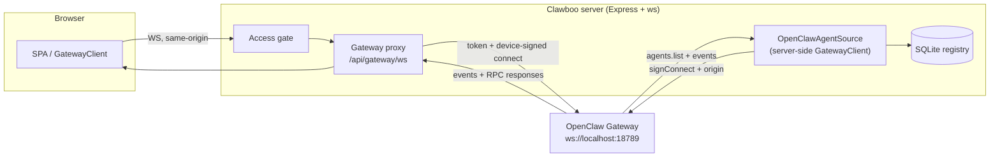
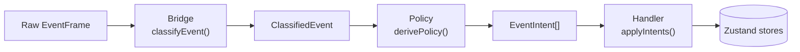

The OpenClaw [Gateway](/appendices/glossary) is the WebSocket runtime that drives OpenClaw agents: it accepts a `connect` handshake, fields RPC calls (`chat.send`, `sessions.list`, `agents.create`, …), and broadcasts a stream of events (`chat`, `agent`, `exec.approval.*`, `heartbeat`). Clawboo speaks to it in two carefully separated ways, and turns its event stream into reactive UI state through one pure, testable pipeline.

This page explains the two paths in and out of the Gateway, the same-origin browser proxy and the single server-side connection, the `connect` handshake and device pairing, and the **Bridge→Policy→Handler** pipeline that classifies a raw frame, decides what it means without side effects, and dispatches the result to the client stores.

## What it is, and what it isn't

The Gateway is the OpenClaw **runtime**, not Clawboo's registry. It is the source of truth for _how OpenClaw agents run_: live sessions, the execution stream, exec approvals, runtime config, while the agent [registry of record](/appendices/glossary) (SQLite, fronted by the [AgentSource](/appendices/glossary)) is the source of truth for _who exists_. The two paths in this document are exactly that split: the **browser→proxy** connection rides the live runtime stream (chat, abort, approvals), and the **server-side connection** keeps the registry synced from the Gateway's agent list.

Two invariants shape everything below:

- **The browser never talks to the Gateway directly.** It talks only to a same-origin WebSocket at `/api/gateway/ws`. The proxy injects the upstream auth token and signs the device-auth handshake server-side, so the browser never holds a credential and never needs a registered device key of its own.
- **There is exactly one non-browser Gateway connection.** The server-side `OpenClawAgentSource` opens its own `GatewayClient` to keep SQLite in sync. Every other Gateway-touching surface in the codebase goes through one of these two paths.

The event pipeline is **OpenClaw-specific**. It maps OpenClaw's WS frames to Zustand store updates for the live fleet view. It is not the cross-runtime lifecycle stream; runtimes other than OpenClaw (clawboo-native, Claude Code, Codex, Hermes) emit a normalized `RuntimeEvent` union server-side instead of flowing through this browser bridge. See [the agent model](/concepts/agent-model).

## The model

Two connections reach the Gateway. The browser path is a same-origin proxy hop; the server path is a single signed connection used for registry sync.

The browser proxy is transparent for everything except the `connect` frame: that one frame is rewritten server-side to add the token and device signature. Everything else is forwarded byte-for-byte in both directions.

Once the browser's `GatewayClient` is connected, every event frame it receives runs through three stages. Bridge and Policy are **pure functions**: no I/O, no store access, and only the Handler touches state.

A single convenience runner, `processEvent(frame, handler)`, threads a frame through all three stages: `classifyEvent` → `derivePolicy` → `handler.applyIntents`.

## How it works

### The same-origin proxy

`createGatewayProxy` runs a `ws` `WebSocketServer` in `noServer` mode; the Express server routes any upgrade for `/api/gateway/ws` into its `handleUpgrade`. Any other upgrade path is destroyed. The proxy's flow is deliberately _eager_: when the browser opens its socket, the proxy immediately loads the upstream settings and opens its own WebSocket to the Gateway, before the first browser message arrives. This is required because the Gateway sends a `connect.challenge` event spontaneously right after the TCP handshake, and the browser needs that challenge nonce before it can send a signed `connect` request.

Messages buffer in both directions until each side is ready (bounded by `maxPendingFrames`, default 512; overflow tears the connection down rather than growing unbounded), then forward bidirectionally. The proxy treats almost every frame as opaque: it re-serializes to normalize whitespace and forwards as-is. The single exception is a `connect` request frame, where the proxy does two server-side rewrites:

1. **Token injection.** If the browser didn't supply an `auth.token` and the server has an upstream token, the proxy injects it. The upstream token lives only on the server; `GET /api/settings` exposes a `hasToken` flag, never the value; so the browser connects with no credential and the proxy fills it in.
2. **Device signing.** The proxy signs the `connect` params with a persistent Ed25519 identity loaded once and shared across all connections (`loadOrCreateProxyDeviceIdentity` + `signConnectParams`, using the `connect.challenge` nonce). This replaces any device fields the browser sent. If signing fails, the proxy strips the device fields and forwards without them rather than failing the connect.

Server-side device signing is what lets _any_ browser context: a preview pane, an incognito window, a brand-new machine, connect without registering its own device key.

The proxy also runs application-level keepalive: it pings the upstream each interval (`keepaliveIntervalMs`, default 30 s) and terminates the connection if no pong arrives, so a half-open TCP connection surfaces immediately instead of stalling on a 60-second-plus RPC timeout.

<Note>
The browser resolves the proxy URL from its own origin; `resolveProxyGatewayUrl()` returns `ws(s)://<window.location.host>/api/gateway/ws`. There is no hardcoded port in the browser path; the `ws://localhost:18790/...` fallback is only used in SSR / Node test contexts where `window` is undefined.
</Note>

### The `connect` handshake and device pairing

The browser's `GatewayClient.connect()` opens the socket, waits briefly for a `connect.challenge`, then sends a `connect` RPC. It advertises `minProtocol: 3, maxProtocol: 4` (OpenClaw bumped the connect protocol 3→4 in 2026.5.x; Clawboo supports both so old and new Gateways negotiate cleanly). It connects with `role: 'operator'` and scopes `operator.admin`, `operator.approvals`, `operator.pairing`. Every browser caller passes `disableDeviceAuth: true` because the proxy owns device signing; the client's own `crypto.subtle` device path is skipped.

If a connect is rejected, the failure is parsed into a structured `GatewayResponseError` carrying a `code`. The one that matters for first-run is `NOT_PAIRED`: OpenClaw 2026.5.x dropped auto-pairing on first connect, so an unapproved device's connect returns `{ code: 'NOT_PAIRED', message: 'pairing required: device is not approved yet' }`. The SPA branches on that code (in `GatewayConnectScreen`, `GatewayBootstrap`, and `StartGatewayStep`) and renders a one-click approval flow.

That flow posts to `POST /api/system/approve-device`, which shells out to the `openclaw` CLI in two steps: `openclaw devices approve --latest` is a _preview_ that prints the pending request id (and exits non-zero by design), so the handler regex-extracts the UUID from the captured output, then runs `openclaw devices approve <UUID>` to actually approve. On success the SPA auto-retries the original connect.

<Warning>
The approve-device endpoint parses the CLI's stdout/stderr for the request id (`/openclaw devices approve\s+([a-f0-9-]{36})/i`). If a future OpenClaw release changes that wording, the parse fails and the endpoint returns `404`. The approval UI shows the manual CLI commands as a fallback so a power user is never stuck.
</Warning>

### The server-side connection (registry sync)

The `OpenClawAgentSource` opens the **only** non-browser Gateway connection, signed with the same shared proxy device identity (via the gateway-client `signConnect` hook). A headless Node connection can't use the browser's `crypto.subtle` path, so the source connects with three deliberate options:

- `clientName: 'cli'`; the Gateway validates `client.id` against a fixed allowlist; a custom id like `clawboo-server` is rejected, and the control-ui ids additionally require a browser `Origin` header. `cli` is the first-class programmatic client type with no origin requirement.
- `signConnect`: signs the `connect` params with the proxy device identity (`disableDeviceAuth: true` turns off the browser path so the signer never double-signs).
- `origin` + `webSocketImpl`: the global undici WebSocket drops the `Origin` header, tripping `CONTROL_UI_ORIGIN_NOT_ALLOWED`. The source injects the `ws` package's WebSocket (which honors `{ origin }`) and presents the gateway-host origin, the same recipe the proxy uses for its upstream connection.

This connection's job is to keep SQLite synced from the Gateway's `agents.list` and its event stream. Reads serve SQLite (so the fleet still renders when the Gateway is down); writes mirror back through the Gateway. See [AgentSource, registry of record](/internals/agent-source).

### Stage 1, Bridge: `classifyEvent`

The Bridge is pure parsing. `classifyEvent(frame)` switches on the frame's `event` name and returns a `ClassifiedEvent` with a `kind`, an extracted `agentId` / `sessionKey`, and a timestamp. It never decides what to _do_, only what the frame _is_:

| Frame `event`                                        | Classified `kind` |
| ---------------------------------------------------- | ----------------- |
| `presence`, `heartbeat`                              | `summary-refresh` |
| `chat`                                               | `runtime-chat`    |
| `agent`                                              | `runtime-agent`   |
| `exec.approval.pending` / `.requested` / `.resolved` | `approval`        |
| anything else                                        | `unknown`         |

It extracts `agentId` from the session key (`agent:<id>:<session>`) or a top-level/nested `agentId` field. The Bridge also holds a set of small pure helpers the rest of the pipeline reuses: `parseChatPayload` and `parseAgentPayload` (shape-validate the raw payload, returning `null` on anything malformed), `isReasoningStream` (is this stream a thinking trace?), `mergeRuntimeStream`, and `dedupeRunLines`.

### Stage 2, Policy: `derivePolicy`

The Policy layer is pure decision-making with no side effects. `derivePolicy(event)` routes by `kind` to one of four deciders and returns an array of typed `EventIntent`s, a description of _what should happen_, not a mutation:

- `summary-refresh` → `decideAgentEvent` → schedules a debounced fleet refresh (750 ms), plus a heartbeat-latest refresh on `heartbeat`.
- `runtime-chat` → `decideWorkChatEvent` → maps `delta` to a live-patch (streaming text/thinking), and `final` / `aborted` / `error` to a `commitChat` intent that finalizes the turn (and an `idle` / `error` status patch).
- `runtime-agent` → `decideWorkAgentEvent` → maps the `lifecycle` stream's `start` / `end` / `error` phase to a status update, and the `assistant` / reasoning streams to live-patches.
- `approval` → `decideTrustEvent` → emits `approvalPending` or `approvalResolved`.

A malformed payload returns a single `{ kind: 'ignore', reason }` intent instead of throwing, so a junk frame is a no-op, not a crash. Because Policy reads only its inputs, the same `ClassifiedEvent` always derives the same intents, which is what makes it unit-testable in isolation.

### Stage 3, Handler: `applyIntents`

The Handler is the only stateful stage. `createEventHandler(deps)` returns `{ applyIntents, dispose }`; `deps` are the injected dispatchers that write to the Zustand stores (so the pure package never imports `apps/web`). For each intent it dispatches: `queueLivePatch` feeds the RAF-batched [patch queue](/internals/event-pipeline) that coalesces rapid streaming updates per agent; `commitChat` appends output lines and finalizes the turn; `updateAgentStatus` flips an agent's status; `scheduleSummaryRefresh` debounces the fleet reload; `approvalPending` / `approvalResolved` update the approvals store.

The Handler carries two pieces of guard state. A debounce timer collapses bursts of summary-refresh requests into one fleet reload. A `closedRuns` map (30-second TTL, capped at 500 entries) drops stale terminal events for a run that already closed, guarding against a duplicate `final` or a late lifecycle `end` flipping a fresh run back to idle. Both are cleared by `dispose()` when the Gateway disconnects.

In the browser, `useGatewayEvents` wires this together: it constructs the handler with store-backed dispatchers, subscribes to `client.onEvent`, and calls `processEvent(frame, handler)` for every frame.

<Note>
For a **server-orchestrated team session** (an `agent:<id>:team:<teamId>` key), `useGatewayEvents` deliberately suppresses its own chat commit _and_ live streaming-text writes. The server-side orchestrator is the single writer of that team's transcript, it persists each turn and streams it back over SSE (`GET /api/teams/:id/chat/stream`). The browser still receives the same OpenClaw `chat` frames on its Gateway connection, so without this gate a team turn would be written twice, once from the Gateway frame here and once from the SSE, and render as a duplicate. See [delegation and orchestration](/concepts/delegation-and-orchestration).
</Note>

### The access gate

The proxy upgrade and every `/api/*` route sit behind an optional access gate, active only when `STUDIO_ACCESS_TOKEN` is set. With a token configured, `?access_token=<token>` sets an `HttpOnly` cookie and redirects; thereafter every `/api/*` request and the WS upgrade require that cookie. Token comparison is constant-time (both sides SHA-256-hashed first, so the compare leaks neither length nor a first-differing-byte timing oracle). The gate is the only authentication for a non-loopback bind, so the server warns loudly if it's bound to a public interface with no token set.

<Info>
The gate has one exemption: a **loopback** request to `/api/mcp/*` is let through without a cookie. That is the spawned-runtime control plane, a runtime attaches its MCP client to `http://127.0.0.1:<port>/api/mcp/*` with its env scrubbed of the token. A remote client cannot forge a loopback source on a real TCP handshake, so this is safe; every non-loopback `/api/mcp/*` request still needs the cookie. See [Security](/operating/security).
</Info>

## Design rationale and trade-offs

**Same-origin proxy over a direct browser connection.** A direct browser→Gateway connection would have to ship the upstream token to the browser and require every browser context to register its own device key. The proxy keeps the credential server-side and reuses one shared device identity, so the token never reaches the client and any browser context connects without setup. The cost is a hop and a small connect-frame rewrite, paid once per connection, transparent for every other frame.

**Bridge and Policy as pure functions.** Splitting classification and decision-making away from dispatch means the hard logic, what a frame means, what intents it produces, is testable without a running Gateway, a browser, or a store. The Handler concentrates all the messy state (debounce timers, stale-run guards) in one place. This is the same purity discipline the [board](/concepts/the-board) and [governance](/concepts/governance) layers follow.

**Intents as a description, not a mutation.** Policy emits `EventIntent[]` rather than calling stores directly. That indirection is what keeps Policy pure and lets the Handler apply cross-cutting guards (stale-run dropping, RAF batching) uniformly across every intent kind, regardless of which decider produced it.

**One server-side Gateway connection.** Funneling all non-browser Gateway traffic through a single `OpenClawAgentSource` connection means there is exactly one place that owns sync discipline and reconnection on the server. The Gateway tolerates many connections per device (every browser tab is one), so adding the server's is "one more."

## Boundaries and non-goals

- **OpenClaw-only.** This pipeline maps OpenClaw WS frames. The other four runtimes emit a normalized `RuntimeEvent` union server-side and do not flow through `classifyEvent` / `derivePolicy`. See [the agent model](/concepts/agent-model).
- **Not the team-orchestration engine.** Bridge→Policy→Handler keeps the live _fleet view_ in sync (an agent's status, streaming text, approvals). Turning delegation signals into durable work is the board orchestrator's job, not this pipeline's. See [delegation and orchestration](/concepts/delegation-and-orchestration).
- **Token-count gap.** Gateway `chat` event payloads don't carry usage data, so the cost path estimates tokens (≈ 4 chars/token); the field is wired for real counts if the Gateway ever adds them. See [Known issues](/appendices/known-issues).
- **Device pairing depends on the CLI.** The approve-device endpoint shells out to `openclaw` and parses its output; it is a convenience over the manual `openclaw devices approve` flow, not a reimplementation of OpenClaw's pairing.

<Note>
These docs describe Clawboo **v0.2.1**, the current release.
</Note>

## See also

- [The agent model](/concepts/agent-model), the five runtime classes and where this OpenClaw pipeline fits
- [OpenClaw runtime](/runtimes/openclaw), connecting, device pairing, channels
- [Architecture invariants](/concepts/architecture-invariants), "same-origin WS for the browser" and "all Gateway events go Bridge→Policy→Handler"
- [Event pipeline internals](/internals/event-pipeline), the patch queue and dispatcher wiring in detail
- [AgentSource, registry of record](/internals/agent-source), the server-side sync connection
- [Security](/operating/security), the access gate and the loopback MCP exemption
- [Glossary](/appendices/glossary), canonical term definitions
