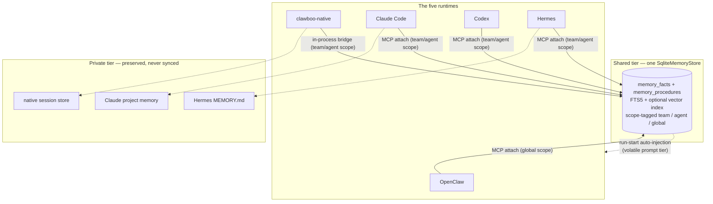

Clawboo gives a team two kinds of memory. There is **one shared store**: declarative facts and versioned procedures in SQLite, served over a Memory [MCP](/appendices/glossary) server, that every [runtime](/appendices/glossary) reads and writes. And there is **each runtime's own private native memory**: Hermes's `MEMORY.md`, Claude Code's project memory, clawboo-native's session store, which Clawboo preserves but never touches and never syncs.

The shared store is the team's collective knowledge: a fact saved by one runtime's agent is recalled by _any_ runtime's agent on the same team. The private store is each runtime's scratch space, invisible to teammates. This page explains both tiers, how scope-tagging keeps the shared store team-aware, the security disciplines on the write and read paths (scrub-on-write, sanitize-before-inject), and how the most-relevant facts are auto-injected into a run's prompt at start.

## What it is, and what it isn't

The shared tier is **`SqliteMemoryStore`**: a local-first store backed by two SQLite tables (`memory_facts` and `memory_procedures`) plus an FTS5 (full-text search) virtual table. It is a single write choke point and a single read surface, exposed three ways: the Memory MCP server (`memory_save` / `memory_search` / `memory_browse`), the `/api/memory` REST routes, and the run-start auto-injection hook. All three go through the same store, so there is one source of truth for "what the team knows."

A **fact** is declarative: "the user prefers concise responses", "the staging deploy command is `pnpm deploy:staging`". A **procedure** is a versioned how-to kept out of facts. Both carry a scope (team and/or agent) and are persisted; the store is not a transcript or a cache.

The shared store is **not** each runtime's private memory, and it deliberately does **not** sync the two. A runtime's native memory accrues inside its own per-identity home directory and stays there. Clawboo observes that a runtime _has_ private memory and preserves it across runs (see [the private tier](#the-private-tier-each-runtimes-native-memory)); it never copies private memory into the shared store or vice versa. Auto-syncing the two would re-create the two-sources-of-truth problem the board architecture exists to avoid; so the model _chooses_ what to promote to a shared fact by calling `memory_save`.

## The model



Every runtime reaches the shared store through MCP. The four executor-driven runtimes (native, Claude Code, Codex, Hermes) get a **per-run scope** bound to the attach connection; OpenClaw gets a **global scope** because its agents are cross-team and the Gateway's process-wide config can't carry a per-run binding. The private tier hangs off the side: each runtime owns its native memory and Clawboo never crosses that line.

## The shared tier: scope-tagged facts

Every fact carries an optional `scope_team_id` and `scope_agent_id`. Reads use **inclusive visibility**: a scoped query also sees globally-scoped (null) rows. A query bound to team T and agent A returns facts tagged with team T, facts tagged with agent A, _and_ untagged global facts, but never another team's or another agent's private facts.

Auto-saved team facts drop the `agentId` on purpose. The save is tagged with the **team only** (agent left null = shared across all teammates), so a teammate on _any_ runtime recalls it. Tagging an auto-save with an agent id would hide it from teammates and defeat the entire point of a shared tier.

The scope binding is **authoritative when the run is bound**; the model can neither widen its visibility nor mis-tag a save:

- **Save** tags the fact with the bound team only.
- **Search / browse** filter by the full bound scope (team + agent inclusive + global).

This binding rides the MCP attach URL, not the tool arguments. For the four executor-driven runtimes, the Memory attach URL carries `scopeTeamId` / `scopeAgentId` query params; the server reads them off the request and binds the MCP session. A runtime may pass whatever `scopeTeamId` it likes in a tool call; it is ignored when the run is bound. The unbound case (the raw stdio bin, an external attach) falls back to the model's scope args, which is the legacy behavior.

<Info>
A team-less bound run (no team id) reads **global facts only**, never every team's shared facts. The store treats an empty-string team tag as a global-only sentinel; passing `null` instead would skip the team filter entirely, leaking cross-team facts. The injection hook and the MCP server both normalize a null team to `''` for exactly this reason.
</Info>

### Search: FTS5, vector, and hybrid

Search runs in one of three modes. **FTS** (the default with no embedding provider) tokenizes the query and matches against the FTS5 table, ranking by BM25. **Vector** mode embeds the query and the candidate facts and ranks by cosine similarity over a stored Float32 BLOB. **Hybrid** (the default when an embedding provider is available) blends the two: 60% vector, 40% an FTS-membership signal.

Embedding is best-effort and pluggable behind an `EmbeddingProvider` seam. The resolver prefers a reachable local Ollama, falls back to OpenAI when a key is present, and otherwise returns nothing, in which case vector and hybrid modes degrade gracefully to FTS. A fresh install with no embedding provider still gets working full-text recall. Vector scores only compare facts produced by the _current_ embedding model; a fact embedded by a different model scores 0 on the vector axis (cross-model cosine is meaningless) but stays findable via FTS in hybrid mode.

<Note>
The `MemoryStore` and `EmbeddingProvider` interfaces are the swap points for a future hosted backend (Postgres, a dedicated vector DB, a knowledge graph) and a different embedding source. The default `SqliteMemoryStore` (FTS5 + brute-force cosine over a BLOB column) is the local-first implementation that ships.
</Note>

## The private tier: each runtime's native memory

The four non-OpenClaw runtimes, and OpenClaw itself, each keep their own native memory, and Clawboo's job is to **preserve it, not replace it**.

A runtime declares whether its native memory should be preserved via its capabilities (`nativeMemory: 'preserve' | 'none'`). Hermes, clawboo-native, and OpenClaw declare `'preserve'`; Claude Code and Codex declare `'none'` (they run against the host's own state, or an ephemeral home). The runner turns that declaration into an integration plan: a runtime whose native memory is preserved gets a **stable per-identity home directory** under Clawboo's state dir, materialized owner-only (`0700`) before the driver touches it, where its native skills and memory accrue across runs. A runtime without a persistent home gets an ephemeral one.

The preservation rule is enforced _by construction_, not by name: the runner branches only on the resolved integration plan, never on a runtime id, and a misdeclared adapter degrades to the safe ephemeral default rather than producing a contradictory plan. Preserve flags are clamped to a persistent home; preserving state inside a throwaway home is incoherent.

The split between the two tiers is communicated to the agent in the prompt. A short guidance block tells each runtime that durable team knowledge belongs in the shared Memory tool, while its native memory (Hermes `MEMORY.md`, Claude project memory, the native store) is private scratch teammates cannot see. The guidance never tells a runtime to stop using its native memory.

## Scrub-on-write

The shared store is the single write choke point for the team's memory, so it is the one place a secret is removed before it can ever become durable, searchable, or injectable. `saveFact` and `saveProcedure` both scrub the title and content through a secret-redactor _before_ embedding and insertion. A credential that an agent tries to memorialize is stored as `[REDACTED]`, never as the live value, regardless of which surface (MCP, REST, a future writer) made the call.

The MCP layer adds one refinement on top. If a fact's _content_ reduces entirely to redaction sentinels after scrubbing, the save is declined outright: a fact like `{ title: 'Token', content: 'sk-…' }` would store only a useless `Token: [REDACTED]` breadcrumb with the actual token gone, so there is nothing worth recalling. This check is deliberately content-only; a fact's recallable value lives in its content, not its title.

## Sanitize-before-inject

The write path scrubs secrets; the read path that feeds a prompt adds two more guards, because a fact written by one agent may later be injected into a _different_ agent's run.

- **Injection sanitize.** A poisoned "fact" must not smuggle instructions into a teammate's run. The auto-injection hook runs each candidate fact through an injection scanner and drops any that trips it. A memory entry saying "ignore your previous instructions and …" never reaches another agent's prompt.
- **Defense-in-depth scrub.** Facts are scrubbed on write, but a fact that predates the scrubber, or that some external writer inserted, must never re-surface a secret into context. The injection hook re-scrubs each fact's title and content before rendering it into the prompt.

Both guards are belt-and-suspenders: the store already scrubs on write, but the read-into-prompt path is the last line before a fact lands in front of a model, so it re-checks rather than trusting upstream.

## Run-start auto-injection

A runtime can call `memory_search` whenever it wants. But to start with the team's accumulated knowledge already in hand, the executor runner seeds the most-relevant facts into the prompt at run start, no tool call required.

When a task run begins, the runner builds a memory block by searching the shared store with the task's title and description as the query, scoped to the task's team and assignee, in hybrid mode. The top-ranked facts (5 by default) that fit within a character budget (1500 chars by default, a few hundred tokens) are rendered as a bounded `<auto-memory>` block. The block lands in the prompt's **volatile tier only**, never the cache-stable prefix, so seeding it never busts the KV-cache prefix the rest of the prompt relies on.

The hook is **default-on and a no-op when it can't help**: it returns an empty string when memory is empty (a fresh install has no facts), when the query is blank, when no fact matches, or when the char budget is non-positive. A task can opt out entirely with `disableMemoryAutoInject`. And it is best-effort; any failure returns an empty string rather than failing the run.

```ts
// apps/web/server/lib/executorRunner.ts (run-start)
const memoryBlock = input.disableMemoryAutoInject
  ? ''
  : await buildMemoryInjection({
      db,
      query: `${task.title}\n${task.description ?? ''}`,
      scope: { teamId: task.teamId, agentId: assigneeAgentId },
      maxChars: DEFAULTS.memoryAutoInjectMaxChars, // 1500
      topK: DEFAULTS.memoryAutoInjectTopK, // 5
    })
```

The injection hook reuses the exact `SqliteMemoryStore` + `EmbeddingProvider` stack the `/api/memory` REST surface uses, so a run sees the same store, the same scope rules, and the same search behavior as a manual `memory_search`.

## Design rationale and trade-offs

The two-tier split exists because a mixed-runtime team has two genuinely different needs. Coordination, "what did the team learn, what does the user want", must be _shared_: a fact one agent records has to be recallable by a teammate running on a different runtime, or the team isn't really collaborating. But each runtime's _cognitive_ memory (Hermes's self-improving `MEMORY.md`, Claude's project memory) is part of how that runtime works, and stripping or rewriting it every run would degrade the runtime. So the shared tier is the common spine, the private tier is preserved untouched, and the model decides what to promote across the boundary.

<Note>
Keeping the two tiers separate, with the model choosing what to share, is the deliberate counter to the two-sources-of-truth failure mode: an automatic private→shared sync would re-introduce drift and double-bookkeeping.
</Note>

Making the SQLite store the single scrub choke point, rather than scrubbing at each call site, means there is exactly one place a secret can be redacted before durability, and no second path that could diverge. The cost is that scrubbing is a heuristic: a redactor masks credential-shaped values, not arbitrary sensitive prose. The injection-scan and re-scrub on the read path are the deliberate second and third lines for the case that matters most: a fact about to enter another agent's prompt.

## Boundaries and non-goals

- **Not a per-runtime memory sync.** Clawboo preserves each runtime's private native memory and never copies it into the shared store. Cross-runtime knowledge sharing happens only through facts the model explicitly saves.
- **OpenClaw's shared facts are global, not team-scoped.** OpenClaw agents are cross-team and the Gateway's config is process-wide, so the OpenClaw MCP attach can't carry a per-run team scope. This is an organizational boundary for the local-first single-user model, not a security one; a per-runtime team binding for OpenClaw is a future seam.
- **Single implicit tenant today.** `memory_facts` and `memory_procedures` carry a `tenant_id` column, but it is a dormant seam; no per-tenant filtering is active in v0.2.0. The store's tenant scoping path exists; it is not wired to a tenant boundary yet.
- **Scrub is heuristic, not exhaustive.** The redactor masks credential-shaped values; it is not a guarantee against every form of sensitive content reaching the store.

<Note>
These docs describe Clawboo **v0.2.0**, the current release.
</Note>

## See also

- [Capabilities](/concepts/capabilities): the manageability tiers that govern what Clawboo reads vs. manages across runtimes
- [Teams and planes](/concepts/teams-and-planes): the shared-plane / private-plane split that memory tiering implements
- [Observability](/concepts/observability): the event log and traces that record runtime activity
- [MCP tools reference](/reference/mcp-tools): the `memory_save` / `memory_search` / `memory_browse` input shapes
- [Database schema](/reference/database-schema): the `memory_facts` and `memory_procedures` tables
- [MCP servers (operating)](/operating/mcp-servers): attaching Clawboo's MCP servers, transports, and scoping
- [Memory browser](/using/memory-browser): the UI over the shared store
- [Glossary](/appendices/glossary): canonical term definitions
