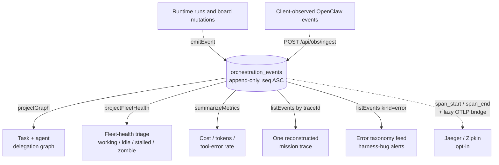

Clawboo treats every observability surface, the live team graph, the per-mission trace view, the fleet-health triage, the cost overlay, as a **projection of a single append-only event log**, not a hand-drawn diagram or a side channel. One table, `orchestration_events`, captures the orchestration stream; pure deterministic reducers fold that stream into whatever view a surface needs; replaying the same log always reproduces the same state. Tracing, error classification, and metrics all read the same log.

This page explains what observability is and isn't, the shape of the event log and its monotonic `seq` ordering, the projections (`projectGraph`, `projectFleetHealth`, `summarizeMetrics`), the runtime error taxonomy and the harness-bug rule, span tracing with its lazy OpenTelemetry bridge, and the live SSE tail.

## What it is, and what it isn't

Observability is **derived from the orchestration log, never authored alongside it**. A surface does not maintain its own view-model that a writer keeps in sync; it folds the log on demand. The log is the source of truth for _what happened_; the [board](/concepts/the-board) is the source of truth for _current task state_; the [runtime](/appendices/glossary) owns _how an agent runs_. Observability watches all three and persists what it sees.

It is **always on**. There is no feature flag and no opt-in. `createDb` bootstraps the `orchestration_events` table on every connection, the REST read surface serves unconditionally, and the local event log is the canonical trace store. OpenTelemetry export is the one piece that is opt-in: the OTel SDK is lazy-loaded only when an OTLP endpoint is configured, so a no-collector boot never even requires `@opentelemetry/*`.

It is **best-effort by discipline**, not by accident. A failed event append must never throw on the orchestration hot path; the emit choke-point swallows append failures. The event schema validates the correlation envelope strictly but treats the per-kind `data` payload as an open record, so a minor data-shape drift in a producer can never cause an event to be dropped. Observability that loses events to capture its own bugs is worse than useless, so it is built to capture best-effort and never to fail loud on the path it observes.

It is **not a logging framework**. Structured logs exist (the harness-bug alert is one), but the event log is a typed, queryable orchestration stream, not a free-text log stream. And it is **not the agent or session registry**; events reference agents, tasks, runtimes, and sessions by id; they own no identity.

## The model

Every observability view is a fold over one ordered list of events. The producers emit; SQLite assigns ordering; the reducers project.

Each box on the right is a _pure function of the log to the left_. None of them holds its own state; all of them can be re-derived at any time from a fresh read of the events.

## The event log

The log is a single SQLite table, `orchestration_events`. Its columns split into a correlation envelope (always present, always typed the same way) and a scrubbed JSON `data` blob (kind-specific):

| Column                                   | Purpose                                                                                     |
| ---------------------------------------- | ------------------------------------------------------------------------------------------- |
| `seq`                                    | Auto-increment integer primary key: the cross-process monotonic, never-reused ordering key. |
| `id`                                     | A random UUID (unique-indexed): the stable event identity independent of ordering.          |
| `ts`                                     | Wall-clock milliseconds at emit.                                                            |
| `kind`                                   | The event kind (one of 23, below).                                                          |
| `teamId`, `taskId`, `agentId`, `runtime` | Scoping / attribution ids.                                                                  |
| `traceId`, `spanId`, `parentSpanId`      | The trace + span tree (see [Tracing](#tracing-and-the-otel-bridge)).                        |
| `correlationId`                          | A free-form correlator (an execution id, for example).                                      |
| `data`                                   | Scrubbed, JSON-stringified kind-specific detail.                                            |
| `tenantId`                               | A dormant multi-tenant seam; no per-tenant filtering is active.                             |

### `seq` is the causal cursor

`seq` is the linchpin of the "replay reproduces state" property. It is an auto-increment integer assigned by SQLite _under the write lock_, so it is monotonic and unique across every writer, including the in-process server **and** the out-of-process MCP stdio bins that open the same database file. The default read order is `seq ASC` (causal order), a deliberate departure from the audit log's "most-recent-first" lineage feed. Because the reducers consume a `seq`-ordered list, a trace or graph replay is deterministic.

`seq` also doubles as the **SSE-tail cursor**: it is strictly monotonic and collision-free, so a live tail can resume from "everything after `seq = N`" without the timestamp-collision ambiguity that a wall-clock cursor would have.

### Append is insert-only and scrubbed

`appendEvent` mirrors the governance audit log: it inserts (never updates), scrubs secrets from `data` _before_ storage, and runs under the board's jittered write-retry (so concurrent writers don't trip over SQLite's single-writer lock). It omits `seq` so SQLite allocates it atomically. It is hardened against producer drift: an unrecognized `kind` is coerced to `error` rather than rejected, and `data` that won't serialize falls back to a `{ note: 'unserializable data' }` placeholder. The server wraps it in `emitEvent`, a try/caught choke-point that guarantees an append failure can never throw on the orchestration path.

### The 23 event kinds

The kind set is a frozen union. The producers and reducers stay typed through a TypeScript `KindToData` map, but the wire schema validates only the envelope, so an event is never lost to a `data` mismatch.

| Group            | Kinds                                                                           |
| ---------------- | ------------------------------------------------------------------------------- |
| Board lifecycle  | `task_created`, `task_claimed`, `status_changed`, `comment_added`, `dep_linked` |
| Execution        | `execution_started`, `execution_completed`                                      |
| Tool calls       | `tool_call`, `tool_result`                                                      |
| Cost             | `cost`                                                                          |
| Approvals        | `approval_requested`, `approval_resolved`                                       |
| Errors           | `error`                                                                         |
| Spans            | `span_start`, `span_end`                                                        |
| Session rotation | `session_rotated`                                                               |
| Routines         | `routine_fired`, `routine_dispatched`, `routine_completed`, `routine_error`     |
| Peer chat        | `team_chat_post`, `speaker_selected`, `turn_bound_hit`                          |

Board lifecycle events are emitted server-side by the [board](/concepts/the-board) REST handlers. The OpenClaw runtime, however, is observed _in the browser_, so the server never sees its tool calls directly. The `POST /api/obs/ingest` route closes that gap: the client mirrors its observed `tool_call`, `tool_result`, and `error` events into the log so the activity surface reads uniformly across every runtime. The ingest route is whitelisted to exactly those three kinds; board lifecycle is never accepted from the browser, because the server already emits it.

## Projections

Three pure reducers fold the event list. None mutates; each is deterministic given a `seq`-ordered input.

### `projectGraph`: the delegation graph

`projectGraph(events)` folds the log into a task-delegation graph and a derived agent graph. It walks the ordered events once, building:

- **Task nodes**: title, status, assignee, parent, runtime, team, accumulated cost.
- **Task edges**: a `delegation` edge from a parent task to each child (minted when `task_created` carries a `parentTaskId`), and a `dependency` edge for each `dep_linked`.
- **Agent nodes**: per-agent cost and the set of task ids the agent touched.
- **Agent edges**: agent→agent `delegation` edges, derived after the fold by joining each child task's assignee to its parent task's assignee.

Status is tracked across `task_created`, `task_claimed` (which advances a still-`todo`/`unknown`/`backlog` task to `in_progress`), and `status_changed`. Cost reconciliation is careful about double-counting: `cost` events are incremental, while an `execution_completed` carries the run's _final_ total, so the reducer takes the larger of the two per task. The same reducer powers the Ghost Graph's live overlay (per-Boo status pip and cost) and the dashboard's event-sourced graph view, both reading one projection, so they can never diverge.

<Info>
`projectGraph` and `projectFleetHealth` are pure and deterministic, no `Date.now()`, no `Math.random()` inside the fold. This is the property that makes "replay the log to reconstruct the graph" exact, and it is depended on by the replay test. `projectFleetHealth` takes `now` as an explicit argument precisely so it stays pure.
</Info>

### `projectFleetHealth`: the triage taxonomy

`projectFleetHealth(events, now)` is the time-sensitive view behind the fleet-health panel. It classifies each agent into one of four states by how long an _open_ execution (started, not yet completed) has gone quiet:

| Status    | Meaning                                                                                                        |
| --------- | -------------------------------------------------------------------------------------------------------------- |
| `working` | An execution is open and an event landed recently.                                                             |
| `idle`    | No open execution.                                                                                             |
| `stalled` | An execution is open but no event for ≥ `stallMs` (default 5 minutes).                                         |
| `zombie`  | An execution is open but no event for ≥ `zombieMs` (default 30 minutes); the process is almost certainly dead. |

A `zombie` is exactly what the board's orphan reconciliation reaps on the next restart; this triage view surfaces it live. Because the function takes `now` as a parameter, it stays a pure fold; the REST handler supplies `Date.now()` at call time.

### `summarizeMetrics`: cost, tokens, tool-error rate

`summarizeMetrics(events)` aggregates the run-level signals the cost overlays and trace view read: total USD, input/output tokens, the tool-error rate (`tool_result` events flagged `isError` over total tool results), per-kind event counts, active-agent count, and output tokens per minute over the observed window. It reconciles cost the same way `projectGraph` does: per run, taking `max(sum of incremental cost events, the final execution-complete total)`, so a runtime that reports cost only at completion reads the same total as one that streams it.

## The error taxonomy

Every runtime or tool failure is classified into a baseline of **expected** classes; anything that doesn't match is `Unknown`, and an `Unknown` is treated as a **harness bug**: a defect in Clawboo, not in the user's prompt or the provider. Clawboo surfaces the unknown loudly rather than swallowing it.

`classifyError(code, message)` runs an ordered list of regex rules over the combined error code and message. The order matters; more specific signals (rate-limit, user abort) are checked before the broader provider/environment buckets. The classes are:

| Class           | Matches (examples)                                           |
| --------------- | ------------------------------------------------------------ |
| `RateLimited`   | `429`, "rate limit", "too many requests", "quota"            |
| `UserAborted`   | "abort", "cancelled", `SIGINT`, `SIGTERM`                    |
| `Timeout`       | "timeout", "timed out", `ETIMEDOUT`, "deadline exceeded"     |
| `UnexpectedEnv` | `ENOENT`, `EACCES`, "command not found", "module not found"  |
| `InvalidArgs`   | `400`, `422`, "invalid argument", "validation", "malformed"  |
| `ProviderError` | `500`–`504`, "upstream", "overloaded", "service unavailable" |
| `Unknown`       | nothing matched                                              |

`isHarnessBug(cls)` returns `true` exactly when the class is `Unknown`. When the executor runner sees an error event, it classifies the failure, writes an `error` event with `errorClass` and a `harnessBug` flag in `data`, and, if it's a harness bug, also raises an error-level structured-log alert via `alertHarnessBug`. The `GET /api/obs/errors?harnessBug=true` query is the alert feed; it also returns a running `harnessBugCount`.

The taxonomy carries a per-runtime **baseline** of expected classes, so that later the _rate_ of an expected class can be alerted on as an anomaly while its mere occurrence is not. `Unknown` is never in any baseline; it always alerts immediately. (`isUnexpectedFor(runtime, cls)` encodes that policy.)

## Tracing and the OTel bridge

The trace layer maps the board's parent/child task hierarchy onto a span tree, with **zero context threading**. The mission's root task id derives a shared `traceId`; each run's `spanId` is derived from its _own_ task id; each run's `parentSpanId` is derived from its _parent_ task id. So the board ancestor chain _is_ the trace hierarchy; a delegated child task's run nests under its parent task's run automatically.

`withTaskSpan(meta, fn)` opens one task span per run. It emits a `span_start` event into the always-on event-log trace store, runs the body, and emits a `span_end` with `ok`/`error` status and a duration. Tool calls within the run are recorded as child spans (`recordToolSpan`). The run's `SpanCtx` (its `traceId`, `spanId`, `parentSpanId`, and a W3C `traceparent`) is handed to the body so the run's own `cost`/`tool`/`error` emits nest under it.

A trace is read back by `GET /api/obs/traces/:traceId`: all events sharing the `traceId`, ordered `seq ASC`, plus the `summarizeMetrics` summary. That reconstruction is the always-on representation; it works with no external collector.

The **OpenTelemetry bridge is the opt-in bonus**. It is lazy by design:

- The OTel SDK is `await import()`-ed exactly once, and only when `OTEL_EXPORTER_OTLP_ENDPOINT` (or `OTEL_EXPORTER_OTLP_TRACES_ENDPOINT`) is set, the same lazy-import contract the runtime adapters use for their SDKs.
- The whole init is try/caught: if the SDK isn't installed (a lean bundled CLI), the bridge silently degrades to event-log-only.
- When active, a cross-process parent's `traceparent` wins so a whole multi-process mission shares one trace; otherwise the OTel `traceId` is derived deterministically from the mission root. A child run pins under its parent run's span context, so a multi-run task renders as one nested trace in Jaeger.

<Note>
The `@opentelemetry/api` namespace is sourced from `@opentelemetry/sdk-node`'s re-export rather than a direct dependency. A direct top-level dependency would be picked up by drizzle-orm as an optional peer and duplicate the OTel instance. The bridge crosses a single `any` boundary on purpose; it is decoupled from OTel's deep types.
</Note>

## The live tail (SSE)

`GET /api/obs/stream` is a Server-Sent-Events live tail of the log, scoped by team, task, or agent. It is a short-interval (750 ms) DB poll keyed on the `seq` cursor rather than an in-process emit hook; so it is **cross-process correct**: it catches writes from the MCP stdio bins, not just the in-process server. Each pushed event uses its `seq` as the SSE `id`, so an `EventSource` resumes from `Last-Event-ID` (or `?since=<seq>`) after a disconnect. Each event's `data` is redacted on the way out (see below).

The stream opens a fresh `better-sqlite3` handle per connection and closes it on `req`/`res` close, so a long-lived or dropped stream doesn't leak a database handle.

## Redaction on display

The event log already scrubs secrets _at write time_ (`appendEvent`). The read surface adds a second, independent layer: every payload-bearing obs response (`/events`, `/traces/:traceId`, `/stream`) masks any credential-shaped key or value in each event's JSON `data` before it reaches the browser. The two layers are defense-in-depth; a credential that slipped past the storage scrub (or was written by an older code path) still never renders. Numeric cost and token fields survive the mask so the metrics stay correct.

## Design rationale and trade-offs

The log-and-project model is a deliberate bet against the failure mode where a UI view-model drifts from reality because a writer forgot to update it. Making every surface a _pure projection of an append-only log_ means there is exactly one writer convention (`emitEvent`) and the views are re-derivable; a surface can never silently hold stale state, because it holds no state. The cost is that the log grows unboundedly and every view re-folds it on read; for the team-scale workloads Clawboo targets, that read cost is acceptable and the indexes (`(team_id, seq)`, `(task_id, seq)`, `(trace_id, seq)`) keep the common scopes fast.

Keeping the event-log trace store _always on_ and the OTLP export _opt-in_ is the other deliberate split. Observability that needs an external collector to be useful is observability most installs won't run; the local store gives every install a queryable trace view out of the box, and Jaeger/Zipkin is there for operators who want it. The harness-bug rule follows the same instinct: an unknown failure is treated as Clawboo's bug and surfaced as an alert, because the alternative, swallowing it as "some provider error", is how a harness rots.

## Boundaries and non-goals

- **Not a metrics time-series database.** The log is an orchestration event stream, not Prometheus. `summarizeMetrics` aggregates over a queried window on demand; there is no retention policy, downsampling, or long-horizon storage tuned for time-series queries.
- **Not the audit log.** The governance audit log is a separate, "most-recent-first" lineage feed for forensics; the orchestration log is `seq ASC` for replay. They mirror each other's insert-only / scrub discipline but serve different reads.
- **OTLP export is opt-in, not bundled.** A lean bundled CLI degrades to event-log-only; the OTel SDK is only required when an OTLP endpoint is configured and the SDK is present.
- **Single implicit tenant today.** `orchestration_events.tenant_id` is a dormant column; no per-tenant filtering is active in v0.2.0. Multi-tenant scoping is a future seam, not a shipped feature.

<Note>
These docs describe Clawboo **v0.2.0**, the current release.
</Note>

## See also

- [The board](/concepts/the-board): the task state the log narrates, and whose ancestor chain becomes the trace hierarchy
- [Governance](/concepts/governance): budgets, circuit breakers, and the audit log the obs log mirrors in discipline
- [Delegation and orchestration](/concepts/delegation-and-orchestration): the orchestrator whose decisions become events
- [Observability dashboard](/using/observability-dashboard): the UI over these projections
- [Observability API](/reference/rest-api/observability): the REST surface, SSE tail, and `/api/eval/smoke`
- [Events and errors reference](/reference/events-and-errors): the full event-kind and error-class catalog
- [`@clawboo/obs`](/reference/packages/obs): the pure schema / reducer / taxonomy package
- [Glossary](/appendices/glossary): canonical term definitions
