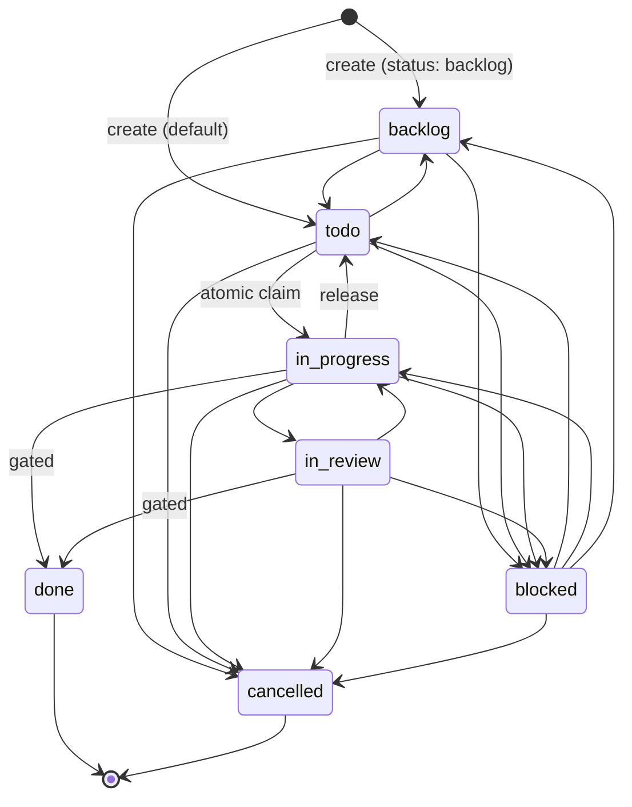

The board is Clawboo's durable, transactional source of truth for task coordination. It is a set of SQLite tables, `tasks`, `task_deps`, `task_comments`, `workspaces`, and `execution_processes`, fronted by a single data-access layer that every other subsystem goes through. When a team delegates work, the work becomes a board task; when an agent picks up work, it atomically claims a board task; when a run completes, the outcome lands on the board. Refresh the page, restart the server, run twelve agents at once against one database file; the board survives all of it.

This page explains what the board is and isn't, the task lifecycle and its legal transitions, the atomic claim that makes single-assignee work race-free, dependency chains, the link to per-task worktrees, the write-contention recipe that keeps many concurrent writers honest, and how orphaned and stale work is recovered.

## What it is, and what it isn't

The board is **canonical for task and coordination state**; chat is **narration** of that state. A board mutation is the decision of record. A chat message is a description of a decision, never a write path back to the board. The REST handlers reflect each board mutation into the team chat room _after_ the canonical write completes, best-effort, precisely so the narration can never become the authority.

The board does **not** duplicate agent or session state. _Who exists_ lives in the agent [registry of record](/appendices/glossary); _how an agent runs_ lives in its [runtime](/appendices/glossary). The board references agents and runtimes by id and owns only _task_ state: title, status, assignee, priority, dependencies, the worktree pointer, the cost ledger, and a verification verdict. It is the dispatcher; the [worktree](/concepts/worktrees-and-handoff) is the world the dispatched work happens in.

The board is the substrate beneath [delegation and orchestration](/concepts/delegation-and-orchestration): the orchestrator turns structured delegation signals into board tasks, and the board's primitives (claim, dependencies, status transitions) are what make that orchestration durable and race-free.

## The task lifecycle

A task moves through seven statuses. The full set is `backlog`, `todo`, `in_progress`, `in_review`, `blocked`, `done`, and `cancelled`. `done` and `cancelled` are terminal; they have no outgoing transitions. A newly created task defaults to `todo` (immediately claimable) unless the caller asks for `backlog` (triage-only, not yet ready to work).



The transition table is the single authority on what is legal:

| From          | Legal `to` states                                   |
| ------------- | --------------------------------------------------- |
| `backlog`     | `todo`, `blocked`, `cancelled`                      |
| `todo`        | `in_progress`, `blocked`, `backlog`, `cancelled`    |
| `in_progress` | `in_review`, `done`, `blocked`, `todo`, `cancelled` |
| `in_review`   | `done`, `in_progress`, `blocked`, `cancelled`       |
| `blocked`     | `todo`, `in_progress`, `backlog`, `cancelled`       |
| `done`        | _(terminal)_                                        |
| `cancelled`   | _(terminal)_                                        |

A few rules are worth calling out:

- **Same-status is an idempotent no-op** and always allowed, so re-emitting a transition does no harm.
- **`in_progress → todo` is the release path.** A task can fall back to `todo` to be re-claimed; doing so clears the assignee (and the assignee runtime), so the [atomic claim](#the-atomic-claim) can re-acquire it. It also clears the stored verification verdict, because releasing for re-claim is a cross-runtime rebind boundary; a previous runtime's failing verdict must not gate a fresh runtime's legitimate completion.
- **`in_progress` and `in_review` are "locked" statuses.** While a task is in one of them it is actively owned, and its assignee must not be reassigned.

Status changes go through one function that enforces the table against the freshly read row, inside a write transaction, so a stale pre-check from a concurrent caller can never sneak through. A REST-layer pre-check, if any, is only fast-fail ergonomics; the transactional check is the real gate. An illegal transition returns a `409` from the REST layer.

<Info>
Reaching `done` carries an intrinsic verification gate. Any transition to `done` is rejected with `verification_required` when the task carries a non-promotable verification verdict (a failing deterministic gate, including red-gate `completed_with_debt`). This is the builder-≠-judge rule enforced in the board itself, un-bypassable by any caller except an explicit, audited `humanOverride`. A task with *no* stored verdict is unverified, not failing, and lands `done` normally. See [Verification](/concepts/verification).
</Info>

## The atomic claim

A task is worked by exactly one assignee. The board guarantees this with a single conditional UPDATE rather than a read-then-write:

```sql
UPDATE tasks
   SET assignee_agent_id = ?, assignee_runtime = ?, status = 'in_progress', updated_at = ?
 WHERE id = ?
   AND status = 'todo'
   AND assignee_agent_id IS NULL
   AND dropped = 0
RETURNING *
```

Because the guard (`status='todo' AND assignee IS NULL AND dropped=0`) is part of the same atomic statement that does the write, at most one concurrent caller can win. The winner gets the updated row back; every loser gets zero rows.

That zero-row result is **data, not an error**. The claim function returns `{ ok: false, reason: 'conflict' }` and the REST layer maps it to a `409`. The rule the whole system follows is **never retry a 409**; a conflict means someone else legitimately owns the work, so a retry would either no-op or fight for a task that is already taken. (A `404` `not_found` distinguishes "the task doesn't exist" from "someone already claimed it.")

<Tip>
The "never retry a 409" rule is structural. The contention layer that wraps the claim retries *only* transient SQLite lock errors; it explicitly returns a 0-row result to the caller unretried, so application-level conflicts and database-level lock contention are handled by completely different mechanisms. See [the contention recipe](#the-contention-recipe).
</Tip>

Stale re-claim of a dead, abandoned `in_progress` task is deliberately _not_ the claim's job. Liveness lives in one place; [reconciliation](#orphan-and-stale-reconciliation) releases such a task back to `todo`, after which an ordinary claim re-acquires it.

## Dependencies

Tasks form a blocks / blocked-by graph in the `task_deps` table. Linking a dependency means "this task won't become ready to work until that task is `done`." A composite primary key on `(task_id, depends_on_task_id)` prevents duplicate edges, and inserts are conflict-tolerant, so re-linking is harmless.

A task is **ready** when it is `todo`, not dropped, and _every_ one of its dependencies is `done`. Plans become dependency chains: each step depends on the prior step, and an orchestration ready-pump fires the next step the moment its blocker completes. Ready tasks are ordered by priority (descending), then by recency.

Dependencies also drive failure recovery. When a blocker fails, moves to `blocked` or otherwise can't reach `done`, its downstream chain can never become ready and would otherwise sit as permanent ghost `todo` cards. The board can cancel the still-pending (`todo` / `backlog`) transitive dependents of a failed task via a recursive walk of the dependency graph, returning the cancelled rows so the orchestrator can report the stalled plan to the team leader. Tasks already `in_progress`, `done`, or `cancelled` are left untouched.

The board similarly walks the _parent_ chain (via the self-referential `parent_task_id`) with a recursive query to compute a task's ancestors, used to enforce delegation depth limits. Both recursive reads validate their raw SQL output with a schema at runtime rather than trusting the type system over a raw query.

## Worktree linkage

When a task involves file mutation, it gets an isolated git [worktree](/concepts/worktrees-and-handoff) so concurrent runs never collide. The board doesn't own that worktree; it owns a _pointer_ to it. Two columns on the task, `worktree_ref` and `branch_ref`, record where the isolated work lives; a `workspaces` row tracks the worktree's own lifecycle (`active`, then `archived` on cleanup or `stale` on garbage collection). The board is annotating the durable task with a filesystem location; the worktree subsystem owns the actual checkout and the system-of-record files inside it.

Read-only or research tasks don't pay the worktree cost; provisioning a worktree for a non-file-mutating task is refused (the REST layer returns `422`). The worktree is for the concurrency boundary that file-mutating work needs.

## Execution processes

Each spawned run for a task is recorded as an `execution_processes` row, a per-run ledger that exists for any executor. An exec row is opened only _after_ a successful claim, starts in `running`, and is closed with an outcome (`succeeded`, `failed`, `timed_out`, or `cancelled`) plus an optional token / cost ledger and git before/after commit checkpoints. This ledger is what crash recovery reads on restart, which is why an executor that starts work must open one and close it.

## The contention recipe

Clawboo is team-first: many agents may write one SQLite file. Without care, concurrent writers hit SQLite's single-writer lock and degrade into a "convoy." The board's answer is a layered recipe: three connection-level pragmas plus two application-level pieces.

Every database connection sets:

| Pragma               | Value        | Why                                                                               |
| -------------------- | ------------ | --------------------------------------------------------------------------------- |
| `journal_mode`       | `WAL`        | Write-ahead logging lets readers and a writer proceed concurrently.               |
| `busy_timeout`       | `1000` (ms)  | Wait up to a second for the write lock before erroring, dodges the convoy effect. |
| `wal_autocheckpoint` | `50` (pages) | A passive checkpoint keeps the WAL lean without an app-level write counter.       |
| `synchronous`        | `NORMAL`     | Standard WAL durability/performance balance.                                      |
| `foreign_keys`       | `ON`         | Referential integrity is enforced.                                                |

On top of those, the board's data-access layer adds two application-level mechanisms:

- **Jittered retry.** Writes are wrapped so that _only_ transient lock errors (`SQLITE_BUSY`, `SQLITE_BUSY_SNAPSHOT`, `SQLITE_LOCKED`) are retried, with a jittered backoff (20–150 ms, at most 15 attempts). A 0-row result, like a lost claim race, is returned to the caller unretried, which is what lets callers honor the never-retry-a-409 rule. Any other error propagates immediately.
- **`BEGIN IMMEDIATE` transactions.** Multi-step writes (status transitions, reconciliation passes) acquire the write lock up front rather than escalating mid-transaction, which avoids lock-escalation deadlocks. The whole transaction re-runs from scratch on a transient lock error.

<Note>
Because `better-sqlite3` is fully synchronous, the retry uses a synchronous, non-busy-spinning sleep (`Atomics.wait`); making every repository method async just to back off would be a needless cost.
</Note>

## Orphan and stale reconciliation

Two recovery passes keep the board from accumulating stuck work: one for crashes, one for abandonment.

**Orphan reconciliation runs once at startup.** Any execution row still marked `running` belonged to a process that died with the previous server. The pass marks each such execution `failed`, sets a `recovery_tombstone` so a second pass is a no-op (no infinite auto-resume), and releases its task back to `todo` so a fresh claim can pick it up. It runs in a single `BEGIN IMMEDIATE` transaction and never blocks boot.

**Stale-task reconciliation runs on an interval.** It is a backstop for an `in_progress` task whose driving client view simply went away (the in-browser idle watchdog only runs while a team chat is mounted). A task that is `in_progress`, whose `updated_at` is older than a TTL, and whose execution is still `running` is timed out and released to `todo`. The TTL is deliberately generous, much longer than the client's own watchdog, because `tasks.updated_at` is bumped only on status/claim writes, not on every agent event, so a long-but-active run must never be falsely swept. A boot pass plus a periodic interval cover both startup and steady state.

<Danger>
`tasks.updated_at` is **not** a liveness signal for the in-browser OpenClaw path; there is no server-side execution heartbeat that bumps the task row mid-run. The stale sweep is purely a "nobody is watching" backstop with a long TTL (60 minutes by default, tunable via `CLAWBOO_BOARD_STALE_TTL_MS`). A live client's own watchdog fails a genuinely hung delegate long before this fires; a re-mounted client re-attaches an orphaned `in_progress` task and re-runs its watchdog.
</Danger>

## Design rationale and trade-offs

The board exists because narration-only orchestration is fragile: a chat transcript can't be transactionally claimed, can't survive a refresh as authority, and can't tell a crashed run from a slow one. Making the board canonical buys durability (state survives restart), race-freedom (the atomic claim), and recoverability (the two reconciliation passes), at the cost of a second persistence layer beside the runtime's own session state.

SQLite is a deliberate choice: it ships in-process, needs no server, and, with the WAL recipe, handles the team-scale concurrency Clawboo needs without a database to administer. The single data-access layer is the seam where a future SQLite→Postgres or multi-tenant move would land; the dormant `tenant_id` column on every board table is the placeholder for that.

## Boundaries and non-goals

- **Not a general-purpose project tracker.** The board exists to coordinate agent execution, not to replace a human-facing issue tracker. Its statuses, transitions, and recovery passes are tuned for runtime-driven work.
- **Not the agent or session registry.** The board references agents and sessions by id and owns no agent identity, agent files, or live session state. Those belong to the registry of record and the runtime.
- **Single implicit tenant today.** Every board table carries a `tenant_id` column, but it is a dormant seam; no per-tenant filtering is active in v0.2.0. Multi-tenant scoping is a future seam, not a shipped feature.

<Note>
These docs describe Clawboo **v0.2.0**, the current release.
</Note>

## See also

- [Delegation and orchestration](/concepts/delegation-and-orchestration), how delegation signals become board tasks
- [Verification](/concepts/verification), the builder-≠-judge gate on `→ done`
- [Worktrees and handoff](/concepts/worktrees-and-handoff), the isolated world a task's work happens in
- [Database schema](/reference/database-schema), the full table definitions
- [Board API](/reference/rest-api/board), the REST surface over these primitives
- [Glossary](/appendices/glossary), canonical term definitions
