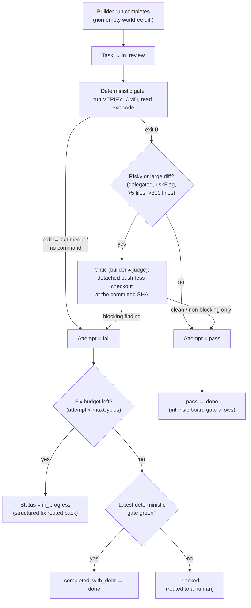

Verification is the rule that makes `done` mean _verified_. A code task that mutated files can reach `done` only when two independent checks agree: a **deterministic gate** (the task's own build/test/lint command, judged by its exit code) passes, and, on a green gate, for a risky or large change, a read-only **critic** (an independent reviewer that cannot push) raises no blocking finding. The principle underneath is **builder≠judge**: the agent that did the work never certifies its own work. A generator self-grading is a known failure mode; Clawboo's only signals into `done` are a machine truth (an exit code) and a structurally-independent reviewer.

This page explains what verification is and isn't, the two-layer model and the typed verdict it produces, the [swe-af](/appendices/glossary) severity taxonomy that rations blocking, the bounded fix loop and its `completed_with_debt` exit, and the intrinsic board gate that makes the rule un-bypassable.

<Info>
The verification gate is **intrinsic to the board state machine**, not an opt-in step. Any transition to `done` is rejected when the task carries a non-promotable verdict, by *any* caller, including the generic board PATCH route, the Tasks-MCP `update_status` tool, and the orchestrator. The only escape is an explicit, audited `humanOverride`. See [The intrinsic board gate](#the-intrinsic-board-gate).
</Info>

## What it is, and what it isn't

Verification is a **gate on `→ done` for file-mutating work**, not a continuous test runner and not a quality score. It runs once, at completion, when a task's worktree carries a non-empty diff. It produces a typed verdict that the board state machine reads mechanically, never prose a model can argue with.

A few things verification is _not_:

- **Not a quality opinion.** The deterministic gate is an exit code, not a judgement; the critic emits structured findings against a fixed severity taxonomy, not a free-form review.
- **Not run on every change.** A read-only task, a research task, an empty diff, or a small low-risk diff is not sent to the critic; a model is spent only where it earns its keep (see [When the critic runs](#when-the-critic-runs)).
- **Not a deadlock.** When the fix loop is exhausted, the task is marked `completed_with_debt` rather than stuck forever; but that exit is itself gated (see [The bounded fix loop](#the-bounded-fix-loop-and-completed_with_debt)).
- **Not applicable to non-worktree work.** A task with no isolated [worktree](/concepts/worktrees-and-handoff) (an OpenClaw-substrate run, a non-file-mutating native run) has no diff to verify, so it carries _no_ verdict; and a task with no verdict is unverified, not failing.

The board owns _where_ the gate lives (the `→ done` transition and a single verification cell on the task row); the [worktree](/concepts/worktrees-and-handoff) subsystem owns the isolated checkout the gate runs in; the verification subsystem owns the gate-and-critic composition. Verification is downstream of [delegation](/concepts/delegation-and-orchestration): the orchestrator routes a structured failure verdict back to the team leader as a real, actionable fix request, not the string "FAIL".

## The model

The completion path for a file-mutating task: land the work in review, run the deterministic gate, run the critic only if the gate is green and the diff is risky, then map the verdict to a terminal status. The board gate then enforces that mapping.

## The two layers

### The deterministic gate

The deterministic gate is the strongest signal because it reads a truth, not an opinion. It runs the task's configured verify command, the build/test/lint command from the worktree's [system-of-record](/appendices/glossary), inside the isolated worktree and records the result as a typed `DeterministicResult` (`command`, `exitCode`, `passed`, scrubbed stdout/stderr tails, `durationMs`, `timedOut`).

The command is resolved without scraping rendered output. The scaffold writes `VERIFY_CMD='<shell-quoted>'` into `init.sh` and a `` - Verify: `<cmd>` `` line into `VERIFICATION.md`; the gate parses that structured line (`init.sh` first, then `VERIFICATION.md`) and reverses the bash single-quote escaping. `passed` is true only when the command exits `0` and did not time out. A timeout kills the whole process tree (the shell wrapper plus the real test runner it spawned). The command + a scrubbed output tail are appended to `VERIFICATION.md` as evidence; the typed verdict on the task is the source of truth.

A **missing or placeholder verify command is a structured `fail`**, not a skip. `done` requires real evidence, so the absence of a check cannot certify completion; an unconfigured task fails the gate with `(none configured)` until someone sets `VERIFY_CMD`.

<Note>
The deterministic gate uses `shell: true` because the verify command is a free-form shell string (unlike the runtime drivers, which spawn a known binary by argv). It sets `windowsHide` to suppress the console popup on Windows, matching the repo's spawn convention.
</Note>

### The critic

When the gate is green and the change is non-trivial, an independent reviewer runs second. The critic's independence is **structural**: it provisions a _detached_ review worktree, checked out at the work's committed SHA with no branch, so the reviewer literally has nothing to push and cannot mutate the builder's branch. It then drives a reviewer adapter with a structured-output instruction and parses a typed `CriticVerdict`.

Independence is layered. At minimum it is **context-level**: a fresh session, a detached push-less checkout, and _no builder home directory_; the reviewer never shares the builder's persisted native memory. When an operator sets a distinct reviewer model via `CLAWBOO_REVIEWER_MODEL`, independence becomes **model-level** too. The stored verdict records the `reviewerModel` and `reviewerRuntime`, so a same-model review's bias caveat stays visible rather than hidden.

The critic is asked to emit **only** a single JSON object of `findings`, each a typed `Finding` with a severity, a title, an optional body / file path / start line, and a confidence. The output is parsed through the same structured-judge drive the eval grader uses (`@clawboo/obs`): valid JSON yields findings, an empty result yields no findings (a valid, good outcome), and **anything unparseable becomes a single non-blocking `other` finding rather than a crash**. A malformed or failed critic must never block the deterministic verdict; the gate is the hard signal; the critic is the second opinion.

#### When the critic runs

The critic is rationed. It fires only when at least one of these is true:

| Trigger                     | Why                                                          |
| --------------------------- | ------------------------------------------------------------ |
| `riskFlag` set              | The task was explicitly flagged sensitive.                   |
| Task has a parent           | Delegated work (delegation depth > 0) is inherently riskier. |
| More than 5 files changed   | A large surface deserves review (default threshold).         |
| More than 300 changed lines | A large diff deserves review (default threshold).            |

A small, undelegated, unflagged change skips the critic entirely (`ran: false`), no review worktree, no model spend, and its verdict comes from the deterministic gate alone. The thresholds (`files`, `lines`) are overridable.

## Composing one verdict

The two layers fold into a single attempt status, with the deterministic gate as the hard authority:

- A **red gate is always `fail`**, full stop, the critic never even runs.
- A **green gate plus a critic with a blocking finding is `fail`**, route the fix back.
- A **green gate with the critic not run, or only non-blocking findings, is `pass`**.

What counts as _blocking_ is the rationed-blocking rule. Only five severities force a fix back to the specialist; the rest are debt, recorded, never deadlocking.

| Severity                                   | Class       |
| ------------------------------------------ | ----------- |
| `security`                                 | block       |
| `crash`                                    | block       |
| `data_loss`                                | block       |
| `wrong_algorithm`                          | block       |
| `missing_ac` (missing acceptance criteria) | block       |
| `style`                                    | warn (debt) |
| `perf`                                     | warn (debt) |
| `other`                                    | warn (debt) |

This is deliberate: a style nit or a perf observation must not deadlock a task, but a security hole, a crash, data loss, a wrong algorithm, or unmet acceptance criteria must. Rationing blocking to genuine defects keeps the fix loop from churning on cosmetics.

A failing attempt does not return the string "FAIL". It carries a structured `{ what, why, howToFix }`, for a red gate, the failing command and its scrubbed output tail; for blocking critic findings, the list of `[severity] title (file:line)`, so the leader routes a concrete fix, not a guess.

## The bounded fix loop and `completed_with_debt`

The independent evaluator is _permanent_; only the _retry budget_ is bounded. Each verify attempt is recorded in an `attempts[]` array on the task, that array **is** the loop history, which is why the `→ done` gate is a single-row read.

After a failing attempt, the loop decides whether to retry or stop. If the attempt count (including the one just completed) is below `maxCycles` (default 3), the task goes back to `in_progress` with the structured fix note and the specialist tries again. Once the budget is exhausted, the task is marked **`completed_with_debt`**, never a deadlock, and the open issues are recorded as `debtNotes` (each a `{ criterion, severity, justification }`).

`completed_with_debt` is **not** an unconditional pass. Its promotability is the load-bearing rule:

- `completed_with_debt` **over a green deterministic gate** (the gate passed; only non-blocking critic findings remain unresolved) → **promotable to `done`**. The debt covers reviewer findings the loop couldn't resolve in budget, not a broken build.
- `completed_with_debt` **over a red deterministic gate** (the build/test gate is still failing after the loop exhausts) → **not promotable**. A red gate is the canonical blocking case; it routes to `blocked` for a human rather than silently shipping.

The completion path enforces exactly this: a `pass` verdict lands `done`; a debt-over-green verdict lands `done`; a debt-over-red verdict lands `blocked` with a system comment explaining why; any other `fail` reverts to `in_progress`.

## The intrinsic board gate

The rule above is enforced in the board state machine itself, so it cannot be skipped by reaching `done` through a different door. Every transition to `done` runs a single shared check, `isVerdictPromotable`, against the freshly-read task row inside a `BEGIN IMMEDIATE` transaction:

- **`pass`** → promotable.
- **`completed_with_debt`** → promotable _only_ if the latest attempt's deterministic gate was green.
- **anything else** (`fail`, or an unparseable verdict that _is_ present and non-promotable) → not promotable.
- **no stored verdict** → the task is unverified, not failing, and lands `done` normally. The gate blocks _known-failing_ verdicts, not un-run verification. (An unparseable-but-present cell is treated leniently, if promotability can't be determined, the gate doesn't block.)

When the verdict is non-promotable, the transition returns `verification_required`, which the [board REST](/reference/rest-api/board) layer maps to a `409`. The same `isVerdictPromotable` rule is used by both the state machine and the worktree completion path, so "done means verified" holds at every entry point.

The one escape is `humanOverride`, a human deciding to ship despite a non-promotable verdict. It is the _only_ way a task with a known-failing verdict can reach `done`, and the caller must audit it: the `PATCH /api/board/:taskId` handler writes a `verification` audit row (`{ override: true, route: 'board_patch', priorStatus, to: 'done' }`) whenever an override-to-`done` succeeds. The override is never silent.

<Danger>
Releasing a task back to `todo` (the `in_progress → todo` re-claim path) **clears the stored verification verdict**. This is intentional: a release is a cross-runtime rebind boundary, and a previous runtime's failing verdict must not gate a fresh runtime's legitimate completion. The next runtime re-verifies from scratch.
</Danger>

## Design rationale and trade-offs

Verification exists because a self-grading generator is unreliable, and because "the agent said it's done" is not evidence. Making `done` mean _verified_ buys a real completion guarantee, at the cost of a verify command per task and, on risky changes, a second model run.

The two-layer split is deliberate. The deterministic gate is cheap, objective, and non-negotiable: a red gate is always a failure, with no model in the loop to be talked out of it. The critic adds judgement that an exit code can't capture (a security hole that still compiles, a wrong algorithm that still passes thin tests); but judgement is expensive and a same-model self-review is biased, so it is rationed to risky surfaces and made structurally independent (detached, push-less, no shared home).

`completed_with_debt` is the honest middle. A purely binary gate either deadlocks on an un-fixable nit or ships broken work; bounding the _retry budget_ (not the evaluator) and recording debt lets a green-gate task with unresolved style findings ship with a paper trail, while keeping a red-gate task out of `done` and in front of a human. The trade-off is that some non-blocking findings ship as recorded debt rather than being fixed.

Making the gate intrinsic to the state machine, rather than a step the orchestrator is trusted to call, is what makes the rule un-bypassable. The cost is a small inline read of the verification cell on every `→ done` transition; the benefit is that no caller (MCP tool, REST route, future orchestrator) can route around it without the audited override.

## Boundaries and non-goals

- **Not a CI system.** Verification runs the task's own verify command once at completion; it does not provide a pipeline, scheduling, caching, or matrix builds.
- **Only worktree-backed work is verified.** Tasks without an isolated worktree carry no verdict and land `done` un-gated. Verification is for file-mutating work that has a diff to check.
- **The critic's model independence is opt-in.** Without `CLAWBOO_REVIEWER_MODEL`, the critic reuses the run's own adapter factory; independence is context-level (fresh session, detached checkout, no builder home), and the verdict records the reviewer model so the same-model caveat is visible.
- **The deterministic gate trusts the configured command.** It reads an exit code; it does not validate that the command actually exercises the change. A weak `VERIFY_CMD` yields a weak gate.

<Note>
These docs describe Clawboo **v0.2.0**, the current release.
</Note>

## See also

- [The board](/concepts/the-board), the state machine the `→ done` gate lives in
- [Governance](/concepts/governance), budgets, circuit breakers, caps, and approvals that bound a run
- [Worktrees and handoff](/concepts/worktrees-and-handoff), the isolated checkout the gate runs in and the system-of-record `VERIFY_CMD` lives in
- [Delegation and orchestration](/concepts/delegation-and-orchestration), how a structured fix verdict routes back to the leader
- [Board API](/reference/rest-api/board), the REST surface, including the `409 verification_required` and the audited `humanOverride`
- [Glossary](/appendices/glossary), canonical term definitions
