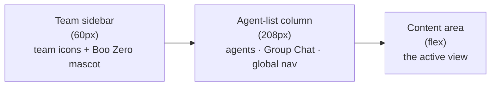

The Clawboo dashboard is a single-page app with a stable three-column shell and one large content area that swaps between views. This page is a map: it walks the shell left-to-right (team sidebar, agent-list column, content area), explains the **view modes** that decide what fills the content area, and clarifies the one distinction newcomers trip on most: **Atlas** (the global, all-teams [Ghost Graph](/concepts/teams-and-planes)) versus the **per-team Ghost Graph** you see inside a team's group chat.

Read this after you've finished onboarding ([native](/getting-started/quickstart-native) or [OpenClaw](/getting-started/quickstart-openclaw)) and have at least one team. If the dashboard is empty, [deploy your first team](/getting-started/first-team) first.

## The shell

The app is three persistent columns plus a swappable content area:

The team sidebar (column 1) and the content area (column 3) are always present. The agent-list column (column 2) is hidden in two cases: when you're in the standalone **Boo Zero** view, and when you collapse it with the sidebar's collapse toggle. The Boo Zero view dedicates the whole window to Boo Zero's agent detail, so the agent list, which is team-scoped, has nothing to show.

<Note>
Widths are fixed: the team sidebar is 60px, the agent-list column is 208px. The content area takes the rest. There's no draggable shell divider; the only resizable seams are *inside* views (the agent detail panels, the group-chat graph/chat split).
</Note>

### Team sidebar (column 1)

The leftmost strip is a Discord-style icon rail. Top to bottom:

- **The Boo Zero mascot** (the Clawboo logo). Clicking it deselects any team and opens the standalone **Boo Zero** view. [Boo Zero](/concepts/agent-model) is the universal team leader, teamless in the registry, but present in every team. Right-clicking the mascot offers "Show all agents," which clears the team filter and opens [Atlas](#atlas-vs-the-per-team-ghost-graph).
- **One icon per active team** (its emoji on its color). Clicking a team icon selects that team _and_ opens its **group chat** directly, not Atlas. A Discord-style pill marks the selected team. Right-clicking a team icon opens a context menu: archive/unarchive, "Refresh Protocol" (regenerate each agent's routing file), "Delete team only" (orphan the agents), or "Delete with agents."
- **The "+" button** opens the create-team modal.
- **The collapse toggle** hides or shows the agent-list column.

Archived teams are filtered out of the rail; unarchive one from a team's context menu while it's still visible, or before archiving.

### Agent-list column (column 2)

This column is **team-scoped**: it shows the agents of the selected team (or all agents when no team is selected), filtered live by the search box. Top to bottom:

- **The team header**: the selected team's name (or "All Agents") plus the visible agent count.
- **The search box**: filters the agent list by name as you type.
- **The Group Chat row**: when a team is selected and has agents, a single row at the top of the list shows the team "photo" (a stack of up to four overlapping Boo avatars, leader first, with a "+N" badge for larger teams) and an aggregate team-status badge. Clicking it opens the team's [group chat](/concepts/peer-chat). It's styled to read as a peer of the agent rows beneath it, not a section header.
- **The agent rows**: each Boo with its avatar, name, a live status badge (Idle / Working / Error / Sleeping, with a fine-grained activity verb when running), and a "seen X ago" timestamp. Clicking a row opens that agent's detail view. A trash icon appears on hover to delete the agent.
- **Create Boo**: adds a new agent to the selected team (shown only when connected to a runtime that can create agents).
- **The global nav**: anchored to the bottom of the column, split into a primary block and a secondary block.

The global nav is where you reach every dashboard view that isn't an agent or a team chat:

| Block     | Item                    | View it opens                                    |
| --------- | ----------------------- | ------------------------------------------------ |
| Primary   | **Atlas** _(All Teams)_ | The global Ghost Graph                           |
| Primary   | **Fleet** _(Overview)_  | Fleet-health summary                             |
| Primary   | **Marketplace**         | Browse 304 agents and 82 teams                   |
| Secondary | **Board**               | The durable kanban board                         |
| Secondary | **Runtimes**            | Connect/manage runtimes                          |
| Secondary | **Memory**              | Shared-memory browser                            |
| Secondary | **Governance**          | Budgets, caps, audit, approvals                  |
| Secondary | **Capabilities**        | The capability inventory                         |
| Secondary | **Approvals**           | Pending tool/exec approvals (with a count badge) |
| Secondary | **Scheduler**           | Routines (scheduled team work)                   |
| Secondary | **Tokens Used**         | Cost dashboard                                   |
| Secondary | **System**              | Gateway control, model, API keys                 |
| Secondary | **Observability**       | Traces, errors, fleet health, evals              |
| Secondary | **System Health**       | Boot probe + degradation checks                  |

The theme toggle sits below the nav.

### Content area (column 3)

The content area renders exactly one view at a time, chosen by the current **view mode** (see below). When you switch views, the old view fades out and the new one fades in. Pressing `Escape` from an agent, Boo Zero, or group-chat view returns you to the welcome screen.

## View modes

The dashboard's state is a single discriminated union, the `ViewMode`, and the content area is a `switch` over it. There are five shapes:

| View mode   | What it shows                            | How you reach it                                 |
| ----------- | ---------------------------------------- | ------------------------------------------------ |
| `welcome`   | The welcome screen                       | `Escape` from a chat/agent view, or no selection |
| `agent`     | An agent's three-panel detail view       | Click an agent row                               |
| `booZero`   | Boo Zero's detail view (column 2 hidden) | Click the mascot                                 |
| `groupChat` | A team's group chat (graph + chat split) | Click a team icon or the Group Chat row          |
| `nav`       | One of the 14 nav panels                 | Click a nav item                                 |

The `nav` mode carries a `view` field, one of `graph` (Atlas), `fleet`, `approvals`, `cost`, `marketplace`, `scheduler`, `system`, `obs`, `board`, `runtimes`, `memory`, `governance`, `capabilities`, `health`. The dashboard opens on `nav: graph` (Atlas) by default, so a fresh launch lands you on the org-wide map.

### Keyboard navigation

- `Escape`: leave an agent / Boo Zero / group-chat view back to the welcome screen (ignored while a file-editor overlay is open or you're typing).
- `Cmd/Ctrl + 1…6`: jump to a nav view, in this order: **1** Atlas, **2** Marketplace, **3** Approvals, **4** Scheduler, **5** Cost, **6** System.

## Atlas vs the per-team Ghost Graph

The single most useful thing to internalize: **the same Ghost Graph component renders at two scopes**, and which one you're looking at depends on how you got there.

- **Atlas** is the Ghost Graph at **`atlas` scope**. It ignores the selected team and pulls _every_ agent onto one canvas, with Boo Zero presiding at the top of the hierarchy and each team laid out as a row beneath it. Reach it from the **Atlas** nav item (column 2) or the mascot's "Show all agents." This is the org-wide map, every team at once.
- **The per-team Ghost Graph** is the same component at the default **`team` scope**, embedded inside a team's group-chat view. It filters to the selected team's agents (plus Boo Zero) and renders that team's internal routing as a top-down org chart. You don't navigate to it separately; it's the top half of the group-chat split.

So: **Atlas is a nav destination; the per-team Ghost Graph is part of a team's group chat.** They share rendering, hover cascades, team halos, and the peacock skill-expand interaction, but Atlas is scoped to all teams while the embedded graph is scoped to one. The Atlas nav item and its keyboard shortcut both open Atlas.

## The agent detail view

Clicking an agent opens a three-panel detail view: a chat panel on the left, a single-agent compact graph (its Boo, skills, and resources) top-right, and an inline editor bottom-right with tabs for personality sliders and the four agent files (SOUL.md, IDENTITY.md, TOOLS.md, AGENTS.md). The panels are resizable, and their sizes persist across sessions.

## Where to go from here

- Click a **team icon** to open its group chat and watch the team collaborate.
- Open **Atlas** to see how all your teams relate under Boo Zero.
- Open the **Board** to see delegated work as durable, claimable tasks.
- Open **Runtimes** to connect Claude Code, Codex, Hermes, or OpenClaw alongside the native runtime.

## See also

- [Deploy your first team](/getting-started/first-team), get a team on screen, then come back to this map
- [Teams and planes](/concepts/teams-and-planes), what a team is, shared vs private plane
- [The board](/concepts/the-board), the durable substrate beneath the Board view
- [Peer chat](/concepts/peer-chat), what happens inside a team's group chat
- [Agent model](/concepts/agent-model), Boo, Boo Zero, and the runtime classes
- [Connecting runtimes](/runtimes/connecting-runtimes), what the Runtimes view manages
- [Glossary](/appendices/glossary), canonical term definitions
