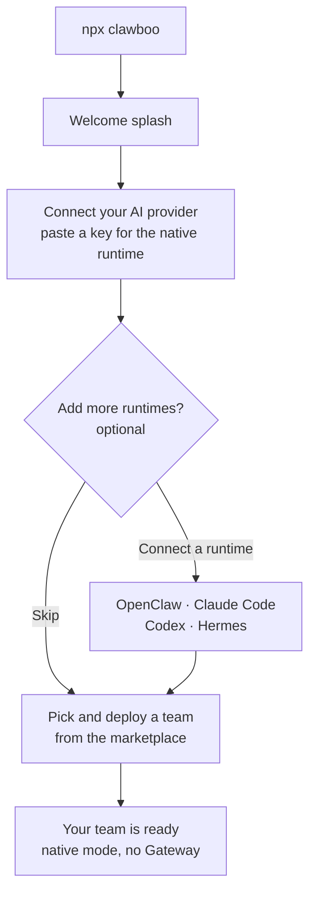

Clawboo runs the same way for everyone. Install it with `npm install -g clawboo` and run `clawboo` (or `npx clawboo` to try it without installing), which launches a local dashboard and walks you through a first-run wizard. Onboarding is **native-first**: you paste one provider key and land in a working team, with no runtime to pick up front. The OpenClaw Gateway and the coding-agent runtimes are **opt-in**, connected during the optional Add-runtimes step or later from Settings. This page explains the fast native path and the OpenClaw path so you can choose which quickstart to follow.

<Note>
These docs describe Clawboo **v0.3.0**, the current release.
</Note>

## Prerequisites

<Note>
- **Node.js 22 or newer**: Clawboo's `engines` field requires `node >=22.0.0`. The OpenClaw path also enforces this: the wizard's detection step flags Node older than 22.
- **A provider API key** if you choose the native path: Anthropic (`sk-ant-…`), OpenAI (`sk-…`), or OpenRouter (`sk-or-…`). A running local Ollama works with no key, and a **ChatGPT subscription** works with no key too (the OpenAI card's Sign in with ChatGPT connects the [Codex runtime](/runtimes/codex)). The OpenClaw path needs a provider key too, entered during Gateway configuration.
- A global install (`npm i -g clawboo`) is recommended for a persistent `clawboo` command and one-click updates, but not required; `npx clawboo` downloads and launches the bundled dashboard server without one. (The OpenClaw path can install the `openclaw` CLI for you from inside the wizard.)
</Note>

That is the full list. You do not need OpenClaw, a Gateway, Docker, or any database; Clawboo bundles its own SQLite store and dashboard server.

## What `clawboo` does

```bash
clawboo
```

The launcher prints the Clawboo logo, does a quick **informational** probe of the OpenClaw Gateway port (`localhost:18789`) so it can tell you whether a Gateway is already up, starts the bundled dashboard server, then opens your browser at the discovered URL. The dashboard binds to loopback `127.0.0.1` on port `18790` (auto-falling back through `18790–18809` if that port is busy). On a fresh machine the first-run wizard appears.

The Gateway probe is purely informational; a "No Gateway detected" result does not block anything; the dashboard simply guides you through setup either way. See [Installation](/getting-started/installation) for the full launch sequence (port discovery, bundled vs dev server, the browser-open step).

## How onboarding flows

After the welcome splash, the wizard takes you straight to **Connect your AI provider**: pick a provider and paste a key (or point at a local Ollama) to power the built-in native runtime. An optional **Add more runtimes** step then lets you connect OpenClaw or a coding-agent runtime as peers, a **Team** step lets you pick a starter team from the marketplace and deploy it, and a final **Your team is ready** screen drops you into the dashboard. There is no up-front "pick a runtime" question; native is the default and everything else is additive.



Both quickstarts share this spine; they differ only in whether you connect the OpenClaw Gateway along the way.

|                      | Native (the fast path)                                               | With the OpenClaw Gateway                                                              |
| -------------------- | -------------------------------------------------------------------- | -------------------------------------------------------------------------------------- |
| **Best for**         | Getting a team running in ~60 seconds                                | Also running OpenClaw agents on a local Gateway                                        |
| **What you provide** | One provider API key (or a local Ollama)                             | The same, plus OpenClaw setup in the Add-runtimes step                                 |
| **Extra software**   | None: the native runtime ships inside Clawboo                        | The `openclaw` CLI + a running local Gateway (the wizard can install/start it for you) |
| **End state**        | A deployed native team, no GatewayClient                             | A deployed native team plus a connected OpenClaw runtime you can add to a team         |
| **Walkthrough**      | [Quickstart: the native runtime](/getting-started/quickstart-native) | [Quickstart: OpenClaw](/getting-started/quickstart-openclaw)                           |

<Tip>
Nothing is permanent. Every runtime is a peer; you can add OpenClaw, Claude Code, Codex, or Hermes anytime from **Settings**, then the **Runtimes** panel, and mix runtimes within one team. See [Connecting runtimes](/runtimes/connecting-runtimes).
</Tip>

### The native path (the fast route)

Clawboo's [native runtime](/appendices/glossary) (`clawboo-native`) is an in-process harness that talks to provider SDKs directly (Anthropic, OpenAI, OpenRouter, or a local Ollama), so there is nothing extra to install and no Gateway. You paste a provider key, optionally test it, then click **Continue**; Clawboo stores the key in its encrypted vault. After an optional runtimes step, you pick a starter team from the marketplace and deploy it (every agent native, sharing one memory), and land directly in that team's group chat.

This is the fastest route to a running team. Follow it step by step in the [native quickstart](/getting-started/quickstart-native).

### The OpenClaw path (opt-in)

Want to run OpenClaw agents on a local Gateway? Connect OpenClaw from the wizard's **Add more runtimes** step (a "Set up OpenClaw" detour that detects, installs, configures, and starts the Gateway, then returns you to the wizard) or later from **Settings**, then the **Runtimes** panel. The detour checks Node.js, whether the `openclaw` CLI is installed, and whether a Gateway is running, and can install OpenClaw, write its config and provider key, and start the Gateway for you. Once it is connected you can deploy or add OpenClaw agents to a team.

This path involves more moving parts (a separate CLI and a long-lived Gateway process) but unlocks OpenClaw's own agents and channels. Follow it step by step in the [OpenClaw quickstart](/getting-started/quickstart-openclaw).

## Next steps

- [Installation](/getting-started/installation): what `clawboo` launches, ports, and the bundled server
- [Quickstart: the native runtime (no Gateway)](/getting-started/quickstart-native): the recommended ~60-second path
- [Quickstart: OpenClaw](/getting-started/quickstart-openclaw): the Gateway path
- [Deploy your first team and watch it collaborate](/getting-started/first-team)
- [Dashboard tour](/getting-started/dashboard-tour): Atlas, the Ghost Graph, the sidebar, and the view modes

## See also

- [Concept: the agent model and the five runtime classes](/concepts/agent-model)
- [Connecting runtimes](/runtimes/connecting-runtimes): add and switch runtimes after onboarding
- [Runtimes overview](/runtimes/index): the capability matrix
- [Glossary](/appendices/glossary): Boo, runtime, the board, registry of record
