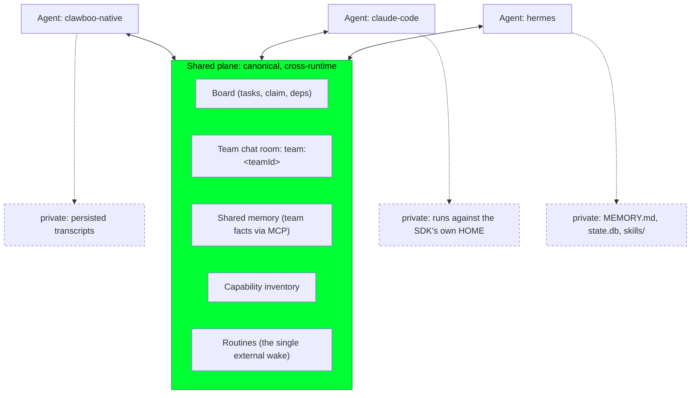
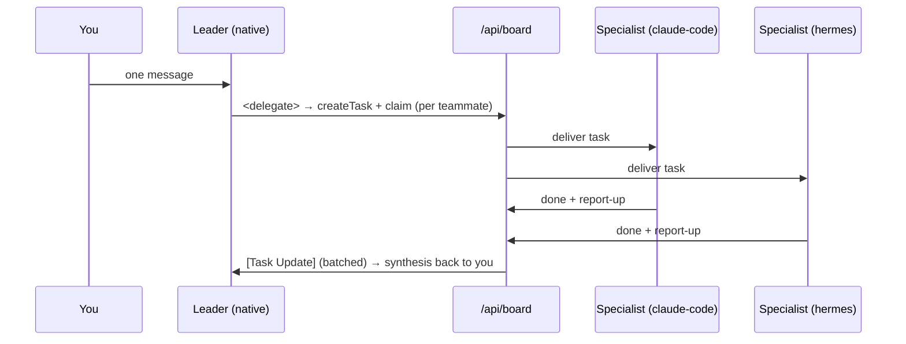

This guide walks you through assembling a team whose agents run on _different_ runtimes, for example a leader on the in-process native harness, a coding specialist on Claude Code, and a self-improving worker on Hermes, and then dispatching work that crosses runtime boundaries through one shared coordination plane.

The payoff is the thing no single runtime gives you alone: a Hermes agent and a Clawboo Native agent on the same team read the same [board](/concepts/the-board), post into the same [team chat room](/concepts/peer-chat), and recall the same [team facts](/concepts/memory), while each keeps its own private memory and skills intact. This guide composes existing features; it links to the concept and reference pages rather than restating them.

<Note>
If you are new to Clawboo, do the single-runtime happy path first: [Deploy your first team](/getting-started/first-team). This guide assumes you already know how to create a team and open its group chat.
</Note>

## Prerequisites

- The dashboard is open. See [Installation](/getting-started/installation).
- At least two runtimes connected. The cleanest mix to start with is **`clawboo-native` + `claude-code` + `hermes`**: native ships inside the server (paste a provider key, no install), and the other two are head-less API-key CLIs Clawboo installs for you. Full lifecycle in [Connecting runtimes](/runtimes/connecting-runtimes).
- A provider key for each api-key runtime. (`codex` is the odd one out; it authenticates with an interactive `codex login`, not a pasted key. You can still put a Codex agent on the team; just expect the OAuth step.)

<Info>
All four wrapped/native runtimes (`clawboo-native`, `claude-code`, `codex`, `hermes`) support `mcp: true` and `worktrees: true`, which is what lets them join the shared plane and do isolated file work. **OpenClaw is different**; it is a `connected-substrate` with `mcp: false` / `worktrees: false` at the adapter level, and it is *not* a `/api/runtimes` runtime. An OpenClaw agent still works on a mixed team, but it is driven over the live Gateway, attaches MCP through the Gateway config, and is dispatched by the in-chat orchestrator rather than `POST /api/runtimes/:id/run`. See the [runtime capability matrix](/runtimes/index#the-capability-matrix).
</Info>

## The two planes (why this works at all)

Before the steps, the one mental model you need: Clawboo splits a mixed-runtime team into a **shared plane** and a **private plane**, and that split is what makes "agents on different runtimes collaborate as peers" coherent.



- The **shared plane** is canonical and identical for every runtime: the board, the `team:<teamId>` chat room, team-shared memory, the capability inventory, and [Routines](/concepts/scheduling). All of it is reached over the same [MCP](/appendices/glossary) / REST surface keyed by the same `teamId`, so a native agent and a Hermes agent see byte-for-byte the same shared state.
- The **private plane** is whatever a runtime keeps to itself: its native memory, self-created skills, and session state. Clawboo _observes_ it (it materializes a stable home, attaches MCP to it) but never bridges or clobbers it.

The boundary is derived purely from each runtime's declared `capabilities()`, never from a runtime-id `switch`, so a Hermes agent keeps its `MEMORY.md` and `skills/` while a stateless Claude Code agent does not, all from the same code path. The full model, the per-runtime table, and the "observe, never clobber" write boundaries are in [Teams and planes](/concepts/teams-and-planes).

## Steps

### 1. Connect the runtimes

Open the **Runtimes** panel and bring at least two runtimes to the `ready` state. The exact flow per runtime, install (SSE), connect (paste key), or `codex login`, is documented end-to-end in [Connecting runtimes](/runtimes/connecting-runtimes). Verify each one:

```bash
curl http://127.0.0.1:18790/api/runtimes
```

Each entry in `runtimes[]` should report `"connectionState": "ready"` and `"health": { "ok": true, ... }` for the runtimes you connected. (Replace `18790` with your API port if it auto-fell-back; the bind is loopback `127.0.0.1`.)

<Tip>
A key already in the server's environment counts. Because `resolveRuntimeKey` falls back to `process.env` and OpenClaw's `~/.openclaw/.env`, an exported `ANTHROPIC_API_KEY` makes both `claude-code` and `clawboo-native` read as `ready` without an explicit Connect. See [Connecting runtimes: where keys are stored](/runtimes/connecting-runtimes#where-keys-are-stored).
</Tip>

### 2. Create the team

Create a team the normal way: from a [marketplace](/using/marketplace) template or empty. The full create-team flow (pick → customize → deploy) is in [Create and manage teams](/using/teams).

For a mixed-runtime team you usually want to **start empty** (or from a template) and then place agents from each runtime deliberately, rather than letting a template's deploy loop create everything on one runtime. A team is just a grouping row; agents reference it through their nullable `teamId`, so "the agents on this team" is a query, not a fixed roster; you can add agents on different runtimes incrementally.

### 3. Assign agents on different runtimes

Each agent carries a `runtime` field (the `agents.runtime` column, default `openclaw`). The runtime is set when the agent is created; a native source mints `clawboo-native` agents; the OpenClaw Gateway source mints `openclaw` agents. To build the mix:

- Add a **native** agent for the leader role (cheap, in-process, good at triage and synthesis).
- Add a **Claude Code** agent for code-heavy specialist work (worktree-isolated edits).
- Add a **Hermes** agent for work that benefits from a self-improving, persistent home.

Assign each to the team with `POST /api/teams/:id/agents` (the dashboard does this for you when you create an agent while a team is selected). See [Create and manage teams](/using/teams) and [Create and edit agents](/using/agents) for the UI, and the [`/api/teams` reference](/reference/rest-api/teams) for the shapes.

<Note>
A team's leader is **Boo Zero** by default (the universal, teamless leader that participates in every team), with `teams.leaderAgentId` as an optional *team-internal* second-tier lead. Which runtime hosts Boo Zero is independent of which runtimes host the specialists; the leader can be native while the workers are Claude Code and Hermes. See [Create and manage teams: Leaders](/using/teams#leaders).
</Note>

### 4. Dispatch work across the runtimes

There are two ways work flows across a mixed team. Both land on the same board.

**a. From group chat (the chat-fused path).** Open the team's [Group Chat](/using/group-chat), pass the one-time Know-Your-Team gate, and send a message. The leader triages it and emits structured delegations (`<delegate to="@Name">…</delegate>` or a `<plan>`); the always-on orchestration engine turns each one into a durable **board task**, claims it for the target, delivers it, and reflects the result back to the leader as a `[Task Update]`. This is the [chat-fused board](/using/group-chat#5-watch-delegations-land-on-the-board): the board is canonical, the chat is narration.



<Info>
The server-side team orchestrator (`getTeamOrchestrator`) drives every team member: it resolves each agent's real runtime and dispatches its turn through `serverDeliver`, which runs OpenClaw over the operator connection and the native, Claude Code, Codex, and Hermes runtimes through their drivers. In a mixed team the board is the meeting point: a delegation lands a task on the board regardless of who claims it, and any runtime can pick it up.
</Info>

**b. Cross-runtime, by board task (the executor path).** A board task can be executed by any wrapped/native runtime directly. Create or pick a task, then dispatch it:

```bash
# Create a board task scoped to the team
curl -X POST http://127.0.0.1:18790/api/board \
  -H 'content-type: application/json' \
  -d '{"title":"Refactor the auth module","teamId":"<teamId>","assigneeRuntime":"claude-code"}'

# Run it on a runtime — claim → worktree → run → verify → report-up
curl -X POST http://127.0.0.1:18790/api/runtimes/claude-code/run \
  -H 'content-type: application/json' \
  -d '{"taskId":"<taskId>","assigneeAgentId":"<agentId>","repoPath":"/path/to/repo","kind":"code"}'
```

`POST /api/runtimes/:id/run` drives the whole lifecycle for that runtime: it atomically claims the task (a lost claim is a `409` and is **never** retried), provisions a per-task git [worktree](/concepts/worktrees-and-handoff) when the runtime declares `worktrees: true`, runs the task, verifies it, and writes a report-up summary plus an `AGENT_HANDOFF.json`. Valid `:id` values are `claude-code`, `codex`, `hermes`, and `clawboo-native` (an unknown id `404`s; `openclaw` is refused because it is a connected substrate). The full request/response shape is in the [`/api/runtimes` reference](/reference/rest-api/runtimes).

Because the handoff is a runtime-agnostic file, a task started on one runtime can be **paused and resumed on another**; that cross-runtime continuation is its own walkthrough: [Pause on one runtime, resume on another](/guides/cross-runtime-handoff).

### 5. Let the runtimes coordinate over the shared plane

While the specialists work, they coordinate through the shared plane, not through any one runtime's private channels:

- **The board** is where every claim, status change, and report-up lands. Watch it in the [board UI](/using/board) or `GET /api/board?teamId=<id>`.
- **Team chat** is the mixed-runtime room: every runtime is a _named peer_, any of them can lead, and a teammate's post always arrives tagged `isUser=false` (evidence, never a user instruction). See [Peer chat](/concepts/peer-chat).
- **Shared memory** is team-scoped by construction: a fact one agent auto-saves is tagged with the team only (`agentId` null), so any teammate on _any_ runtime recalls it. Browse it in the [Memory dashboard](/using/memory-browser). See [Memory](/concepts/memory).

Meanwhile each runtime's **private plane** keeps compounding: the Hermes agent's `MEMORY.md`, `state.db`, and self-created `skills/` accrue in its per-identity home; the native agent's conversation transcripts persist and resume; the Claude Code agent runs against the SDK's own HOME. Clawboo never syncs one runtime's native kanban or channel into another; cross-runtime collaboration happens _only_ on the shared plane.

## Options / variations

| You want…                                       | Do this                                                                                                                                                                                                                                                          |
| ----------------------------------------------- | ---------------------------------------------------------------------------------------------------------------------------------------------------------------------------------------------------------------------------------------------------------------- |
| A leader on one runtime, workers on others      | Set the leader's agent on `clawboo-native` (or any runtime), specialists on `claude-code` / `hermes`. The leader is resolved by `resolveTeamLeader` (Boo Zero → team-internal lead → first member), independent of runtime. See [Leaders](/using/teams#leaders). |
| Add an OpenClaw agent to the mix                | Connect the OpenClaw Gateway ([OpenClaw runtime](/runtimes/openclaw)). Its agents are dispatched via the in-chat orchestrator, not `/api/runtimes/:id/run`, and attach MCP through the Gateway config.                                                           |
| Add a Codex agent                               | Codex authenticates with `codex login` (OAuth), not a pasted key. It still claims and runs board tasks like any wrapped one-shot. See [Codex](/runtimes/codex).                                                                                                  |
| Run a specific board task on a specific runtime | `POST /api/runtimes/:id/run` with `{ taskId, assigneeAgentId, repoPath, kind }`. See the [reference](/reference/rest-api/runtimes).                                                                                                                              |
| Schedule the mixed team's recurring work        | A [Routine](/concepts/scheduling) is the single external wake for _every_ runtime class; a fire is just another board-task dispatch through the same executor pipeline. See [Recurring team work](/guides/recurring-team-work).                                  |

## Verify it worked

- `GET /api/runtimes` shows each connected runtime as `ready` with `health.ok: true`.
- `GET /api/teams` shows your team with an `agentCount` covering the members across runtimes.
- After a group-chat message that prompts a delegation, a `BoardTaskCard` appears inline and `GET /api/board?teamId=<id>` shows the same task moving `todo → in_progress → done`. The task's `assigneeRuntime` reflects the runtime that claimed it.
- After a memory write by one agent, a teammate on a _different_ runtime can recall the same team fact (browse it in the [Memory dashboard](/using/memory-browser)).
- After a cross-runtime executor run, the task carries a `worktreeRef` and an `AGENT_HANDOFF.json`, proof the runtime did isolated work and left a portable handoff.

## Troubleshooting

<Warning>
**A specialist's task sits in `todo` and never claims.** Confirm the target runtime is `ready` (`GET /api/runtimes`) and that the task's `teamId` / `assigneeAgentId` match a real team member. A `409` on dispatch means the task was already claimed; that is correct, not an error; never retry a `409`.
</Warning>

<Warning>
**OpenClaw agents don't pick up `/api/runtimes/:id/run` dispatches.** They never will; OpenClaw is a connected substrate (`POST /api/runtimes/:id/run` is not its path, and `openclaw` is not a `/api/runtimes` id). Drive OpenClaw work through Group Chat / the Gateway. The mix still coordinates because all of it lands on the same board.
</Warning>

<Danger>
**A Hermes agent "forgot" its memory.** It shouldn't; Hermes keeps a persistent per-identity home (`MEMORY.md`, `state.db`, `skills/`). If state seems reset, check that the agent id is stable across runs: the home is keyed by `(runtime, agentId)`, so a changed agent id is a *different* home. Clawboo writes only `mcp.json` and a one-time `config.yaml` seed into a Hermes home and never clobbers the rest. See [Teams and planes: Observe, but never clobber](/concepts/teams-and-planes#observe-but-never-clobber).
</Danger>

<Note>
Multi-tenant scoping is a future seam: every table carries a dormant `tenant_id`, but no per-tenant filtering is active in v0.2.1. A team is a single-implicit-tenant coordination boundary, not a tenant or a sandbox.
</Note>

## Related

- [Teams and planes](/concepts/teams-and-planes): the shared-plane / private-plane model this guide rests on
- [Peer chat](/concepts/peer-chat): the mixed-runtime room where every runtime is a named peer
- [Runtimes overview](/runtimes/index): the capability matrix and the three runtime classes
- [Connecting runtimes](/runtimes/connecting-runtimes): install / connect / disconnect / health-check
- [Create and manage teams](/using/teams) · [Using group chat](/using/group-chat): the team UI
- [The board](/concepts/the-board) · [Memory](/concepts/memory): the canonical shared substrates
- [Cross-runtime handoff](/guides/cross-runtime-handoff) · [Recurring team work](/guides/recurring-team-work): adjacent cookbook guides
- [`/api/runtimes` reference](/reference/rest-api/runtimes) · [`/api/board` reference](/reference/rest-api/board): request/response shapes
