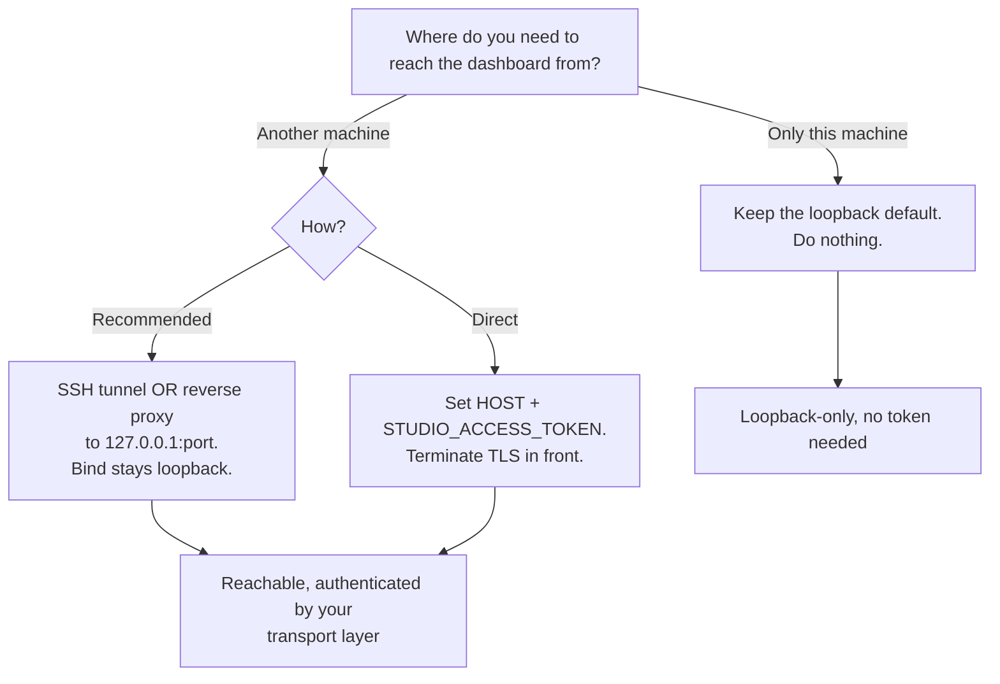

Use this guide when you are running Clawboo somewhere other than your own laptop, a home server, a VPS, a container, and you need to decide how exposed it should be. It composes three pages into one decision path: the [security model](/operating/security), the [deployment](/operating/deployment) mechanics, and the [environment variables](/reference/environment-variables) reference. Read those for the full detail; this guide is the walkthrough.

The short version: a fresh install binds loopback and is already safe. The two ways to reach it from elsewhere are a **tunnel** (recommended: keep the bind loopback) or a **wide bind plus an access token** (the opt-in second wall). Everything below makes that choice concrete.

<Note>
Clawboo is single-tenant and local-first. There are no user accounts, roles, or scopes; the access gate is one shared secret that grants full operator access. See [The honest caveats](#the-honest-caveats) before you expose it to anyone but yourself.
</Note>

## Prerequisites

- A working Clawboo server you can start with `node dist/server.js` or `npx clawboo`. See [Deployment](/operating/deployment).
- For the recommended path: SSH access to the box, or a reverse proxy (nginx, Caddy) you can terminate TLS on.
- For the wide-bind path: the ability to set environment variables on the process (`HOST`, `STUDIO_ACCESS_TOKEN`).

## Decision path



## Step 1: Understand the default (do nothing if it fits)

On a fresh install the dashboard binds `127.0.0.1`, not `0.0.0.0`. The host resolver returns loopback unless you explicitly set `HOST` or `HOSTNAME`; an explicit value wins (trimmed), anything else falls back to loopback. So the dashboard and every `/api/*` route are reachable only from the local machine until you opt out of that.

`localhost`, `::1`, and the whole `127.0.0.0/8` range count as loopback. `0.0.0.0`, `::`, a LAN IP, or a hostname are all network-exposed; and binding one of those is the only thing that triggers the boot-time security warning.

If you only need the dashboard from the same machine, and you do not set `HOST`/`HOSTNAME`, you are done. No token, no proxy, nothing else to configure.

## Step 2: Reach it from another machine without widening the bind (recommended)

The safest way to reach Clawboo remotely is to keep the bind loopback and put a real transport-security layer in front. Two options:

**SSH tunnel.** Forward a local port on your client to the loopback port on the server. Nothing about Clawboo's bind changes:

```bash
# from your client machine; assumes Clawboo is on the default 18790
ssh -N -L 18790:127.0.0.1:18790 user@your-server
# then open http://localhost:18790 on your client
```

**Reverse proxy that terminates TLS.** Run nginx/Caddy on the box, terminate HTTPS there, and forward to `127.0.0.1:<port>`. Pin the port so the upstream is stable ([Port resolution](/operating/deployment#port-resolution)):

```bash
CLAWBOO_API_PORT=18790 CLAWBOO_UI_DIR=./dist/ui node dist/server.js
```

Forward both HTTP and the WebSocket upgrade for the Gateway proxy at `/api/gateway/ws`:

```nginx
# nginx sketch — terminate TLS, forward to the loopback Clawboo server
location / {
    proxy_pass http://127.0.0.1:18790;
    proxy_set_header Host $host;
    proxy_set_header X-Forwarded-Proto $scheme;
    # WebSocket upgrade for the Gateway proxy
    proxy_http_version 1.1;
    proxy_set_header Upgrade $http_upgrade;
    proxy_set_header Connection "upgrade";
}
```

With either option, Clawboo never accepts a connection off-host directly; your tunnel or proxy is the only network-facing surface, and it brings its own authentication and TLS. You can still add an access token on top, but you do not have to widen the bind to get there.

## Step 3: Or widen the bind, and set an access token

If you do bind a non-loopback interface, you take on the access gate yourself. Set `HOST` (or `HOSTNAME`) **and** `STUDIO_ACCESS_TOKEN` together:

```bash
HOST=0.0.0.0 \
STUDIO_ACCESS_TOKEN="$(openssl rand -hex 24)" \
CLAWBOO_API_PORT=18790 \
CLAWBOO_UI_DIR=./dist/ui \
node dist/server.js
```

<Warning>
A non-loopback bind with **no** access token exposes the dashboard and every `/api/*` route to your network, unauthenticated, including the routes that resolve provider keys into spawned runtimes. Clawboo never auto-generates a token. It logs a loud `SECURITY:` warning at boot and keeps serving, so the boot warning is your signal that this happened. Set `STUDIO_ACCESS_TOKEN`, or unset `HOST`/`HOSTNAME`, to close it.
</Warning>

The token must come from the safe charset `[A-Za-z0-9._~-]` (which `openssl rand -hex` satisfies). A token containing any other character is rejected; the gate logs a warning naming the offending character and **disables itself** rather than ship a permanent lockout, because a cookie-delimiter character would otherwise corrupt the auth cookie and silently 401 every `/api/*` route. So a "wrong charset" token doesn't half-work; it turns the gate off. Generate from the safe set and you will never hit this.

## Step 4: Know how the gate behaves once it's on

When `STUDIO_ACCESS_TOKEN` is set, the access gate is the only authentication on the dashboard. Four behaviors matter for a self-host setup; the [security page](/operating/security#the-access-gate-opt-in) has the full treatment.

**Presenting the token, and the cookie.** Open `/?access_token=<token>` once. The gate validates it, sets an `HttpOnly`, `SameSite=Lax`, `Path=/` cookie named `clawboo_access`, and 302-redirects to strip the token from the URL. After that the cookie is the steady-state credential, validated on every `/api/*` request and on the `/api/gateway/ws` WebSocket upgrade. A request without a valid cookie gets `401` with a JSON `{ error }` body whose message tells you to open `/?access_token=<token>` once.

**Constant-time, length-hiding compare.** The token is never compared byte-by-byte. Both the cookie value and the configured token are SHA-256-hashed to a fixed 32-byte digest first, then compared in constant time; so the check neither short-circuits on the first differing byte (a timing oracle) nor leaks the token's length.

**Case-folded path test.** The gate lowercases the pathname before testing the `/api/` prefix, so an uppercased `/API/settings` can't slip past a case-sensitive prefix check and reach the real handler unauthenticated. The Express app also sets case-sensitive routing so its matcher and the gate agree.

**Loopback `/api/mcp/*` exemption.** A spawned runtime attaches its MCP client to `http://127.0.0.1:<port>/api/mcp/*` with no cookie, by design, because the runtime's environment is scrubbed of the access token. The gate therefore lets a request through _only_ when it is both loopback (`127.0.0.1`, `::1`, or `::ffff:127.0.0.1` at the TCP socket) **and** targets `/api/mcp/*`. A remote client cannot forge a loopback source address on a real TCP handshake. Every other `/api/*` route, and any non-loopback `/api/mcp/*` request, still requires the cookie.

<Info>
The exemption is loopback-scoped at the socket layer. Putting a reverse proxy in front does **not** widen it: a proxied `/api/mcp/*` request arrives from the proxy's source address (the proxy and the server are both on the box, so it's still loopback, fine), but a request that genuinely originates off-host can never present a loopback peer address. The runtime control plane stays local-only.
</Info>

## Step 5: Terminate TLS so the cookie is `Secure`

The gate marks the access cookie `Secure` **only** when the request arrived over TLS, which it detects from the `X-Forwarded-Proto: https` header. This is deliberate: a `Secure` cookie is never sent back over plain HTTP, so adding it unconditionally would break the gate on a loopback/dev HTTP origin.

The practical consequence for a self-host: terminate TLS at your reverse proxy and forward `X-Forwarded-Proto`. The nginx sketch in [Step 2](#step-2--reach-it-from-another-machine-without-widening-the-bind-recommended) already sets `proxy_set_header X-Forwarded-Proto $scheme;`; that single header is what upgrades the cookie to `Secure` end to end.

## Options / variations

| Goal                               | What to set                                      | Notes                                                                         |
| ---------------------------------- | ------------------------------------------------ | ----------------------------------------------------------------------------- |
| Loopback-only (default)            | nothing                                          | Safe out of the box; no token.                                                |
| Remote access, bind stays loopback | SSH tunnel or reverse proxy → `127.0.0.1:<port>` | Recommended. Transport security from your tunnel/proxy.                       |
| Direct wide bind                   | `HOST=0.0.0.0` + `STUDIO_ACCESS_TOKEN=…`         | Always pair the two. TLS in front for a `Secure` cookie.                      |
| Stable upstream port               | `CLAWBOO_API_PORT=18790`                         | An explicitly pinned port gets **no** fallback, frees you from the auto-scan. |
| Custom state dir                   | `CLAWBOO_HOME=/path`                             | Moves the vault, settings, port file, and worktrees with it.                  |
| Bring your own vault key           | `CLAWBOO_SECRETS_MASTER_KEY=…`                   | 32-byte base64, 64 hex chars, or a raw 32-char string.                        |

See [Environment variables](/reference/environment-variables) for every variable, its reader, and its default.

## Verify it worked

- **Confirm the bind.** Boot the server and read the startup log. A non-loopback bind with no token prints the `SECURITY:` warning; its absence (or a token being set) means you're either loopback or gated.
- **Check the access gate.** With the gate on, `curl https://your-host/api/settings` without a cookie should return `401`. The same request with `?access_token=<token>` should `302`-redirect and set the `clawboo_access` cookie.
- **Confirm Clawboo-shaped health.** `GET /api/settings` returns `{ gatewayUrl, hasToken }`; `GET /api/health` returns the boot probe (`{ ok, degraded, fatal, checks, … }`). `ok: true` means no fatal checks failed. See [Deployment → Verify it worked](/operating/deployment#verify-it-worked).

## Troubleshooting

<Warning>
**The gate seems off even though I set a token.** Check the boot log for a charset warning. A token with any character outside `[A-Za-z0-9._~-]` disables the gate by design (fail-loud rather than a silent lockout). Regenerate with `openssl rand -hex 24` and restart.
</Warning>

<Warning>
**The cookie isn't sticking over HTTPS.** The gate only sets `Secure` when it sees `X-Forwarded-Proto: https`. If your proxy terminates TLS but doesn't forward that header, the cookie may be dropped by the browser as insecure, or never marked `Secure`. Add `proxy_set_header X-Forwarded-Proto $scheme;` (or the equivalent for your proxy).
</Warning>

<Warning>
**WebSocket / Gateway connection fails behind the proxy.** The gateway proxy upgrade lives at `/api/gateway/ws` and the gate guards it with the same cookie check. Forward the upgrade headers (`Upgrade`, `Connection: upgrade`) and make sure the access cookie reaches the upgrade request.
</Warning>

<Danger>
**Don't run a wide bind without a token "just for a minute."** Every `/api/*` route, including the ones that resolve provider keys into spawned runtimes, is reachable unauthenticated the moment the bind is non-loopback and no token is set. The boot warning is real; treat it as a stop sign.
</Danger>

## The honest caveats

Clawboo is single-tenant and local-first by design. The access gate makes a _deliberately exposed single-user_ dashboard safe; it is not a multi-user authorization system.

- **The token is all-or-nothing.** Everyone who has it has full operator access. There are no per-user accounts, roles, or scopes, and no per-user revocation; rotate by changing the env var and restarting.
- **The vault is defense in depth, not targeted-attacker-proof.** It defeats commodity infostealers and the accidental backup or sharing of the vault file, but it does not protect against a process running as you. See [Security → the vault](/operating/security#the-encrypted-secrets-vault).
- **Single-tenant only.** The `tenant_id` columns across the schema are a dormant future seam; no per-tenant isolation or scoping is active in v0.2.0.
- **OpenClaw shared memory is registered globally.** Because OpenClaw agents are cross-team, Clawboo registers the shared [Memory](/concepts/memory) MCP server for the OpenClaw runtime at _global_ scope rather than per-run/per-team scope (the other four runtimes get per-run team scope). In a multi-tenant world that would need narrowing; it is a documented multi-tenant deferral, not a leak in the single-tenant model Clawboo ships today.

<Note>
These docs describe Clawboo **v0.2.0**, the current release.
</Note>

## See also

- [Security model and safe exposure](/operating/security), the full security model end to end
- [Deploying Clawboo](/operating/deployment), ports, state dir, host binding, reverse-proxy setup
- [Environment variables](/reference/environment-variables), `HOST`, `STUDIO_ACCESS_TOKEN`, `CLAWBOO_HOME`, `CLAWBOO_SECRETS_MASTER_KEY`, and the rest
- [Connecting runtimes](/runtimes/connecting-runtimes), the encrypted vault and the credential-resolution chain
- [MCP servers](/operating/mcp-servers), the loopback `/api/mcp/*` control plane the gate exempts
- [Glossary](/appendices/glossary), access gate, vault, loopback, runtime
