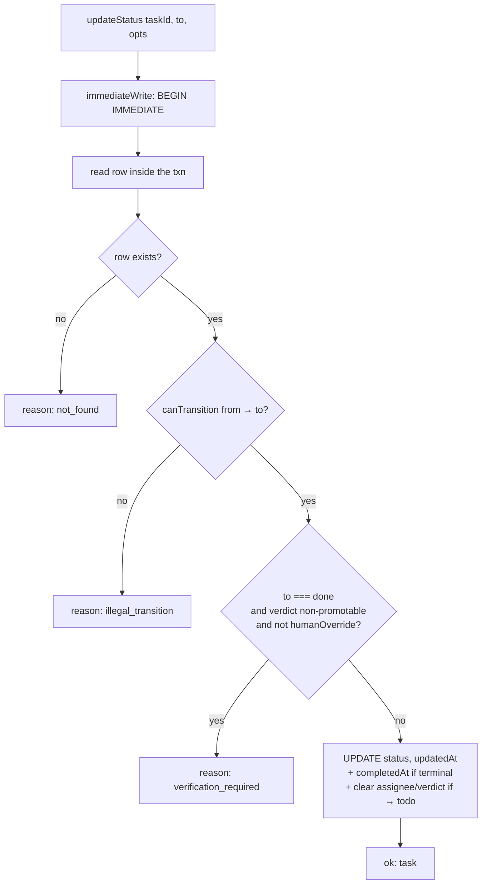

[The board](/concepts/the-board) is Clawboo's durable task-coordination substrate. This page is the implementation deep-dive for people working _on_ it: the single data-access layer that owns every board write, the conditional-UPDATE claim that makes single-assignee work race-free, the state machine that enforces legal transitions inside a write transaction, the SQLite contention recipe that keeps many concurrent writers honest, the recursive CTEs that walk the dependency and parent graphs, and the two reconciliation passes that recover stuck work.

Everything here lives in `packages/db/src/board/`: four modules: `repository.ts` (the data access), `state-machine.ts` (the pure transition rules), `contention.ts` (the write recipe), and `schemas.ts` (the zod shapes for REST bodies and raw-CTE results). The connection-level pragmas they depend on are set in `packages/db/src/db.ts`. If you want the _why_ behind the board's existence, narration-vs-authority, the worktree linkage, read [the concept page](/concepts/the-board) first; this page assumes it.

## What it is, and what it isn't

The board data-access layer is **the only place in the codebase that touches the board tables**. `apps/web` never reaches a board table with raw Drizzle; it calls a repository function. That is deliberate: it keeps query construction out of the app, and it is the single seam a future SQLite→Postgres or multi-tenant swap would target. Every read that could be tenant-scoped takes an optional `scope` argument carrying a `tenantId`; the column exists on every board table but no filtering is active in v0.2.0.

It is **not** an ORM-over-everything layer. It is a hand-written set of typed functions over five tables (`tasks`, `task_deps`, `task_comments`, `workspaces`, `execution_processes`), each function doing exactly one board operation. The pure transition rules live apart from the data access so they are unit-testable without a database; the contention helpers live apart so the rest of the repository reads as plain Drizzle.

<Note>
The repository imports one cross-package symbol: `isVerdictPromotable` from `@clawboo/governance`. That is the shared builder-≠-judge rule, kept in one place so the board state machine and the worktree completion path enforce "done means verified" identically. See [Verification](/concepts/verification).
</Note>

## The state machine

`state-machine.ts` is pure: a `TaskStatus` union of seven values, a `LEGAL` transition map, and three predicates. There is no I/O here; it is the rulebook the repository consults inside a transaction.

```ts
const LEGAL: Record<TaskStatus, readonly TaskStatus[]> = {
  backlog: ['todo', 'blocked', 'cancelled'],
  todo: ['in_progress', 'blocked', 'backlog', 'cancelled'],
  in_progress: ['in_review', 'done', 'blocked', 'todo', 'cancelled'],
  in_review: ['done', 'in_progress', 'blocked', 'cancelled'],
  blocked: ['todo', 'in_progress', 'backlog', 'cancelled'],
  done: [],
  cancelled: [],
}
```

`canTransition(from, to)` returns `true` when `from === to` (same-status is an idempotent no-op, so re-emitting a transition is harmless) and otherwise checks membership in `LEGAL[from]`. `done` and `cancelled` have empty target lists; they are terminal. `isLocked(status)` returns `true` for `in_progress` and `in_review` (a locked task is actively owned and must not have its assignee reassigned). `isTerminal(status)` returns `true` for `done` and `cancelled`.

The enforcement happens in `updateStatus` in the repository, not in the REST layer:



The row is read **inside** the `BEGIN IMMEDIATE` transaction, so the transition is checked against the freshly read status; two concurrent callers cannot both pass a stale pre-check. Any pre-check the REST layer does first is purely fast-fail ergonomics; the transactional check is the real gate. An illegal transition surfaces as `409` from the REST handler.

Two side effects fire inside that same write:

- **Terminal states set `completedAt`.** Reaching `done` or `cancelled` stamps the completion timestamp.
- **`→ todo` is the release path, and it unassigns.** Moving a task back to `todo` clears `assigneeAgentId`, `assigneeRuntime`, **and** the stored `verification` verdict. The assignee clear is what lets the [atomic claim](#the-atomic-claim) re-acquire the task (the claim guards on `assignee IS NULL`); without it, every re-fire of a released task would `409`. The verdict clear is the cross-runtime rebind boundary: a previous runtime's failing verdict must not gate a fresh runtime's legitimate completion. `releaseTask` performs the same three-field clear directly for the `in_progress → todo` case.

### The intrinsic verification gate

The `→ done` gate is the board enforcing builder-≠-judge in the substrate itself, not in a caller:

```ts
if (to === 'done' && !opts.humanOverride && !verdictCellPromotable(row.verification)) {
  return { ok: false, reason: 'verification_required' }
}
```

`verdictCellPromotable` is a lightweight read of the persisted JSON cell. A full zod parse happens on _write_ (`setTaskVerification` in `verification.ts`); here a tiny inline `JSON.parse` plus the shared `isVerdictPromotable` rule avoids importing `board/verification.ts`, which would create an import cycle with `getTask`. The semantics:

| Stored cell                                             | `verdictCellPromotable` | Why                                                                                                                                                                          |
| ------------------------------------------------------- | ----------------------- | ---------------------------------------------------------------------------------------------------------------------------------------------------------------------------- |
| `null` / absent                                         | `true`                  | An unverified task is _not_ failing; the gate only blocks a verdict that **exists and is non-promotable**. Manually completing unverified work is an intentional human call. |
| unparseable                                             | `true`                  | Cannot determine ⇒ don't block (lenient).                                                                                                                                    |
| `pass`                                                  | `true`                  | Verified.                                                                                                                                                                    |
| `completed_with_debt` over a _green_ deterministic gate | `true`                  | Debt covers unresolved critic findings, never a red build/test gate.                                                                                                         |
| `completed_with_debt` over a _red_ deterministic gate   | `false`                 | A red gate is the canonical crash/blocking case, routes to a human, not silently `done`.                                                                                     |
| `fail`                                                  | `false`                 | Known-failing.                                                                                                                                                               |

<Info>
The gate is un-bypassable by any caller except an explicit `opts.humanOverride: true`. The REST `PATCH /api/board/:taskId` handler accepts `humanOverride` in the request body and records the bypass in the governance audit log; the override is auditable, never silent. The autonomous path always writes a verdict via `verifyTask` *before* this transition, so the gate is exercised on genuine completions, not as a routine bypass.
</Info>

<Note>
A subtlety for contributors: `isVerdictPromotable(null)` in `@clawboo/governance` returns `false`, but `verdictCellPromotable(null)` in the repository returns `true`. They are not contradictory; `verdictCellPromotable` only *calls* `isVerdictPromotable` when a cell exists. A null cell short-circuits to "promotable" because a missing verdict means "unverified," which the gate deliberately does not block. Do not "fix" this by passing the null straight through.
</Note>

## The atomic claim

A task is worked by exactly one assignee. The board guarantees that with a single conditional UPDATE, not a read-then-write:

```ts
db.update(tasks)
  .set({
    assigneeAgentId,
    assigneeRuntime: assigneeRuntime ?? null,
    status: 'in_progress',
    updatedAt: now,
  })
  .where(
    and(
      eq(tasks.id, taskId),
      eq(tasks.status, 'todo'),
      isNull(tasks.assigneeAgentId),
      eq(tasks.dropped, 0),
    ),
  )
  .returning()
  .all()
```

Because the guard (`status='todo' AND assignee IS NULL AND dropped=0`) is part of the same atomic statement that performs the write, at most one concurrent caller can win. The winner gets the updated row back via `RETURNING`; every loser gets a zero-row result.

That zero-row result is **data, not an error**. `claimTask` distinguishes the two failure modes with a follow-up existence check and returns `{ ok: false, reason: 'conflict' }` when the row exists (someone else claimed it) or `{ ok: false, reason: 'not_found' }` when it does not. The REST layer maps `conflict → 409` and `not_found → 404`. The rule the whole system follows is **never retry a 409**; a conflict means someone legitimately owns the work, so a retry would either no-op or fight for a task already taken.

<Tip>
"Never retry a 409" is structural, not a convention. The contention layer that wraps the claim retries *only* transient SQLite lock errors and returns a 0-row result to the caller **unretried**; so application-level conflicts and database-level lock contention go through completely different mechanisms. See [the contention recipe](#the-contention-recipe).
</Tip>

Stale re-claim of a dead, abandoned `in_progress` task is deliberately **not** the claim's job. The claim's `WHERE` only matches `todo`, so an abandoned `in_progress` task is invisible to it. Liveness lives in one place; [reconciliation](#orphan-and-stale-reconciliation) releases such a task back to `todo`, after which an ordinary claim re-acquires it. Keeping the claim a pure mutex and liveness a separate pass is what makes both correct.

## Dependencies and the recursive CTEs

Tasks form a blocks / blocked-by graph in `task_deps`, with a composite primary key on `(task_id, depends_on_task_id)` that prevents duplicate edges. `linkDep` inserts with `onConflictDoNothing`, so re-linking is a harmless no-op.

A task is **ready** when it is `todo`, not dropped, and _every_ one of its dependencies is `done`. `getReadyTasks` expresses that with a `NOT EXISTS` subquery and orders the results by priority descending, then `updatedAt` descending:

```sql
NOT EXISTS (
  SELECT 1 FROM task_deps d
  JOIN tasks dt ON dt.id = d.depends_on_task_id
  WHERE d.task_id = tasks.id AND dt.status != 'done'
)
```

Two recursive common-table-expression reads walk the graph in both directions. Both validate their raw SQL output with a zod schema at runtime; the codebase rule is to never trust the type system over an untyped raw query.

**`getDependents`** walks the dependency graph _downstream_, every task transitively blocked by a given task:

```ts
sql`
  WITH RECURSIVE dependents(id) AS (
    SELECT task_id FROM task_deps WHERE depends_on_task_id = ${taskId}
    UNION
    SELECT td.task_id FROM task_deps td
    JOIN dependents dep ON td.depends_on_task_id = dep.id
  )
  SELECT * FROM tasks WHERE id IN (SELECT id FROM dependents)
`
```

This drives failure recovery. When a blocker fails, moves to `blocked` or otherwise can't reach `done`, its downstream chain can never become ready and would otherwise sit forever as ghost `todo` cards. `cancelDependents` walks `getDependents`, cancels only the still-pending (`todo` / `backlog`) members via `updateStatus`, and returns the cancelled rows so the orchestrator can report the stalled plan to the team leader. Tasks already `in_progress`, `done`, or `cancelled` are left untouched.

**`getAncestors`** walks the _parent_ chain via the self-referential `parent_task_id`, returning a minimal `{ id, parent_task_id, title, status }` row per ancestor. It is used to enforce delegation depth limits; an orchestrator reads the ancestor count to refuse spawning past a maximum depth. Its raw rows are parsed with `ancestorRowsSchema` from `schemas.ts` before being returned.

## Worktree linkage and execution rows

The board owns _pointers_ into the worktree subsystem, not the worktree itself. `setTaskWorkspaceRefs` records `worktreeRef` and `branchRef` on the task; `createWorkspace` / `updateWorkspaceStatus` track a `workspaces` row through `active → archived` (cleanup) or `active → stale` (garbage collection). Provisioning a worktree for a read-only or research task is refused by the REST layer with `422 no_isolation`; the worktree is only for the concurrency boundary that file-mutating work needs. See [Worktrees and handoff](/concepts/worktrees-and-handoff).

Each spawned run is an `execution_processes` row, a per-run ledger for any executor. `createExecutionProcess` opens it (started `running`); `completeExecutionProcess` closes it with an outcome (`succeeded`, `failed`, `timed_out`, or `cancelled`) plus an optional token/cost ledger and git before/after commit checkpoints. By convention an exec row is opened only _after_ a successful claim, because this ledger is exactly what crash recovery reads on restart.

## The contention recipe

Clawboo is team-first: many agents may write one SQLite file, and out-of-process consumers (the MCP stdio bins an external runtime spawns) open the _same_ file the Express server serves. Without care, concurrent writers hit SQLite's single-writer lock and degrade into a "convoy." The board's answer is a layered recipe: connection-level pragmas plus two application-level pieces.

Every connection `createDb` opens sets these pragmas:

| Pragma               | Value        | Why                                                                                |
| -------------------- | ------------ | ---------------------------------------------------------------------------------- |
| `journal_mode`       | `WAL`        | Write-ahead logging lets readers and a single writer proceed concurrently.         |
| `foreign_keys`       | `ON`         | Referential integrity is enforced.                                                 |
| `synchronous`        | `NORMAL`     | The standard WAL durability/performance balance.                                   |
| `busy_timeout`       | `1000` (ms)  | Wait up to a second for the write lock before erroring, dodges the convoy effect.  |
| `wal_autocheckpoint` | `50` (pages) | A native PASSIVE checkpoint keeps the WAL lean without an app-level write counter. |

On top of those, `contention.ts` adds two application-level mechanisms:

- **`withWriteRetry(fn)`** runs a synchronous write and retries **only** transient lock errors, `SQLITE_BUSY`, `SQLITE_BUSY_SNAPSHOT`, `SQLITE_LOCKED` (the set `isBusyError` recognizes), with a jittered backoff (`20–150` ms, at most `15` attempts). A 0-row result, like a lost claim race, is not an exception; it is returned to the caller unretried, which is what lets callers honor the never-retry-a-409 rule. Any non-lock error propagates immediately.
- **`immediateWrite(db, cb)`** runs `cb` inside a `db.transaction(cb, { behavior: 'immediate' })`; `BEGIN IMMEDIATE` acquires the write lock up front rather than escalating mid-transaction, avoiding lock-escalation deadlocks. The whole transaction re-runs from scratch on a transient lock error because `immediateWrite` itself is wrapped in `withWriteRetry`. `updateStatus`, `reconcileOrphans`, and `reconcileStaleInProgress` all run through it.

<Note>
The retry sleep is synchronous and non-busy-spinning: it uses `Atomics.wait` on a throwaway `SharedArrayBuffer`. `better-sqlite3` is fully synchronous, so making every repository method `async` just to `await` a backoff would be a needless cost; the synchronous block on a transient lock is the correct shape.
</Note>

The deviation from the literal plan is documented in the module header: instead of an app-level write-counter to trigger checkpoints, the recipe relies on SQLite's native `wal_autocheckpoint=50` PASSIVE checkpoint. It is the SQLite-blessed mechanism and needs no access to the raw handle.

## Orphan and stale reconciliation

Two recovery passes keep the board from accumulating stuck work, one for crashes, one for abandonment. Both run in a single `immediateWrite` transaction and never block boot.

**`reconcileOrphans` runs once at startup.** Any `execution_processes` row still marked `running` belonged to a process that died with the previous server. The pass marks each such execution `failed`, sets `recovery_tombstone=1` so a second pass is a no-op (no infinite auto-resume), and releases its task back to `todo` if the task is currently `in_progress` or `in_review`. The release clears the assignee, the assignee runtime, and the verification verdict, the same unassign-on-release discipline as `updateStatus(→todo)`. The server's boot sequence calls it best-effort, logging and continuing on failure.

**`reconcileStaleInProgress` runs at boot and on an interval.** It is the backstop for an `in_progress` task whose driving client view simply went away; the in-browser idle watchdog only runs while a team chat is mounted. A task that is `in_progress`, not dropped, whose `updatedAt` predates a TTL cutoff, **and** whose execution is still `running` is timed out (the exec → `timed_out`) and released to `todo`. The server wires it as one immediate sweep plus a `setInterval(...).unref()` loop.

<Danger>
`tasks.updatedAt` is **not** a liveness signal for the in-browser OpenClaw path; there is no server-side execution heartbeat that bumps the task row mid-run; `updatedAt` is written only on status/claim mutations. So the stale TTL is deliberately *generous* (`60` minutes by default, tunable via `CLAWBOO_BOARD_STALE_TTL_MS`; the sweep interval is `CLAWBOO_BOARD_STALE_SWEEP_MS`, default `5` minutes). A live client's own 8-minute watchdog fails a genuinely hung delegate long before this fires; a re-mounted client re-attaches an orphaned `in_progress` task and re-runs its watchdog. The sweep exists only to catch a client that is gone and never returns; set the TTL well beyond any realistic single delegate turn or a long-but-active run gets falsely swept.
</Danger>

## The no-migration-ladder model

There is no migration ladder. `createDb`'s inline `CREATE TABLE IF NOT EXISTS` block in `db.ts` is the **sole** schema-creation source: it declares every table and column on a fresh database outright. A schema change is a hard reset of the local DB; there are no users to migrate, so the codebase never carries forward-only `ALTER`s (which would also have to blanket-swallow DDL errors). The package no longer ships `db:migrate` or `db:generate` scripts; only `db:studio` remains, and there is no `drizzle/` directory on disk.

`schema.ts` is the Drizzle **type layer** over the same tables, used for typed queries and `$inferSelect` / `$inferInsert` types, never to apply migrations. Because nothing keeps the two descriptions in sync automatically, `schemaSource.test.ts` is the guard: it builds a database via the real `createDb()`, reads the live `{ table → column-name set }` via `PRAGMA table_info`, and asserts it matches the same map derived from the `schema.ts` type layer (and vice versa). It also pins the posture, asserting the npm `files` array excludes `drizzle`, that no `db:migrate` / `db:generate` scripts exist, and that no migration-ladder directory is present.

<Note>
`schemaSource.test.ts` compares **column names only**; column type, `NOT NULL`, `DEFAULT`, primary key, foreign key, and index drift are *not* checked, because the Drizzle-column → SQLite-PRAGMA mapping is lossy and would produce false drift. The test catches the drift that matters most (a column or table added to one source but not the other); deeper shape verification is deferred until a real schema change. The FTS5 virtual table and its shadow tables are excluded; they are raw DDL in `db.ts` that Drizzle cannot model.
</Note>

## Design rationale and trade-offs

The board is a hand-written repository, not a generic ORM facade, for the same reason the claim is a conditional UPDATE rather than a transaction-wrapped read-modify-write: the correctness properties (single-assignee, legal transitions, crash recovery) are easier to _see_ and to test as explicit, single-purpose functions over five tables than as generated query plans. The pure state machine and the contention helpers are split out precisely so each can be reasoned about in isolation, transition legality with no database, lock handling with no business logic.

SQLite with the WAL recipe is the deliberate concurrency choice: it ships in-process, needs no server, and tolerates the team-scale write contention Clawboo needs without a database to administer. The single data-access layer is the seam where a future SQLite→Postgres or multi-tenant move would land; the dormant `tenant_id` column on every board table is the placeholder for it.

The cost is a second persistence layer beside each runtime's own session state, and a recovery surface (the two reconciliation passes plus the stale-sweep TTL tuning) that has to be conservative because the in-browser path provides no server-side heartbeat. The board buys durability, race-freedom, and recoverability; the bill is that liveness detection is heuristic, not certain.

## Boundaries and non-goals

- **Not the agent or session registry.** The board references agents, runtimes, and sessions by id (soft refs, no foreign key) and owns no agent identity, agent files, or live session state. Those belong to the [registry of record](/appendices/glossary) and the [runtime](/appendices/glossary). Only the internal `parent_task_id` self-reference is FK-enforced.
- **Not a general-purpose tracker.** The statuses, transitions, and recovery passes are tuned for runtime-driven agent execution, not for a human-facing issue tracker.
- **Single implicit tenant today.** Every board table carries a `tenant_id` column, but it is a dormant seam; no per-tenant filtering is active in v0.2.0. Multi-tenant scoping is a future seam, not a shipped feature.

<Note>
These docs describe Clawboo **v0.2.0**, the current release.
</Note>

## See also

- [The board](/concepts/the-board), the concept-level model this page implements
- [The executor runner](/internals/executor-runner), the consumer that drives claim → run → verify → handoff
- [Verification](/concepts/verification), the builder-≠-judge gate the `→ done` rule enforces
- [Worktrees and handoff](/concepts/worktrees-and-handoff), the isolated world a task's work happens in
- [Database schema](/reference/database-schema), the full table and column definitions
- [Board API](/reference/rest-api/board), the REST surface over these primitives
- [Glossary](/appendices/glossary), canonical term definitions
