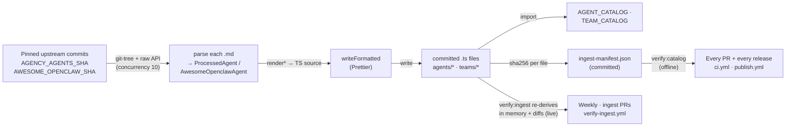

The marketplace catalog, 304 deployable agents and 82 teams, is **committed codegen**. None of it is fetched at runtime, and none of it is hand-maintained entry by entry. Instead, `scripts/ingest-marketplace-content.ts` reads two upstream GitHub repos at pinned commits, parses each `.md` file into a typed catalog entry, renders the entries as TypeScript source, runs that source through Prettier, and writes it to disk. The 20 generated files under `apps/web/src/features/marketplace/` are committed to git and imported directly by the app.

Two independent gates keep those files honest, and the split between them matters:

- **`pnpm verify:catalog`** checks the committed files against a committed **integrity manifest** (`scripts/ingest-manifest.json`). It is **offline**, so it runs on every PR _and_ on the release path.
- **`pnpm verify:ingest`** re-runs the whole render pipeline in memory against the **live** pinned upstream commits and diffs the result. It runs weekly, on demand, and on any PR touching the ingest scripts, deliberately **off** the release critical path.

This page explains _why_ the catalog is built this way, how the ingest pipeline is structured as a deterministic function of a pinned input, the zero-loss `identityTemplate` invariant that the whole design hangs on, how the two gates divide the work, and how to bump a pinned SHA. For the _shapes_ this pipeline produces, the `AgentCatalogEntry` / `TeamTemplate` schemas, the ID conventions, the per-source counts, see the [marketplace catalog reference](/reference/marketplace-catalog). This page is about the machinery, not the output.

## What it is, and what it isn't

The ingestion pipeline is a **build-time content generator**, not a runtime feature. It runs only when a maintainer invokes `pnpm ingest:marketplace`; the app never calls it. The product of that run is plain committed TypeScript, so the marketplace browses and deploys entirely client-side with no network dependency on the upstream repos; a fresh `npx clawboo` install carries the full catalog inside its bundle.

It is also **not** the source of truth for the catalog. The committed `.ts` files are. The pinned upstream commits are an _input_ to a transform that produced those files; once generated, the files stand on their own. The ingest script exists to regenerate them deterministically (when an upstream pin is bumped), and the verify script exists to prove they were generated and not hand-edited. The upstream repos could vanish and the catalog would be unaffected.

This is the deliberate middle path between two alternatives the project rejected:

- **Runtime fetch** would break offline-first installs and make the catalog non-reproducible; a deploy would depend on a live GitHub and on whatever the upstream `HEAD` happened to be.
- **Hand-writing** ~300-line entries across hundreds of agents is error-prone, unreviewable at scale, and would drift the moment an upstream source changed.

Committed codegen keeps the offline-first guarantee _and_ reproducibility, while making every change auditable as a normal PR diff.

<Note>
A small, hand-written slice sits beside the generated content and is deliberately *not* part of the pipeline: the 15 clawboo built-in agents (`agents/clawboo/*`), the 5 built-in teams (`teams/clawboo-builtin.ts`), and the catalog barrel (`teams/index.ts`). Their source is local TypeScript with path-alias imports the ingest script can't resolve at script runtime, so they're authored by hand and skipped by the verifier. The generated arrays they import *are* verified.
</Note>

## The model

The pipeline is one deterministic function: **pinned commits → parse → render → Prettier → committed `.ts`**, with the verifier re-running the middle three steps and diffing.



Two properties make this a _function_ rather than a script with side effects, and both are load-bearing for the verify gate:

1. **The input is pinned.** The two upstream commit SHAs are constants in `scripts/lib/ingest-helpers.ts` (`AGENCY_AGENTS_SHA = '64eee9f8…'`, `AWESOME_OPENCLAW_SHA = '659895e5…'`). Both the ingest and verify scripts import the _same_ constants, and every GitHub call, the recursive git-tree fetch and each raw-file fetch, embeds the SHA in its URL. Nothing reads a branch `HEAD`. Re-running today and re-running in a year against the same pins produce byte-identical output.
2. **The transform is order-stable.** Every domain's agents are sorted by `id` before rendering, the awesome-openclaw entries are sorted by `id`, and the per-usecase named-agent extraction de-dupes deterministically. There is no `Date.now()`, no `Math.random()`, no filesystem-order dependence in the rendered content.

Because the function is deterministic, the verifier can re-evaluate it and assert the committed files equal the result, which is the entire trust model (see [the verify gates](#the-verify-gates)).

## How the ingest pipeline works

`scripts/ingest-marketplace-content.ts` orchestrates two source pipelines plus a team-generation phase. The reusable logic, every fetch, parse, and render helper, lives in `scripts/lib/ingest-helpers.ts`, which the verify script imports as well. Keeping the helpers in one module is what guarantees the generator and verifier can't diverge.

### Fetch (pinned, concurrency-limited)

For each source, the script fetches the repo's recursive git tree at the pinned SHA via the GitHub API, filters the tree to the relevant `.md` blobs (the 13 agency domain folders; everything under `usecases/` for awesome-openclaw), then downloads each file's raw content. Downloads run through a hand-rolled `pLimit(tasks, concurrency)` worker pool at concurrency 10, enough to be fast, bounded enough to stay under GitHub's unauthenticated rate ceiling. The raw-content URLs hit `raw.githubusercontent.com/<repo>/<SHA>/<path>`, again pinned.

### Parse (markdown → typed entry)

Each agency `.md` file becomes a `ProcessedAgent` via `processAgentFile`. The parser:

- derives a stable `id` (`agency-<slug(filename)>`, with the sub-folder prepended for game-development files to avoid collisions),
- pulls a 1–2 sentence `description` from the YAML frontmatter (with a body-line fallback),
- distills a `soulTemplate` by collecting up to three sections whose headings match a small `SOUL_KEYWORDS` list (tolerant of leading emoji and possessive prefixes), falling back to the first 400 characters,
- matches `skillIds` against an inline `SKILL_MATCH_CATALOG` by word-boundary tag matching, and
- sets `identityTemplate` to the file's content **verbatim** (see [the zero-loss invariant](#the-zero-loss-identitytemplate-invariant)).

The awesome-openclaw pipeline is different in kind: those files are prose usecase write-ups, not agent manifests. `processUsecaseFile` always emits one guaranteed `*-operator` entry per usecase, then runs five regex passes over the body to extract named role/phase agents (`### Agent N: Name (Role)`, `### Name Agent`, `**Name Agent**` bold, and two passes scoped to the `## What It Does` section), de-duped per file by role slug. Even a usecase page with zero detectable headings yields its operator, the floor that keeps the count stable. The whole usecase body still becomes each entry's verbatim `identityTemplate`.

### Render and format (the Prettier step)

The render helpers (`renderDomainFile`, `renderAwesomeOpenclawFile`, the team renderers) emit TypeScript source by `JSON.stringify`-ing each field into an object literal. That raw output is _unformatted_, double-quoted, single-line strings, and would never byte-match a committed file. So every write goes through a `writeFormatted(outPath, content)` helper that runs `prettier.format(content, { parser: 'typescript', filepath: outPath })` before flushing to disk.

<Info>
`prettier.format({ parser, filepath })` does **not** resolve `.prettierrc`. So `writeFormatted` emits Prettier's *default* style (double quotes, semicolons, `printWidth: 80`), and the pre-commit `prettier --write` hook then restyles the generated files into the repo's style (single quotes, no semicolons, `printWidth: 100`). That restyle is expected, and it is invisible to both gates.

The reason it's invisible is the **canonical form**: the shared default-option `prettier.format` output. `verify:ingest` runs _both_ the freshly generated content and the committed content through that same call before comparing (`scripts/verify-ingest.ts`'s `format()`), and the integrity manifest hashes it (`canonicalize()` in `scripts/lib/ingest-manifest.ts`). Because both sides are normalized identically, a difference in formatting can never be mistaken for a difference in content — and the hashes are invariant to code style, to `.prettierrc` changes, and to CRLF line endings on a Windows checkout.
</Info>

### Team generation

After the agent files are written, the script builds the three generated team files from the same in-memory agent data:

- `teams/agency-workflows.ts`: five hand-curated workflows (`WORKFLOW_TEAM_CONFIGS` maps each example filename to a list of catalog agent IDs), with hub-and-spoke routing generated by `buildHubSpokeRouting` (first agent is the leader; everyone else routes to `@<Leader>`) and the full example `.md` body stored as `workflowNarrative`.
- `teams/awesome-openclaw.ts`: one team per usecase, members grouped by usecase slug.
- `teams/synthetic.ts`, the 30 "Excellence Teams" that partition every agency agent _not_ already covered by a workflow team into per-domain clusters, so every agent appears in at least one team. The exclusion set comes from `workflowAgentIds()`.

These three are generated; `teams/clawboo-builtin.ts` and `teams/index.ts` are hand-written.

## The zero-loss `identityTemplate` invariant

The single most important property of the catalog, the one the deploy story depends on and a unit test enforces, is **zero-loss**: every entry's `identityTemplate` is the full, verbatim source content, never a condensed summary.

For the two upstream sources this is trivial by construction: `processAgentFile` and `processUsecaseFile` both assign `identityTemplate: content`, the exact `.md` body fetched at the pinned commit. For clawboo built-ins (which have no upstream `.md`) `fromInlineAgent` synthesizes the `identityTemplate` from the full set of inline fields under headings, structured around the original data, never lossy of it.

The shorter, distilled `soulTemplate` is a separate field. The two map onto two different deploy artifacts:

| Field              | Deploy artifact | Content                                   |
| ------------------ | --------------- | ----------------------------------------- |
| `soulTemplate`     | `SOUL.md`       | Distilled mission statement               |
| `identityTemplate` | `IDENTITY.md`   | The full, verbatim source body, zero-loss |

So a deploy is lossless: `createAgent` writes `identityTemplate` straight into the agent's `IDENTITY.md`, byte-for-byte for upstream entries. The same property is what lets the agent-detail modal render an agent's _entire_ original spec before you commit to deploying it.

The guarantee is mechanical, asserted for every catalog entry by `agentCatalog.test.ts`:

```ts
it('identityTemplate.length > 500 (zero-loss — full content preserved)', () => {
  for (const e of AGENT_CATALOG) {
    expect(e.identityTemplate.length).toBeGreaterThan(500)
  }
})
```

A length floor is a blunt instrument, but a deliberate one: any future change that accidentally swapped in a summary, a slug, or a truncated excerpt would drop dozens of entries under 500 characters and fail loudly. The invariant isn't documentation; it's a tripwire.

## Design rationale and trade-offs

**Why a separate verify script instead of one idempotent generator?** Because a generator that "fixes" drift in place would mask the drift. The two-script split makes the property explicit and externally checkable: `ingest` _writes_, `verify` _asserts_, and CI runs only `verify`. A reviewer can trust a green check without re-running the network-bound generator. The cost is keeping one renderer (`renderAgentsIndex`) duplicated across both scripts, a small, intentional copy that a comment flags, paid to keep the verifier self-contained.

**Why pin SHAs rather than track a branch?** Determinism. A pinned commit makes the transform a pure function of a fixed input, which is the precondition for the verifier to be meaningful at all. Bumping the catalog is a conscious act: change a SHA constant in `ingest-helpers.ts`, re-run `pnpm ingest:marketplace`, commit the regenerated files. The verify gate then proves the new files match the new pin.

**Why commit the output at all?** So the catalog ships in the bundle and the install is offline-first, and so catalog changes show up as reviewable diffs. The alternative, generating at build time, would make the build depend on a live GitHub and would hide the catalog from review.

**Why two gates instead of just the live one?** Because the live check reaches two external repos, and a 404 is non-retryable by design (a rename or a force-push is not a transient error worth retrying). While `verify:ingest` sat on the release path, an upstream change could hold up a release, including an urgent fix. Splitting the gate keeps the semantic check without that coupling: the release path asserts an offline invariant, and upstream drift is surfaced on its own schedule.

## The integrity manifest

`scripts/ingest-manifest.json` is written by `pnpm ingest:marketplace` as its last step and asserted by `pnpm verify:catalog`. It records the two pinned upstream commits plus a `sha256` per generated file:

```json
{
  "$comment": "AUTO-GENERATED — do not edit manually. Regenerate: pnpm ingest:marketplace…",
  "version": 1,
  "sources": {
    "agency-agents": { "repo": "msitarzewski/agency-agents", "sha": "64eee9f8…" },
    "awesome-openclaw": { "repo": "hesamsheikh/awesome-openclaw-usecases", "sha": "659895e5…" }
  },
  "files": {
    "apps/web/src/features/marketplace/agents/agency/academic.ts": "111bba55…"
  }
}
```

Three design points:

1. **Hashes are over the canonical form, not the raw bytes.** See the `<Info>` above: raw-byte hashes would go stale the moment the pre-commit hook restyled a generated file. Hashing the canonical form makes them invariant to style, to `.prettierrc`, and to CRLF. The one thing they _are_ sensitive to is a Prettier major bump moving that canonical form, which is what `pnpm ingest:manifest` exists to re-bless.
2. **The file set is derived, not hand-listed.** Both the manifest and `verify:catalog` enumerate via `catalogFilePaths()` in `scripts/lib/ingest-helpers.ts`, composed from the same path helpers the generator writes through, so the list cannot drift from what is actually generated. `verify:ingest` additionally cross-checks its own file list against that enumeration, so the two verifiers police each other.
3. **Manifest keys are repo-relative and POSIX-separated**, so a regeneration on Windows does not rewrite all 20 keys with backslashes.

`pnpm verify:catalog` performs five checks: the manifest parses at a known `version`; its `sources` match the SHA constants in `ingest-helpers.ts` (this is the check that catches _"bumped a pin, forgot to regenerate"_); the manifest covers exactly the generated file set, in both directions; the file count matches the `CATALOG_FILE_COUNT` tripwire; and every file is present and hashes to what was recorded. Failures name the remediation explicitly.

<Warning>
The manifest is a **drift detector, not an anti-tamper control**. Anyone who can commit can regenerate it, and it proves only that the committed files are what the last generator run produced — not that they match upstream. `pnpm verify:ingest` remains the semantic authority, which is why the live check still runs, just on its own schedule.
</Warning>

## The verify gates

`scripts/verify-catalog.ts` is the gate on the PR and the release path. It is described in full [above](#the-integrity-manifest): re-hash the 20 committed files, compare against the manifest, no network.

`scripts/verify-ingest.ts` is the semantic authority. It re-runs the agency and awesome-openclaw pipelines and the three team renderers entirely in memory, fetching the same pinned trees, parsing the same files, rendering the same source; then, for each file it owns, reads the committed file from disk, runs _both_ the freshly generated content and the committed content through Prettier with identical config, and string-compares. On any mismatch it prints a short line diff and exits `1`; when every generated file is current it exits `0`. Hand-written files (the clawboo built-ins, `teams/clawboo-builtin.ts`, `teams/index.ts`) are not in its check set.

The two gates are wired into three workflows:

| Workflow                              | Check                                            | Network | Runs on                                                         | Blocks                      |
| ------------------------------------- | ------------------------------------------------ | ------- | --------------------------------------------------------------- | --------------------------- |
| `.github/workflows/ci.yml`            | `pnpm verify:catalog` in a `verify-catalog` job  | No      | Every push to `main` and every PR                               | Red check on the PR         |
| `.github/workflows/publish.yml`       | `pnpm verify:catalog` step before `pnpm build`   | No      | Every push to `main`                                            | Releases                    |
| `.github/workflows/verify-ingest.yml` | `pnpm verify:catalog`, then `pnpm verify:ingest` | Yes     | Weekly cron, `workflow_dispatch`, and PRs touching ingest paths | Nothing on the release path |

Why the release path uses the offline check: an upstream repo that has been renamed or force-pushed returns a non-retryable 404, and that must never be able to hold up a release.

Why the PR paths trigger on the live workflow is load-bearing rather than decorative: `renderAgentsIndex()` is duplicated between `scripts/ingest-marketplace-content.ts` and `scripts/verify-ingest.ts` (see the rationale above), and only the live re-derive catches the two copies drifting apart. Without a PR trigger, that regression could sit unnoticed for a week.

<Warning>
Do **not** add the `verify-ingest.yml` job to the branch-protection required checks. Its `pull_request` trigger is paths-filtered, so on a PR touching none of those paths the check never reports — and a required check that never reports blocks the PR forever. The offline `verify-catalog` job is the one safe to require.
</Warning>

<Warning>
Every generated file opens with an `// AUTO-GENERATED — do not edit manually` header. Editing one by hand now fails `pnpm verify:catalog` immediately and offline, locally as well as in CI. To change catalog content, bump the pinned SHA in `scripts/lib/ingest-helpers.ts` and re-run `pnpm ingest:marketplace`, never patch the generated `.ts` directly.
</Warning>

## Refreshing the catalog

Bumping a pinned upstream commit is a deliberate act. The whole procedure:

1. **Pick the new upstream commit.** Read the diff between the current pin and the candidate first; a re-ingest rewrites every generated file, so a large upstream change is a large PR.
2. **Edit the SHA constant** in `scripts/lib/ingest-helpers.ts` (`AGENCY_AGENTS_SHA` or `AWESOME_OPENCLAW_SHA`). The SHA is embedded in the 14 per-source data files' headers and in every entry's `sourceUrl`, so one constant moves all of them. (The six barrel and team files carry no SHA header — they re-export rather than restate the data.)
3. **Regenerate** with `pnpm ingest:marketplace`. This needs network. Locally the GitHub API allows 60 requests/hour unauthenticated and the run makes ~180, so export a `GITHUB_TOKEN` (or `GH_TOKEN`) first to get the 5000/hour ceiling.
4. **Expect** 20 regenerated `.ts` files plus an updated `scripts/ingest-manifest.json`.
5. **Verify both gates:** `pnpm verify:catalog` (offline) then `pnpm verify:ingest` (live).
6. **Run the tests:** `pnpm test`. The catalog suites assert count lower bounds, ID uniqueness, and the zero-loss `identityTemplate` floor — the checks that catch an upstream restructure quietly dropping content.
7. **Commit.** The pre-commit hook restyles the generated files into the repo's Prettier style. That is expected and does not change the manifest hashes.
8. **Open the PR.** The ingest-paths trigger runs the live check automatically, so the PR gets both gates.

No changeset is needed for a catalog refresh on its own — it is a `apps/web` content change, and the PR template's "not needed: docs/CI/web-only change" applies.

<Warning>
`pnpm ingest:manifest` re-blesses the manifest from whatever is on disk. It exists for exactly one case: a **tooling** change that moves the canonical form with no content change, a Prettier major bump being the realistic example. Never reach for it to silence a `verify:catalog` failure — that would bless a hand-edit of an AUTO-GENERATED file. If content changed, the answer is always `pnpm ingest:marketplace`.

The one way it could actually defeat the gate is guarded mechanically rather than by convention: re-blessing **across a pin change** would record the new SHA against hashes of content generated from the old one, turning `verify:catalog` green on a catalog that does not match its own pin. So `ingest:manifest` compares the manifest's recorded sources against the constants first and **refuses to run** if they differ, pointing at `pnpm ingest:marketplace` instead. For the same reason, a `verify:catalog` failure caused by a pin mismatch does not offer the re-bless path in its remediation text at all.
</Warning>

## Boundaries and non-goals

- **Not a live marketplace.** There is no runtime fetch, no remote catalog API, no per-install update channel. The catalog is whatever was committed at build time. A "fetch from ClawHub" model is a hypothetical future, not a shipped feature.
- **Not the source of truth for the hand-written slice.** The 15 clawboo built-in agents and 5 built-in teams are authored by hand and live outside the pipeline. `verify:ingest` neither generates nor checks them; their correctness rests on ordinary unit tests, not on the drift gate.
- **Counts are not test assertions.** The catalog ships 304 agents and 82 teams, but the tests assert _lower bounds_ (≥ 270 agents, ≥ 160 agency, ≥ 40 awesome, ≥ 15 clawboo) so a future re-ingest can grow the catalog without breaking them. Treat the zero-loss `identityTemplate` floor and the verify gate as the invariants, not the exact counts.

<Note>
These docs describe Clawboo **v0.3.1**, the current release.
</Note>

## See also

- [Marketplace catalog reference](/reference/marketplace-catalog), the `AgentCatalogEntry` / `TeamTemplate` schemas, ID conventions, and per-source counts this pipeline produces
- [The agent model](/concepts/agent-model), what a deployed catalog agent becomes
- [Release process](/internals/release-process), Changesets, `publish.yml`, and the clean-install gate this sits alongside
- [Monorepo and build](/internals/monorepo-and-build), the Turbo / pnpm build the catalog compiles into
- [Testing](/internals/testing); the unit / e2e / clean-install strategy that backs the catalog's invariants
- [Glossary](/appendices/glossary), canonical term definitions
