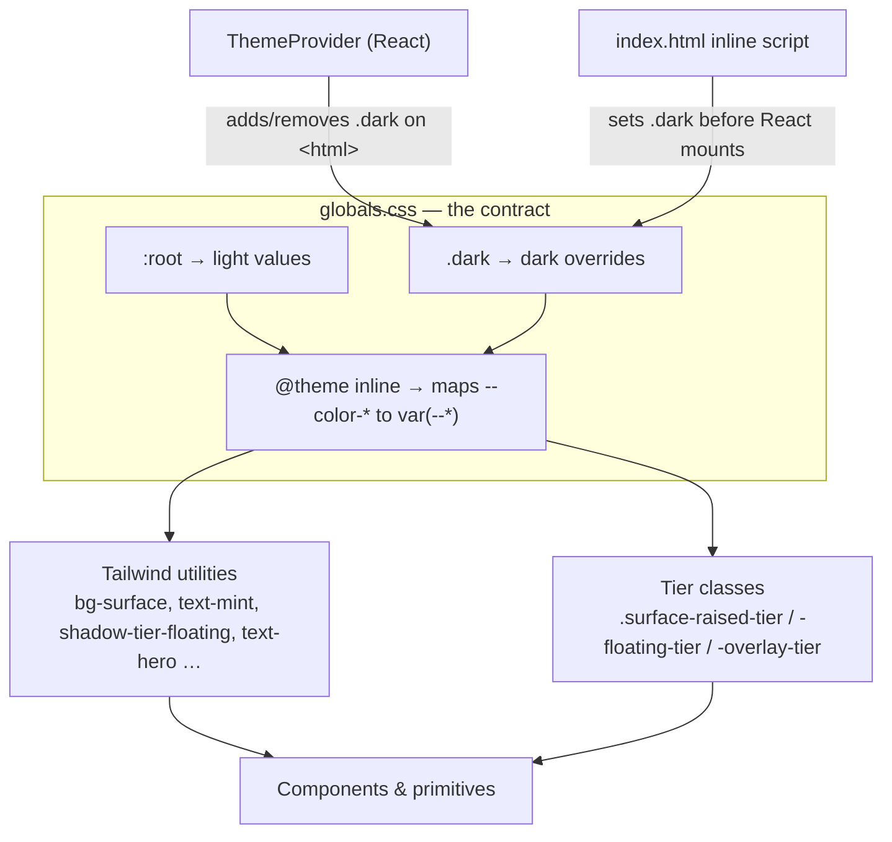

Clawboo's design system is a single CSS file plus a thin runtime: every color, shadow, font, motion curve, and type step is a CSS custom property declared in [`apps/web/src/app/globals.css`](https://github.com/clawboo/clawboo/blob/main/apps/web/src/app/globals.css), and switching the entire visual theme is one class flip on `<html>`. There is no component library to learn; the tokens are the contract, and a small set of reusable primitives (`Skeleton`, `Spinner`, `StatusPill`, `EmptyState`, `FormattedAlert`, `Select`) bundle the right tokens for the patterns that recur.

This page explains the theme architecture (Tailwind 4 `@theme inline` indirection over `:root` light / `.dark` overrides), the four-tier surface elevation model, the motion tokens, the type scale, the brand palette and generative team color collections, and the shared primitives. It is for people working _on_ Clawboo's UI: the goal is that you reach for a token before a raw hex, and a primitive before re-implementing a pattern.

<Note>
The source of truth for every actual token value is `globals.css`, which is what this page cites.
</Note>

## The model



The indirection is the whole trick. A Tailwind utility like `bg-surface` resolves to `--color-surface`, which the `@theme inline` block maps to `var(--surface)`, which `:root` defines as `#ffffff` and `.dark` overrides to `#111827`. Flip one class and every `bg-surface` element re-paints with no rebuild and no flash. Component code never names a hex; it names a semantic token, and the token carries the theme.

## Theme architecture

### `@theme inline` indirection

The top of `globals.css` is a Tailwind 4 `@theme inline` block whose entries are pure aliases: `--color-surface: var(--surface)`, `--color-mint: var(--mint)`, and so on. This is what makes the theme runtime-switchable. Tailwind generates utilities from the `--color-*` names, but each one points at a _second_ variable (`--surface`, `--mint`) that is redefined per theme. Without the `inline` keyword Tailwind would bake the value at build time; with it, the value is read live from the cascade.

The same block registers the `@custom-variant dark (&:where(.dark, .dark *))` so `dark:` utilities key off the `.dark` class rather than a media query; the app controls the theme explicitly, including a "system" mode that resolves to one or the other.

### `:root` light, `.dark` overrides

Light is the default. `:root` declares the full token set with light values; the `.dark` selector re-declares the _same_ token names with dark values. The light theme is paper-white (`--background: #f8fafc`, `--surface: #ffffff`, slate-900 text); the dark theme is the original production palette (`--background: #0a0e1a`, `--surface: #111827`, `#e8e8e8` text). Brand colors are deepened in light mode for AA contrast on white; OpenClaw Red is `#e94560` in dark but `#dc2a48` in light, mint is `#34d399` → `#059669`, amber is `#fbbf24` → `#d97706`.

A handful of tokens are deliberately theme-_invariant_, declared only in `:root` and inherited everywhere:

- **Terminal surfaces**: `--terminal-bg: #0d1117` / `--terminal-fg: #e8e8e8`. Onboarding install/gateway log windows always read as a terminal regardless of app theme.
- **Motion tokens**: the easing curves and durations (see [Motion tokens](#motion-tokens)) don't change between themes.

### The one-class flip

Two pieces apply the `.dark` class, and they must agree:

1. **`ThemeProvider`** (`apps/web/src/features/theme/ThemeProvider.tsx`), a React context holding `theme: 'system' | 'light' | 'dark'` and a derived `resolvedTheme: 'light' | 'dark'`. It reads `localStorage['clawboo.theme']` on mount, defaulting to `'light'` when nothing is stored (so onboarding happens in light mode). It subscribes to `matchMedia('(prefers-color-scheme: dark)')` _only_ while in system mode, and adds/removes `.dark` on `document.documentElement` whenever `resolvedTheme` changes. `useTheme()` exposes `{ theme, resolvedTheme, setTheme }` and throws if called outside the provider. `ThemeToggle` cycles `light → dark → system`.

2. **An inline script in `apps/web/index.html`**, runs synchronously before React mounts to prevent a flash of the wrong theme (FOUC). It mirrors the provider's resolution logic exactly: read `localStorage['clawboo.theme']`, default to `'light'`, resolve `'system'` via `matchMedia`, and set `.dark` on `<html>`.

<Info>
The inline `index.html` script and `ThemeProvider`'s resolver are duplicated logic by necessity; the script must run before any JS bundle loads. The default (`'light'`), the storage key (`clawboo.theme`), and the `'system'` resolution must stay identical in both. Change one, change the other.
</Info>

`ThemeProvider` wraps the app tree in `apps/web/src/app/providers.tsx`. Components that render their own pixel-themed surfaces (CodeMirror, Recharts) read `resolvedTheme` and pick a matching theme object; for example the editor exports both `clawbooEditorThemeDark` and `clawbooEditorThemeLight`.

## Surface elevation (four tiers)

The visual hierarchy is a four-tier elevation model. Tier 1 is the base `--surface`; tiers 2–4 each bundle a background, border, shadow, and (for the glass tiers) a backdrop blur into a single class so a card, popover, or modal opts into the right elevation with one `className`.

| Tier        | Class                    | Used for                                     | Treatment                                                        |
| ----------- | ------------------------ | -------------------------------------------- | ---------------------------------------------------------------- |
| 1           | (`bg-surface`)           | The base panel surface                       | Opaque base                                                      |
| 2: Raised   | `.surface-raised-tier`   | Cards in normal flow (marketplace cards)     | Opaque lift + subtle shadow                                      |
| 3: Floating | `.surface-floating-tier` | Popovers, dropdowns, context menus, tooltips | Glass: translucent + `blur(16px) saturate(140%)`                 |
| 4: Overlay  | `.surface-overlay-tier`  | Modals, sheets, command palettes, wizards    | Glass: translucent + `blur(20px) saturate(140%)` + lifted shadow |

Each tier resolves its own token trio. The raised tier uses `--surface-raised` (a slight lift: `#fdfdfe` light, `#141b2e` dark), `--border`, and `--shadow-raised`. The floating and overlay tiers use translucent surfaces (`--surface-floating`, `--surface-overlay`), highlight borders that read on glass (`--border-floating`, `--border-overlay`), and progressively heavier multi-layer shadows (`--shadow-floating`, `--shadow-overlay`). Shadows are theme-aware: light mode is soft and slate-tinted, dark mode keeps a deep-black drop.

The tier class brings _only_ background, border, shadow, and blur. Component-specific properties, `border-radius`, `padding`, an accent-colored border, positioning, stay inline on the element. A glass tier is always paired with a scrim behind it: `--overlay-scrim` (modal strength) and `--overlay-scrim-soft` (sheet strength) replace hardcoded `rgb(0 0 0 / X)` backdrops with theme-aware values. `--code-block-bg` is the companion token for code/tool-call rows and command previews.

```tsx
// Modal: overlay tier + a separate scrim div behind it
<motion.div className="surface-overlay-tier w-full max-w-md rounded-2xl p-6">…</motion.div>

// Card: raised tier as a base, accent border kept inline
<motion.div
  className="surface-raised-tier"
  style={{ border: `1px solid ${accent}25`, borderRadius: 12 }}
>…</motion.div>
```

<Note>
The elevation shadows are also exposed as Tailwind utilities, `shadow-tier-raised`, `shadow-tier-floating`, `shadow-tier-overlay`, generated from the `--shadow-tier-*` aliases in the `@theme inline` block, for cases where you want the shadow without the rest of the tier treatment.
</Note>

## Motion tokens

Motion is theme-invariant and lives in `:root`. Five tokens cover the app's transition vocabulary:

| Token                      | Value                                  | Use                                  |
| -------------------------- | -------------------------------------- | ------------------------------------ |
| `--motion-fast`            | `150ms cubic-bezier(0.4, 0, 0.2, 1)`   | Hover, focus, button press           |
| `--motion-base`            | `200ms cubic-bezier(0.4, 0, 0.2, 1)`   | State changes, tab switches          |
| `--motion-emphasized`      | `300ms cubic-bezier(0.32, 0.72, 0, 1)` | Modal / sheet enter                  |
| `--motion-easing-standard` | `cubic-bezier(0.4, 0, 0.2, 1)`         | Easing only, for custom `transition` |
| `--motion-easing-spring`   | `cubic-bezier(0.32, 0.72, 0, 1)`       | Spring-feel easing only              |

The first three are full `<duration> <easing>` shorthands you drop straight into a `transition` property (`transition: border-color var(--motion-fast)`); the last two are easing curves only, for when you need a custom duration. Framer Motion springs are the runtime side of this, used for state-change choreography that CSS transitions can't express.

Accessibility is built in. A global `@media (prefers-reduced-motion: reduce)` rule neutralizes CSS `animation-duration` / `transition-duration` to `0.001ms` across `*`, freezes the skeleton shimmer to a static tint, and forces `scroll-behavior: auto`. Framer Motion respects `prefers-reduced-motion` at the framework level on top of that. A global `:focus-visible` rule paints a 2px accent ring (`outline: 2px solid var(--primary)`) on every keyboard-focused interactive element, suppressed inside React Flow and CodeMirror, which own their focus visuals.

## Type scale

Three font families, each a token: `--font-display` (Cabinet Grotesk, loaded from the Fontshare CDN), `--font-body` (DM Sans, Google Fonts CDN), and `--font-mono` (Geist Mono, a local `@font-face` from a woff2). The `@theme inline` block exposes them as the `font-display`, `font-body`, and `font-mono` Tailwind families.

The type scale fills the gaps Tailwind's default leaves. Tailwind already ships `text-xs` (12), `text-sm` (14), `text-base` (16), `text-lg` (18), `text-2xl` (24); the custom tokens add the steps Clawboo needs:

| Token            | Size / line-height | Generated utility | For                                            |
| ---------------- | ------------------ | ----------------- | ---------------------------------------------- |
| `--text-micro`   | 11 / 14            | `text-micro`      | Micro labels, count pills                      |
| `--text-compact` | 13 / 18            | `text-compact`    | Compact agent/row names (the one missing step) |
| `--text-section` | 22 / 28            | `text-section`    | Section headers                                |
| `--text-page`    | 28 / 34            | `text-page`       | Page titles                                    |
| `--text-hero`    | 40 / 46            | `text-hero`       | Welcome hero, marketing-grade headlines        |

A typography rule of thumb runs through the codebase: titles ≥ 18px use `--font-display` with negative letter-spacing; body and small headings stay DM Sans; code, tool-call lines, timestamps, and metric columns stay Geist Mono. A `.font-data` utility class bundles mono + `tabular-nums` so numeric columns (cost, token counts, ports, durations) align and don't jitter as values update.

## Brand palette and team color collections

### The brand colors

The brand identity is three accents, OpenClaw Red (primary), mint, and amber, plus a category palette. Each is a token with a per-theme value and an `rgb` triplet companion (`--mint-rgb`, `--amber-rgb`, `--primary-rgb`, `--foreground-rgb`) so component code can compose translucent overlays via `rgb(var(--mint-rgb) / 0.2)` rather than reaching for a fixed alpha hex.

| Token       | Light     | Dark      | Role                                                |
| ----------- | --------- | --------- | --------------------------------------------------- |
| `--primary` | `#dc2a48` | `#e94560` | OpenClaw Red, accent, destructive-adjacent emphasis |
| `--mint`    | `#059669` | `#34d399` | Success / working / done                            |
| `--amber`   | `#d97706` | `#fbbf24` | Warning / pending                                   |

A separate **category palette** (`--category-data`, `--category-comm`, `--category-code`, `--category-file`, `--category-web`, `--category-other`) gives a stable color per classification slot for skill / cron / source badges. `comm` aliases mint and `file` aliases amber so the visual language stays consistent; the rest are their own hues, deepened one step in light mode for contrast. The dark values are intentionally byte-identical to the hardcoded hex they replaced, so the dark UI looked unchanged after the token migration. Consumers compose opacity with `color-mix(in srgb, var(--category-X) N%, transparent)`.

<Note>
`@clawboo/ui` exports a `tokens` constant with the *dark* brand hex values for any non-CSS context that needs literal colors (it predates the full theme system). For themed UI, prefer the CSS tokens; the `tokens` constant does not switch with the theme.
</Note>

### Team color collections

A team doesn't pick individual Boo colors; it picks a _collection_, and each of its Boos gets a distinct color generated from that collection. The recipes live in `apps/web/src/lib/teamPalettes.ts`. There are eight collections, `vivid-pop`, `dusty-pastel-pro`, `coastal-mist`, `executive-jewel`, `sharp-saas`, `soft-neutral-editorial`, `monochrome-accent`, and `classic`, and the team's choice is stored in a `color_collection_id` column on the `teams` table.

`generateTeamColors(collectionId, count, theme, hueRotation)` is the generator. For a generative collection it divides the OKLCH hue wheel into `count` even steps from the recipe's `hueOffset`, staggers lightness alternately (an Okabe-Ito separation so the team reads as distinct even in grayscale or under color-vision deficiency), picks the lightness band by theme, nudges any wheel-adjacent pair that collapses below a minimum perceptual distance, and gamut-maps each result to sRGB via culori's `clampChroma` (reduce chroma, preserve hue and lightness, the CSS Color 4 strategy). A per-team `hueRotation`, derived from the team id via `hueRotationFromSeed` (FNV-1a → 0–359°), shifts _which_ hues appear so two teams on the same collection at the same size don't look identical, while leaving chroma and lightness, the collection's "feel", untouched.

`classic` is the default and is legacy-faithful: it carries a `fixedColors` list (the original tint set minus the Boo-Zero-reserved red) and the OKLCH recipe fields are ignored. For `classic`, `pickBooColor` short-circuits to the original per-agent hash assignment (`resolveBooTint(agentId)`), so out of the box every Boo keeps the exact color it had before collections existed. The reserved tint list itself, `TINTS` in `@clawboo/boo-avatar`, re-exported through `@clawboo/ui`, pins index 0 (`#ff4d4d`, OpenClaw Red) to Boo Zero; every other agent hashes into `TINTS[1..9]`.

The full deployment-matches-preview discipline (a team's create-time preview palette equalling its deployed palette, via a client-minted team id) is covered in [Teams](/using/teams).

## Reusable primitives

The pattern primitives live in `apps/web/src/features/shared/`. Each one bundles the right tokens so a recurring UI pattern reads consistently and stays theme-correct, accessible, and reduced-motion-safe by construction.

| Primitive        | File                 | What it gives you                                                                                                                                                                                                                                                                              |
| ---------------- | -------------------- | ---------------------------------------------------------------------------------------------------------------------------------------------------------------------------------------------------------------------------------------------------------------------------------------------- |
| `Skeleton`       | `Skeleton.tsx`       | A shimmer placeholder block (`width` / `height` / `radius`). Uses the `.clawboo-skeleton` class, which animates a `--surface → --surface-raised → --surface` gradient sweep and freezes to a static tint under reduced motion. `aria-hidden`.                                                  |
| `Spinner`        | `Spinner.tsx`        | An in-flight `Loader2` spinner. Under `prefers-reduced-motion` it swaps to a static `LoaderCircle` ring (a frozen partial arc would read as broken). `aria-hidden`.                                                                                                                            |
| `StatusPill`     | `StatusPill.tsx`     | The canonical mono / uppercase / tracking-wider status indicator. `tone` ∈ `working \| done \| idle \| warning \| success \| error`; omit `label` to render a dot-only indicator (the Working-pulse / Done-mint / Idle-gray pattern). Each tone maps to a brand token, so themes flow through. |
| `EmptyState`     | `EmptyState.tsx`     | The branded empty state: a 56px circular icon disc + a Lucide icon @ 26px + a Cabinet-Grotesk title + a DM-Sans helper + an optional CTA. `tone` ∈ `neutral \| mint \| amber \| primary` tints the disc. Never an emoji.                                                                       |
| `FormattedAlert` | `FormattedAlert.tsx` | A thin in-flow callout strip with a leading semantic Lucide icon. `tone` ∈ `info \| warning \| error`; `role="alert"` for errors, `role="status"` otherwise. Not for toasts (those have their own motion system).                                                                              |
| `Select`         | `Select.tsx`         | A styled wrapper around the native `<select>`, keeps full keyboard / type-ahead / screen-reader / mobile-picker behavior, layers on token-driven chrome and a custom Lucide chevron. `size` ∈ `sm \| md`; pass `options` or `<option>` children.                                               |

Two principles run through all of them. **They are token-driven**, every color is a CSS variable (`rgb(var(--mint-rgb) / 0.2)`, `var(--primary)`), so a primitive recolors itself when the theme flips with no per-component logic. **They are accessibility-first**; reduced-motion fallbacks, `aria-*` and `role` attributes, and native-element semantics are baked in, so callers get correct behavior for free.

`ResizeHandle.tsx` lives in the same directory but is a layout primitive (the split-panel drag seam) rather than a token-bundling design primitive.

## Design rationale and trade-offs

**One file, one flip.** Putting every value in `globals.css` and switching themes with a single class buys two things: zero-rebuild theming (a contributor can re-theme the entire app by editing variable values) and a flash-free first paint (the inline script applies the class before React mounts). The cost is the duplicated resolver in `index.html`, which must be kept in lockstep with `ThemeProvider`.

**Tokens over hex.** The semantic indirection (`bg-surface` → `--color-surface` → `--surface`) means component code states _intent_, not appearance. A new theme is a new set of variable values, not a sweep through component files. The discipline this requires; never writing a raw hex in a component, is the price.

**Tier classes over bespoke elevation.** Bundling background + border + shadow + blur into `.surface-raised-tier` / `-floating-tier` / `-overlay-tier` keeps elevation consistent and theme-correct everywhere a card, popover, or modal appears, instead of each one re-deriving its own shadow stack.

**Generative team palettes over fixed tints.** OKLCH generation with CVD-aware lightness staggering and per-team hue rotation scales to any team size and any number of teams while keeping each team distinguishable, something a fixed ten-color tint list can't do. `classic` is retained as the pixel-exact default so nothing changed for existing installs.

## Boundaries and non-goals

- **Not a published component library.** The primitives are app-internal (`apps/web/src/features/shared/`), and `@clawboo/ui` is a `private: true` package; like every `@clawboo/*` package, it ships only inside the CLI bundle, not to npm. There is no externally consumable Clawboo UI kit.
- **Not a full shadcn surface.** `@clawboo/ui` provides `cn`, a `cva` re-export, the `tokens` constant, and the `BooAvatar` component. shadcn/ui primitives are initialized per-app, not vendored into the package.
- **`globals.css` is the single source of truth.** Every token value comes from `globals.css`; this page documents what ships.

<Note>
These docs describe Clawboo **v0.2.0**, the current release.
</Note>

## See also

- [Theming](/using/theming), switching between light and dark from the UI
- [Teams](/using/teams), team color collections in practice
- [Monorepo and build](/internals/monorepo-and-build), where `apps/web` and the packages sit in the build
- [Internals overview](/internals/index), the contributor map
- [Glossary](/appendices/glossary), canonical term definitions
