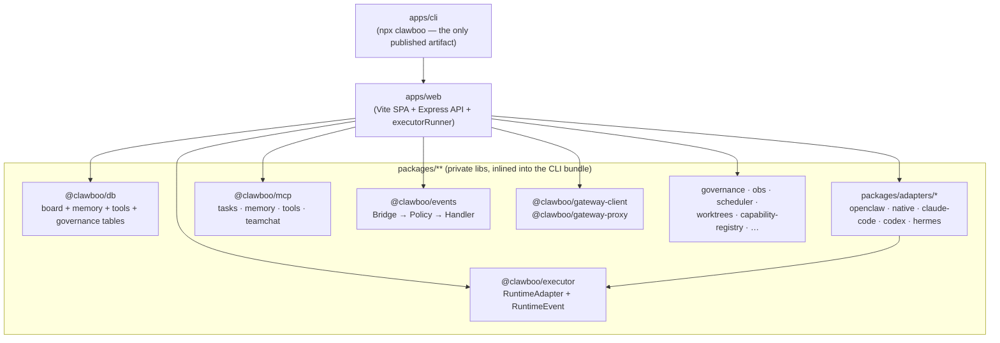

This section is for people working **on** Clawboo, not just with it. Each page is a deep-dive into one part of the machine: the design, the seam or trait it hangs on, the rationale, and the invariants you have to preserve when you change it. They are grounded in the real package and module source, not the README.

If you only read one thing first, read [`CONTRIBUTING.md`](https://github.com/clawboo/clawboo/blob/main/CONTRIBUTING.md) at the repo root; it covers setup (`pnpm install`, `pnpm dev`), branching, the commands CI runs, and the no-feature-flags reality (every subsystem ships on). This index is the conceptual companion: it explains _why_ the code is shaped the way it is.

## Architecture at a glance

Clawboo is a TypeScript monorepo managed by pnpm workspaces and TurboRepo. The workspace globs (`packages/*`, `packages/adapters/*`, `apps/*`, `docs`) split the tree into two layers. **Packages** (`packages/**`) hold the pure, reusable substrate: the durable board (`@clawboo/db`), the `RuntimeAdapter` trait and normalized event union (`@clawboo/executor`), the Gateway client and same-origin proxy, the MCP servers, governance and observability primitives, the per-runtime adapters under `packages/adapters/*`, and the design-token UI kit. **Apps** (`apps/**`) compose them: `apps/web` is the Vite SPA plus the Express API and the server-side orchestration runner (`apps/web/server/lib/executorRunner.ts`), `apps/cli` is the `npx clawboo` installer, and `docs/` is the hand-edited Mintlify docs site. Dependencies flow strictly one way, **packages never import apps**, and every `@clawboo/*` library is `private: true`. The only artifact published to npm is the `clawboo` CLI, which inlines the libraries into its own bundle. The whole system is wired together by a handful of _seams_: a `RuntimeAdapter` makes any runtime (OpenClaw, native, Claude Code, Codex, Hermes) a uniform teammate; an `AgentSource` makes SQLite the registry of record while keeping the Gateway as one source among many; and multiplexer traits (`CapabilitySource`, `ScheduleSource`) fan many providers into one stream.

## The internals map

The pages below go in rough reading order, from the build and the core traits down to the subsystem internals.

| Page                                                       | What it covers                                                                                                                                                                  |
| ---------------------------------------------------------- | ------------------------------------------------------------------------------------------------------------------------------------------------------------------------------- |
| [Monorepo and build](/internals/monorepo-and-build)        | Turbo + pnpm workspaces, the build order, and the dev/CI commands.                                                                                                              |
| [The RuntimeAdapter trait](/internals/runtime-adapter)     | The `RuntimeAdapter` interface, the normalized `RuntimeEvent` union, and the registry that makes every runtime a uniform teammate.                                              |
| [AgentSource, registry of record](/internals/agent-source) | How SQLite becomes the source of truth for _who exists_, with the Gateway synced in as one `AgentSource` among many, and the idempotency discipline that keeps the sync honest. |
| [The seams](/internals/seams)                              | The `CapabilitySource` and `ScheduleSource` multiplexers, fanning many providers into one merged stream with per-record manageability.                                          |
| [The executor runner](/internals/executor-runner)          | The server-side run loop: claim → worktree → run → verify → handoff, plus session rotation and the circuit breakers.                                                            |
| [Board internals](/internals/board-internals)              | The board data-access layer and the SQLite write-contention recipe that keeps many concurrent writers honest.                                                                   |
| [The event pipeline](/internals/event-pipeline)            | The `Bridge → Policy → Handler` internals that turn raw Gateway frames into Zustand dispatches.                                                                                 |
| [Testing](/internals/testing)                              | The unit / e2e / clean-install / evals / ablation strategy and how the suites are organized.                                                                                    |
| [Release process](/internals/release-process)              | Changesets, the publish workflow, and the clean-install gate that guards every release.                                                                                         |
| [Codegen and ingestion](/internals/codegen-and-ingestion)  | The marketplace ingestion pipeline and the `verify:ingest` drift gate.                                                                                                          |
| [Design system](/internals/design-system)                  | The token catalog, surface-elevation tiers, motion tokens, and theming.                                                                                                         |

<Note>
These pages explain the *internals*. For the factual surface, every package's public API, every REST route, every database table, see the [Reference section](/reference/index). For the conceptual model of a subsystem (what the board *is*, what verification *means*), see [Core concepts](/concepts/index).
</Note>

## Where to start by task

- **Adding a runtime** → [The RuntimeAdapter trait](/internals/runtime-adapter), then [The executor runner](/internals/executor-runner).
- **Touching coordination/state** → [Board internals](/internals/board-internals) and [AgentSource](/internals/agent-source).
- **Working on the Gateway/event path** → [The event pipeline](/internals/event-pipeline).
- **Changing the build or a package boundary** → [Monorepo and build](/internals/monorepo-and-build).
- **Shipping a release** → [Release process](/internals/release-process).

<Note>
These docs describe Clawboo **v0.3.0**, the current release.
</Note>

## See also

- [`CONTRIBUTING.md`](https://github.com/clawboo/clawboo/blob/main/CONTRIBUTING.md), setup, branching, commands, the PR checklist
- [How it works](/intro/how-it-works), the end-to-end architecture overview
- [Architecture invariants](/concepts/architecture-invariants), the rules a change must not break
- [Package reference](/reference/packages/index), the per-package API pages and dependency graph
- [Glossary](/appendices/glossary), canonical term definitions
