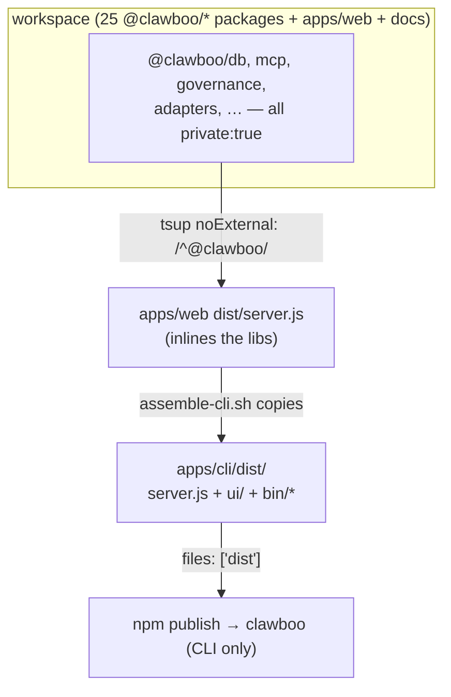
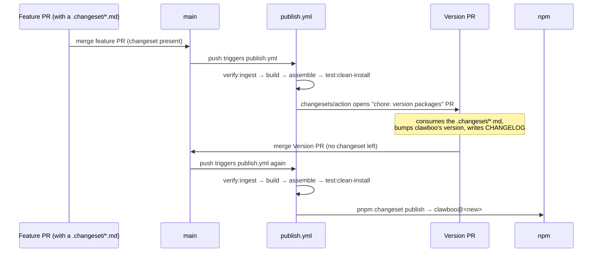

A Clawboo release is the publish of **one npm package**: the `clawboo` CLI in `apps/cli`. Every `@clawboo/*` library in the workspace is `private: true` and never reaches npm on its own; the libraries it needs are _inlined_ into the CLI's shipped bundle. The release machinery is Changesets for versioning + changelog, a CI gate that mirrors the publish steps, and a two-phase `publish.yml` (open a Version PR, then publish on its merge).

This page is for people working _on_ Clawboo who need to cut a release or understand why the publish posture looks the way it does. It covers the `.changeset` workflow, the CI gate (`lint` / `typecheck` / `test` / `build` / `verify:ingest` / `smoke-test-bundle`), the `publish.yml` flow, and the single-artifact posture enforced by a test. For the build mechanics behind it, Turbo, the bundle, `assemble-cli.sh`, read [Monorepo and build](/internals/monorepo-and-build).

## What ships, and what doesn't

There are 25 scoped `@clawboo/*` packages plus two apps. Run `git grep '"private"' packages` and you find `"private": true` on every library; the same is true of `apps/web` (`@clawboo/web`) and `docs` (`@clawboo/docs`). The **only** non-private package in the entire workspace is `apps/cli`, whose `name` is `clawboo` (no scope) and whose `files` array is just `["dist"]`. So `pnpm changeset publish` skips everything private and publishes exactly one tarball: the CLI.

The libraries still ship; they just travel _inside_ the CLI bundle, not as separate npm installs. The web server's tsup config marks the whole `@clawboo/*` scope `noExternal`, so `dist/server.js` inlines `db`, `mcp`, `governance`, the adapters, and the rest into one file. `assemble-cli.sh` copies that `server.js`, the Vite `ui/`, and the four bundled MCP stdio bins into `apps/cli/dist/`. The published tarball is therefore: the CLI entrypoint, the inlined server bundle, the SPA assets, and the MCP bins, nothing else.

<Info>
This single-artifact posture is **enforced by a test**, not just a convention. `packagePosture.test.ts` walks the library and app directories (`packages/*`, `packages/adapters/*`, `apps/*`) and asserts two invariants: (1) the set of non-private packages is *exactly* `['clawboo (apps/cli)']`, and (2) no non-private package has a runtime `@clawboo/*` dependency on a private one. The second guard matters because a public package that depended on a private one would publish a manifest pointing at packages that are never published; `npm install` would 404. The test fails the build if you mark a second package non-private.
</Info>



## Version posture

The CLI is `clawboo@0.2.1` in `apps/cli/package.json` and `CHANGELOG.md`, and v0.2.1 is published: the npm `latest` dist-tag is **`clawboo@0.2.1`** and the `clawboo@0.2.1` git tag exists, so `npx clawboo` installs 0.2.1.

The CLI's runtime version string comes from the build, not from reading `package.json` at runtime: `apps/cli/tsup.config.ts` injects `define: { __CLI_VERSION__: JSON.stringify(pkg.version) }`, and `src/index.ts` reads `__CLI_VERSION__` into `VERSION` (falling back to `'0.0.0-dev'` when the define is absent, e.g. running the TS directly in dev). So `clawboo --version` reports whatever version was set in `package.json` at build time.

## Changesets

Versioning and changelog generation are driven by [Changesets](https://github.com/changesets/changesets). The configuration in `.changeset/config.json` is deliberately small:

```json
{
  "changelog": "@changesets/cli/changelog",
  "commit": false,
  "access": "public",
  "baseBranch": "main",
  "updateInternalDependencies": "patch",
  "ignore": ["@clawboo/docs", "@clawboo/web"]
}
```

A few of these are load-bearing:

- **`ignore: ["@clawboo/docs", "@clawboo/web"]`** keeps the docs placeholder and the web app out of the changeset version-bumping flow entirely. (They are private anyway, but ignoring them stops Changesets from prompting about them or bumping them.) The CLI (`clawboo`) is the package Changesets actually versions.
- **`commit: false`**: Changesets doesn't commit on your behalf; the CI action does that step explicitly (it commits the version bump as `chore: version packages`).
- **`access: "public"`** is the npm publish access for the artifact it does publish (the CLI). It's harmless for the private packages because they're never published.
- **`updateInternalDependencies: "patch"`** governs how an internal `workspace:*` dependency edge gets re-versioned when a dependency bumps, relevant only if a private package were ever published, which it isn't, so it has no practical effect today.

### Authoring a changeset

The release flow is intent-first: you describe the change in a `.changeset/*.md` file, and the bump + changelog are derived from it later.

```bash
pnpm changeset
```

This walks you through which package changed (in practice, `clawboo`) and at what semver level (patch / minor / major), then writes a markdown file under `.changeset/` describing the bump. You commit that `.md` file alongside your code change. On a fresh checkout, `.changeset/` holds only `config.json`; there is no pending changeset committed at the documented commit.

<Note>
Because the libraries don't publish, a changeset is in practice always *about the `clawboo` CLI*. A code change deep in `@clawboo/db` is still released as a CLI version bump; the lib change rides inside the CLI bundle, so the user-facing artifact that changed is the CLI.
</Note>

## The CI gate

Every push to `main` and every pull request runs `.github/workflows/ci.yml`. It is six parallel jobs, all on Node 22 with `pnpm install --frozen-lockfile` (so the lockfile is authoritative; an out-of-sync lockfile fails the install):

| Job                 | Command                                     | What it guards                                             |
| ------------------- | ------------------------------------------- | ---------------------------------------------------------- |
| `lint`              | `pnpm lint`                                 | ESLint across the workspace.                               |
| `typecheck`         | `pnpm typecheck`                            | `tsc --noEmit` across the workspace.                       |
| `test`              | `pnpm test`                                 | Per-package Vitest suites (`turbo test`).                  |
| `build`             | `pnpm build`                                | Every package + app `dist/` builds, dependency-ordered.    |
| `verify-ingest`     | `pnpm verify:ingest`                        | The committed marketplace catalog matches a fresh codegen. |
| `smoke-test-bundle` | `pnpm assemble` → `pnpm test:clean-install` | The bundled CLI actually works end-to-end.                 |

The `smoke-test-bundle` job is the one that earns its keep at release time, and it runs on a **`[ubuntu-latest, windows-latest]` matrix**. It first `pnpm assemble`s the CLI bundle, then `pnpm test:clean-install` simulates `npx clawboo` on a real machine: it binds a fake non-Clawboo listener on port 18791, spawns the bundled CLI in an isolated `$HOME` with no env pins, and asserts the CLI's HTTP-signature port probe skips the fake listener (it picks 18790, never 18791), the SPA renders at `/`, a deep route falls through to `index.html`, `/api/settings` returns Clawboo-shaped JSON, and a bundled MCP stdio bin completes a real JSON-RPC `tools/list` handshake. This exists because v0.1.1 shipped a `Cannot GET /` SPA-catch-all bug and v0.1.2 shipped a port-collision `Unauthorized` bug; the smoke test catches that whole class before a bundle reaches npm. The Windows leg is the regression gate for the v0.1.4 Windows-compat fixes (`npm.cmd` resolution, the `which`→`where` shim, `netstat`-based process lookup).

<Tip>
You can reproduce the release gate locally before authoring a changeset. `pnpm prepublish:check` is the alias for `pnpm assemble && pnpm test:clean-install`, the exact bundle-and-smoke sequence CI runs. If it fails locally, the release is broken; fix it before opening the PR.
</Tip>

## The publish flow

`.github/workflows/publish.yml` runs on every push to `main` and implements the standard two-phase Changesets release: a first run opens a "Version Packages" PR, and merging that PR triggers a second run that publishes.



The workflow has two jobs:

1. **`check`** counts the `.changeset/*.md` files (excluding `README.md`) and exports a `has_changesets` output. It's a diagnostic; the publish job consumes the count but does not _gate_ on it (see the warning below).
2. **`publish`** does the real work. It checks out with `fetch-depth: 0` (Changesets needs the full git history to compute tags), installs frozen, then re-runs the gate steps in order: `pnpm verify:ingest` → `pnpm build` → `bash scripts/assemble-cli.sh` → `pnpm test:clean-install`, _before_ the Changesets action. This is belt-and-suspenders: even though the same checks ran on the PR, a race or an upstream-changed lockfile could cause divergence, so the bundle is re-smoke-tested immediately before publish. Finally it runs `changesets/action@v1` with `publish: pnpm changeset publish` and `commit: 'chore: version packages'`.

The `changesets/action@v1` step is what gives the flow its two phases, deciding internally based on the repo state:

- **Changesets present** (a feature PR merged with a `.changeset/*.md`) → the action opens (or updates) a **Version PR** titled `chore: version packages`. That PR, when merged, consumes the `.md` file, bumps `clawboo`'s version in `package.json`, and writes the `CHANGELOG.md` entry.
- **No changesets present** (the Version PR itself just merged; Changesets already consumed the `.md`) → the action runs `pnpm changeset publish`, which publishes the CLI to npm (using `NODE_AUTH_TOKEN` from the `NPM_TOKEN` secret) and creates the git tag + GitHub release.

<Warning>
The `publish` job does **not** gate on `needs.check.outputs.has_changesets`. That is deliberate: re-adding the gate would silently break publishing. An `if: has_changesets == 'true'` gate is correct for the "open a Version PR" run (changesets are present), but it would **block the publish step on the Version-PR-merge run**; at that point Changesets has *already consumed* the `.md` file, so `has_changesets` is `false`, and the gate would skip the very run that's supposed to publish. `changesets/action@v1` handles both phases internally; it just needs the job to run unconditionally. Do not reintroduce the gate.
</Warning>

## Releasing, step by step

The normal path to npm is:

1. **Author a changeset.** `pnpm changeset` → commit the generated `.changeset/*.md` alongside your change on a feature branch; open a PR.
2. **Pass CI.** The six jobs (`lint`, `typecheck`, `test`, `build`, `verify-ingest`, `smoke-test-bundle`) must all be green. The bundle smoke test runs on Ubuntu and Windows.
3. **Merge the feature PR.** `publish.yml` runs and `changesets/action` opens a `chore: version packages` Version PR.
4. **Merge the Version PR.** `publish.yml` runs again: `verify:ingest` → `build` → `assemble-cli.sh` → `test:clean-install` → `pnpm changeset publish`. The CLI publishes, the tag and changelog land.
5. **Verify.** `npm view clawboo version` should reflect the new version within roughly half a minute.

<Danger>
If a version is published manually (outside the Changesets flow) before the Changesets `version` step has run, the repo state and npm diverge. The recovery is to run `pnpm changeset version` and commit it as `chore: version packages` so the changelog and tag catch up, **not** to re-run `changeset publish` for a version that is already live on npm.
</Danger>

## Design rationale and trade-offs

**Why one published artifact?** Clawboo's value is the end-to-end product, not a constellation of reusable libraries. Keeping every `@clawboo/*` package private means there is no semver contract to maintain for two dozen internal packages, no internal publish-then-install loop, and no risk of a partial release where the CLI publishes against an unpublished lib. The cost is that the only way to consume a Clawboo library is to vendor the CLI bundle, which is exactly the intent. The `packagePosture.test.ts` guard turns "we only publish the CLI" from a habit into an enforced invariant.

**Why inline the libs instead of declaring them as CLI dependencies?** A clean `npx clawboo` install must run with no surprises. Inlining via tsup `noExternal` means a fresh machine needs only the CLI's small set of genuinely-external runtime deps (`better-sqlite3`, `ws`, `pino`, `pino-pretty`, and the lazily-imported `@opentelemetry/*`); everything else, including the provider SDKs and the scheduler's `croner`, is already in `server.js`. The clean-install smoke test is what proves this holds.

**Why re-run the gate inside `publish.yml`?** The PR already ran CI, but a merge race or an upstream-changed lockfile between PR-green and main-merge could ship a bundle that no longer assembles. Re-smoke-testing immediately before `changeset publish` makes a broken bundle impossible to publish even if a PR slipped through, the same belt-and-suspenders reasoning that made the smoke test exist in the first place.

## Boundaries and non-goals

- **Not a multi-package release.** Despite the monorepo, there is no scenario where a `@clawboo/*` library publishes independently. If you ever need that, it's a deliberate posture change; start by reading `packagePosture.test.ts`, which will fail the moment a second package goes non-private.
- **Not a hosted-deployment pipeline.** `publish.yml` ships an npm package; it does not deploy a service. Operating a running Clawboo instance is a separate concern; see [Deployment](/operating/deployment).
- **No migration step at release.** Clawboo has no database migration ladder; the schema is created by `createDb`'s inline DDL and a schema change is a local reset (the database is per-user state). There is nothing to migrate as part of a release. See [Monorepo and build](/internals/monorepo-and-build#dbstudio-is-the-only-database-script).

<Note>
These docs describe Clawboo **v0.2.1**, the current release.
</Note>

## See also

- [Monorepo and build](/internals/monorepo-and-build): Turbo, the build order, the bundle, and `assemble-cli.sh`
- [Testing](/internals/testing): the unit / component / e2e / clean-install / evals strategy behind the CI gate
- [Codegen and ingestion](/internals/codegen-and-ingestion): the `verify:ingest` gate that runs in CI and `publish.yml`
- [CLI reference](/reference/cli): `npx clawboo` and the bundled MCP bins
- [Changelog](/appendices/changelog): the release history (0.1.0 → 0.2.1)
- [Internals overview](/internals/index): the contributor map
