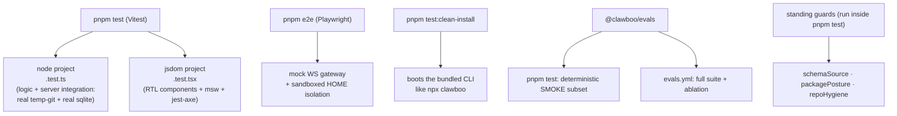

Clawboo is a team-first orchestrator: many agents write one SQLite file, five [runtimes](/appendices/glossary) execute heterogeneous work, and the whole thing ships as a single bundled CLI that has to boot on a stranger's machine. Each of those facts has a matching test layer. This page explains the layers, why each exists, and the invariants the standing guard tests freeze in place; so you can extend the suite without re-learning the same lessons the suite was written to encode.

The full gate is six commands, all green: `pnpm lint`, `pnpm typecheck`, `pnpm test`, `pnpm e2e`, `pnpm verify:ingest`, and `pnpm assemble && pnpm test:clean-install`. The first five run as parallel CI jobs; the last is the clean-install simulation, run on both Ubuntu and Windows. The strategy described below is deliberately phrased in terms of _suites and intent_, not exact test counts; counts change every session, and a doc that pins them goes stale on the next commit.

## The model

Each layer answers a question the others can't:

- **Vitest (two projects)**: does the _logic_ hold, and do the server's stateful subsystems behave against real git and real SQLite?
- **Playwright e2e**: does the _assembled product_ render and round-trip in a browser, without ever touching the developer's real state?
- **The clean-install smoke**: does a freshly bundled `npx clawboo` actually reach a working dashboard, including the stdio MCP bins?
- **The eval harness**: does the _orchestrator itself_ still satisfy its load-bearing guarantees, measured as an outcome rather than a narration?
- **The standing guards**: do the repo's structural invariants (schema source-of-truth, publish posture, source hygiene) still hold?

## Vitest: two projects, one run

`apps/web/vitest.config.ts` defines two Vitest projects (a Vitest 3.x feature). One `vitest run` runs both; splitting them keeps the heavier component transforms from flipping the node-environment server and store suites.

**The `node` project** runs every `src/**/*.test.ts` and `server/**/*.test.ts` in a Node environment. This is where the bulk of Clawboo's logic lives: pure functions, Zustand stores, policy reducers, the board state machine, _and_ where the server's stateful subsystems get integration-tested against real infrastructure rather than mocks. The worktree orchestrator test drives the full claim → provision → handoff → complete lifecycle against a real temporary git repository and a real SQLite board, with `$HOME` overridden to a throwaway sandbox so it never touches the developer's `~/.openclaw` or `~/.clawboo`. The all-on executor-runner integration test exercises board, executors, worktrees, verification, governance, and observability together in one flow, the cross-subsystem interactions (a verify gate fed by a runner-provisioned worktree; a budget recorded alongside an obs trace; a governance halt correctly _skipping_ verify) that no per-subsystem test reaches on its own. Because these run real git and real SQLite, they get a 30-second `testTimeout` / `hookTimeout`, headroom for tests that take a few seconds each in isolation and could be starved past the 5-second default when the jsdom project runs concurrently in the same `vitest run`.

<Note>
The integration tests use a *fake* `RuntimeAdapter` against a real board and real worktree, so they're deterministic and need no network or provider key. The same files carry an env-gated `describe.skipIf` live variant that drives a real Claude Code runtime, skipped in CI when no key or auth is present. The deterministic fake-adapter path is the one CI runs; the live variant is a developer's on-demand confidence check.
</Note>

**The `jsdom` project** runs every `src/**/*.test.tsx` in a jsdom environment with `@vitejs/plugin-react`. These are React Testing Library component tests over the dashboard panels; each one asserts render, a nav-gate or interaction, and (via msw) the right network behavior. Its setup file (`src/__vitest__/setup.ts`) does four things: registers `@testing-library/jest-dom` matchers, registers the `jest-axe` `toHaveNoViolations` accessibility matcher, wires the shared msw request-mock server, and shims the jsdom gaps the panels touch on render (`matchMedia`, `ResizeObserver`). Its `testTimeout` is widened to 15 seconds because the jest-axe accessibility sweeps are CPU-heavy and can be starved under concurrent load.

The load-bearing detail is in the msw wiring. The shared server (`src/__vitest__/mswServer.ts`) is started with `onUnhandledRequest: 'error'`, so any `/api/*` call a component makes _without_ a matching handler fails the test loudly. That turns "this panel makes zero fetches on render" into a guarantee the component test itself encodes, not something only the e2e can prove. One default handler covers the single cross-origin call the panels make on mount, the GitHub star count; so that one request never reaches the real network and the strict same-origin policy can stay strict.

<Tip>
Every workspace package has its own `vitest run` test script and its own focused suites: `@clawboo/db`'s board contention and schema tests, `@clawboo/governance`'s verdict and circuit-breaker math, `@clawboo/obs`'s event-projection replay, and so on. The package suites are the unit layer; the `apps/web` two-project config is where the integration and component layers live.
</Tip>

## Playwright e2e: the mock gateway, and never your real data

`playwright.config.ts` drives the _assembled_ product. Its `webServer.command` builds the UI bundle and starts the Express server in production mode (`build:ui && start`), pinned to port `19999`, well outside the regular auto-fallback window (`18790`–`18809`) so a developer's running `pnpm dev` instance never collides with a test run. The build timeout is bumped to 180 seconds because a cold `vite build` takes 80–120 seconds on the macOS dev box.

The specs use a **mock WebSocket gateway** (`tests/e2e/helpers/mockGateway.ts`) instead of a real OpenClaw Gateway. It's a small `ws` server that answers the handshake (`connect`, `agents.list`, `agents.files.read`) and, crucially for the board round-trip spec, pushes synthetic `chat` event frames after a `chat.send`. The synthesized reply is deterministic and role-aware: the leader given a normal user message replies with a structured `<delegate>` block (which derives a board task), the leader given a `[Task Update]` reflection replies with a plain synthesis (no delegate, so it can't loop), and the specialist replies with a report-up summary (which drives the task to `done`). That lets a single Playwright spec drive a real chat → board → chat round-trip end-to-end over the mock.

### Sandboxed HOME isolation

The most important thing the e2e config does is **never touch the developer's real state**. The server's SQLite path is derived from `os.homedir()`, and the fixtures run a `DELETE`-loop over `/api/teams` to clean stale state between runs. Without isolation, that loop would hit the developer's actual `~/.openclaw/clawboo/clawboo.db`, so the e2e suite is sandboxed in three layers:

1. **mkdtemp at config load.** `playwright.config.ts` creates a per-run sandbox directory under the OS temp root and overrides three environment variables on the spawned server via `webServer.env`: `HOME`, `OPENCLAW_STATE_DIR` (OpenClaw interop reads), and `CLAWBOO_HOME` (Clawboo's own SQLite DB, settings, secrets vault, and worktrees). The server's state therefore lands entirely inside the sandbox.
2. **`globalTeardown` cleanup.** After the run finishes or fails, `tests/e2e/globalTeardown.ts` removes the sandbox, but only after asserting the path lives under the OS temp dir, silently no-op'ing otherwise rather than risking an `rm -rf` of real data.
3. **`assertSandboxed` guard rail.** Before any destructive helper runs, `assertSandboxed` (in `helpers/fixtures.ts`) makes two checks: that the test-runner env's sandbox markers point under the temp root, _and_ that a live `GET /api/system/status` reports a `stateDir` under the temp root. The second check catches the nasty case where Playwright reused a stale, unsandboxed server that a developer started manually via `pnpm dev` or `pnpm start`; the guard refuses to proceed and tells the developer exactly how to recover. Every helper that touches a destructive endpoint calls it; new destructive helpers must too.

<Danger>
If you add a Playwright helper that deletes or mutates server state, it **must** call `assertSandboxed(request)` first. The mkdtemp + `globalTeardown` pair protects against a misconfigured run, but `assertSandboxed` is the belt-and-suspenders that protects against a *stale unsandboxed server*, the failure mode the other two layers can't catch.
</Danger>

The specs cover the surfaces a smoke pass cares about: connection and auto-connect, the fleet list and agent detail view, the Ghost Graph canvas, team navigation, the group-chat onboarding gate and two-row layout, the chat → board → chat round-trip, the eval-run-from-UI button, and the native-first and coding-agent onboarding flows. The group-chat helper can pre-mark the "Know Your Team" onboarding flags complete so most specs skip the gate, while the gate-specific test exercises it directly.

## The clean-install smoke: does `npx clawboo` actually work

`pnpm test:clean-install` runs `scripts/test-clean-install.mjs`, which simulates `npx clawboo` on a stranger's machine and asserts the bundled CLI reaches a working dashboard. It exists because Clawboo shipped two releases broken in ways every other test passed: a release where the bundled server returned `Cannot GET /` because the Express 5 SPA catch-all pattern didn't match the bare `/`, and a release where the CLI's port discovery did a TCP-only probe and mistook a foreign listener on an adjacent port for Clawboo, routing the browser to an "Unauthorized" page.

The script reproduces the exact condition the second bug shipped under. It binds port `18791` with a fake service that returns `401 Unauthorized` (mimicking the OpenClaw Gateway's auxiliary-port behavior), spawns the bundled CLI in an isolated state dir with an isolated `$HOME` and no env-var pins, and then asserts:

- the CLI announces a dashboard URL that is **not** `:18791`; its HTTP-signature probe must reject the fake listener and let Clawboo's own server pick `18790`;
- `GET /` returns the SPA HTML (`

`);
- a deep SPA route (`/some/spa/route`) falls through to the same SPA HTML (the catch-all works);
- `GET /api/settings` returns Clawboo-shaped JSON (`gatewayUrl` string + `hasToken` boolean);
- `GET /api/system/status` returns the expected shape;
- a bundled **stdio MCP bin** (`dist/bin/tasks.js`) can be spawned and driven through a raw JSON-RPC handshake (`initialize` → `notifications/initialized` → `tools/list`), and its tool list includes `list_tasks`.

That last assertion is what proves an external runtime can spawn a packaged MCP bin straight from a clean install. Because the smoke test boots the _assembled_ artifact, it depends on `pnpm assemble` having run first, which is exactly what the `prepublish:check` alias (`pnpm assemble && pnpm test:clean-install`) and the CI `smoke-test-bundle` job do. The CI job runs it on a matrix of Ubuntu and Windows, because the Windows leg is the regression gate for the Windows-compat fixes (`.cmd` shim resolution, `which`→`where`, netstat-based process discovery) that a Unix-only run would never exercise.

## The eval harness: grading the orchestrator's own guarantees

`@clawboo/evals` is a private, server-only package that evaluates Clawboo's _own_ orchestration, not a runtime's model output, but whether the board, the verifier, and the structured-state machinery still satisfy the guarantees they were built to satisfy. It is the layer that catches a regression unit tests would miss because the regression is _behavioral across subsystems_.

The runner reports two numbers per task. **pass@1** is "at least one of K trials succeeded"; **pass^k** is "all K succeeded." pass@1 rises with K and pass^k falls, so pass^k is the production-readiness bar. Each trial runs against a _clean_ environment; `makeBoardContext` mkdtemps a throwaway SQLite board per trial, because leftover state causes correlated failures, an eval cardinal sin. A thrown task body is recorded as a failed trial (`run-error`), never an unhandled rejection.

Graders come in two flavors, and the split is deliberate:

- **Code graders** (`graders/code.ts`) inspect the _outcome_, the board's final state and the orchestration event log, rather than the transcript's claim of success. They're fast, cheap, objective, and reproducible: a board-state assertion, an event-count assertion, a dependency-readiness check, a free-form outcome predicate with optional partial credit. These are preferred wherever the success criterion is mechanical.
- **Model graders** (`graders/model.ts`) are LLM-as-judge, for the subjective dimensions code can't grade: coordination and handoff quality, groundedness. They reuse the shared structured-output judge from `@clawboo/obs` (the same one the read-only verification critic uses), score one isolated dimension per judge, and give the judge a way out. Because they're non-deterministic and priced, they run nightly, never on a PR.

The task set splits the same way: **regression tasks** are snapshots of load-bearing guarantees sourced from real failures the codebase hardened against (the atomic-claim-409-no-retry rule, the dependency gate, the report-up path, the state machine), all deterministic and code-graded; **capability tasks** are the ones whose success depends on a toggled subsystem. The deterministic, no-live-model subset is tagged `smoke` and is what runs in `pnpm test` (the PR gate). The full suite plus the **ablation scorecard** is the heavier read.

The ablation scorecard is the harness-health metric. Hold the model fixed and run the suite across four variants, ±verifier × ±structured-state; then compute each subsystem's _marginal contribution_ as the mean drop in pass rate when it's removed, averaged over the other subsystem's two settings. A near-zero drop is not "useless"; it means the subsystem is redundant or unexercised _on the current task set_. The instruction baked into the code is to re-run it on each major model release, because criticality migrates between subsystems as models improve. The ablation and the live-model graders run via the manual-only `evals.yml` workflow, `workflow_dispatch`-triggered, with the deterministic suite running with no network and the live-model graders activating only when provider keys are present as repo secrets.

<Info>
The eval harness is also runnable *from the dashboard*. `POST /api/eval/smoke` runs exactly the deterministic `SMOKE_TASKS` subset against ephemeral throwaway boards, no live model, no provider keys, no executor, no network, and returns the real `SuiteReport`, with the trial and `k` parameters clamped to `[1, 3]` so the route can never become a load generator. The real `clawboo.db` is never touched. The full live ablation stays CI-only; the UI renders and explains it but never drives it. The Playwright `09-eval-smoke` spec clicks that button and asserts a real report renders at 100%.
</Info>

## The standing guards

Three tests in the suite aren't testing features; they're freezing structural invariants of the repo itself. They run inside `pnpm test` like any other test, and they fail the build the moment an invariant drifts.

**Schema source-of-truth** (`packages/db/src/__tests__/schemaSource.test.ts`). Clawboo has _no migration ladder_; `createDb`'s inline `CREATE TABLE IF NOT EXISTS` DDL is the sole schema-creation source, and a schema change is a hard reset of the local DB. The Drizzle `schema.ts` is the _type_ layer over the same tables, used for typed queries but never to apply migrations. Nothing keeps the two descriptions in sync automatically, so this test does: it builds a DB via the real `createDb()` and asserts every `schema.ts` table and its column set matches the live DDL, and vice-versa (the FTS5 virtual table and its shadow tables are excluded; they're raw DDL not modellable in `schema.ts`). It also pins the posture decision: the `package.json` `files` array must not ship migration metadata, the `db:migrate` and `db:generate` scripts must not exist, and no `drizzle/` migration directory may sit on disk.

<Warning>
The schema parity check compares only `{table → set(column names)}`. Column *type*, `NOT NULL`, `DEFAULT`, primary key, foreign key, and index drift between the two sources is **not** compared; the Drizzle-column to SQLite-PRAGMA mapping is lossy and would produce false drift, so the deeper shape check is deliberately deferred. The drift this *does* catch is a table or column added to one source but not the other. Revisit the deeper check before any real schema change.
</Warning>

**Publish posture** (`apps/web/server/lib/__tests__/packagePosture.test.ts`). Clawboo ships as a single `npx clawboo` CLI that inlines its workspace packages into one bundle; nothing else is released to npm. This guard asserts two invariants: the _only_ non-private workspace package is `clawboo` (apps/cli); every other `@clawboo/*` package is `private: true`; and no non-private package has a runtime dependency on a private one (which would publish a manifest pointing at packages that never get published, so `npm install` would 404). The first assertion is exact: it expects the non-private set to equal `['clawboo (apps/cli)']`, so adding a publishable package or accidentally un-privatizing a library trips it immediately.

**Repo hygiene** (`repoHygiene.test.ts` + `repoHygieneTracked.test.ts`). The product source must stand on its own, free of non-product scaffolding strings (internal shorthand, external tooling paths). The pair is a belt-and-suspenders: one walks `apps/` + `packages/` + `scripts/` on the filesystem (covering brand-new, not-yet-committed files, and home to a comment-scoped build-phase check), the other shells `git grep --untracked` over the whole committed-plus-untracked tree (respecting `.gitignore`, so `dist/` and `node_modules/` are skipped). Both assert zero matches against a shared pattern set, with carefully case-tuned rules so legitimate domain code, a lowercase `session-1` sessionKey fixture, a marketplace persona that mentions project phases, is never falsely flagged. Both files self-exclude, since they carry the patterns literally.

## How CI wires it together

The CI workflow (`.github/workflows/ci.yml`) runs `lint`, `typecheck`, `test`, `build`, and `verify-ingest` as independent parallel jobs, each on Node 22 with a frozen lockfile, plus the `smoke-test-bundle` job that runs `pnpm assemble && pnpm test:clean-install` on the Ubuntu + Windows matrix. The Turbo task graph makes `test`, `lint`, and `typecheck` depend on `^build` so every package's workspace dependencies are built first. Playwright e2e is not a default CI job; it builds the UI and boots a real server, which is heavier; it runs locally and on demand. The nightly/manual eval workflow (`evals.yml`) is `workflow_dispatch`-only.

The release pipeline that consumes these gates, Changesets, the publish workflow, and the clean-install gate's role on a Version-PR merge, is documented separately.

## Design rationale and trade-offs

The shape of this suite follows directly from what Clawboo _is_. Because the product is a bundled CLI that boots on a stranger's machine, a unit suite isn't enough; the clean-install smoke boots the real artifact, on Windows too, and that's where the worst regressions hid. Because the orchestrator coordinates real concurrent writers against one SQLite file, the server integration tests use real git and real SQLite rather than mocks; a mock can't surface a lock convoy or a stale-claim race. Because the orchestrator's guarantees are behavioral and cross-subsystem, the eval harness grades the _outcome_ on the board, not the transcript's claim of success, and the ablation scorecard measures whether each subsystem still earns its place. And because a stray `pnpm e2e` run must never be able to touch real state, the e2e isolation is three independent layers, with `assertSandboxed` as the one that catches the case the other two can't.

The cost is real: the server integration and e2e tests are slow (hence the widened timeouts and the 180-second build window), the eval harness is a whole extra package, and the standing guards add maintenance friction whenever a structural choice genuinely changes. The trade is deliberate; the guards are cheap insurance against exactly the class of regression that ships green and breaks users.

## Boundaries and non-goals

- **No coverage threshold is enforced.** The suite is intent-driven (does this guarantee hold?), not line-coverage-driven. There is no `--coverage` gate.
- **Playwright is not in the default CI matrix.** It runs locally and on demand because it builds the UI and boots a real server; the clean-install smoke is the CI-gated "assembled artifact works" check.
- **Live-model evals never gate a PR.** Only the deterministic smoke subset runs in `pnpm test`. The full suite, the live-model graders, and the ablation are manual/nightly, behind `workflow_dispatch` and the presence of provider-key secrets.
- **The schema parity guard is name-level, not shape-level.** It catches added/removed tables and columns, not type or constraint drift, by design, until a real schema change warrants the deeper check.

<Note>
These docs describe Clawboo **v0.2.1**, the current release.
</Note>

## See also

- [Release process](/internals/release-process): Changesets, the publish workflow, and the clean-install gate on release
- [Monorepo and build](/internals/monorepo-and-build): Turbo, pnpm, build order, and the commands these tests depend on
- [The board](/concepts/the-board): the durable substrate the server integration and eval suites drive
- [Executor runner](/internals/executor-runner): the claim→run→verify→handoff flow the all-on integration test exercises
- [Codegen and ingestion](/internals/codegen-and-ingestion): the `verify:ingest` gate that runs beside these suites
- [Database schema](/reference/database-schema): the 27 tables the schema-source guard pins
- [Glossary](/appendices/glossary): canonical term definitions
