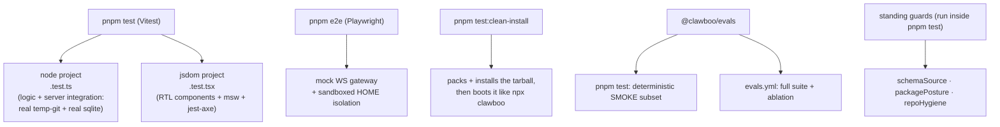

Clawboo is a team-first orchestrator: many agents write one SQLite file, five [runtimes](/appendices/glossary) execute heterogeneous work, and the whole thing ships as a single bundled CLI that has to boot on a stranger's machine. Each of those facts has a matching test layer. This page explains the layers, why each exists, and the invariants the standing guard tests freeze in place; so you can extend the suite without re-learning the same lessons the suite was written to encode.

The full gate is six commands, all green: `pnpm lint`, `pnpm typecheck`, `pnpm test`, `pnpm e2e`, `pnpm verify:ingest`, and `pnpm assemble && pnpm test:clean-install`. Every one of them runs as a parallel CI job (`pnpm build` is a seventh job); the last is the clean-install simulation, run on Ubuntu, Windows, and macOS. The strategy described below is deliberately phrased in terms of _suites and intent_, not exact test counts; counts change every session, and a doc that pins them goes stale on the next commit.

## The model

```mermaid
flowchart TD
    A["pnpm test (Vitest)"] --> A1["node project<br/>.test.ts<br/>(logic + server integration:<br/>real temp-git + real sqlite)"]
    A --> A2["jsdom project<br/>.test.tsx<br/>(RTL components + msw + jest-axe)"]
    B["pnpm e2e (Playwright)"] --> B1["mock WS gateway<br/>+ sandboxed HOME isolation"]
    C["pnpm test:clean-install"] --> C1["packs + installs the tarball,<br/>then boots it like npx clawboo"]
    D["@clawboo/evals"] --> D1["pnpm test: deterministic SMOKE subset"]
    D --> D2["evals.yml: full suite + ablation"]
    E["standing guards (run inside pnpm test)"] --> E1["schemaSource · packagePosture · repoHygiene"]
```

Each layer answers a question the others can't:

- **Vitest (two projects)**: does the _logic_ hold, and do the server's stateful subsystems behave against real git and real SQLite?
- **Playwright e2e**: does the _assembled product_ render and round-trip in a browser, without ever touching the developer's real state?
- **The clean-install smoke**: does a packed-and-installed `npx clawboo` actually reach a working dashboard, including the stdio MCP bins and a real agent run?
- **The eval harness**: does the _orchestrator itself_ still satisfy its load-bearing guarantees, measured as an outcome rather than a narration?
- **The standing guards**: do the repo's structural invariants (schema source-of-truth, publish posture, source hygiene) still hold?

## Vitest: two projects, one run

`apps/web/vitest.config.ts` defines two Vitest projects (a Vitest 3.x feature). One `vitest run` runs both; splitting them keeps the heavier component transforms from flipping the node-environment server and store suites.

**The `node` project** runs every `src/**/*.test.ts` and `server/**/*.test.ts` in a Node environment. This is where the bulk of Clawboo's logic lives: pure functions, Zustand stores, policy reducers, the board state machine, _and_ where the server's stateful subsystems get integration-tested against real infrastructure rather than mocks. The worktree orchestrator test drives the full claim → provision → handoff → complete lifecycle against a real temporary git repository and a real SQLite board, with `$HOME` overridden to a throwaway sandbox so it never touches the developer's `~/.openclaw` or `~/.clawboo`. The all-on executor-runner integration test exercises board, executors, worktrees, verification, governance, and observability together in one flow, the cross-subsystem interactions (a verify gate fed by a runner-provisioned worktree; a budget recorded alongside an obs trace; a governance halt correctly _skipping_ verify) that no per-subsystem test reaches on its own. Because these run real git and real SQLite, they get a 30-second `testTimeout` / `hookTimeout`, headroom for tests that take a few seconds each in isolation and could be starved past the 5-second default when the jsdom project runs concurrently in the same `vitest run`.

<Note>
The integration tests use a *fake* `RuntimeAdapter` against a real board and real worktree, so they're deterministic and need no network or provider key. The same files carry an env-gated `describe.skipIf` live variant that drives a real Claude Code runtime, skipped in CI when no key or auth is present. The deterministic fake-adapter path is the one CI runs; the live variant is a developer's on-demand confidence check.
</Note>

**The `jsdom` project** runs every `src/**/*.test.tsx` in a jsdom environment with `@vitejs/plugin-react`. These are React Testing Library component tests over the dashboard panels; each one asserts render, a nav-gate or interaction, and (via msw) the right network behavior. Its setup file (`src/__vitest__/setup.ts`) does four things: registers `@testing-library/jest-dom` matchers, registers the `jest-axe` `toHaveNoViolations` accessibility matcher, wires the shared msw request-mock server, and shims the jsdom gaps the panels touch on render (`matchMedia`, `ResizeObserver`). Its `testTimeout` is widened to 15 seconds because the jest-axe accessibility sweeps are CPU-heavy and can be starved under concurrent load.

The load-bearing detail is in the msw wiring. The shared server (`src/__vitest__/mswServer.ts`) is started with `onUnhandledRequest: 'error'`, so any `/api/*` call a component makes _without_ a matching handler fails the test loudly. That turns "this panel makes zero fetches on render" into a guarantee the component test itself encodes, not something only the e2e can prove. One default handler covers the single cross-origin call the panels make on mount, the GitHub star count; so that one request never reaches the real network and the strict same-origin policy can stay strict.

<Tip>
Every workspace package has its own `vitest run` test script and its own focused suites: `@clawboo/db`'s board contention and schema tests, `@clawboo/governance`'s verdict and circuit-breaker math, `@clawboo/obs`'s event-projection replay, and so on. `apps/cli` has one too, covering the launcher logic that is risky to get wrong and awkward to exercise end to end: the semver comparison and dev-version guards behind the version-aware attach, the `lsof` / `netstat` parsers behind `clawboo stop`, and the SIGTERM → poll → SIGKILL escalation itself, which is driven through injected dependencies so no test ever signals a real process. The package suites are the unit layer; the `apps/web` two-project config is where the integration and component layers live.
</Tip>

## Playwright e2e: the mock gateway, and never your real data

`playwright.config.ts` drives the _assembled_ product. Its `webServer.command` builds the UI bundle and starts the Express server in production mode (`build:ui && start`), pinned to port `19999`, well outside the regular auto-fallback window (`18790`–`18809`) so a developer's running `pnpm dev` instance never collides with a test run. The build timeout is bumped to 180 seconds because a cold `vite build` takes 80–120 seconds on the macOS dev box.

The specs use a **mock WebSocket gateway** (`tests/e2e/helpers/mockGateway.ts`) instead of a real OpenClaw Gateway. It's a small `ws` server that answers the handshake (`connect`, `agents.list`, `agents.files.read`) and, crucially for the board round-trip spec, pushes synthetic `chat` event frames after a `chat.send`. The synthesized reply is deterministic and role-aware: the leader given a normal user message replies with a structured `<delegate>` block (which derives a board task), the leader given a `[Task Update]` reflection replies with a plain synthesis (no delegate, so it can't loop), and the specialist replies with a report-up summary (which drives the task to `done`). That lets a single Playwright spec drive a real chat → board → chat round-trip end-to-end over the mock.

### Sandboxed HOME isolation

The most important thing the e2e config does is **never touch the developer's real state**. The server's SQLite path is derived from `os.homedir()`, and the fixtures run a `DELETE`-loop over `/api/teams` to clean stale state between runs. Without isolation, that loop would hit the developer's actual `~/.openclaw/clawboo/clawboo.db`, so the e2e suite is sandboxed in three layers:

1. **mkdtemp at config load.** `playwright.config.ts` creates a per-run sandbox directory under the OS temp root and overrides three environment variables on the spawned server via `webServer.env`: `HOME`, `OPENCLAW_STATE_DIR` (OpenClaw interop reads), and `CLAWBOO_HOME` (Clawboo's own SQLite DB, settings, secrets vault, and worktrees). The server's state therefore lands entirely inside the sandbox.
2. **`globalTeardown` cleanup.** After the run finishes or fails, `tests/e2e/globalTeardown.ts` removes the sandbox, but only after asserting the path lives under the OS temp dir, silently no-op'ing otherwise rather than risking an `rm -rf` of real data.
3. **`assertSandboxed` guard rail.** Before any destructive helper runs, `assertSandboxed` (in `helpers/fixtures.ts`) makes two checks: that the test-runner env's sandbox markers point under the temp root, _and_ that a live `GET /api/system/status` reports a `stateDir` under the temp root. The second check catches the nasty case where Playwright reused a stale, unsandboxed server that a developer started manually via `pnpm dev` or `pnpm start`; the guard refuses to proceed and tells the developer exactly how to recover. Every helper that touches a destructive endpoint calls it; new destructive helpers must too.

<Danger>
If you add a Playwright helper that deletes or mutates server state, it **must** call `assertSandboxed(request)` first. The mkdtemp + `globalTeardown` pair protects against a misconfigured run, but `assertSandboxed` is the belt-and-suspenders that protects against a *stale unsandboxed server*, the failure mode the other two layers can't catch.
</Danger>

The specs cover the surfaces a smoke pass cares about: connection and auto-connect, the fleet list and agent detail view, the Ghost Graph canvas, team navigation, the group-chat onboarding gate and two-row layout, the chat → board → chat round-trip, the eval-run-from-UI button, and the native-first and coding-agent onboarding flows. The group-chat helper can pre-mark the "Know Your Team" onboarding flags complete so most specs skip the gate, while the gate-specific test exercises it directly.

## The clean-install smoke: does `npx clawboo` actually work

`pnpm test:clean-install` runs `scripts/test-clean-install.mjs`, which simulates `npx clawboo` on a stranger's machine and asserts the **published artifact** reaches a working dashboard. It exists because Clawboo shipped two releases broken in ways every other test passed: a release where the bundled server returned `Cannot GET /` because the Express 5 SPA catch-all pattern didn't match the bare `/`, and a release where the CLI's port discovery did a TCP-only probe and mistook a foreign listener on an adjacent port for Clawboo, routing the browser to an "Unauthorized" page.

A third bug of the same family is covered by a unit test rather than this script, because the script structurally cannot see it: `res.sendFile()` was called with an absolute path and no `root`, so `send` split the whole path into segments and 404'd on any segment beginning with a dot. `npx` installs under `~/.npm/_npx/…`, so the `.npm` segment broke every deep route for real users while `/` still worked. CI never reproduces it, since runners check out to a dot-free path, so `apps/web/server/lib/__tests__/serveSpa.test.ts` runs the real `mountSpa` against both a plain and a dot-containing install path.

### It runs against a real install, not the repo build

The script starts by `pnpm pack`ing `apps/cli` and `npm install`ing the resulting tarball into a throwaway directory under the OS temp dir. Everything after that runs against **that** install. This is the load-bearing detail: running the repo's `apps/cli/dist/index.js` in place lets Node's module resolution walk up into the monorepo's `node_modules`, so a module the bundle still loads at runtime resolves in the repo and is `ERR_MODULE_NOT_FOUND` on a user's machine. Installing a packed tarball outside the workspace removes that escape hatch, so the published `files` whitelist and the published `dependencies` closure are what get exercised.

`pnpm pack` (not `npm pack`) because `pnpm changeset publish` is what publishes: pnpm rewrites `workspace:` specifiers into concrete versions in the packed manifest, so the tarball under test is the one users download. `npm install` (not `pnpm add`) because npm's hoisted layout is what an `npx clawboo` user resolves through.

Before packing, the script refuses to run if anything already answers with the Clawboo signature in the `18790-18809` discovery window — the CLI would (correctly) attach to that dashboard and every assertion below would silently test the wrong server. After boot it re-proves the point structurally: the server writes its port to `<clawboo home>/api-port.txt`, and the run's isolated `$HOME` must be the home that file lives under.

### What it asserts

The script reproduces the exact condition the port-collision bug shipped under. It binds port `18791` with a fake service that returns `401 Unauthorized` (mimicking the OpenClaw Gateway's auxiliary-port behavior), spawns the **installed** CLI in an isolated state dir with an isolated `$HOME` and no env-var pins, and then asserts:

- every `bin` the published manifest declares exists in the tarball and got a `node_modules/.bin` shim, and the UI + third-party notices shipped;
- every module the installed bundles still load from `node_modules` is a declared dependency, a Node builtin, or a documented optional external (see below);
- the CLI announces a dashboard URL that is **not** `:18791`; its HTTP-signature probe must reject the fake listener and let Clawboo's own server pick `18790`;
- `GET /` returns the SPA HTML (`

`);
- a deep SPA route (`/some/spa/route`) falls through to the same SPA HTML (the catch-all works);
- `GET /api/settings` returns Clawboo-shaped JSON (`gatewayUrl` string + `hasToken` boolean);
- `GET /api/system/status` returns the expected shape;
- an installed **stdio MCP bin** (`dist/bin/tasks.js`) can be spawned and driven through a raw JSON-RPC handshake (`initialize` → `notifications/initialized` → `tools/list`), and its tool list includes `list_tasks`;
- **an agent run can start**: the script creates a native agent and a board task, then drives a real `POST /api/runtimes/clawboo-native/run` to a terminal `done`, and checks the report-up summary carries the provider's reply and the task moved to `done` on the board.

The MCP assertion is what proves an external runtime can spawn a packaged MCP bin straight from a clean install. The dispatch assertion covers the product's main path — assign a task and it runs — so it can never be a publish-time unknown. It needs no API key and no network: the native runtime's keyless `ollama` provider rides the shared OpenAI-compatible client with a base-URL override, so the script points `OLLAMA_BASE_URL` at a local stub that streams one canned reply. `kind: 'research'` keeps isolation at `none`, so no git repo or worktree is involved.

### The externals-vs-dependencies check

`scripts/check-bundle-externals.mjs` (also runnable on its own as `pnpm test:bundle-externals`) statically extracts every `require(...)` / `import(...)` left in `dist/index.js`, `dist/server.js`, and `dist/bin/*.js`, and asserts the set is a subset of the package's `dependencies` + Node builtins + a small documented-optional allowlist. It catches what booting can't: a **lazy** import only fails when that feature is first used, which on a fresh install is long after CI went green.

The extractor is a small hand-rolled JS scanner rather than a regex, because a regex produces false positives — the inlined `ajv` source contains the literal string `'require("ajv/dist/runtime/equal").default'` (its standalone-codegen template) and esbuild writes module paths into comments. The scanner tracks strings, template literals with `${}` nesting, comments, and regex literals so it only ever matches a call in code position, and it runs its own fixtures (including those adversarial cases) at the start of every check, since `scripts/` has no CI-wired Vitest project. Its output was validated against esbuild's own metafile for all six bundles.

The allowlist lives in `scripts/lib/bundle-externals.mjs` and is a product decision, not a build detail: an entry means "a clean install cannot do X until the user installs this themselves". Today it holds `@opentelemetry/*` (lazy, degrades to event-log-only) and [`@anthropic-ai/claude-agent-sdk`](/runtimes/claude-code) (declaring it would add ~210 MB of platform binary to every install).

Because the smoke test packs the _assembled_ artifact, it depends on `pnpm assemble` having run first, which is exactly what the `prepublish:check` alias (`pnpm assemble && pnpm test:clean-install`) and the CI `smoke-test-bundle` job do. The CI job runs it on a matrix of Ubuntu, Windows, and macOS: the Windows leg is the regression gate for the Windows-compat fixes (`.cmd` shim resolution, `which`→`where`, netstat-based process discovery) that a Unix-only run would never exercise, and macOS is a primary user OS.

## The eval harness: grading the orchestrator's own guarantees

`@clawboo/evals` is a private, server-only package that evaluates Clawboo's _own_ orchestration, not a runtime's model output, but whether the board, the verifier, and the structured-state machinery still satisfy the guarantees they were built to satisfy. It is the layer that catches a regression unit tests would miss because the regression is _behavioral across subsystems_.

The runner reports two numbers per task. **pass@1** is "at least one of K trials succeeded"; **pass^k** is "all K succeeded." pass@1 rises with K and pass^k falls, so pass^k is the production-readiness bar. Each trial runs against a _clean_ environment; `makeBoardContext` mkdtemps a throwaway SQLite board per trial, because leftover state causes correlated failures, an eval cardinal sin. A thrown task body is recorded as a failed trial (`run-error`), never an unhandled rejection.

Graders come in two flavors, and the split is deliberate:

- **Code graders** (`graders/code.ts`) inspect the _outcome_, the board's final state and the orchestration event log, rather than the transcript's claim of success. They're fast, cheap, objective, and reproducible: a board-state assertion, an event-count assertion, a dependency-readiness check, a free-form outcome predicate with optional partial credit. These are preferred wherever the success criterion is mechanical.
- **Model graders** (`graders/model.ts`) are LLM-as-judge, for the subjective dimensions code can't grade: coordination and handoff quality, groundedness. They reuse the shared structured-output judge from `@clawboo/obs` (the same one the read-only verification critic uses), score one isolated dimension per judge, and give the judge a way out. Because they need a real runtime adapter and provider keys, **they are not yet wired into any task**, so nothing runs them today; a live drift-canary that activates them is deferred. They never run on a PR.

The task set splits the same way: **regression tasks** are snapshots of load-bearing guarantees sourced from real failures the codebase hardened against (the atomic-claim-409-no-retry rule, the dependency gate, the report-up path, the state machine), all deterministic and code-graded; **capability tasks** are the ones whose success depends on a toggled subsystem flag. Every task today is deterministic and tagged `smoke`, so the same set runs in `pnpm test` (the PR gate) and in the manual `evals.yml` workflow; the **ablation self-test** is the extra read there. (A live-model task set is the deferred canary.)

The ablation scorecard is a **harness self-test**, not a measurement of the live orchestrator. It holds the harness fixed and runs the capability tasks across four variants, ±verifier × ±structured-state; those tasks read the subsystem flags and behave accordingly, so each _marginal contribution_ is the harness's own scripted response to the flag, which confirms the ablation wiring is sound. Measuring the REAL subsystems' contribution needs the live executor: the deterministic `executorRunner` integration test (`apps/web/server/lib/__tests__/executorRunner.integration.test.ts`) drives the real board, verifier, and worktree today, and a live-model version is the deferred canary. The ablation runs via the manual-only `evals.yml` workflow (`workflow_dispatch`), with no network and no provider keys; no live-model graders are wired into it yet.

<Info>
The eval harness is also runnable *from the dashboard*. `POST /api/eval/smoke` runs exactly the deterministic `SMOKE_TASKS` subset against ephemeral throwaway boards, no live model, no provider keys, no executor, no network, and returns the real `SuiteReport`, with the trial and `k` parameters clamped to `[1, 3]` so the route can never become a load generator. The real `clawboo.db` is never touched. The ablation self-test runs only from the manual `evals.yml` workflow; the UI renders and explains the ablation shape but never drives it. The Playwright `09-eval-smoke` spec clicks that button and asserts the deterministic report renders at 100%.
</Info>

## The standing guards

Five guard areas in the suite aren't testing features; they're freezing structural invariants of the repo itself (six test files, since repo hygiene splits tracked from untracked). They run inside `pnpm test` like any other test, and they fail the build the moment an invariant drifts.

**Schema source-of-truth** (`packages/db/src/__tests__/schemaSource.test.ts`). Clawboo has _no migration ladder_; `createDb`'s inline `CREATE TABLE IF NOT EXISTS` DDL is the sole schema-creation source, and a schema change is a hard reset of the local DB. The Drizzle `schema.ts` is the _type_ layer over the same tables, used for typed queries but never to apply migrations. Nothing keeps the two descriptions in sync automatically, so this test does: it builds a DB via the real `createDb()` and asserts every `schema.ts` table and its column set matches the live DDL, and vice-versa (the FTS5 virtual table and its shadow tables are excluded; they're raw DDL not modellable in `schema.ts`). It also pins the posture decision: the `package.json` `files` array must not ship migration metadata, the `db:migrate` and `db:generate` scripts must not exist, and no `drizzle/` migration directory may sit on disk.

<Warning>
The schema parity check compares only `{table → set(column names)}`. Column *type*, `NOT NULL`, `DEFAULT`, primary key, foreign key, and index drift between the two sources is **not** compared; the Drizzle-column to SQLite-PRAGMA mapping is lossy and would produce false drift, so the deeper shape check is deliberately deferred. The drift this *does* catch is a table or column added to one source but not the other. Revisit the deeper check before any real schema change.
</Warning>

**Publish posture** (`apps/web/server/lib/__tests__/packagePosture.test.ts`). Clawboo ships as a single `npx clawboo` CLI that inlines its workspace packages into one bundle; nothing else is released to npm. This guard asserts two invariants: the _only_ non-private workspace package is `clawboo` (apps/cli); every other `@clawboo/*` package is `private: true`; and no non-private package has a runtime dependency on a private one (which would publish a manifest pointing at packages that never get published, so `npm install` would 404). The first assertion is exact: it expects the non-private set to equal `['clawboo (apps/cli)']`, so adding a publishable package or accidentally un-privatizing a library trips it immediately.

**Layer boundaries** (`apps/web/server/lib/__tests__/importBoundary.test.ts`). `apps/web/server` (Express, tsup-bundled for Node) and `apps/web/src` (the Vite browser SPA) are separate build targets, and packages are the shared layer that must never depend on apps. `eslint.config.mjs` enforces all three directions with `no-restricted-imports`, plus a `no-restricted-syntax` selector for dynamic `import()` (which `no-restricted-imports` does not visit). This guard runs the real config through ESLint's programmatic API against synthetic sources, asserting each violation shape is flagged and legitimate imports are not, so a bare specifier like `react-dom/server` never trips the SPA rule. Its load-bearing assertion is the last one: `apps/web`'s `lint` script must still cover `server/`. That tree was historically unlinted (`"lint": "eslint src/"`), so narrowing the script back would silently kill the server-side rule while every other test still passed. The single sanctioned crossing, the prompt drift-guard at `apps/web/src/features/teams/__tests__/nativeTeamPrompts.parity.test.ts`, carries an inline `eslint-disable-next-line` so the exemption is visible at the site rather than buried in config.

**Repo hygiene** (`repoHygiene.test.ts` + `repoHygieneTracked.test.ts`). The product source must stand on its own, free of non-product scaffolding strings (internal shorthand, external tooling paths). The pair is a belt-and-suspenders: one walks `apps/` + `packages/` + `scripts/` on the filesystem (covering brand-new, not-yet-committed files, and home to a comment-scoped build-phase check), the other shells `git grep --untracked` over the whole committed-plus-untracked tree (respecting `.gitignore`, so `dist/` and `node_modules/` are skipped). Both assert zero matches against a shared pattern set, with carefully case-tuned rules so legitimate domain code, a lowercase `session-1` sessionKey fixture, a marketplace persona that mentions project phases, is never falsely flagged. Both files self-exclude, since they carry the patterns literally.

**Browser-bundle purity** (`apps/web/src/__tests__/browserBundlePurity.test.ts`). The lint-enforced layer boundaries above block _relative_ imports across `src/` ↔ `server/`, but say nothing about which bare `@clawboo/*` specifiers are safe for the browser — and `@clawboo/db`'s barrel pulls `better-sqlite3`, `drizzle-orm`, and `node:*` into anything that value-imports it. This guard scans every file under `apps/web/src/**` and fails on a value import of `@clawboo/db` (type-only imports are fine; esbuild drops an explicit `import type` outright, and `isolatedModules` is what forces type-only imports to be spelled that way), with a self-test asserting the scanner actually catches a static import, a re-export, and a dynamic `import()`. Its second half checks the substitute the board UI relies on: it resolves `@clawboo/board-core`'s built output and asserts the artifact declares _zero_ bare import specifiers in either module format — a stronger check than a `node:`/`better-sqlite3` denylist, because esbuild rewrites `node:fs` to `fs` in the CJS build, which a `node:`-prefix denylist would miss.

## How CI wires it together

The CI workflow (`.github/workflows/ci.yml`) runs `lint`, `typecheck`, `test`, `build`, and `verify-ingest` as independent parallel jobs, each on Node 22 with a frozen lockfile, plus the `smoke-test-bundle` job that runs `pnpm assemble && pnpm test:clean-install` on the Ubuntu + Windows + macOS matrix. The Turbo task graph makes `test`, `lint`, and `typecheck` depend on `^build` so every package's workspace dependencies are built first.

The seventh job is `e2e`. It is Ubuntu-only, because the `webServer` command is POSIX shell syntax that `cmd.exe` cannot parse, and it does three things the other jobs don't: it downloads Chromium (`playwright install --with-deps chromium`), it runs a full `pnpm build` first, and it uploads `playwright-report/` plus `test-results/` as an artifact so a failure is readable without reproducing it. The build step is not an optimization: every `@clawboo/*` package resolves through its gitignored `dist/`, nothing builds those during install, and both halves of the `webServer` command import them, so the suite would die before its first test without it. A green run is under 4 minutes on a hosted runner; the job's timeout is 15, leaving headroom for a cold cache and the two CI retries.

Two more workflows sit alongside it. `codeql.yml` runs GitHub code scanning over the TypeScript sources and over the workflow files themselves, on pull requests, on pushes to `main`, and weekly; its `.github/codeql/codeql-config.yml` excludes only the codegen'd marketplace catalog, which is ~41% of the repo's TypeScript by volume and contains no executable logic. The manual eval workflow (`evals.yml`) is `workflow_dispatch`-only.

The release pipeline that consumes these gates, Changesets, the publish workflow, and the clean-install gate's role on a Version-PR merge, is documented separately.

## Design rationale and trade-offs

The shape of this suite follows directly from what Clawboo _is_. Because the product is a bundled CLI that boots on a stranger's machine, a unit suite isn't enough; the clean-install smoke installs and boots the real tarball, on Windows and macOS too, and that's where the worst regressions hid. Because the orchestrator coordinates real concurrent writers against one SQLite file, the server integration tests use real git and real SQLite rather than mocks; a mock can't surface a lock convoy or a stale-claim race. Because the orchestrator's guarantees are behavioral and cross-subsystem, the eval harness grades the _outcome_ on the board, not the transcript's claim of success, and the deterministic `executorRunner` integration test exercises the real verifier and structured-state across subsystems (the package-level ablation over its own flags is a harness self-test). And because a stray `pnpm e2e` run must never be able to touch real state, the e2e isolation is three independent layers, with `assertSandboxed` as the one that catches the case the other two can't.

The cost is real: the server integration and e2e tests are slow (hence the widened timeouts and the 180-second build window), the eval harness is a whole extra package, and the standing guards add maintenance friction whenever a structural choice genuinely changes. The trade is deliberate; the guards are cheap insurance against exactly the class of regression that ships green and breaks users.

## Boundaries and non-goals

- **No coverage threshold is enforced.** The suite is intent-driven (does this guarantee hold?), not line-coverage-driven. There is no `--coverage` gate.
- **Whether Playwright blocks a merge is a ruleset setting, not a workflow property.** The `e2e` job runs on every pull request and every push to `main`, so a break is visible immediately either way; whether a red run also blocks the merge button is decided by the `main` branch ruleset's required-checks list in the repository settings, not by anything in `ci.yml`. It shipped non-required so a flake could not wedge merges before the job had a run history. The clean-install smoke remains the gate on "the assembled artifact works".
- **Live-model evals never gate a PR.** Only the deterministic smoke subset runs in `pnpm test`. The manual `evals.yml` workflow (`workflow_dispatch`) re-runs that same deterministic suite plus the ablation self-test; the live-model graders are defined but not yet wired into any task, so no provider-key path is active today.
- **The schema parity guard is name-level, not shape-level.** It catches added/removed tables and columns, not type or constraint drift, by design, until a real schema change warrants the deeper check.

<Note>
These docs describe Clawboo **v0.3.0**, the current release.
</Note>

## See also

- [Release process](/internals/release-process): Changesets, the publish workflow, and the clean-install gate on release
- [Monorepo and build](/internals/monorepo-and-build): Turbo, pnpm, build order, and the commands these tests depend on
- [The board](/concepts/the-board): the durable substrate the server integration and eval suites drive
- [Executor runner](/internals/executor-runner): the claim→run→verify→handoff flow the all-on integration test exercises
- [Codegen and ingestion](/internals/codegen-and-ingestion): the `verify:ingest` gate that runs beside these suites
- [Database schema](/reference/database-schema): the 27 tables the schema-source guard pins
- [Glossary](/appendices/glossary): canonical term definitions
