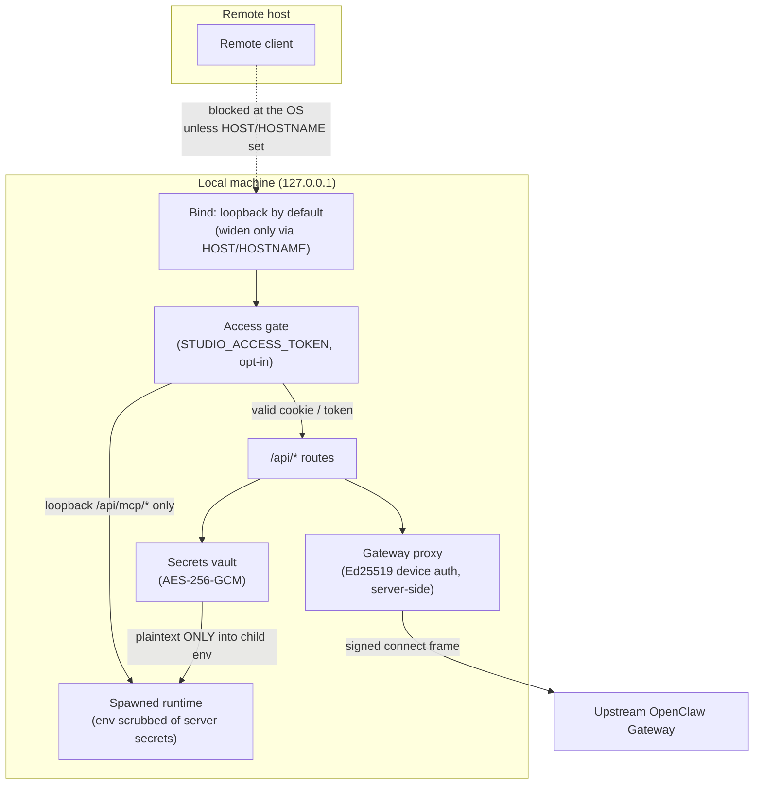

Clawboo is a local-first, single-user tool. A fresh install binds loopback only, holds no public credential, and runs every API route behind that boundary. The security model is built around that default: the network boundary is the primary control, the optional access gate is the opt-in second wall when you widen the bind, the secrets vault keeps provider keys off disk in plaintext, and a display-layer redaction pass keeps credentials out of responses and logs.

This page explains the model end to end: the loopback bind, the access gate, server-side device authentication, the encrypted secrets vault, and redact-on-display, and then gives honest guidance for exposing Clawboo beyond `localhost`. It is deliberately candid about what each control does and does not protect against.

## What it is, and what it isn't

Clawboo's security posture is **single-tenant, local-first**. The defaults assume one operator on one machine. Every shipped control is designed to make that default safe and to make widening it a conscious, opt-in act:

- **The bind is the first wall.** By default nothing off the local machine can reach the dashboard or any `/api/*` route. This is the control you rely on for a normal install.
- **The access gate is the opt-in second wall.** It is a single shared bearer token, off by default. It exists for the case where you deliberately bind a non-loopback interface.
- **The vault is defense in depth for provider keys**, not a targeted-attacker boundary. It defeats commodity infostealers and accidental backup/share of the vault file; it does not protect against a process running as you.
- **Redaction is a display-and-log boundary**, distinct from the storage-layer scrub. It is the last line that keeps a credential out of an API body or a log line.

What Clawboo is _not_: a multi-user authorization system, a per-tenant isolation boundary, or a key-management service. Those are future seams (see [Boundaries and non-goals](#boundaries-and-non-goals)), not shipped features.

## The model

The flow is: a request reaches the bind; if the bind is loopback, only local traffic gets that far. If the access gate is enabled, the request must carry a valid token (cookie or one-time query param), except a loopback `/api/mcp/*` request, which is the server's own spawned runtime and is exempt. Past the gate, the gateway proxy signs upstream connect frames with a server-held Ed25519 device key, and the secrets vault resolves provider keys into spawned-runtime env only, never into a response or a log.

## The loopback bind (secure by default)

The dashboard binds `127.0.0.1` unless you explicitly set `HOST` or `HOSTNAME`. The host resolver returns loopback, not `0.0.0.0`, so the dashboard and every `/api/*` route are reachable only from the local machine on a fresh install. An explicit `HOST`/`HOSTNAME` value wins (trimmed); anything else falls back to loopback.

`localhost`, `::1`, and the entire `127.0.0.0/8` range count as loopback. `0.0.0.0`, `::`, a LAN IP, or a hostname are all network-exposed, and that is the trigger for a loud boot-time warning.

<Info>
If you bind a non-loopback interface **and** have not set an access token, the server logs a `SECURITY:` warning at boot; the dashboard and every `/api/*` route are then reachable by anyone on your network, unauthenticated. Clawboo does not auto-generate a token; it warns and proceeds, so the choice is yours and visible. Set `STUDIO_ACCESS_TOKEN` or unset `HOST`/`HOSTNAME` to close the hole.
</Info>

## The access gate (opt-in)

The access gate is a single shared bearer token, controlled by the `STUDIO_ACCESS_TOKEN` environment variable and read at server start. A blank or unset value disables the gate entirely. When enabled, it is the only authentication on the dashboard, so its design is deliberately conservative.

**Constant-time, length-hiding compare.** The token is never compared byte-by-byte against the cookie. Both sides are SHA-256-hashed to a fixed 32-byte digest first, then compared with a constant-time equality check. Hashing first means the comparison neither short-circuits on the first differing byte (a timing oracle) nor leaks the token's length.

**Case-folded path test (no `/API/` bypass).** Before the gate tests whether a path is an `/api/*` route, it lowercases the pathname. The Express app also sets case-sensitive routing so its matcher and the gate agree. Together this closes a bypass where an uppercased `/API/settings` could resolve to the real handler while slipping past a case-sensitive prefix check. The gate folds case itself rather than trusting the host app's routing configuration.

**Loopback `/api/mcp/*` exemption.** A spawned runtime attaches its MCP client to `http://127.0.0.1:<port>/api/mcp/*` with no cookie, by design, because the runtime's environment is scrubbed of the access token (see [Secrets never reach spawned runtimes](#secrets-never-reach-spawned-runtimes)). The gate therefore lets a request through _only_ when it is both loopback (`127.0.0.1`, `::1`, or `::ffff:127.0.0.1` at the TCP socket) **and** targets `/api/mcp/*`. A remote client cannot forge a loopback source address on a real TCP handshake, so this is a safe basis for the exemption. Every other `/api/*` route, and any non-loopback `/api/mcp/*` request, still requires the cookie.

**Token charset validation (fail-loud).** The token is written raw into a `Set-Cookie` value and compared raw against the cookie, but percent-decoded on the query path. A token containing a cookie delimiter or other unsafe character would corrupt the cookie and silently lock the operator out of every `/api/*` route with no hint. So the gate validates the token against a safe charset (`[A-Za-z0-9._~-]`). If the token contains anything else, the gate logs a warning naming the offending character and **disables itself** rather than ship a permanent lockout.

How a token is presented:

| Channel                             | Behaviour                                                                                                                                                                                                                                                  |
| ----------------------------------- | ---------------------------------------------------------------------------------------------------------------------------------------------------------------------------------------------------------------------------------------------------------- |
| `?access_token=<token>` query param | Validated; on success the gate sets an `HttpOnly`, `SameSite=Lax`, `Path=/` cookie and 302-redirects to strip the token from the URL. `Secure` is added only when the request arrived over TLS, so the cookie still works on a plain-http loopback origin. |
| `clawboo_access` cookie             | The steady-state credential, validated on every `/api/*` request and every WebSocket upgrade.                                                                                                                                                              |
| Invalid / missing                   | `401` with a JSON `{ error }` body. The missing-cookie message tells you to open `/?access_token=<token>` once to set the cookie.                                                                                                                          |

The same authorization check guards the WebSocket upgrade for the gateway proxy: when the gate is enabled, an upgrade is allowed only if it carries a valid cookie.

<Note>
The access gate is a single shared secret; every client that knows the token has full operator access. It is the right tool for "lock down a deliberately-exposed single-user dashboard," not for multi-user authorization. There are no per-user accounts, roles, or scopes.
</Note>

## Server-side device authentication

The upstream OpenClaw Gateway requires an Ed25519 device signature on every connect frame. Clawboo handles this entirely server-side in the [gateway proxy](/concepts/gateway-and-events), so the browser never manages device keys.

The proxy holds a persistent Ed25519 identity at `~/.clawboo/proxy-device-identity.json`. The file contains the private key and is written with restrictive permissions: a `0700` directory and a `0600` file, and the proxy re-hardens the file to `0600` on every load, so an identity file loosened by an older code path or an upgrade is brought back to safe permissions. POSIX modes are advisory on Windows, so this is best-effort there.

When a browser opens a WebSocket to the proxy, the proxy opens the upstream connection eagerly, captures the Gateway's `connect.challenge` nonce, then, on the browser's connect frame, injects the upstream bearer token (which lives only on the server; `GET /api/settings` exposes a `hasToken` flag, never the value) and signs the frame with the proxy's device identity, replacing any browser-supplied device fields. Fresh browser contexts (preview, incognito, a new machine) connect with no device setup. If signing fails for any reason, the proxy strips the device fields and forwards without them rather than crashing the connection.

For the full handshake and event pipeline, see [Gateway and events](/concepts/gateway-and-events).

## The encrypted secrets vault

Provider and runtime API keys you connect through the dashboard are stored in an encrypted vault under Clawboo's own directory, never in OpenClaw's directory and never in plaintext on disk:

| Path                                   | Contents                                | Permissions                     |
| -------------------------------------- | --------------------------------------- | ------------------------------- |
| `~/.clawboo/secrets/master.key`        | 32-byte AES master key, base64          | `0600` file inside a `0700` dir |
| `~/.clawboo/secrets/runtime-keys.json` | `{ [envVar]: { iv, tag, ciphertext } }` | `0600`, ciphertext only         |

Each value is encrypted with AES-256-GCM under the master key. The master key is auto-generated on first use, or you can supply your own via `CLAWBOO_SECRETS_MASTER_KEY` (a 32-byte key as base64, 64 hex characters, or a raw 32-character string). Decryption enforces the standard GCM 96-bit IV and 128-bit auth-tag lengths; a truncated tag, which would weaken forgery resistance, is rejected.

**Resolution chain.** A runtime provider key is resolved by env-var name, highest priority first:

1. `process.env[envVar]`: an explicit environment variable wins.
2. The encrypted vault (decrypt).
3. OpenClaw's `~/.openclaw/.env`, so an existing OpenClaw provider key auto-satisfies a sibling runtime.

This single function is the _only_ place a secret value is read; callers put the plaintext straight into a spawned process's env and nowhere else.

**Fail-closed.** A wrong, rotated, or lost master key, or a corrupt vault entry, returns `null`, never a partial plaintext and never a thrown error into a request path.

<Danger>
The vault is **defense in depth, not targeted-attacker-proof.** It defeats commodity infostealers and the accidental backup, sync, or sharing of the vault file (the ciphertext is useless without the separate master key), but it does **not** protect against a process running as you, which can read the master key from disk or grab the decrypted value from memory or the spawned child's env. The vault holds one value per env-var, server-wide; a multi-key / per-team model is a documented future seam.
</Danger>

### Secrets never reach spawned runtimes

A spawned runtime (a Codex or Hermes CLI, the Claude Agent SDK child) executes an _untrusted_ agent that can read its own process environment. Clawboo's own server secrets must therefore never be inherited by it. The child-environment builder denylists Clawboo's named server secrets: `GATEWAY_AUTH_TOKEN`, `STUDIO_ACCESS_TOKEN`, `CLAWBOO_SECRETS_MASTER_KEY`, and any `BETTER_AUTH*` key, then merges the caller's explicit provider-key grant on top.

This denylist is exactly why the loopback `/api/mcp/*` access-gate exemption exists: the runtime's env has been stripped of `STUDIO_ACCESS_TOKEN`, so it _cannot_ present the gate cookie, and the loopback exemption is the controlled way to let only the server's own runtime through.

## Redact-on-display

Clawboo masks credential-looking content at two distinct boundaries, with two distinct markers, defense in depth:

- **Storage-layer scrub** (in `@clawboo/db`) masks secrets with `[REDACTED]` _before_ anything is persisted to SQLite, the audit log, or the observability event log.
- **Display/log-layer redaction** (in `@clawboo/logger`, re-exported by the server) masks with a bullet string (`••••`) at two later boundaries: just before an API response body is sent, and inside the pino logger so every log record passes through it.

The display redactor masks both credential-looking **keys** (a key containing `token`, `secret`, `password`, `api_key`, `authorization`, `bearer`, `credential`, `private_key`, `access_key`, or `cookie`) and credential-shaped **values** (PEM private-key blocks, `sk-`/`sk-ant-`/`sk-or-` API keys, GitHub/GitLab PATs, Slack tokens, AWS access-key IDs, Google API keys, `Bearer …` headers, and JWTs). Crucially, numeric telemetry survives: a `SAFE_COUNT_KEYS` allowlist (`inputTokens`, `outputTokens`, `totalTokens`, and similar token _counts_) is matched against the exact key name, so a token _count_ is never masked while a real credential under e.g. `accessToken` still is. Numbers, booleans, and `null` always pass through.

It is applied at the API response sites that expose stored payloads: the observability events, traces, and graph projection; the governance audit summary; and the tools audit `argsSummary`/`resultSummary`, each of which runs the JSON-string `data`/`summary` field through `redactJsonString` before sending, and at the System Health endpoint, which runs the whole report through `redactObject`.

<Note>
Redaction is a safety net, not the primary control; the value patterns are an intentional allow-list of known credential shapes, not universal coverage. A new vendor's key format may need an entry. The real guarantee that a provider key never reaches a response or log is the [vault's invariant](#the-encrypted-secrets-vault): the plaintext flows only into a spawned process's env.
</Note>

## How to expose Clawboo safely

The honest summary: Clawboo is single-tenant and local-first today. If you keep the loopback default you need none of the following; if you widen the bind, do all of it.

1. **Prefer not to widen the bind.** For local use, leave `HOST`/`HOSTNAME` unset. The dashboard is loopback-only and no token is needed.
2. **If you must reach it remotely, tunnel rather than bind wide.** An SSH tunnel or a reverse proxy that terminates TLS and forwards to `127.0.0.1:<port>` keeps the bind loopback and adds a real transport-security and authentication layer in front. This is the recommended path.
3. **If you do bind a non-loopback interface, set `STUDIO_ACCESS_TOKEN`.** Use a long random token from the safe charset (`[A-Za-z0-9._~-]`). The boot warning exists to catch the case where you forget; do not run a non-loopback bind without it.
4. **Terminate TLS in front of the dashboard** so the access cookie is sent with `Secure`. The gate only marks the cookie `Secure` when the request arrives over TLS (it detects this via `x-forwarded-proto: https`), so a terminating proxy that sets that header is what upgrades the cookie.
5. **Treat the access token as a full-operator credential.** Everyone who has it can do everything. Rotate it by changing the env var and restarting; there is no per-user revocation.

<Warning>
A non-loopback bind with no access token is the single most dangerous misconfiguration: every `/api/*` route, including the ones that resolve provider keys into spawned runtimes, becomes reachable by anyone on the network. The boot-time `SECURITY:` warning is your signal that this has happened.
</Warning>

## Design rationale and trade-offs

The model optimizes for a frictionless single-user local install while keeping a clear, opt-in path to a locked-down exposed one. Loopback-by-default means a fresh install is never accidentally on the network. A single shared token (rather than accounts) keeps the exposed-but-single-user case trivial to set up. Server-side device auth keeps key management out of the browser entirely, so any browser context connects. The vault is a pragmatic "raise the bar against the common threats without pretending to defeat a local attacker" choice, and it says so plainly. Redaction is a cheap, broad backstop layered behind a narrow structural guarantee (secrets only enter child env).

The trade-offs are equally plain: there is no multi-user authorization, the token is all-or-nothing, and the vault cannot defend against a process running as you. Each is a conscious scope boundary, not an oversight.

## Boundaries and non-goals

- **Single-tenant today.** There is no per-tenant isolation. The dormant `tenant_id` columns across the schema are a future seam; no per-tenant filtering or scoping is active in v0.2.0.
- **OpenClaw shared memory is registered globally.** Because OpenClaw agents are cross-team, Clawboo registers the shared [Memory](/concepts/memory) MCP server for the OpenClaw runtime at _global_ scope rather than per-run/per-team scope (the other four runtimes get per-run team scope). In a multi-tenant world that global registration would need narrowing; it is a documented multi-tenant deferral, not a leak in the single-tenant model Clawboo ships.
- **Not a key-management service.** The vault stores one value per env-var, server-wide. Named profiles, per-team keys, and rotation tooling are future seams.
- **Not multi-user.** The access gate is one shared secret with no accounts, roles, or scopes.

<Note>
These docs describe Clawboo **v0.2.0**, the current release.
</Note>

## See also

- [Deployment](/operating/deployment): ports, state directory, and the bundled server
- [Gateway and events](/concepts/gateway-and-events): the proxy handshake and event pipeline
- [Connecting runtimes](/runtimes/connecting-runtimes): the connect/disconnect flow that writes the vault
- [Memory](/concepts/memory): the shared-tier registration and its OpenClaw global-scope note
- [Environment variables](/reference/environment-variables): `STUDIO_ACCESS_TOKEN`, `HOST`/`HOSTNAME`, `CLAWBOO_SECRETS_MASTER_KEY`
- [Configuration](/reference/configuration): settings file and directory locations
- [Glossary](/appendices/glossary): canonical term definitions
