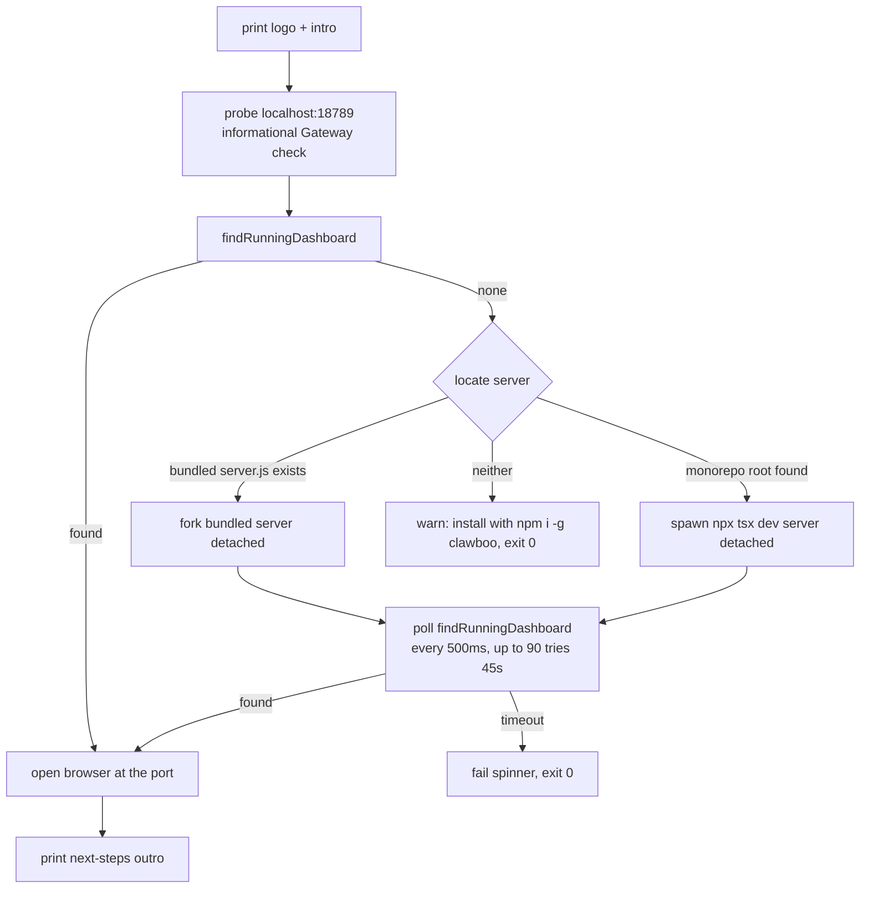

Clawboo ships one user-facing command and four MCP stdio binaries. The `clawboo` command is a thin launcher: it finds or starts the bundled dashboard server and opens a browser. There are **no subcommands**; onboarding, Gateway detection, runtime connection, and team deployment all happen in the web UI. The MCP bins are not launched by humans; an external agent runtime spawns them to attach Clawboo's board, memory, tools, and team-chat surfaces over stdio.

<Note>
These docs describe Clawboo **v0.3.0**, the current release.
</Note>

## At a glance

| Binary                 | Invocation           | Purpose                                                   |
| ---------------------- | -------------------- | --------------------------------------------------------- |
| `clawboo`              | `npx clawboo`        | Launch the dashboard (find-or-start server, open browser) |
| `clawboo-mcp-tasks`    | spawned by a runtime | Tasks (board) MCP server over stdio                       |
| `clawboo-mcp-memory`   | spawned by a runtime | Memory MCP server over stdio                              |
| `clawboo-mcp-tools`    | spawned by a runtime | Tools-broker MCP server over stdio                        |
| `clawboo-mcp-teamchat` | spawned by a runtime | TeamChat MCP server over stdio                            |

All five are declared in the package's `bin` map and shipped in the published `dist/` tarball.

---

## `clawboo`

The launcher is built on Commander with a single default action; there are no `commander` subcommands registered, only the two flags Commander provides automatically (`--version` and `--help`). The runtime is Node 22+ (the package `engines` field requires `node >=22.0.0`).

### Flags

| Flag              | Effect                                                                                                      |
| ----------------- | ----------------------------------------------------------------------------------------------------------- |
| `-V`, `--version` | Print the CLI version and exit (the version is compiled in at build time via the `__CLI_VERSION__` define). |
| `-h`, `--help`    | Print usage and exit.                                                                                       |

There are no other flags. The launch flow is not configurable on the command line; it is steered by [environment variables](#environment-variables-honored).

### What `npx clawboo` does

Running `clawboo` with no flags executes the launch sequence below.



1. **Print the banner.** An ASCII logo, the tagline, and an intro line showing `Clawboo v<version>`.
2. **Informational Gateway probe.** A TCP probe of `localhost:18789` (the OpenClaw Gateway's default port). The result is purely informational; it prints "OpenClaw Gateway detected" or "No Gateway detected; the dashboard will guide you through setup." It does not gate anything; the dashboard handles Gateway setup.
3. **Find a running dashboard.** `findRunningDashboard()` looks for an existing Clawboo server (see [Port discovery](#port-discovery)). If one is found, the launcher skips straight to opening the browser.
4. **Start the server** if none is running, choosing one of two strategies:
   - **Bundled mode (primary):** if `server.js` exists next to the CLI entry, it is `fork`ed detached with `NODE_ENV=production`, `cwd` set to the CLI's own directory, and `CLAWBOO_MCP_BIN_DIR` pointed at the sibling `bin/` directory (so the server's `/api/mcp/config` can emit `node <bin>` stdio attach snippets). The child is `unref`'d so the CLI can exit while the server keeps running.
   - **Dev mode (fallback):** if there is no bundled server but a monorepo root (a `package.json` with `"name": "clawboo"`) is found, the launcher `spawn`s `npx tsx apps/web/server/index.ts` detached with `NODE_ENV=production`.
   - **Neither found:** it prints a warning to `npm install -g clawboo` and exits 0.
5. **Poll for the port.** After spawning, it polls `findRunningDashboard()` every 500 ms for up to **90 attempts (≈45 s)**. The long window accommodates a cold first boot of the bundled server on Windows (Defender scanning the freshly-extracted package plus Node's first-load module compile). On timeout it fails the spinner and exits 0.
6. **Open the browser.** Resolves `http://localhost:<port>` and opens it with the platform launcher (`open` on macOS, `start` on Windows, `xdg-open` elsewhere).
7. **Print next steps.** A success outro with pointers to the dashboard and docs.

<Note>
The CLI never connects to a Gateway itself, never reads a token, and never writes Clawboo state; the dashboard server owns all of that. The CLI's only job is to get a server running and open the page.
</Note>

### Port discovery

`findRunningDashboard()` mirrors the server's port resolver and probes for a Clawboo dashboard in this priority order:

1. **`CLAWBOO_API_PORT`**: if set to a valid port (1–65535), probe only that port.
2. **Runtime port file**: read `<CLAWBOO_HOME>/api-port.txt` (default `~/.clawboo/api-port.txt`), which the server writes on successful bind, and probe it.
3. **Range scan**: probe `18790`, then scan upward through **20 consecutive ports** (`18790`–`18809`).

The default port is **18790** (one above the OpenClaw Gateway's `18789`).

Each probe is not a bare TCP check. `probeClawbooDashboard()` does a cheap TCP probe first, then an HTTP `GET /api/settings` and validates a Clawboo-shaped JSON body (the response must include both a `gatewayUrl` string and a `hasToken` boolean). This signature check is load-bearing: the fallback range `18790`–`18809` overlaps the OpenClaw Gateway's auxiliary ports (`18791`–`18792`) and Chrome's `--remote-debugging-port` (commonly `18800`), and a naive TCP probe would route the browser at one of those (a 401 page, a DevTools target list). The signature check rejects any non-Clawboo listener regardless of what else is bound in the range.

<Warning>
The launcher's resolution comment lists `CLAWBOO_API_URL` as an override, but no code reads it; only `CLAWBOO_API_PORT` is honored. Use `CLAWBOO_API_PORT`.
</Warning>

### Environment variables honored

These are the only environment variables the `clawboo` launcher itself reads or sets. The bundled server it starts reads many more; see [Environment variables](/reference/environment-variables).

| Variable              | Read / Set                     | Effect                                                                                    |
| --------------------- | ------------------------------ | ----------------------------------------------------------------------------------------- |
| `CLAWBOO_API_PORT`    | read                           | Probe this exact port for a running dashboard (skips the range scan).                     |
| `CLAWBOO_HOME`        | read (via `resolveClawbooDir`) | Locates the runtime port file at `<CLAWBOO_HOME>/api-port.txt`. Defaults to `~/.clawboo`. |
| `CLAWBOO_SERVER_PATH` | read                           | Overrides monorepo-root discovery for the dev-mode fallback.                              |
| `NODE_ENV`            | set on child                   | Forced to `production` on the spawned server.                                             |
| `CLAWBOO_MCP_BIN_DIR` | set on child (bundled mode)    | Points the server at the sibling `bin/` dir so it can emit stdio attach snippets.         |

### Example

```bash
# Launch (find-or-start the dashboard, then open the browser)
npx clawboo

# Print the version
npx clawboo --version

# Pin the dashboard port the launcher probes
CLAWBOO_API_PORT=18790 npx clawboo
```

---

## MCP stdio bins

Each `clawboo-mcp-*` bin is a standalone Node script that runs one [MCP](/appendices/glossary) server over stdio. They exist so an external agent runtime (for example, a Codex or Claude Code process you configure yourself) can attach Clawboo's coordination surfaces as MCP tools without going through the dashboard. The dashboard server hosts the same servers in-process and over Streamable HTTP; the stdio bins are the standalone path.

All four open the **shared** Clawboo SQLite database via `createDb(defaultDbPath())`. `defaultDbPath()` returns `~/.openclaw/clawboo/clawboo.db` unless `CLAWBOO_DB_PATH` overrides it. Opening the same file the in-process server serves is safe because the database is created in WAL mode with the multi-process contention recipe; a bin spawned by an external runtime and the Express server read and write the one file concurrently.

| Bin                    | MCP server    | Notes                                                                                                                                                                                                  |
| ---------------------- | ------------- | ------------------------------------------------------------------------------------------------------------------------------------------------------------------------------------------------------ |
| `clawboo-mcp-tasks`    | Tasks (board) | Serves the durable board.                                                                                                                                                                              |
| `clawboo-mcp-memory`   | Memory        | Resolves an embedding provider once at boot (Ollama → OpenAI → none); vector/hybrid search degrades to FTS when no provider is available.                                                              |
| `clawboo-mcp-tools`    | Tools broker  | Availability is evaluated from the bin's own env at boot; only satisfied tools register. Calls run the full broker pipeline (inspector chain → DB-mediated approval → execute → compact → audit).      |
| `clawboo-mcp-teamchat` | TeamChat      | Unbound by default; an external attach passes `authorAgentId` + `teamId` in the tool args. Clawboo's own per-runtime attach binds the identity authoritatively via the HTTP URL (the anti-spoof path). |

For the tool list and zod input shapes each server registers, see the [MCP tools reference](/reference/mcp-tools).

### Packaging

The bins are bundled **self-contained** (the MCP SDK, `@clawboo/db`, and drizzle are inlined) so they run from a clean `npx clawboo` install. Only native and process-level deps stay external (`better-sqlite3`, `ws`, `pino`, `pino-pretty`) and are resolved from the CLI's installed dependencies; OpenTelemetry stays external and is lazily loaded, so the bins never require it at boot. The `#!/usr/bin/env node` shebang is preserved on each.

### Attaching from a runtime

You normally do not invoke these by hand. The server's `GET /api/mcp/config?runtime=&server=&transport=stdio` emits a ready-to-paste attach snippet. For the stdio transport that requires the server to know where the built bins live; the `clawboo` launcher sets `CLAWBOO_MCP_BIN_DIR` to the sibling `bin/` directory on the bundled server, and the config endpoint joins that dir with `<server>.js` to produce a `{ command: "node", args: [<binPath>] }` invocation. See the [Tools & MCP API](/reference/rest-api/tools-and-mcp) for the config endpoint and the transport options.

### Honored environment variables

| Variable          | Effect                                                                                    |
| ----------------- | ----------------------------------------------------------------------------------------- |
| `CLAWBOO_DB_PATH` | Override the shared SQLite path the bins open (default `~/.openclaw/clawboo/clawboo.db`). |

The memory bin additionally consults embedding-provider env vars at boot; those are documented under [Environment variables](/reference/environment-variables), not here.

### Example

```bash
# Spawn the Tasks MCP server over stdio (normally a runtime does this for you)
clawboo-mcp-tasks

# Point the bins at a different database file
CLAWBOO_DB_PATH=/tmp/clawboo-test.db clawboo-mcp-tasks
```

## See also

- [Installation](/getting-started/installation), what `npx clawboo` launches and the prerequisites
- [Deployment](/operating/deployment), ports, the runtime port file, the bundled server, state dir
- [Environment variables](/reference/environment-variables), the full env-var surface (the server reads many more than the CLI)
- [Configuration](/reference/configuration), `settings.json` and file/dir locations
- [MCP tools reference](/reference/mcp-tools), the four MCP servers and their tool/input shapes
- [Tools & MCP API](/reference/rest-api/tools-and-mcp), the `/api/mcp/*` endpoints and `GET /api/mcp/config`
