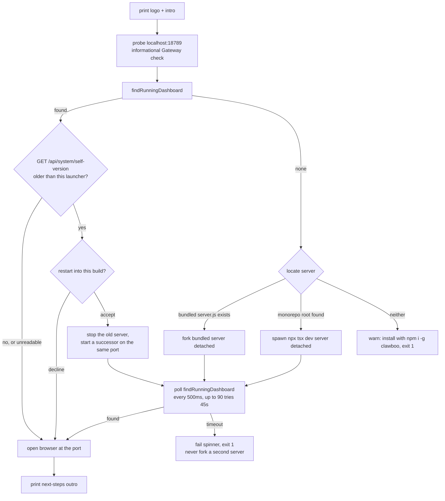

Clawboo ships one user-facing command and four MCP stdio binaries. Run bare, `clawboo` is a launcher: it finds or starts the bundled dashboard server, checks what version it found, and opens a browser. Three subcommands sit alongside that default action, and each exists because the server runs **detached**: taking a consistent copy of a live database, clearing an instance you can no longer Ctrl-C, and rolling a running instance onto a newer build are all things a detached process makes awkward. Everything else, onboarding, Gateway detection, runtime connection, and team deployment, still happens in the web UI. The MCP bins are not launched by humans; an external agent runtime spawns them to attach Clawboo's board, memory, tools, and team-chat surfaces over stdio.

<Note>
These docs describe Clawboo **v0.3.1**, the current release.
</Note>

## At a glance

| Binary                 | Invocation                         | Purpose                                                   |
| ---------------------- | ---------------------------------- | --------------------------------------------------------- |
| `clawboo`              | `npm i -g clawboo`, then `clawboo` | Launch the dashboard (find-or-start server, open browser) |
| `clawboo-mcp-tasks`    | spawned by a runtime               | Tasks (board) MCP server over stdio                       |
| `clawboo-mcp-memory`   | spawned by a runtime               | Memory MCP server over stdio                              |
| `clawboo-mcp-tools`    | spawned by a runtime               | Tools-broker MCP server over stdio                        |
| `clawboo-mcp-teamchat` | spawned by a runtime               | TeamChat MCP server over stdio                            |

All five are declared in the package's `bin` map and shipped in the published `dist/` tarball.

The `clawboo` binary carries one default action and three subcommands:

| Command                 | What it does                                                        | Effect on the server           |
| ----------------------- | ------------------------------------------------------------------- | ------------------------------ |
| `clawboo`               | Find or start the dashboard server, then open the browser at it     | Starts one if none is running  |
| `clawboo backup [dest]` | Online, checkpoint-consistent copy of `clawboo.db` to a single file | None (reads the file directly) |
| `clawboo stop`          | Terminate the running dashboard server                              | Stops it                       |
| `clawboo restart`       | Stop the running server, start a fresh one on the same port         | Stops, then starts             |

---

## `clawboo`

The launcher is built on Commander: one default action, the `backup` / `stop` / `restart` subcommands, and the two flags Commander provides automatically (`--version` and `--help`). The runtime is Node 22+ (the package `engines` field requires `node >=22.0.0`).

### Flags

| Flag                 | Effect                                                                                                      |
| -------------------- | ----------------------------------------------------------------------------------------------------------- |
| `-V`, `--version`    | Print the CLI version and exit (the version is compiled in at build time via the `__CLI_VERSION__` define). |
| `-h`, `--help`       | Print usage and exit.                                                                                       |
| `--no-version-check` | Skip the version comparison against an already-running server and attach to it unconditionally.             |
| `-y`, `--yes`        | Answer yes to the restart offer, so an older running server is replaced without a prompt.                   |

`--no-version-check` and `-y` apply to the default action only. `clawboo backup` adds `-f, --force`; `clawboo restart` adds `--no-open`; `clawboo stop` takes no flags. Beyond that the launch flow is not configurable on the command line; it is steered by [environment variables](#environment-variables-honored).

### What `clawboo` does

Running `clawboo` with no flags executes the launch sequence below.


```mermaid
flowchart TD
  A[print logo + intro] --> B[probe localhost:18789<br/>informational Gateway check]
  B --> C[findRunningDashboard]
  C -->|found| V{GET /api/system/self-version<br/>older than this launcher?}
  V -->|no, or unreadable| H[open browser at the port]
  V -->|yes| Q{restart into this build?}
  Q -->|decline| H
  Q -->|accept| S[stop the old server,<br/>start a successor on the same port]
  C -->|none| D{locate server}
  D -->|bundled server.js exists| E[fork bundled server detached]
  D -->|monorepo root found| F[spawn npx tsx dev server detached]
  D -->|neither| G[warn: install with npm i -g clawboo, exit 1]
  E --> P[poll findRunningDashboard<br/>every 500ms, up to 90 tries 45s]
  F --> P
  S --> P
  P -->|found| H
  P -->|timeout| I[fail spinner, exit 1<br/>never fork a second server]
  H --> J[print next-steps outro]
```

1. **Print the banner.** An ASCII logo, the tagline, and an intro line showing `Clawboo v<version>`.
2. **Informational Gateway probe.** A TCP probe of `localhost:18789` (the OpenClaw Gateway's default port). The result is purely informational; it prints "OpenClaw Gateway detected" or "No Gateway detected; the dashboard will guide you through setup." It does not gate anything; the dashboard handles Gateway setup.
3. **Find a running dashboard.** `findRunningDashboard()` looks for an existing Clawboo server (see [Port discovery](#port-discovery)).
4. **Compare versions.** When a server _is_ already running, the launcher reads `GET /api/system/self-version` from it and compares that response's `current` field to its own compiled-in version. Three outcomes: same or newer, attach silently; **older**, print a short notice and offer to restart into this build; unreachable, unparseable, or either side reading `0.0.0*` (a dev checkout), attach silently. The check is deliberately fail-open: a version it cannot read must never stand between you and an open browser. `--no-version-check` skips it entirely.
5. **Start the server** if none is running, choosing one of two strategies:
   - **Bundled mode (primary):** if `server.js` exists next to the CLI entry, it is `fork`ed detached with `NODE_ENV=production`, `cwd` set to the CLI's own directory, `CLAWBOO_VERSION` set to the launcher's version, and `CLAWBOO_MCP_BIN_DIR` pointed at the sibling `bin/` directory (so the server's `/api/mcp/config` can emit `node <bin>` stdio attach snippets). The child is `unref`'d so the CLI can exit while the server keeps running.
   - **Dev mode (fallback):** if there is no bundled server but a monorepo root (a `package.json` with `"name": "clawboo"`) is found, the launcher `spawn`s `npx tsx apps/web/server/index.ts` detached with `NODE_ENV=production`.
   - **Neither found:** it prints a warning to `npm install -g clawboo` and exits 1.
6. **Poll for the port.** After spawning, it polls `findRunningDashboard()` every 500 ms for up to **90 attempts (≈45 s)**. The long window accommodates a cold first boot of the bundled server on Windows (Defender scanning the freshly-extracted package plus Node's first-load module compile). On timeout it fails the spinner and exits 1.
7. **Open the browser.** Resolves `http://localhost:<port>` and opens it with the platform launcher (`open` on macOS, `start` on Windows, `xdg-open` elsewhere).
8. **Print next steps.** A success outro with pointers to the dashboard and docs.

<Note>
The version check exists because the server is spawned **detached and `unref`'d**. A dashboard started weeks ago on an older build stays bound to the port, and every later `clawboo` run attached to it, so upgrading the package changed nothing until you rebooted. Reading the running server's own version closes that loop.

Note what this is _not_: it compares the running server against **the launcher you just invoked**, not against npm. The "a newer release exists upstream" check is a separate, server-side surface; the same endpoint also returns `latest` and `updateAvailable`, which the dashboard's update chip renders. The launcher asks for `?local=1`, which tells the server to skip its registry probe, so the comparison stays local and adds no network round-trip. See [`GET /api/system/self-version`](/reference/rest-api/system) for the full payload.
</Note>

<Note>
The CLI never connects to a Gateway, never reads a Gateway token, and never mutates Clawboo state. `backup` opens the database **read-only** and writes its copy where you point it; `stop` and `restart` act on a process, not on data. Everything that owns state, the board, the vault, settings, stays behind the dashboard server.
</Note>

## Port discovery

`findRunningDashboard()` mirrors the server's port resolver and probes for a Clawboo dashboard in this priority order:

1. **`CLAWBOO_API_PORT`**: if set to a valid port (1–65535), probe only that port.
2. **Runtime port file**: read `<CLAWBOO_HOME>/api-port.txt` (default `~/.clawboo/api-port.txt`), which the server writes on successful bind, and probe it.
3. **Range scan**: probe `18790`, then scan upward through **20 consecutive ports** (`18790`–`18809`).

The default port is **18790** (one above the OpenClaw Gateway's `18789`).

Every command that needs a server shares this one resolver: the default action uses it to decide whether to spawn, and `stop` / `restart` use it to decide what to terminate, so they act on exactly the instance `clawboo` would have attached to. `backup` does not use it at all; it goes straight to the database file, which is why it works with no server running.

Each probe is not a bare TCP check. `probeClawbooDashboard()` does a cheap TCP probe first, then an HTTP `GET /api/settings` and validates a Clawboo-shaped JSON body (the response must include both a `gatewayUrl` string and a `hasToken` boolean). This signature check is load-bearing: the fallback range `18790`–`18809` overlaps the OpenClaw Gateway's auxiliary ports (`18791`–`18792`) and Chrome's `--remote-debugging-port` (commonly `18800`), and a naive TCP probe would route the browser at one of those (a 401 page, a DevTools target list). The signature check rejects any non-Clawboo listener regardless of what else is bound in the range. `stop` re-runs it immediately before resolving a process to terminate, for the same reason.

<Warning>
The launcher's resolution comment lists `CLAWBOO_API_URL` as an override, but no code reads it; only `CLAWBOO_API_PORT` is honored. Use `CLAWBOO_API_PORT`.
</Warning>

### Token-gated installs

Setting `STUDIO_ACCESS_TOKEN` turns on the [access gate](/operating/security), and every `/api/*` route then requires a cookie the launcher does not have — including the `GET /api/settings` that discovery uses. A gated server therefore cannot be attached to from the command line.

The gate answers with a Clawboo-specific JSON error rather than a bare 401, so the launcher can still tell that a Clawboo dashboard is there. It says so and stops, instead of concluding nothing is running and starting a second server onto the same database. `clawboo stop` and `clawboo restart` report the same thing and print the manual command; they deliberately do not terminate a process on a port they could not positively identify.

To use the dashboard, open `http://localhost:<port>/?access_token=<token>` once to set the cookie.

To restart a gated server without unsetting the token, stop it by hand and start a fresh one:

```bash
# POSIX; on Windows use netstat -ano | findstr :<port> then taskkill /PID <pid> /F
lsof -nP -iTCP:<port> -sTCP:LISTEN -t | xargs kill
clawboo
```

Or unset `STUDIO_ACCESS_TOKEN` and use `clawboo restart` normally.

## `clawboo backup`

Writes a single, checkpoint-consistent copy of `~/.clawboo/clawboo.db`. Safe while the dashboard is live: it opens the source **read-only** and uses better-sqlite3's online `.backup()`, which reads pages through the shared WAL and produces one self-contained file with no `-wal`/`-shm` sidecars. A plain `cp` of `clawboo.db` on a running server can miss everything still sitting in the WAL; that gap is the reason this subcommand exists.

| Argument / flag | Effect                                                                                                                                                                                   |
| --------------- | ---------------------------------------------------------------------------------------------------------------------------------------------------------------------------------------- |
| `[dest]`        | Destination. Omitted, `./clawboo-backup-<YYYYMMDD-HHMMSS>.db` in the current directory. An existing **directory**, a timestamped file inside it. Anything else, the literal output path. |
| `-f, --force`   | Delete an existing destination first. Without it, an existing destination is an error, never a silent overwrite.                                                                         |

The unlink under `--force` is load-bearing rather than tidy: `.backup()` opens its destination _as a SQLite database_, so it fails `SQLITE_NOTADB` against a non-SQLite file and would leave stale trailing pages behind on a smaller pre-existing one. Deleting first guarantees a clean single-file image.

The source is `resolveClawbooDir()/clawboo.db`, the same file the server uses, honoring `CLAWBOO_HOME`. If it does not exist the command errors out rather than writing an empty database; start the server once to create it, or point `CLAWBOO_HOME` at the right directory.

See [Data and state](/operating/data-and-state) for the full backup and restore model, including what a whole-directory copy captures that a database-only backup does not.

## `clawboo stop`

Terminates the running dashboard server.

```bash
clawboo stop
```

`stop` resolves the server through the same [port discovery](#port-discovery) chain the launcher uses, so it stops exactly the instance `clawboo` would have attached to (`CLAWBOO_API_PORT=<n> clawboo stop` targets one explicitly). With no Clawboo dashboard running it says so, clears a stale `api-port.txt` if one is left over, and exits 0: stopping something already stopped is not an error, so this is safe in a teardown script. It exits 1 only when a server _is_ running and could not be terminated.

<Note>
`api-port.txt` records a **port, not a PID**, and the detached server writes no PID file of its own. `stop` therefore resolves port to owning process the way the server resolves the Gateway's: `lsof -nP -iTCP:<port> -sTCP:LISTEN -t` on Unix, `netstat -ano` filtered to listening rows on Windows. On a machine with neither tool on `PATH` the lookup returns nothing and `stop` reports that it could not identify the process, and prints the manual command, rather than guessing at one.

It then sends `SIGTERM` and watches the **port**, not the PID, for up to 4 seconds before escalating to `SIGKILL`. A PID can be recycled; a port that stopped answering cannot be misread. Before escalating it re-resolves the listener and only force-kills a process that is still the one holding the port.
</Note>

<Warning>
Stopping the server stops everything that lives inside it: in-flight agent runs, the server-side delegation engine, scheduled [Routines](/concepts/scheduling), and the background reconcilers. Nothing is lost, the board is durable and boot-resume re-arms every active routine on the next start, but a run in progress is interrupted.

On Windows there is no graceful signal for a detached console process: Node's `process.kill` maps to `TerminateProcess`, so the server's shutdown handler does not run. `stop` cleans up `api-port.txt` itself in that case, and the SQLite WAL is crash-safe and recovered on the next open.
</Warning>

## `clawboo restart`

Stops the running server and starts a fresh one on the same port.

```bash
clawboo restart
```

This is `stop` followed by a launch, with one difference that matters: the successor is pinned to the **same port** the old server held (`CLAWBOO_API_PORT`) and told to wait for that port to free before binding (`CLAWBOO_AWAIT_PORT`). Without the wait, the successor would race the exiting process and either fail loudly on a pinned port or drift to the next free one, orphaning any browser tab already open on the old URL. With it, an open tab reconnects on its own.

If the port turns out not to be free after the stop (something else claimed it in the gap), the successor is started without a pin and falls back to ordinary [port resolution](#port-discovery) — an auto-scan, or your own `CLAWBOO_API_PORT` if you have one exported, in which case the boot still fails loudly on the taken port.

Reach for it after a global upgrade (`npm install -g clawboo@latest` replaces the bytes on disk, but not the process already running the old ones), after changing an environment variable the server reads at boot, or any time you want a clean process without hunting one down. It is also what the launcher offers to run for you when it finds an older server during [discovery](#what-clawboo-does).

| Flag        | Effect                                              |
| ----------- | --------------------------------------------------- |
| `--no-open` | Don't open the browser after restarting (headless). |

With nothing running, `restart` simply starts a server, the same convention `systemctl restart` follows. If the stop fails it exits 1 and deliberately does **not** start a replacement: a pinned start would fail on the still-taken port, and an unpinned one would leave you with two dashboards.

<Note>
In a monorepo checkout the dev server is usually supervised by `pnpm dev`, which will respawn it. Restart through your dev script there rather than through `clawboo restart`.
</Note>

## Environment variables honored

These are the only environment variables the `clawboo` launcher itself reads or sets. The bundled server it starts reads many more; see [Environment variables](/reference/environment-variables).

| Variable              | Read / Set                     | Effect                                                                                                                               |
| --------------------- | ------------------------------ | ------------------------------------------------------------------------------------------------------------------------------------ |
| `CLAWBOO_API_PORT`    | read; set on child (`restart`) | Probe this exact port for a running dashboard (skips the range scan). Set on a restarted successor to pin its port.                  |
| `CLAWBOO_HOME`        | read (via `resolveClawbooDir`) | Locates the runtime port file at `<CLAWBOO_HOME>/api-port.txt` and, for `backup`, the source `clawboo.db`. Defaults to `~/.clawboo`. |
| `CLAWBOO_SERVER_PATH` | read                           | Overrides monorepo-root discovery for the dev-mode fallback.                                                                         |
| `NODE_ENV`            | set on child                   | Forced to `production` on the spawned server.                                                                                        |
| `CLAWBOO_VERSION`     | set on child                   | The launcher's own version, so the server's self-version surface knows which release started it without a disk read.                 |
| `CLAWBOO_AWAIT_PORT`  | set on child (`restart`)       | Tells the successor to wait for that port to free before binding, so it reclaims the exact port the stopped server held.             |
| `CLAWBOO_MCP_BIN_DIR` | set on child (bundled mode)    | Points the server at the sibling `bin/` dir so it can emit stdio attach snippets.                                                    |

## Example

```bash
# Install, then launch (find-or-start the dashboard, then open the browser)
npm install -g clawboo
clawboo

# Print the version
clawboo --version

# Pin the dashboard port the launcher probes
CLAWBOO_API_PORT=18790 clawboo

# Attach to whatever is running, without the version comparison
clawboo --no-version-check

# Single-file, live-safe database backup
clawboo backup
clawboo backup ~/backups/                    # timestamped file inside the directory
clawboo backup ~/clawboo.db.bak --force

# Clear a detached server, or roll it onto a freshly-installed build
clawboo stop
npm install -g clawboo@latest && clawboo restart
```

Or run `npx clawboo` to try it without installing.

---

## MCP stdio bins

Each `clawboo-mcp-*` bin is a standalone Node script that runs one [MCP](/appendices/glossary) server over stdio. They exist so an external agent runtime (for example, a Codex or Claude Code process you configure yourself) can attach Clawboo's coordination surfaces as MCP tools without going through the dashboard. The dashboard server hosts the same servers in-process and over Streamable HTTP; the stdio bins are the standalone path.

All four open the **shared** Clawboo SQLite database via `createDb(defaultDbPath())`. `defaultDbPath()` returns `~/.openclaw/clawboo/clawboo.db` unless `CLAWBOO_DB_PATH` overrides it. Opening the same file the in-process server serves is safe because the database is created in WAL mode with the multi-process contention recipe; a bin spawned by an external runtime and the Express server read and write the one file concurrently.

| Bin                    | MCP server    | Notes                                                                                                                                                                                                  |
| ---------------------- | ------------- | ------------------------------------------------------------------------------------------------------------------------------------------------------------------------------------------------------ |
| `clawboo-mcp-tasks`    | Tasks (board) | Serves the durable board.                                                                                                                                                                              |
| `clawboo-mcp-memory`   | Memory        | Resolves an embedding provider once at boot (Ollama → OpenAI → none); vector/hybrid search degrades to FTS when no provider is available.                                                              |
| `clawboo-mcp-tools`    | Tools broker  | Availability is evaluated from the bin's own env at boot; only satisfied tools register. Calls run the full broker pipeline (inspector chain → DB-mediated approval → execute → compact → audit).      |
| `clawboo-mcp-teamchat` | TeamChat      | Unbound by default; an external attach passes `authorAgentId` + `teamId` in the tool args. Clawboo's own per-runtime attach binds the identity authoritatively via the HTTP URL (the anti-spoof path). |

For the tool list and zod input shapes each server registers, see the [MCP tools reference](/reference/mcp-tools).

### Packaging

The bins are bundled **self-contained** (the MCP SDK, `@clawboo/db`, and drizzle are inlined) so they run from a clean Clawboo install. Only native and process-level deps stay external (`better-sqlite3`, `ws`, `pino`, `pino-pretty`) and are resolved from the CLI's installed dependencies; OpenTelemetry stays external and is lazily loaded, so the bins never require it at boot. The `#!/usr/bin/env node` shebang is preserved on each.

### Attaching from a runtime

You normally do not invoke these by hand. The server's `GET /api/mcp/config?runtime=&server=&transport=stdio` emits a ready-to-paste attach snippet. For the stdio transport that requires the server to know where the built bins live; the `clawboo` launcher sets `CLAWBOO_MCP_BIN_DIR` to the sibling `bin/` directory on the bundled server, and the config endpoint joins that dir with `<server>.js` to produce a `{ command: "node", args: [<binPath>] }` invocation. See the [Tools & MCP API](/reference/rest-api/tools-and-mcp) for the config endpoint and the transport options.

### Honored environment variables

| Variable          | Effect                                                                                    |
| ----------------- | ----------------------------------------------------------------------------------------- |
| `CLAWBOO_DB_PATH` | Override the shared SQLite path the bins open (default `~/.openclaw/clawboo/clawboo.db`). |

The memory bin additionally consults embedding-provider env vars at boot; those are documented under [Environment variables](/reference/environment-variables), not here.

### Example

```bash
# Spawn the Tasks MCP server over stdio (normally a runtime does this for you)
clawboo-mcp-tasks

# Point the bins at a different database file
CLAWBOO_DB_PATH=/tmp/clawboo-test.db clawboo-mcp-tasks
```

## See also

- [Installation](/getting-started/installation), what `clawboo` launches and the prerequisites
- [Deployment](/operating/deployment), ports, the runtime port file, the bundled server, state dir
- [Data and state](/operating/data-and-state), backup, restore, and the hard-reset model
- [Environment variables](/reference/environment-variables), the full env-var surface (the server reads many more than the CLI)
- [Configuration](/reference/configuration), `settings.json` and file/dir locations
- [MCP tools reference](/reference/mcp-tools), the four MCP servers and their tool/input shapes
- [Tools & MCP API](/reference/rest-api/tools-and-mcp), the `/api/mcp/*` endpoints and `GET /api/mcp/config`
- [System API](/reference/rest-api/system), `GET /api/system/self-version` (the version-check payload) and `POST /api/system/self-update`
