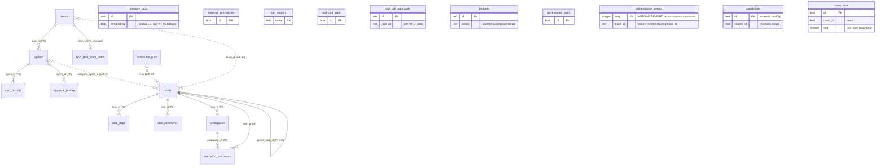

Clawboo persists all of its durable state in one local SQLite file. This page documents every table defined in `packages/db/src/schema.ts`: purpose, key columns, indexes, and foreign keys, plus how the schema is created and where the file lives.

There are **27 tables**. They cluster by subsystem: the agent/team **registry of record**, the durable **board**, the **memory** store, the **tools** broker, **governance**, the **observability** event log, the **capability** inventory, and the **team-chat** room substrate. The `memory_facts_fts` FTS5 virtual table (and its shadow tables) are not in the table count; they are raw DDL in `createDb`, not modellable in `schema.ts`.

<Info>
There is no migration ladder. The inline `CREATE TABLE IF NOT EXISTS` block in `createDb()` (`packages/db/src/db.ts`) is the **sole** schema-creation source. `schema.ts` is the Drizzle type layer over the same tables, used for typed queries, never to apply migrations. A schema change is a hard reset of the local DB; see [Schema source of truth](#schema-source-of-truth--no-migration-ladder) below.
</Info>

## At a glance

| Table                  | Cluster      | PK                              | Purpose                                                          |
| ---------------------- | ------------ | ------------------------------- | ---------------------------------------------------------------- |
| `chat_messages`        | registry     | `id` (autoinc)                  | Persisted transcript entries so chat history survives refresh    |
| `teams`                | registry     | `id` (text)                     | Agent groups deployed together (name, icon, color, leader)       |
| `agents`               | registry     | `id` (text)                     | The agent registry of record (synced from sources into SQLite)   |
| `sessions`             | registry     | `id` (text)                     | Session lineage / native-runtime sessions (dormant for OpenClaw) |
| `cost_records`         | registry     | `id` (autoinc)                  | Per-agent token/USD cost ledger                                  |
| `graph_layouts`        | registry     | `id` (autoinc)                  | Saved Ghost Graph node/edge positions                            |
| `settings`             | registry     | `key` (text)                    | Typed key/value store (briefs, rules, onboarding flags, …)       |
| `skills`               | registry     | `id` (text)                     | Installed-skill tracking (legacy markdown-bullet model)          |
| `team_profiles`        | registry     | `id` (text)                     | Stored team profile templates                                    |
| `boo_zero_team_briefs` | registry     | `team_id` (FK)                  | Per-team Boo Zero context briefs (markdown)                      |
| `approval_history`     | registry     | `id` (autoinc)                  | Resolved exec-approval audit trail                               |
| `tasks`                | board        | `id` (text)                     | The kanban cards (the coordination source of truth)              |
| `task_deps`            | board        | `(task_id, depends_on_task_id)` | Blocks / blocked-by dependency edges                             |
| `task_comments`        | board        | `id` (text)                     | Per-task discussion / system notes                               |
| `workspaces`           | board        | `id` (text)                     | Per-task git worktree isolation                                  |
| `execution_processes`  | board        | `id` (text)                     | One spawned run per task (any executor) + token/cost ledger      |
| `scheduled_runs`       | board        | `id` (text)                     | The Routines ledger: durable team-task schedules                 |
| `memory_facts`         | memory       | `id` (text)                     | Declarative facts (+ optional embedding BLOB)                    |
| `memory_procedures`    | memory       | `id` (text)                     | Versioned procedures                                             |
| `tool_registry`        | tools        | `name` (text)                   | Brokered tool descriptors + provenance + enabled flag            |
| `tool_call_audit`      | tools        | `id` (text)                     | Append-only before/after tool-call audit (secrets scrubbed)      |
| `tool_call_approvals`  | tools        | `id` (text)                     | DB-mediated tool-approval handshake records                      |
| `budgets`              | governance   | `id` (text)                     | Scoped USD budgets (cap/warn) with cent-exact spend              |
| `governance_audit`     | governance   | `id` (text)                     | Append-only forensic governance audit                            |
| `orchestration_events` | obs          | `seq` (autoinc)                 | Append-only orchestration event log (trace + graph source)       |
| `capabilities`         | capabilities | `id` (text)                     | Unified capability inventory across all runtimes                 |
| `team_chat`            | team-chat    | `id` (text)                     | Mixed-runtime peer-chat room substrate                           |

Integer columns are epoch-milliseconds when named `*_at` / `*_ms` (e.g. `created_at`, `timestamp_ms`); boolean-ish flags are stored as `INTEGER` `0`/`1` (e.g. `is_archived`, `dropped`, `enabled`, `is_error`, `recovery_tombstone`). JSON payloads are stored as `TEXT` and noted per column.

## ER diagram (main clusters)

The diagram shows the FK-enforced edges and the load-bearing soft references (board ids are upstream-owned, so most board edges are soft refs by design; only `tasks.parent_task_id` self-reference and the `task_*` → `tasks` edges are FK-enforced).



<Note>
`task_deps`, `task_comments`, `workspaces`, and `execution_processes` reference `tasks(id)` with a real FK. Cross-subsystem references (board `team_id`/`assignee_agent_id`, `tool_call_approvals.task_id`, `scheduled_runs.agent_id`/`team_id`, all memory/obs/governance scope columns) are **soft refs with no FK constraint**; those ids are owned by the Gateway, the chat store, or another source, so the board only references them, never duplicates or constrains them.
</Note>

---

## Registry cluster

### `chat_messages`

Persisted transcript entries so chat history survives a page refresh. Keyed internally by an autoincrement `id`, but deduplicated on the application-supplied `entry_id` (UUID) for idempotent batch inserts.

- **Columns**: `id` (PK, autoinc), `session_key`, `gateway_url`, `entry_id`, `timestamp_ms`, `data` (JSON-serialised `TranscriptEntry`).
- **Indexes**: `uniq_chat_messages_entry_id` (unique on `entry_id`), `idx_chat_messages_session_ts` on `(session_key, timestamp_ms)`.

### `teams`

Groups of agents deployed together. Holds team identity (name, emoji `icon`, `color`, optional `color_collection_id`), the optional in-team `leader_agent_id`, and an `is_archived` flag.

- **Columns**: `id` (PK, text), `name`, `icon`, `color`, `color_collection_id`, `template_id`, `leader_agent_id`, `is_archived` (`0`/`1`), `tenant_id` (dormant), `created_at`, `updated_at`.
- **Indexes**: `idx_teams_name` on `(name)`.
- **Referenced by**: `agents.team_id`, `boo_zero_team_briefs.team_id` (cascade).

### `agents`

The agent registry of record. An `AgentSource` (e.g. `OpenClawAgentSource`) syncs upstream agents INTO this table; SQLite then serves reads so the fleet renders even when the Gateway is down. Columns split into Gateway-synced (overwritten every sync: `name`, `status`, `identity_json`, `source_agent_id`) and clawboo-native (preserved across re-sync: `team_id`, `personality_config`, `exec_config`, `avatar_seed`, `participant_kind`, `runtime`, `capabilities`, `tenant_id`).

- **Columns**: `id` (PK, text), `name`, `gateway_id`, `avatar_seed`, `personality_config` (JSON slider values), `exec_config` (JSON `{ execAsk, execSecurity }`), `team_id` (**FK → `teams.id`**), `status` (default `idle`), `source_id` (default `openclaw`), `source_agent_id`, `identity_json` (JSON Gateway identity), `participant_kind` (default `agent`; `agent`|`human`, dormant), `runtime` (default `openclaw`, open set, dormant), `capabilities` (JSON, dormant), `tenant_id` (dormant), `archived_at` (soft-delete tombstone, epoch ms; `null` = live), `created_at`, `updated_at`.
- **Indexes**: `idx_agents_gateway_id`, `idx_agents_status`, `idx_agents_team_id`, `idx_agents_source` on `(source_id, source_agent_id)`.

### `sessions`

A dormant seam plus the live session-rotation lineage. For OpenClaw, sessions stay Gateway-live and this table is inert; the native runtime owns its sessions here, and the session-rotation engine records successor sessions linked by `parent_session_id`.

- **Columns**: `id` (PK, text), `source_id` (default `openclaw`), `source_session_id`, `agent_id` (soft ref), `team_id`, `status` (default `idle`), `parent_session_id` (soft self-ref → rotation predecessor), `runtime`, `tenant_id` (dormant), `created_at`, `updated_at`.
- **Indexes**: `uniq_sessions_source` (unique on `(source_id, source_session_id)`), `idx_sessions_agent`, `idx_sessions_parent`.

### `cost_records`

Per-agent token and USD cost ledger.

- **Columns**: `id` (PK, autoinc), `agent_id` (**FK → `agents.id`**), `model`, `input_tokens`, `output_tokens`, `cost_usd` (`REAL`), `run_id`, `created_at`.
- **Indexes**: `idx_cost_records_agent_id`, `idx_cost_records_run_id`, `idx_cost_records_created_at`.

### `graph_layouts`

Saved Ghost Graph / Atlas node and edge positions, keyed per layout name + gateway URL.

- **Columns**: `id` (PK, autoinc), `name` (default `default`), `gateway_url`, `layout_data` (JSON node + edge positions), `created_at`, `updated_at`.
- **Indexes**: `uniq_graph_layouts_name_url` (unique on `(name, gateway_url)`).

### `settings`

A typed key/value store. Backs durable per-team briefs, team rules, onboarding flags, the Boo Zero global brief / display name, the API port mirror, and any other simple config-by-key. (See [Configuration](/reference/configuration) for the documented keys.)

- **Columns**: `key` (PK, text), `value` (text), `updated_at`.
- **Helpers**: `getSetting(db, key)` / `setSetting(db, key, value)` (upsert on conflict).

### `skills`

Installed-skill tracking for the legacy markdown-bullet skill model (the brokered tool layer in `tool_registry` supersedes it; both coexist).

- **Columns**: `id` (PK, text), `name`, `source` (`clawhub`|`skill.sh`|`verified`|`local`), `category`, `trust_score` (`REAL`), `installed_at`, `metadata` (JSON; carries the `agentIds` list).
- **Indexes**: `idx_skills_source`, `idx_skills_category`.

### `team_profiles`

Stored team profile templates (JSON agent + skill configs and an optional saved layout).

- **Columns**: `id` (PK, text), `name`, `description`, `agents_config` (JSON), `skills_config` (JSON), `graph_layout` (JSON), `is_builtin` (`0`/`1`), `created_at`.

### `boo_zero_team_briefs`

Per-team context briefs that Boo Zero (the universal team leader) reads when operating on a team. One row per team, markdown content, injected into Boo Zero's context preamble at runtime.

- **Columns**: `team_id` (PK, **FK → `teams.id` `ON DELETE CASCADE`**), `content` (markdown), `updated_at`.

### `approval_history`

A resolved-exec-approval audit trail (distinct from the live tool-call approval handshake in `tool_call_approvals`).

- **Columns**: `id` (PK, autoinc), `agent_id` (**FK → `agents.id`**), `action` (`allow_once`|`always_allow`|`deny`), `tool_name`, `details` (JSON), `created_at`.
- **Indexes**: `idx_approval_history_agent_id`, `idx_approval_history_created_at`.

---

## Board cluster

The transactional source of truth for team/task coordination state. The board references agents/runtimes/sessions/delegations by id but never duplicates them; only the internal `parent_task_id` self-reference and the `task_*` → `tasks` edges are FK-enforced.

### `tasks`

The kanban cards.

- **Columns**: `id` (PK, text), `title`, `description`, `status` (default `backlog`; one of `backlog`|`todo`|`in_progress`|`in_review`|`blocked`|`done`|`cancelled`), `priority` (default `0`), `team_id` (soft ref), `assignee_agent_id` (soft ref), `assignee_runtime`, `parent_task_id` (**FK → `tasks.id` self-ref**), `source_delegation_id`, `worktree_ref`, `branch_ref`, `cost_usd` (`REAL`, default `0`), `parent_session_id`, `dropped` (`0`/`1` soft-delete), `tenant_id` (dormant), `verification` (JSON `VerificationResult`; `null` until a gate runs; the `in_review → done` gate reads `.status === 'pass'`), `scheduled_by` (default `manual`; the one-firing-owner label, open set: `manual`|`clawboo`|`openclaw`|…), `created_at`, `updated_at`, `completed_at`.
- **Indexes**: `idx_tasks_team_status` on `(team_id, status)`, `idx_tasks_assignee`, `idx_tasks_parent`.

### `task_deps`

The blocks / blocked-by dependency graph. The composite primary key prevents duplicate edges.

- **Columns**: `task_id` (**FK → `tasks.id`**), `depends_on_task_id` (**FK → `tasks.id`**), `tenant_id`.
- **Indexes**: composite PK `(task_id, depends_on_task_id)`, `idx_task_deps_task`, `idx_task_deps_depends`.

### `task_comments`

Per-task discussion and system notes (report-up summaries, verification verdicts, board narration).

- **Columns**: `id` (PK, text), `task_id` (**FK → `tasks.id`**), `author_agent_id`, `author_type` (`agent`|`user`|`system`), `body`, `tenant_id`, `created_at`.
- **Indexes**: `idx_task_comments_task`.

### `workspaces`

Per-task git worktree isolation.

- **Columns**: `id` (PK, text), `task_id` (**FK → `tasks.id`**), `repo_path`, `branch`, `worktree_path`, `status` (default `active`; `active`|`archived`|`stale`), `tenant_id`, `created_at`, `last_used_at`.
- **Indexes**: `idx_workspaces_task`.

### `execution_processes`

One spawned run per task, for any executor. Records git checkpoints (before/after commit), a token/cost ledger, and the `recovery_tombstone` that makes startup orphan reconciliation idempotent (no infinite auto-resume).

- **Columns**: `id` (PK, text), `task_id` (**FK → `tasks.id`**), `workspace_id` (**FK → `workspaces.id`**), `executor_type` (`openclaw`|`claude-code`|`codex`|…), `status` (default `queued`; `queued`|`running`|`succeeded`|`failed`|`timed_out`|`cancelled`), `claimed_at`, `started_at`, `completed_at`, `before_commit`, `after_commit`, `input_tokens`, `output_tokens`, `cache_read`, `cache_write`, `cost_usd` (`REAL`), `summary`, `run_reason`, `error`, `recovery_tombstone` (`0`/`1`), `tenant_id`, `created_at`.
- **Indexes**: `idx_exec_task`, `idx_exec_status`.

### `scheduled_runs`

The Routines ledger: durable team-task schedules, the external wake for every runtime class. The row is the source of truth; the in-process ticker is a rebuildable actuator that re-arms from `next_run_at` on boot. `next_run_at` `NULL` = disarmed (a spent `once@`, paused, or errored routine).

- **Columns**: `id` (PK, text), `agent_id` (soft ref), `team_id` (soft ref), `cron_spec` (a croner expression or `once@<iso>`), `task_template` (JSON `TaskTemplate`), `status` (default `idle`; `idle`|`queued`|`claimed`|`running`|`paused`|`error`), `last_run_at`, `next_run_at`, `scheduled_by` (default `clawboo`; the firing owner), `last_error`, `tenant_id` (dormant), `created_at`, `updated_at`.
- **Indexes**: `idx_scheduled_runs_next` on `(next_run_at)`, `idx_scheduled_runs_status_next` on `(status, next_run_at)`, `idx_scheduled_runs_agent`.

---

## Memory cluster

A two-tier memory store: declarative facts + versioned procedures. Full-text search rides a companion FTS5 virtual table (see [FTS5 search](#fts5-search--memory_facts_fts)); the optional `embedding` BLOB powers vector / hybrid search.

### `memory_facts`

- **Columns**: `id` (PK, text), `title`, `content`, `tags` (JSON `string[]`, default `[]`), `embedding` (Float32 little-endian BLOB; `null` when no embedding provider, so search falls back to FTS), `embedding_model` (the provider id that produced it), `scope_agent_id`, `scope_team_id`, `tenant_id` (dormant), `created_at`, `updated_at`.
- **Indexes**: `idx_memory_facts_team` on `(scope_team_id)`, `idx_memory_facts_agent` on `(scope_agent_id)`, `idx_memory_facts_created`.

### `memory_procedures`

- **Columns**: `id` (PK, text), `name`, `version` (default `1`), `content`, `scope_agent_id`, `scope_team_id`, `tenant_id`, `created_at`.
- **Indexes**: `idx_memory_procedures_name`, `idx_memory_procedures_team` on `(scope_team_id)`.

---

## Tools cluster

The brokered tool layer that supersedes the markdown-bullet skill model. The registry persists descriptor metadata plus the provenance seam (Ed25519 signature verify is real but enforcement is off by default). Every call is audited (args/result scrubbed of secrets); risky calls open a DB-mediated approval the UI resolves.

### `tool_registry`

- **Columns**: `name` (PK, text), `description`, `input_schema` (serialised JSON Schema), `availability` (JSON availability requirement), `owner` (default `core`; `core`|`plugin`|`channel`|`mcp`), `provenance_signer_id`, `provenance_signature`, `provenance_signed_at`, `enabled` (`0`/`1`, default `1`), `created_at`, `updated_at`.
- **Indexes**: `idx_tool_registry_owner`.

### `tool_call_audit`

Append-only before/after audit of every brokered call. `args_summary` / `result_summary` are scrubbed of secrets (and the result is compacted) before storage; the model still receives the real, unscrubbed output.

- **Columns**: `id` (PK, text), `tool_name`, `agent_id`, `phase` (`before`|`after`), `decision` (`allow`|`deny`|`require_approval`|`rewrite`, set on the `before` row), `args_summary` (scrubbed JSON), `result_summary` (scrubbed + compacted), `is_error` (`0`/`1`), `tenant_id`, `created_at`.
- **Indexes**: `idx_tool_audit_tool`, `idx_tool_audit_created`.

### `tool_call_approvals`

The DB-mediated approval handshake, uniform across both MCP transports and cross-process. `task_id` lets the TTL reaper unblock a gated board task on expiry; it is nullable because a bare tool-call approval carries no task.

- **Columns**: `id` (PK, text), `tool_name`, `agent_id`, `args_summary` (scrubbed JSON), `reason`, `status` (default `pending`; `pending`|`allow_once`|`allow_always`|`deny`|`expired`), `task_id` (soft ref → `tasks`), `tenant_id`, `created_at`, `expires_at` (not null), `resolved_at`.
- **Indexes**: `idx_tool_approvals_status`, `idx_tool_approvals_created`.

---

## Governance cluster

The hard USD budget kill-switch plus an append-only forensic audit.

### `budgets`

Scoped budgets with cent-exact integer spend, so the atomic read-modify-write never drifts. `spent_micro_cents` is a lossless accumulator in ten-thousandths of a cent (sub-cent cost events carry here so repeated tiny amounts are not floored to zero); `spent_usd_cents` is the whole-cent display mirror = `floor(micro / 10000)`.

- **Columns**: `id` (PK, text), `scope` (`agent`|`mission`|`team`|`tenant`), `scope_id`, `limit_usd_cents` (`INTEGER`), `spent_usd_cents` (default `0`), `spent_micro_cents` (default `0`), `status` (default `active`; `active`|`soft_capped`|`paused`), `mode` (default `warn`; `cap` = hard cap auto-pause at 100%, `warn` = track-and-warn, never auto-pause), `tenant_id`, `created_at`, `updated_at`.
- **Indexes**: `uniq_budgets_scope` (unique on `(scope, scope_id)`), `idx_budgets_status`.

<Note>
The default `mode` is `warn` (track-and-warn): spend is recorded and a warning is emitted at the 80% / 100% crossings, but the run is never auto-paused. A hard cap (`mode: 'cap'`) is opt-in. See [Production defaults](/operating/production-defaults).
</Note>

### `governance_audit`

Insert-only forensic governance log (no update/delete writer), secrets scrubbed before storage, indexed by `(agent_id, created_at)` for lineage queries.

- **Columns**: `id` (PK, text), `event_type` (`install`|`approval`|`tool_call`|`budget`|`cap_hit`|`verification`), `agent_id`, `task_id`, `team_id`, `tenant_id`, `summary` (scrubbed JSON), `created_at`.
- **Indexes**: `idx_gov_audit_agent` on `(agent_id, created_at)`, `idx_gov_audit_created`.

---

## Observability cluster

### `orchestration_events`

The append-only orchestration event stream: the always-on local trace store (a trace = events sharing a `trace_id`, ordered by `seq`), the Ghost-Graph projection source, and the metric + error-taxonomy source. `seq` is `INTEGER PRIMARY KEY AUTOINCREMENT` so ordering is monotonic and never reused across multiple writers (the Express server and the MCP stdio bins open the same file). Insert-only by discipline; `data` is scrubbed before storage.

- **Columns**: `seq` (PK, autoinc: the cross-process monotonic key), `id` (text, not null), `ts`, `kind`, `team_id`, `task_id`, `agent_id`, `runtime`, `trace_id`, `span_id`, `parent_span_id`, `correlation_id`, `data` (scrubbed JSON), `tenant_id`, `created_at`.
- **Indexes**: `uniq_orch_events_id` (unique on `id`), `idx_orch_events_team_seq` on `(team_id, seq)`, `idx_orch_events_task_seq` on `(task_id, seq)`, `idx_orch_events_trace_seq` on `(trace_id, seq)`, `idx_orch_events_kind_ts` on `(kind, ts)`, `idx_orch_events_created`.

---

## Capabilities cluster

### `capabilities`

The durable projection of every runtime's capabilities (skills / tools / connectors), read by the five `CapabilitySource` adapters and fanned by the `CapabilityMultiplexer`. One stream drives both the Ghost Graph and the Capabilities dashboard. The primary key `id` (`${source_id}:${rawKey}`) deterministically encodes the composite identity, so the PK is the upsert key; `source_id` scopes the read-reconcile so one source's re-read never deletes another source's rows.

- **Columns**: `id` (PK, text: `sourceId:rawKey`), `source_id` (the owning adapter: `native`|`hermes`|`claude-code`|`codex`|`openclaw`), `source_key`, `kind` (`skill`|`tool`|`connector`), `runtime` (open set), `scope` (`team`|`agent`|`global`), `agent_id` (`null` for team/global scope), `origin` (`brokered-mcp`|`curated-skill`|`filesystem-skill-md`|`mcp-connector`|`runtime-builtin`|`openclaw-extension`|`external-vendor-cli`), `manageability` (`managed`|`external-write`|`runtime-of-record`|`observe-only`), `name`, `description` (default `''`), `availability` (JSON | null), `available` (`0`/`1`, default `1`), `diagnostics` (JSON `string[]`, default `[]`), `provenance` (JSON | null), `status` (default `ready`), `tenant_id` (dormant), `synced_at`, `created_at`, `updated_at`.
- **Indexes**: `idx_capabilities_source`, `idx_capabilities_runtime`, `idx_capabilities_agent`, `idx_capabilities_kind`.

---

## Team-chat cluster

### `team_chat`

The durable group-chat room substrate for mixed-runtime peer chat: every team member posts as a named peer into one room. This is the team's narration transcript, distinct from the leader-orchestrated `task_comments` thread. `seq` is per-room monotonic (assigned in an `immediateWrite` transaction as `MAX(seq)+1 WHERE room_id=?`), so a cursor read (`subscribe`) is stable. The board stays canonical; a post never mutates the board.

- **Columns**: `id` (PK, text), `room_id` (`team:<teamId>` by default; kept distinct from `team_id` for a future multi-room seam), `team_id` (not null), `author_agent_id` (not null; resolved from the MCP connection binding, never spoofable via tool args), `body`, `kind` (default `peer`; `peer` = a teammate's post, `system` = board-mutation narration, `user`), `created_at`, `seq` (per-room monotonic).
- **Indexes**: `uniq_team_chat_room_seq` (unique on `(room_id, seq)`), `idx_team_chat_team`.

<Note>
`team_chat` carries no `tenant_id` column. The room query is kept tenant-scopable via `team_id`, but the dormant multi-tenant column is not yet present on this table.
</Note>

---

## FTS5 search: `memory_facts_fts`

`memory_facts` full-text search rides a companion FTS5 virtual table, `memory_facts_fts`, declared as raw DDL in `createDb` (Drizzle cannot model a virtual table, so it is not in `schema.ts` and not counted among the 27 tables). It mirrors `title`, `content`, and an unindexed `fact_id`, kept in sync by three triggers:

- `memory_facts_ai`: `AFTER INSERT`: copies the new row into the FTS index.
- `memory_facts_ad`: `AFTER DELETE`: removes the FTS row.
- `memory_facts_au`: `AFTER UPDATE`: deletes then re-inserts the FTS row.

The schema-drift guard (`schemaSource.test.ts`) deliberately excludes `memory_facts_fts` (and its auto-created shadow tables) from the column comparison.

---

## Schema source of truth: no migration ladder

There is **no live migration ladder**. The model is "bootstrap-via-`createDb`":

- **The single source of truth** is the inline `CREATE TABLE IF NOT EXISTS …` block in `createDb()` (`packages/db/src/db.ts`). It declares every table, index, the FTS5 virtual table, and its triggers on a fresh DB outright. Running it twice is a no-op (`IF NOT EXISTS`).
- **`schema.ts` is the Drizzle type layer** over the same tables, used for typed queries (`db.select()…`, the `Db*` / `Db*Insert` inferred types), never to apply migrations.
- **A schema change is a hard reset** of the local DB. There are no users with persisted data to migrate, so the project carries no forward-only `ALTER` ladder.

This posture is enforced by `schemaSource.test.ts`, which:

1. builds a DB through the real `createDb()` and asserts every `schema.ts` table and its column set matches the live DDL (and vice versa), the drift guard;
2. asserts the unapplied drizzle ladder does **not** ship or run: `package.json` `files` excludes `drizzle`, there are no `db:migrate` / `db:generate` scripts, and **no migration-ladder directory exists on disk**.

<Danger>
Five legacy drizzle migration stubs (`0000`–`0004`) remain tracked in git under `packages/db/drizzle/`, but they are not present in the working tree, are excluded from the published npm package, and are never applied. Do not run them against a bootstrapped DB. The only `drizzle-kit` script wired up is `db:studio` (a read-only browser); `drizzle.config.ts` exists for that tool only.
</Danger>

## Pragmas and contention

`createDb` opens the file with the multi-writer-safe pragma recipe (many agents may write one DB):

```sql
PRAGMA journal_mode = WAL;
PRAGMA foreign_keys = ON;
PRAGMA synchronous = NORMAL;
PRAGMA busy_timeout = 1000;
PRAGMA wal_autocheckpoint = 50;
```

This pairs with the application-level jittered retry + `BEGIN IMMEDIATE` in the board repository (`packages/db/src/board/contention.ts`), the write-contention recipe behind the board's atomic claim.

## Where the file lives

The package-level default DB path is `~/.openclaw/clawboo/clawboo.db`, returned by `defaultDbPath()` and used by the out-of-process MCP stdio bins so they open the same file the server serves. A `CLAWBOO_DB_PATH` override takes precedence.

<Info>
The Express server does **not** use the package default. It resolves the path through `getDbPath()` → `resolveClawbooDir()`, which is `~/.clawboo/clawboo.db` by default (`CLAWBOO_HOME`-overridable). `CLAWBOO_DB_PATH` overrides the package-level `defaultDbPath()` only. See [Configuration](/reference/configuration) and [Environment variables](/reference/environment-variables).
</Info>

Boot-time health helpers also live in `db.ts`: `integrityCheck(db)` runs `PRAGMA integrity_check` (`'ok'` when healthy), and `listTableNames(db)` lists the user tables; both feed the system boot probe.

## See also

- [Configuration](/reference/configuration): `settings.json`, file/dir locations, documented `settings` keys
- [Environment variables](/reference/environment-variables): `CLAWBOO_DB_PATH`, `CLAWBOO_HOME`
- [Data and state](/operating/data-and-state): SQLite file, backup, reset
- [The board](/concepts/the-board): `tasks` / `task_deps` / `execution_processes` state machine and atomic claim
- [Memory](/concepts/memory): the `memory_facts` / `memory_procedures` tiers
- [Governance](/concepts/governance): `budgets` / `governance_audit`
- [Observability](/concepts/observability): the `orchestration_events` log
- [@clawboo/db package reference](/reference/packages/db): the data-access exports over these tables
