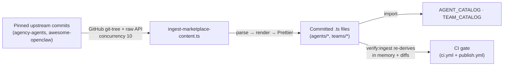

The marketplace ships a static, in-bundle catalog of **304 agents** and **82 teams**. Every entry is a committed TypeScript literal; the catalog is browsed and deployed entirely client-side, with no network fetch at runtime. Two of the agent sources (agency-agents, awesome-openclaw) and three of the team files are **codegen'd** from pinned upstream commits by `scripts/ingest-marketplace-content.ts`; the rest are hand-written. A CI gate (`pnpm verify:ingest`) re-derives the codegen'd files in memory and fails on drift.

This page documents the **schemas** (`AgentCatalogEntry`, `TeamTemplate`), the **ID prefix convention**, the **zero-loss `identityTemplate` invariant**, the **three sources + their pinned SHAs**, and the **ingestion mechanism**. It does not enumerate individual entries; browse those in the marketplace UI (the Agents / Teams tabs) or read the committed files under `apps/web/src/features/marketplace/`.

## At a glance

| Aspect                 | Value                                          | Source of truth                       |
| ---------------------- | ---------------------------------------------- | ------------------------------------- |
| Total agents           | 304                                            | `agents/index.ts` → `AGENT_CATALOG`   |
| ↳ agency-agents        | 179 (across 13 domain files)                   | `agents/agency/`                      |
| ↳ awesome-openclaw     | 110 (42 operators + 68 named)                  | `agents/awesome-openclaw/usecases.ts` |
| ↳ clawboo built-ins    | 15 (5 teams × 3 agents, synthesized at import) | `agents/clawboo/builtin.ts`           |
| Total teams            | 82                                             | `teams/index.ts` → `TEAM_CATALOG`     |
| ↳ clawboo built-in     | 5                                              | `teams/clawboo-builtin.ts`            |
| ↳ agency-workflows     | 5                                              | `teams/agency-workflows.ts`           |
| ↳ awesome-openclaw     | 42 (one per usecase)                           | `teams/awesome-openclaw.ts`           |
| ↳ synthetic excellence | 30                                             | `teams/synthetic.ts`                  |
| Codegen entry point    | `scripts/ingest-marketplace-content.ts`        | npm script `ingest:marketplace`       |
| Drift gate             | `scripts/verify-ingest.ts`                     | npm script `verify:ingest` (CI)       |
| Agent ID prefixes      | `agency-*`, `awesome-*`, `clawboo-*`           | enforced by `agentCatalog.test.ts`    |
| Zero-loss invariant    | `identityTemplate.length > 500` per entry      | `agentCatalog.test.ts`                |

<Note>
The catalog ships 304 agents and 82 teams. The unit tests assert *lower bounds* (`>= 270` agents, `>= 160` agency, `>= 40` awesome, `>= 15` clawboo) rather than exact counts, so an upstream re-ingest can grow the catalog without breaking tests.
</Note>

---

## `AgentCatalogEntry`

The first-class catalog entry for a single deployable agent. Defined in `apps/web/src/features/teams/types.ts`. Every entry across all three sources conforms to this shape.

```ts
interface AgentCatalogEntry {
  /** Globally unique id, e.g. 'agency-frontend-developer'. Prefix encodes the source. */
  id: string
  /** Display name on cards, e.g. 'Frontend Developer Boo' */
  name: string
  /** Short role label, e.g. 'Frontend Developer' */
  role: string
  emoji: string
  /** Hex accent color */
  color: string
  /** 1–2 sentence card description */
  description: string
  source: 'clawboo' | 'agency-agents' | 'awesome-openclaw'
  /** GitHub blob URL at the pinned commit (empty string for clawboo built-ins) */
  sourceUrl: string
  /** Source folder / domain (15-value union; see below) */
  domain: AgentDomain
  /** Deeper sub-folder, e.g. 'unity' within game-development */
  subDomain?: string
  category: TemplateCategory
  tags: string[]
  /** Skill ids from SKILL_CATALOG this agent uses */
  skillIds: string[]

  /** Distilled 20–40 line mission statement → written to SOUL.md on deploy */
  soulTemplate: string
  /** FULL source .md content, verbatim → written to IDENTITY.md on deploy. Zero-loss. */
  identityTemplate: string
  /** TOOLS.md body built from skillIds, e.g. '# TOOLS\n\n## Skills\n- web-search' */
  toolsTemplate: string
  /** Optional AGENTS.md routing, present when the agent appears in a team */
  agentsTemplate?: string
}
```

`AgentDomain` is a 15-value union: `academic`, `design`, `engineering`, `game-development`, `marketing`, `paid-media`, `product`, `project-management`, `sales`, `spatial-computing`, `specialized`, `support`, `testing` (the 13 agency domains), plus `openclaw` (awesome-openclaw entries) and `clawboo` (built-ins).

`TemplateCategory` is an 18-value union: `engineering`, `marketing`, `sales`, `product`, `design`, `testing`, `content`, `support`, `education`, `ops`, `devops`, `research`, `game-dev`, `spatial`, `academic`, `paid-media`, `specialized`, `general`.

### The four deploy artifacts

The four template fields map one-to-one onto the four agent files written when an agent is deployed:

| Field              | Deployed file | Content                                                              |
| ------------------ | ------------- | -------------------------------------------------------------------- |
| `soulTemplate`     | `SOUL.md`     | Distilled mission statement (extracted headings or a fallback slice) |
| `identityTemplate` | `IDENTITY.md` | The full, verbatim source `.md` body (zero-loss)                     |
| `toolsTemplate`    | `TOOLS.md`    | A `## Skills` bullet list derived from `skillIds`                    |
| `agentsTemplate`   | `AGENTS.md`   | Optional `@mention` routing, set when the agent is part of a team    |

---

## `TeamTemplate`

A deployable team, metadata plus a list of catalog agent ids. Defined in `apps/web/src/features/teams/types.ts`. First-party teams reference agents by `agentIds` (the inline `agents` array is a deprecated back-compat path kept only so hypothetical user-defined templates still type-check).

```ts
interface TeamTemplate {
  id: string
  name: string
  emoji: string
  color: string
  description: string
  category: TemplateCategory
  source: 'clawboo' | 'agency-agents' | 'awesome-openclaw'
  sourceUrl?: string
  tags: string[]
  /** @deprecated — inline agents; first-party teams use agentIds instead */
  agents?: AgentTemplate[]
  /** Catalog agent ids; resolve via resolveTeamAgents(team) */
  agentIds?: string[]
  /** Per-agent AGENTS.md routing for this team, keyed by agentId */
  routing?: Record<string, string>
  /** Full workflow prose from the source .md (e.g. an awesome-openclaw usecase body) */
  workflowNarrative?: string
  /** true for the synthetic "Excellence Team" domain clusters */
  isSynthetic?: boolean
}
```

### Resolving a team into deployable agents

`resolveTeamAgents(profile)` (in `teamCatalog.ts`) is the single consumer-facing resolver. For a first-party `TeamTemplate` it walks `agentIds`, looks each one up in `AGENT_CATALOG`, and returns a `ResolvedAgent[]` carrying the full `soulTemplate` / `identityTemplate` / `toolsTemplate` and the team-specific `agentsTemplate` (from `team.routing[agentId]`, falling back to the agent's own `agentsTemplate`). A dangling id is silently skipped; `teamCoverage.test.ts` guards against that. The resolver also handles two legacy input shapes (inline `agents`, and the deprecated `TeamProfile` with shared `skills[]`).

```ts
interface ResolvedAgent {
  id: string
  name: string
  role: string
  emoji?: string
  color?: string
  soulTemplate: string
  identityTemplate: string
  toolsTemplate: string
  agentsTemplate?: string
}
```

Hub-and-spoke `routing` for codegen'd teams is generated at ingest time: the first agent in `agentIds` is the leader, every other member routes work to `@<Leader>`, and the leader's `AGENTS.md` lists all members. This is what produces the dependency edges visible in the Ghost Graph after a team deploys.

---

## ID prefix convention

Every agent id is globally unique across sources, and its prefix encodes the source. This is enforced by `agentCatalog.test.ts` (all ids unique; prefix matches `source`).

| Source            | Prefix     | Construction                                                                                            | Example                             |
| ----------------- | ---------- | ------------------------------------------------------------------------------------------------------- | ----------------------------------- |
| agency-agents     | `agency-`  | `agency-<slug(filename)>`; game-development sub-folders prepend the sub-domain to avoid collisions      | `agency-frontend-developer`         |
| awesome-openclaw  | `awesome-` | `awesome-<usecaseSlug>-operator` (one per usecase) or `awesome-<usecaseSlug>-<roleSlug>` (named agents) | `awesome-ai-video-editing-operator` |
| clawboo built-ins | `clawboo-` | `clawboo-<teamId>-<slug(agentName)>`                                                                    | `clawboo-dev-code-reviewer-boo`     |

Team ids follow source-specific patterns (e.g. `agency-workflow-startup-mvp`, `awesome-<usecaseSlug>`, `<domain>-excellence-<n>`) but are not prefix-constrained the way agent ids are.

---

## Zero-loss `identityTemplate` invariant

The defining property of the catalog: **every entry's `identityTemplate` is the full, verbatim source content**, never a condensed summary. For the two upstream sources it is the exact `.md` file body fetched at the pinned commit; for clawboo built-ins it is a synthesized manifest combining role + soul + identity + tools + routing under headings. `soulTemplate` is the shorter distilled version written to `SOUL.md`.

The hard guarantee, asserted for every entry by `agentCatalog.test.ts`:

```ts
expect(e.identityTemplate.length).toBeGreaterThan(500)
```

This is what lets the agent-detail modal render the entire original spec before deploy, and what makes a deploy lossless; `IDENTITY.md` receives the source content byte-for-byte (clawboo built-ins receive the synthesized manifest, which is structured around the original fields, not lossy of them).

---

## Sources

The catalog draws from three sources, all MIT-licensed and (for the two upstream repos) pinned to a fixed commit so ingestion is deterministic. Attribution lives in `THIRD_PARTY_NOTICES.md`.

| Source                    | `source` value     | Count                              | Upstream repo                                      | Pinned commit                              |
| ------------------------- | ------------------ | ---------------------------------- | -------------------------------------------------- | ------------------------------------------ |
| agency-agents             | `agency-agents`    | 179 agents                         | `github.com/msitarzewski/agency-agents`            | `64eee9f8e04f69b04e78e150d771a443c64720be` |
| awesome-openclaw-usecases | `awesome-openclaw` | 110 agents (from 42 usecase files) | `github.com/hesamsheikh/awesome-openclaw-usecases` | `659895e58e2105c6db8fbef39f446c8a786a480c` |
| clawboo built-ins         | `clawboo`          | 15 agents                          | first-party (local TS)                             | n/a (local)                                |

The pinned SHAs are constants in `scripts/lib/ingest-helpers.ts` (`AGENCY_AGENTS_SHA`, `AWESOME_OPENCLAW_SHA`); both the ingest and verify scripts import them, and every generated entry's `sourceUrl` is a GitHub blob URL at the pinned commit.

### agency-agents (179 agents)

13 domain `.md` collections fetched from the repo tree at the pinned SHA, one committed file per domain under `agents/agency/`:

| Domain file           | Agents | Domain file             | Agents |
| --------------------- | ------ | ----------------------- | ------ |
| `academic.ts`         | 5      | `project-management.ts` | 6      |
| `design.ts`           | 8      | `sales.ts`              | 8      |
| `engineering.ts`      | 29     | `spatial-computing.ts`  | 6      |
| `game-development.ts` | 20     | `specialized.ts`        | 41     |
| `marketing.ts`        | 30     | `support.ts`            | 6      |
| `paid-media.ts`       | 7      | `testing.ts`            | 8      |
| `product.ts`          | 5      |                         |        |

`agents/agency/index.ts` concatenates all 13 arrays into `AGENCY_AGENTS`.

### awesome-openclaw (110 agents)

110 entries extracted from **42 usecase `.md` files**: a guaranteed per-usecase `*-operator` entry (42), plus named role/phase agents parsed from each usecase body (68). The named-agent extraction runs five regex passes over each file (`### Agent N: Name (Role)`, `### Name Agent`, `**Name Agent**` bold, and two passes scoped to the `## What It Does` section), de-duped per file by role slug. All entries land in `agents/awesome-openclaw/usecases.ts` (exported `AWESOME_OPENCLAW_USECASES`), re-exported as `AWESOME_OPENCLAW_AGENTS`.

### clawboo built-ins (15 agents)

15 first-class agents, **synthesized at import time** (not literal `id:` strings in a generated file). `agents/clawboo/builtin.ts` is hand-written: it imports the five built-in `TeamTemplate` literals from `agents/clawboo/sources/{dev,marketing,research,student,youtube}.ts` and runs each team's three inline `AgentTemplate`s through `fromInlineAgent()`, which:

- mints `id = clawboo-<teamId>-<slug(agentName)>`,
- preserves `name` / `role` / `soulTemplate` / `toolsTemplate` / `agentsTemplate` verbatim,
- synthesizes `identityTemplate` from the full set of fields under headings (so `length > 500` holds), and
- extracts `skillIds`, filtered against `SKILL_CATALOG` so only real catalog skill ids survive.

The result is exported as `CLAWBOO_BUILTIN_AGENTS` → `CLAWBOO_AGENTS`. This file is hand-written because the source is local TS with path-alias imports the ingest script cannot resolve, so it is **not** covered by `verify:ingest`.

### Teams (82)

| Team file                   | Teams | Generated?   | Routing                                                                                                       |
| --------------------------- | ----- | ------------ | ------------------------------------------------------------------------------------------------------------- |
| `teams/clawboo-builtin.ts`  | 5     | hand-written | preserved from the source `TeamTemplate` literals                                                             |
| `teams/agency-workflows.ts` | 5     | codegen      | hub-spoke; `workflowNarrative` = full example body                                                            |
| `teams/awesome-openclaw.ts` | 42    | codegen      | hub-spoke; one team per usecase, members grouped by usecase slug                                              |
| `teams/synthetic.ts`        | 30    | codegen      | hub-spoke; partitions of agency agents not covered by a workflow team, chunked by domain, `isSynthetic: true` |

The 30 synthetic "Excellence Teams" exist so that **every agency agent appears in at least one team**; the ingest script excludes workflow-covered agents, then partitions the remainder into per-domain clusters. `teams/index.ts` concatenates all four arrays into `TEAM_CATALOG` (it is hand-written and not verified, but the three generated arrays it imports are).

---

## Ingestion mechanism

The catalog is **committed codegen**, not a runtime fetch, and not hand-maintained line-by-line. The chosen trade-off: a runtime fetch would break offline-first installs; hand-writing ~300-line entries × hundreds of agents is error-prone; committed codegen is auditable in PR diffs and reproducible.



### Regenerate

```bash
pnpm ingest:marketplace   # → tsx scripts/ingest-marketplace-content.ts
```

The script fetches both repos' git trees at the pinned SHAs, downloads the raw `.md` files (concurrency 10), processes each into entries, and writes **codegen'd files**: 13 agency domain files + `agency/index.ts` + `awesome-openclaw/usecases.ts` + `awesome-openclaw/index.ts` + `agents/index.ts`, plus the three team files (`agency-workflows.ts`, `awesome-openclaw.ts`, `synthetic.ts`). Every write goes through a `writeFormatted()` helper that runs Prettier (`parser: 'typescript'`, repo config) before flushing; without it the raw renderers emit double-quoted single-line strings that would drift against the formatted committed files.

The clawboo built-ins (`agents/clawboo/*`), `teams/clawboo-builtin.ts`, and `teams/index.ts` are **not** part of the ingest pipeline; they are hand-written.

### Verify (the CI gate)

```bash
pnpm verify:ingest   # → tsx scripts/verify-ingest.ts
```

`verify-ingest.ts` re-runs the same render pipeline in memory, normalizes **both** the freshly-generated content and the committed file through Prettier with the same config, and compares. It exits `1` on any mismatch (printing a short line diff) and `0` when all generated files are current. Hand-written files are skipped.

The gate runs in two places:

- **`ci.yml`**: a dedicated `verify-ingest` job, parallel to `lint` / `typecheck` / `test` / `build`. Drift blocks PR merge.
- **`publish.yml`**: a `pnpm verify:ingest` step before `pnpm build`. Drift blocks releases.

Both the ingest renderers and the verifier share the logic in `scripts/lib/ingest-helpers.ts`, so they cannot diverge.

<Info>
Generated catalog files carry an `// AUTO-GENERATED — do not edit manually` header. Editing one by hand will be caught by `verify:ingest`. To change catalog content, bump the pinned SHA in `scripts/lib/ingest-helpers.ts` and re-run `pnpm ingest:marketplace`.
</Info>

## See also

- [Marketplace (UI: browse & deploy)](/using/marketplace)
- [Teams API](/reference/rest-api/teams)
- [Agents API](/reference/rest-api/agents)
- [Codegen & ingestion (internals)](/internals/codegen-and-ingestion)
- [The agent model](/concepts/agent-model)
- [Glossary](/appendices/glossary)
