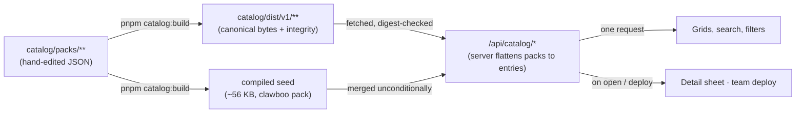

The marketplace ships a catalog of **436 agents** and **85 teams**, organised as **nineteen packs**: JSON documents under the repository's top-level `catalog/` folder. Packs are not compiled into the app and are not in the npm tarball. The dashboard fetches them at runtime through its own API, verifies each pack against a published digest, and renders from a thin browse index.

One pack is different. The **seed** (`catalog/packs/clawboo/builtin`, the five built-in teams and their fifteen agents) is compiled into the build, and the index endpoint merges it unconditionally. That is what makes first-run onboarding work with no network at all.

This page documents the **pack format**, the **layout of `catalog/`**, the **fetch and verification path**, the **seed**, and the **content gates**. It does not enumerate individual entries; browse those in the marketplace UI (the Agents / Teams tabs) or read the committed packs.

## At a glance

| Aspect                              | Value                                                                                                                                                                                                                                                             | Source of truth                                                                |
| ----------------------------------- | ----------------------------------------------------------------------------------------------------------------------------------------------------------------------------------------------------------------------------------------------------------------- | ------------------------------------------------------------------------------ |
| Total packs                         | 19                                                                                                                                                                                                                                                                | `catalog/catalog.config.json`                                                  |
| Total agents                        | 436                                                                                                                                                                                                                                                               | `catalog/packs/*/*/pack.json`                                                  |
| ↳ agency-agents                     | 116                                                                                                                                                                                                                                                               | `catalog/packs/agency/agents/`                                                 |
| ↳ wshobson-agents                   | 97                                                                                                                                                                                                                                                                | `catalog/packs/wshobson/agents/`                                               |
| ↳ clawboo-home                      | 35                                                                                                                                                                                                                                                                | `catalog/packs/clawboo/home/`                                                  |
| ↳ coreyhaines-growth-marketing      | 26                                                                                                                                                                                                                                                                | `catalog/packs/coreyhaines/growth-marketing/`                                  |
| ↳ voltagent-subagents               | 24                                                                                                                                                                                                                                                                | `catalog/packs/voltagent/subagents/`                                           |
| ↳ alirezarezvani-business-desk      | 18                                                                                                                                                                                                                                                                | `catalog/packs/alirezarezvani/business-desk/`                                  |
| ↳ clawboo built-ins                 | 15                                                                                                                                                                                                                                                                | `catalog/packs/clawboo/builtin/`                                               |
| ↳ clawboo-founder-sprint            | 14                                                                                                                                                                                                                                                                | `catalog/packs/clawboo/founder-sprint/`                                        |
| ↳ craighewitt-creator-ops           | 14                                                                                                                                                                                                                                                                | `catalog/packs/craighewitt/creator-founder-ops/`                               |
| ↳ calesthio-generative-media        | 12                                                                                                                                                                                                                                                                | `catalog/packs/calesthio/generative-media/`                                    |
| ↳ charliehills-creator-studio       | 12                                                                                                                                                                                                                                                                | `catalog/packs/charliehills/creator-studio/`                                   |
| ↳ mattpocock-craft                  | 12                                                                                                                                                                                                                                                                | `catalog/packs/mattpocock/engineering-craft/`                                  |
| ↳ phuryn-product-craft              | 12                                                                                                                                                                                                                                                                | `catalog/packs/phuryn/product-craft/`                                          |
| ↳ agricidaniel-repurpose            | 8                                                                                                                                                                                                                                                                 | `catalog/packs/agricidaniel/repurpose/`                                        |
| ↳ google-ads-analytics              | 7                                                                                                                                                                                                                                                                 | `catalog/packs/google/ads-and-analytics/`                                      |
| ↳ thatrebeccarae-lifecycle-commerce | 6                                                                                                                                                                                                                                                                 | `catalog/packs/thatrebeccarae/lifecycle-commerce/`                             |
| ↳ kgelster-storefront-catalog       | 5                                                                                                                                                                                                                                                                 | `catalog/packs/kgelster/storefront-catalog/`                                   |
| ↳ blackforestlabs-visual-direction  | 2                                                                                                                                                                                                                                                                 | `catalog/packs/blackforestlabs/visual-direction/`                              |
| ↳ heygen-presenter-video            | 1                                                                                                                                                                                                                                                                 | `catalog/packs/heygen/presenter-video/`                                        |
| Total teams                         | 85 (24 wshobson, 10 clawboo-home, 5 each agency / voltagent / clawboo / coreyhaines, 4 each founder-sprint / craighewitt / alirezarezvani / calesthio, 3 each mattpocock / charliehills / phuryn, 2 each agricidaniel / thatrebeccarae, 1 each google / kgelster) | seventeen of the nineteen packs; blackforestlabs and heygen ship no teams      |
| Pack-declared skills                | 45 across 7 packs, merged over the 44 built-in skills                                                                                                                                                                                                             | `catalog/packs/*/*/pack.json` + `apps/web/src/features/marketplace/catalog.ts` |
| Browse index                        | `catalog/dist/v1/index.json` (~275 KB, card fields only)                                                                                                                                                                                                          | `scripts/catalog/build-index.ts`                                               |
| Pack bundles                        | `catalog/dist/v1/packs/<publisher>/<slug>/<version>.json`                                                                                                                                                                                                         | the same script                                                                |
| Compiled seed                       | ~56 KB, the clawboo pack only                                                                                                                                                                                                                                     | `scripts/catalog/build-seed.ts`                                                |
| Served at                           | `/api/catalog/index`, `/api/catalog/{agents,teams}/:id`                                                                                                                                                                                                           | `apps/web/server/api/catalog.ts`                                               |
| Content gate                        | `pnpm catalog:verify`                                                                                                                                                                                                                                             | `scripts/catalog/validate.ts`                                                  |
| Byte budgets                        | seed under 128 KB, index under 512 KB                                                                                                                                                                                                                             | `scripts/catalog/budget.mjs`                                                   |
| Agent ID prefixes                   | `adsapi-*`, `agency-*`, `bizdesk-*`, `clawboo-*`, `craft-*`, `creatorkit-*`, `creatorops-*`, `genmedia-*`, `growth-*`, `home-*`, `lifecycle-*`, `pmcraft-*`, `presenter-*`, `repurpose-*`, `shopcat-*`, `sprint-*`, `visdir-*`, `voltagent-*`, `wshobson-*`       | enforced by the pack format and `validate.ts`                                  |
| Body invariants                     | no YAML frontmatter, no truncated description                                                                                                                                                                                                                     | `validate.ts` + `agentCatalog.test.ts`                                         |
| Content denylist                    | no competing registry, installer, or invite                                                                                                                                                                                                                       | `validate.ts` + `agentCatalog.test.ts`                                         |

<Note>
The unit tests assert _lower bounds_ (`>= 100` agents, `>= 90` agency, `>= 15` clawboo, `>= 10` teams) rather than exact counts, so adding an entry does not break a test. The quality assertions are the exact ones.
</Note>

---

## Where the content lives

```
catalog/                                 not a pnpm workspace member, not in any turbo task
  catalog.config.json                    which packs exist, and where the index is served
  schema/pack.schema.json                the PUBLIC pack specification (JSON Schema 2020-12)
  schema/index.schema.json               the PUBLIC browse-index specification
  packs/<publisher>/<slug>/
    pack.json                            manifest + listings; each listing points at a body
    agents/<slug>.json                   one agent document set
    teams/<slug>.json                    one team body
    NOTICE.md                            required when provenance.repo is set
  dist/v1/index.json                     GENERATED, COMMITTED
  dist/v1/packs/<publisher>/<slug>/<version>.json
                                         GENERATED, COMMITTED
```

`catalog/` sits outside the workspace deliberately. A pull request that adds a pack is content, not code, and putting it through `turbo lint`, `turbo typecheck` and `turbo test` buys nothing. `website/` has the same posture. The CI consequence is described under [Content pull requests](#content-pull-requests).

**`catalog/dist/` is committed.** That is what makes the fallback URL work with zero infrastructure: a raw `githubusercontent.com` URL against `main` serves the same bytes a CDN would, with no deploy step between merging a pack and it being installable.

---

## The pack format

`packages/pack-format` is the TypeScript home of the versioned pack shape: the v1 types, the zod validators, the version ladder, and `parseAgentPack`. It is `private: true` and never published - the artifact meant for the outside world is the **specification**, committed as JSON Schema 2020-12:

| File                               | Describes                                                       |
| ---------------------------------- | --------------------------------------------------------------- |
| `catalog/schema/pack.schema.json`  | A whole pack: manifest, provenance, agent/team listings, bodies |
| `catalog/schema/index.schema.json` | The merged browse index served at `/api/catalog/index`          |

A third party writes a pack against those two files and installs nothing.

### The manifest

```ts
interface PackManifest {
  /** FIRST key, an integer, the dispatch key for the version ladder. */
  schemaVersion: 1
  id: SourceId
  /** Entry-id prefix. Defaults to `id`. Keeps 'agency-agents' emitting 'agency-'. */
  idPrefix?: string
  name: string
  description: string
  /** Exact semver of the CONTENT. Ranges ('^1.2.3', '1.x') are rejected. */
  version: string
  provenance: Provenance
  counts: { agents: number; teams: number; skills: number }
  /** Reviewable line in the content PR when a pack introduces a taxonomy value. */
  newCategories?: string[]
  /** Former id -> current id, or null if removed. NOT schema migration. */
  renames?: Record<string, string | null>
}
```

`provenance` lives **once per pack** and replaces the per-entry `source` + `sourceUrl` pair the old TypeScript catalog carried: `sourceId`, `label`, `color`, `repo`, `ref` (the pinned commit), `license`, `authors`, `adaptation`, and `importedAt`. An entry whose upstream differs from the pack's can override it with an `origin` block.

A pack that sets `provenance.repo` must ship a `NOTICE.md`. The SPDX id on its own is a claim with nothing behind it, so `pnpm catalog:verify` fails without the notice.

### Listings and bodies

A **listing** is what a card renders. A **body** is what a detail sheet or a deploy needs. They are separate files because `IDENTITY.md` and `SOUL.md` are the overwhelming majority of the bytes and no card reads either one.

```ts
interface AgentListing {
  id: string // `${idPrefix ?? id}-${slug}`, globally unique, flat kebab-case
  packId: SourceId
  slug: string
  name: string
  role: string
  emoji: string
  color: string // #RRGGBB
  description: string
  category: CategoryId
  tags: string[]
  skillIds: string[]
  body: string // relative path to this entry's AgentBody document
  origin?: EntryOrigin
  suggestedRuntime?: string
}

interface AgentBody {
  id: string
  /** SOUL.md and IDENTITY.md required; TOOLS.md and AGENTS.md optional. */
  files: Record<string, string>
}
```

A team listing denormalises its roster, so a card renders member count and roles with no body fetch:

```ts
interface TeamListing {
  id: string
  packId: SourceId
  slug: string
  name: string
  emoji: string
  color: string
  description: string
  category: CategoryId
  tags: string[]
  members: { agentId: string; name: string; role: string }[]
  body: string
  origin?: EntryOrigin
  defaultRuntime?: string
}

interface TeamBody {
  id: string
  workflowNarrative?: string
  /** Per-member AGENTS.md routing content, keyed by agent id. */
  routing?: Record<string, string>
}
```

`files` is a **map, not named fields**, so adding a fifth agent file is a no-op for every reader instead of a shape change each one has to follow.

**The deploy path overlays on this map; it does not pass it through.** `AGENTS.md` and `CLAWBOO.md` are synthesized per-deploy from the team topology (`lib/teamProtocol.ts`) and never exist in a pack, and `IDENTITY.md` is rewritten with the agent's final, deduped name. `AgentFiles` and `toFilePayload` in `lib/createAgent.ts` are unchanged for exactly that reason: handing the pack's map straight to `createAgent` would drop the team protocol docs the orchestration contract depends on.

### Skills

An agent's `skillIds` resolve against the **merged registry**: the host's `BUILTIN_SKILLS` plus whatever the pack's own `skills` array adds. A pack may reference a builtin without redeclaring it, and must **not** redeclare one - the builtin wins the merge, so the copy would be silently discarded (`assertNoBuiltinSkillCollision`). Seven packs declare skills of their own, 45 in total; the other twelve, including both first-party packs, ship `skills: []`.

pack-format cannot see the host registry, so this reference check lives where the registry does: `scripts/catalog/validate.ts` in the repo, `buildSkillRegistry` at runtime.

### The two open unions

`SourceId` and `CategoryId` are **open unions**, re-exported into the app as `TemplateSource` and `TemplateCategory`:

```ts
type Open<K extends string> = K | (string & {})
type SourceId = Open<'clawboo' | 'agency-agents'>
type CategoryId = Open<
  | 'academic'
  | 'content'
  | 'design'
  | 'devops'
  | 'education'
  | 'engineering'
  | 'game-dev'
  | 'general'
  | 'marketing'
  | 'ops'
  | 'paid-media'
  | 'product'
  | 'project-management'
  | 'research'
  | 'sales'
  | 'spatial'
  | 'specialized'
  | 'support'
  | 'testing'
>
```

The listed values autocomplete; any other string is legal, because a third-party pack must be able to bring a pack id or a category without a Clawboo release.

The cost is that `Record<TemplateSource, …>` and `Record<TemplateCategory, …>` are no longer exhaustive maps. Nothing indexes one directly any more. Display metadata resolves through two **total** functions in `features/marketplace/registry.ts`:

- `metaFor(categoryId)` → `{ label, color }`, falling back to a title-cased label and a deterministic colour drawn from a 12-entry hex palette.
- `sourceMetaFor(packId)` → the same for a pack.

Both always return a value and the colour is always `#RRGGBB`, because the cards build alpha variants by string concatenation (`${color}18`). The predecessors of these functions were `TEMPLATE_CATEGORIES`, `SOURCE_META`, and `AGENT_DOMAIN_META`; an unguarded index on the last of those white-screened the Agents tab on an unrecognised value.

The counterweight to an open taxonomy is the manifest's `newCategories`: a pack that introduces a category outside `KNOWN_CATEGORY_META` must declare it there, so a typo'd `enginering` becomes a reviewable line in the content PR rather than a silent 20th filter chip.

### The version ladder

Every pack declares an integer `schemaVersion` as its first key, and it is **never assumed**. `MIN_SUPPORTED_SCHEMA_VERSION` and `CURRENT_SCHEMA_VERSION` are both `1` today, and `UPGRADES` is deliberately empty - there is one version, so there is nothing to upgrade. The scaffold exists now so that adding v2 is "write the upgrade and add two entries" rather than inventing a migration story under deadline.

`parseAgentPack(raw, { staleVersionPolicy })` never throws on bad input; it returns a result, so a caller can **reject the pack and keep the catalog**. That matters because onboarding renders `SelectTeamStep` with `allowStartFromScratch={false}`: an empty catalog bricks first-run, so one malformed third-party pack must not be able to empty it. Its six reject paths:

| Code                                | Behaviour                                                                           |
| ----------------------------------- | ----------------------------------------------------------------------------------- |
| `missing-schema-version`            | Hard reject. Never defaults to 1.                                                   |
| `schema-version-not-an-integer`     | Hard reject (`"1"` and `1.0.0` are the two spellings people reach for).             |
| `schema-version-too-new`            | Hard reject, names the supported range, says to upgrade Clawboo.                    |
| `schema-version-too-old`            | Hard reject, says to re-publish the pack at the current version.                    |
| `invalid-at-declared-version`       | Validation runs at the DECLARED version first, so issues point at what was written. |
| `upgrade-produced-invalid-document` | Self-check after the chain: a corrupt pack becomes a caught error, not an install.  |

`staleVersionPolicy` is `'allow'` at host runtime, `'warn'` at a future publish endpoint, and `'error'` in the repo gate. **It defaults to `'allow'`**, which means a call site that forgets to pass it silently permits stale content rather than failing loudly.

---

## Serving, fetching, verifying


```mermaid
flowchart LR
  P["catalog/packs/**<br/>(hand-edited JSON)"] -->|"pnpm catalog:build"| D["catalog/dist/v1/**<br/>(canonical bytes + integrity)"]
  P -->|"pnpm catalog:build"| S["compiled seed<br/>(~56 KB, clawboo pack)"]
  D -->|"fetched, digest-checked"| API["/api/catalog/*<br/>(server flattens packs to entries)"]
  S -->|"merged unconditionally"| API
  API -->|"one request"| G["Grids, search, filters"]
  API -->|"on open / deploy"| B["Detail sheet · team deploy"]
```

### Three tiers, in order

`apps/web/server/lib/catalogIndex.ts` resolves the index:

1. **The local filesystem.** If `catalog/dist/v1/` exists above the server module, it is used verbatim. A repo checkout, a fresh branch, and `pnpm dev` therefore work with no network - including on a branch whose catalog has never been pushed anywhere.
2. **`CLAWBOO_CATALOG_INDEX_URL`.** An operator override.
3. **The default URL**, a raw `githubusercontent.com` path against `main`.

<Note>
`CLAWBOO_CATALOG_INDEX_URL` is **not a feature flag** - Clawboo has none. It is an *endpoint override*, the same class of setting as `CLAWBOO_ALLOWED_ORIGINS`: both tiers serve the identical generated file, so there is no behavioural fork, only a different host.
</Note>

The fetch is timeout-bounded at 5 s, sends `If-None-Match`, caches for 6 hours in memory, and **never throws**. Offline, firewalled, 404, corrupt bytes - every one of them returns the seed.

### The index is mutable, each row is immutable

`index.json` is rewritten on every build. Each `packs[]` row inside it names one immutable bundle by version and carries `integrity`, a `sha256-<base64>` value computed over that bundle's exact bytes.

**The integrity value is the trust anchor, not the URL.** The server recomputes the digest over the bytes it received and compares it **before `JSON.parse` ever sees them**. Bytes that fail are discarded unparsed. Verified bundles are cached on disk at `~/.clawboo/catalog/<hash>.json`, keyed by integrity - a sha-pinned raw URL still only advertises `max-age=300`, so this cache, not the CDN, is what makes a second launch free.

### Hashing rule

Bundles and the index are emitted as **canonical bytes**: keys sorted recursively, no insignificant whitespace, LF, and no trailing newline. Those exact bytes are written, served, and hashed.

This is deliberately different from the retired ingest manifest, which hashed a _Prettier-canonical_ form. It had to: its inputs were TypeScript files a pre-commit hook restyles. A pack bundle has no formatter round-trip - it is generated, committed, fetched, and verified by a client that has never seen Prettier. `.prettierignore` already matches `catalog/dist/` through its `**/dist/` entry, and that exclusion is load-bearing rather than incidental.

Pack **source** under `catalog/packs/**` is the opposite: hand-edited, reviewed in a diff, and therefore Prettier-formatted like any other JSON in the repo. Only `dist/` is canonical.

### Compatibility

An index whose top-level `schemaVersion` is newer than the build reads shows the **seed only**, plus one quiet log line. A single **pack** the build cannot read drops out and the rest of the catalog renders. That lets a v2 pack shape and v1 packs coexist in one index.

### The three routes

| Route                         | Answers with                                               |
| ----------------------------- | ---------------------------------------------------------- |
| `GET /api/catalog/index`      | Browse rows for the seed union every pack that verified    |
| `GET /api/catalog/agents/:id` | One agent's `files` map, plus `sourceUrl` from the listing |
| `GET /api/catalog/teams/:id`  | One team's `workflowNarrative` and `routing`               |

All three are same-origin, so the existing origin guard covers them unchanged. The pack bundle stays the distribution and integrity unit; the server flattens it to entries so the browser needs no integrity logic, no second origin, and no knowledge that packs exist.

---

## The seed

`SelectTeamStep` renders with `allowStartFromScratch={false}`. An empty catalog is therefore not a degraded browse experience, it is a first run with nothing to click. So the builtin pack ships in the binary.

`scripts/catalog/build-seed.ts` generates it into two places, from one pass over the same bytes:

| File                                                      | Consumer           |
| --------------------------------------------------------- | ------------------ |
| `apps/web/src/features/marketplace/seed/{index,packs}.ts` | the browser SPA    |
| `apps/web/server/lib/catalogSeed.ts`                      | the Express server |

Two copies because `apps/web/server` and `apps/web/src` are separate build targets and an eslint boundary forbids either importing the other. `pnpm catalog:verify` fails if either drifts from the pack.

Both are **generated and committed**. Never edit them by hand.

The payload is one JSON string constant rather than an object literal: it is agent prose, so a literal is a file Prettier reflows on every regeneration and a reviewer cannot read, while a string constant diffs as a single line and V8 parses it faster.

---

## Resolving a team into deployable agents

`resolveTeamAgents(index, profile, routing?)` (in `teamCatalog.ts`) is the single consumer-facing resolver. For a first-party team it walks `agentIds`, fetches each member's body, and returns a `ResolvedAgent[]` carrying the merged `files` map - with the team's `routing[agentId]` already overlaid onto `AGENTS.md`. A dangling id is silently skipped; `teamCoverage.test.ts` guards against that. The resolver also handles two legacy input shapes (inline `agents`, and the deprecated `TeamProfile` with shared `skills[]`).

```ts
interface ResolvedAgent {
  id: string
  name: string
  role: string
  emoji?: string
  color?: string
  files: Record<string, string>
}
```

The member bodies are fetched through one `Promise.all` **before** the deploy step begins. That is deliberate: doing it inside the per-agent creation loop would turn a 12-agent deploy into 12 serial fetches with a partial-failure mode halfway through creating a team.

The agency workflow teams use hub-and-spoke `routing`: the first member is the leader, every other member routes work to `@<Leader>`, and the leader's `AGENTS.md` lists all members. This is what produces the dependency edges visible in the Ghost Graph after a team deploys. Two gates keep it honest: every team names at least two members, and every member has routing.

---

## ID prefix convention

Every entry id is globally unique across packs, and its prefix is the pack's `idPrefix ?? id`. The pack format states it as `id === \`${prefix}-${slug}\``; `validate.ts` adds the cross-pack half - no two packs may emit the same prefix, and no two packs may claim the same id.

| Pack              | Prefix     | Example                                 |
| ----------------- | ---------- | --------------------------------------- |
| agency-agents     | `agency-`  | `agency-engineering-frontend-developer` |
| clawboo built-ins | `clawboo-` | `clawboo-dev-code-reviewer-boo`         |
| founder sprint    | `sprint-`  | `sprint-founder-partner`                |

<Note>
The five builtin team ids gained their pack prefix in this move: `dev` became `clawboo-dev`, `marketing` became `clawboo-marketing`, and so on. The old ids are recorded in the clawboo pack's `renames` map, which is entry bookkeeping and not schema migration. A team row stored before the rename keeps its old `templateId`; nothing reads it for behaviour.
</Note>

Agent _names_ are unique across the whole catalog, which is what lets an `@mention` in a team's routing resolve to exactly one agent.

---

## The `IDENTITY.md` invariant

**Every entry's `IDENTITY.md` is that agent's complete instruction body**, never a condensed summary and never an excerpt. What the agent-detail modal renders is exactly what is written on deploy, so you read the whole spec before you commit to it.

Adapted, not verbatim. Every entry drawn from an upstream repository was pruned, renamed, re-described, and re-formatted; the upstream YAML frontmatter is stripped, because the listing already stores `name`, `description`, `emoji`, and `color` as structured fields and feeding them back in as prompt text was pure waste. `SOUL.md` is the shorter distilled version.

`scripts/catalog/validate.ts` holds one rule per defect the old ingest pass produced: no body opens with `---`, no description ends in an ellipsis, no body exceeds 50,000 characters, no entry repeats a tag. It also scans every string in every listing and body against a denylist of competing registries, competing installers, and chat invites, and runs the full prompt-injection evaluation over each field a deploy would write.

---

## Sources

Attribution lives in `THIRD_PARTY_NOTICES.md` and in each pack's `NOTICE.md`.

| Pack                         | `id`                                | Count                        | Upstream repo                                        | Pinned commit                              | License    |
| ---------------------------- | ----------------------------------- | ---------------------------- | ---------------------------------------------------- | ------------------------------------------ | ---------- |
| agency-agents                | `agency-agents`                     | 116 agents, 5 workflow teams | `github.com/msitarzewski/agency-agents`              | `64eee9f8e04f69b04e78e150d771a443c64720be` | MIT        |
| wshobson-agents              | `wshobson-agents`                   | 97 agents, 24 teams          | `github.com/wshobson/agents`                         | `d82998e7df393c671ede2387a8435075f0b633f5` | MIT        |
| clawboo life and home        | `clawboo-home`                      | 35 agents, 10 teams          | first-party                                          | n/a                                        | MIT        |
| growth marketing             | `coreyhaines-growth-marketing`      | 26 agents, 5 teams, 9 skills | `github.com/coreyhaines31/marketingskills`           | `b1aaa3619e747f4a836c61e03084c4a531de1262` | MIT        |
| voltagent subagents          | `voltagent-subagents`               | 24 agents, 5 teams           | `github.com/VoltAgent/awesome-claude-code-subagents` | `c9e51ec0b3d43f5dcdd0b558a6cd28ba6ada97c1` | MIT        |
| business and compliance desk | `alirezarezvani-business-desk`      | 18 agents, 4 teams           | `github.com/alirezarezvani/claude-skills`            | `19392f7a08264ed00486a251f5b2098321771f94` | MIT        |
| clawboo built-ins            | `clawboo`                           | 15 agents, 5 teams           | first-party                                          | n/a                                        | MIT        |
| founder sprint               | `clawboo-founder-sprint`            | 14 agents, 4 teams           | `github.com/garrytan/gstack`                         | `394db326f2d3aaccd4804fe846b82aaa7d189dee` | MIT        |
| creator and founder ops      | `craighewitt-creator-ops`           | 14 agents, 4 teams           | `github.com/TheCraigHewitt/skills`                   | `fdbf39b61fbc8cb7cea67949bfb5e8fc567bbc51` | MIT        |
| generative media production  | `calesthio-generative-media`        | 12 agents, 4 teams, 9 skills | `github.com/calesthio/generative-media-skills`       | `8c85352d5d75d4dcbe58480bd138e37b9742bab1` | MIT        |
| creator studio               | `charliehills-creator-studio`       | 12 agents, 3 teams           | `github.com/charlie947/social-media-skills`          | `d2e948719eafc8ed9e2436357ad18489bb371a81` | MIT        |
| engineering craft            | `mattpocock-craft`                  | 12 agents, 3 teams, 7 skills | `github.com/mattpocock/skills`                       | `6654f6b60cd9d5be8b54c6fafe44346dabeb3b76` | MIT        |
| product craft                | `phuryn-product-craft`              | 12 agents, 3 teams           | `github.com/phuryn/pm-skills`                        | `18468a95b427e70e258b51389796367c6f684e7d` | MIT        |
| content repurposing          | `agricidaniel-repurpose`            | 8 agents, 2 teams            | `github.com/AgriciDaniel/claude-repurpose`           | `669187e2b69ef3c854d149657b7fb2483263dab4` | MIT        |
| ads and analytics            | `google-ads-analytics`              | 7 agents, 1 team             | `github.com/google/skills`                           | `0dad3f947e45a736060e524bbefa3eab692809f9` | Apache-2.0 |
| lifecycle commerce           | `thatrebeccarae-lifecycle-commerce` | 6 agents, 2 teams, 7 skills  | `github.com/thatrebeccarae/claude-marketing`         | `a8a63ec1341f05ec9c1e9cb52b4edeb14e3bdcba` | MIT        |
| storefront catalog ops       | `kgelster-storefront-catalog`       | 5 agents, 1 team, 6 skills   | `github.com/kgelster/awesome-ecom-skills`            | `0b6f9e51b4a14b030ab52a2f1ff8a320bdc50070` | MIT        |
| image and shot direction     | `blackforestlabs-visual-direction`  | 2 agents, 4 skills, no teams | `github.com/black-forest-labs/skills`                | `8907d515b0ac270a988ec7a239add81ee13d6cba` | MIT        |
| presenter video studio       | `heygen-presenter-video`            | 1 agent, 3 skills, no teams  | `github.com/heygen-com/skills`                       | `1bd5e4d33a028dfed3abf504c5e3dd644fb9ea8a` | MIT        |

Every pack records its upstream repository and pinned commit in its own `provenance` block. Most adapted entries additionally carry an `origin.url`: a GitHub blob URL at that pinned commit, so the entry can be compared against what it was derived from. Entries written from scratch carry `origin.adaptation: "original"` instead, and the `wshobson-agents` pack records provenance at the pack level only. The pin is historical provenance, not an automated dependency: nothing re-fetches it.

---

## Content pull requests

A pull request that touches only `catalog/` skips the full CI matrix and runs `.github/workflows/catalog-ci.yml` instead: roughly two minutes rather than roughly fifty. The `filter` job in `ci.yml` makes that decision, with one deliberate carve-out - a change under `catalog/packs/clawboo/**` alters bytes that ship in the tarball, so it is a product change and gets the full matrix.

<Warning>
`catalog-ci.yml` must **never** be a branch-protection required check. It is paths-filtered, so on a PR that touches no catalog file it never reports, and GitHub treats a required check that never reports as pending forever. The `catalog-verify` job in `ci.yml` runs the same command on every code PR; that is the one to require.
</Warning>

### Adding or editing a pack

```bash
# edit catalog/packs/<publisher>/<slug>/**
pnpm catalog:build     # regenerate catalog/dist and the compiled seed
pnpm catalog:verify    # every content rule, then "is dist current?"
```

Commit the regenerated `catalog/dist/**` and, if you touched the seed pack, the regenerated seed modules. `catalog:verify` fails when they are not byte-for-byte what a rebuild would write, which is what keeps committed generated output honest.

### Guards

- `scripts/catalog/validate.ts` - schema, licence and NOTICE, referential integrity, quality rules, taxonomy declarations, denylist, injection scan.
- `scripts/catalog/budget.mjs` - the seed under 128 KB, the index under 512 KB.
- `catalogDist.test.ts` - the committed index matches the packs, and each bundle's bytes hash to the integrity the index publishes.
- `scripts/check-entry-chunk.mjs` - post-build, by value: a seed body must appear in an emitted chunk, and a non-seed pack body must appear in none.
- `entryImportGraph.test.ts` - the seed and `catalogClient.ts` are the only two catalog data seams in the SPA.

---

## See also

- [Marketplace (UI: browse & deploy)](/using/marketplace)
- [Teams API](/reference/rest-api/teams)
- [Agents API](/reference/rest-api/agents)
- [The agent model](/concepts/agent-model)
- [Glossary](/appendices/glossary)
